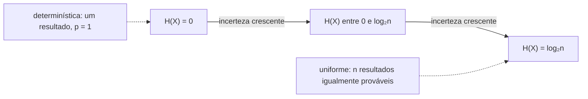

## Objetivos de Aprendizagem

- Definir a entropia H(X) = ∑ₓ p(x)·I(x) = −∑ₓ p(x)·log₂p(x) como a autoinformação esperada de uma variável aleatória.
- Calcular a entropia à mão para várias distribuições de probabilidade pequenas e concretas.
- Provar que 0 ≤ H(X) ≤ log₂(n) para uma variável com n resultados possíveis, com igualdade nos extremos exatamente quando a distribuição é determinística ou uniforme, respectivamente.
- Explicar, de forma intuitiva e por meio dos exemplos resolvidos, por que a entropia é o número único certo para resumir "quanta incerteza" uma fonte tem.

## Contexto e Motivação

O conceito anterior definiu quanta informação um *único* resultado carrega. Mas uma variável aleatória produz muitos resultados possíveis, cada um com sua própria probabilidade e sua própria autoinformação; o que se precisa agora é de um número que resuma a fonte como um todo, antes de qualquer resultado específico ser observado. `expectation-and-variance` já estabeleceu exatamente a ferramenta certa para isso em geral: o valor esperado de uma variável aleatória é a média ponderada pela probabilidade dos valores que ela pode assumir. A entropia não é nada mais que essa mesma esperança, aplicada à variável aleatória específica "a autoinformação de qualquer resultado que ocorra". Não é uma ideia matemática nova sobreposta à teoria da probabilidade: é a esperança, já totalmente desenvolvida em `foundations/probability-statistics`, apontada para uma nova quantidade.

A entropia acaba sendo exatamente o número que o teorema da codificação de fonte (alguns conceitos adiante) identifica como o limite fundamental da compressão sem perdas. Mas antes que esse teorema possa sequer ser enunciado, a própria entropia precisa ser definida com precisão, calculada à mão em exemplos concretos e compreendida estruturalmente: por que ela é limitada, e por que os dois extremos (0 e `log₂n`) correspondem aos dois extremos de "nenhuma incerteza" e "máxima incerteza possível".

## Teoria Central

### Definição

Para uma variável aleatória discreta `X` que assume valores em um conjunto finito com função massa de probabilidade `p(x)` (exatamente a PMF já definida em `discrete-random-variables-and-pmfs`), a **entropia** de `X` é:

```text
H(X) = E[I(X)] = ∑ₓ p(x)·I(x) = −∑ₓ p(x)·log₂p(x)
```

com a convenção `0·log₂0 = 0` (justificada pelo fato de que `x·log₂x → 0` quando `x → 0`, então resultados com probabilidade zero não contribuem com nada, exatamente como a intuição exige: um resultado que nunca acontece não deveria afetar a média). A entropia é medida em **bits**, herdando a unidade diretamente da autoinformação que ela calcula em média.

Em palavras: a entropia é o número médio de bits de "surpresa" produzidos por resultado de `X`, ponderado por quão frequentemente cada resultado de fato ocorre.

### Limite inferior: H(X) ≥ 0, com igualdade para uma variável determinística

Como cada termo `p(x)·I(x)` da soma é não negativo (uma probabilidade vezes uma autoinformação não negativa), a soma inteira é não negativa: `H(X) ≥ 0` sempre. A igualdade vale exatamente quando todo termo é 0, o que acontece exatamente quando `X` é **determinística** (um resultado tem probabilidade 1 e todos os outros têm probabilidade 0): o único resultado com `p(x) = 1` contribui `1 · I(x) = 1 · 0 = 0` (já que `I(1) = −log₂1 = 0`), e todo outro resultado contribui `0 · I(x) = 0` pela convenção acima. Uma variável sem nenhuma incerteza tem entropia zero, de acordo exato com a intuição de que a entropia mede incerteza.

### Limite superior: H(X) ≤ log₂(n), com igualdade para a distribuição uniforme

**Afirmação.** Para uma variável aleatória com exatamente `n` resultados possíveis, `H(X) ≤ log₂(n)`, com igualdade exatamente quando todo resultado tem probabilidade `1/n` (a distribuição uniforme).

Isso é demonstrável pela **desigualdade de Jensen** aplicada à função côncava `log₂`: para uma função côncava `f` e pesos `p(x)` que somam 1, `∑ₓ p(x)f(g(x)) ≤ f(∑ₓ p(x)g(x))`. Aplicando isso com `g(x) = 1/p(x)`:

```text
H(X) = ∑ₓ p(x)·log₂(1/p(x)) ≤ log₂(∑ₓ p(x)·(1/p(x))) = log₂(∑ₓ 1) = log₂(n)
```

A desigualdade de Jensen é uma igualdade exatamente quando a função côncava é aplicada a um argumento constante em todos os termos ponderados; aqui, exatamente quando `1/p(x)` é o mesmo para todo `x` com `p(x) > 0`, ou seja, todo resultado tem a mesma probabilidade `1/n`. Isso confirma que a distribuição uniforme sobre `n` resultados maximiza a entropia em exatamente `log₂(n)` bits, e nenhuma outra distribuição sobre os mesmos `n` resultados pode ter entropia maior.



### A entropia como propriedade da distribuição, e não de um valor isolado

A entropia é função apenas da distribuição de probabilidade `p`; ela não depende de como os resultados são rotulados, só de como a probabilidade se espalha entre eles. Renomear os resultados, ou até mudar completamente o que eles representam, deixa `H(X)` totalmente inalterada, desde que o multiconjunto de probabilidades `{p(x)}` continue o mesmo. É por isso que a entropia pode ser discutida com significado como "a entropia de uma fonte" sem referência ao que os símbolos da fonte de fato significam, exatamente a mesma postura em relação à semântica que `information-content-and-self-information` já estabeleceu para um único resultado.

## Exemplos Resolvidos

### Exemplo 1: entropia de uma moeda viciada

Seja `p(cara) = 0.9`, `p(coroa) = 0.1`.

```text
H(X) = −(0.9·log₂0.9 + 0.1·log₂0.1)
     = −(0.9·(−0.152) + 0.1·(−3.322))
     = −(−0.137 − 0.332)
     = 0.469 bits
```

Bem menos que o máximo possível de 1 bit para uma variável de 2 resultados (que o caso da moeda justa abaixo atinge): o forte viés para cara torna a moeda muito mais previsível, então há bem menos incerteza genuína a relatar por lançamento, em média.

### Exemplo 2: entropia de uma moeda justa (o máximo para 2 resultados)

`p(cara) = p(coroa) = 0.5`. `H(X) = −(0.5·log₂0.5 + 0.5·log₂0.5) = −(0.5·(−1) + 0.5·(−1)) = −(−0.5 − 0.5) = 1` bit, exatamente `log₂(2) = 1`, coincidindo exatamente com o teorema de que a uniforme maximiza a entropia, e coincidindo com a autoinformação de um único lançamento de moeda justa do conceito anterior (já que todo resultado aqui carrega exatamente a mesma autoinformação que a média, havendo só dois resultados igualmente prováveis).

### Exemplo 3: entropia de um pequeno alfabeto de 4 símbolos com frequências desiguais

Uma fonte emite símbolos `{A, B, C, D}` com probabilidades `p(A) = 0.5`, `p(B) = 0.25`, `p(C) = 0.125`, `p(D) = 0.125`.

```text
H(X) = −(0.5·log₂0.5 + 0.25·log₂0.25 + 0.125·log₂0.125 + 0.125·log₂0.125)
     = −(0.5·(−1) + 0.25·(−2) + 0.125·(−3) + 0.125·(−3))
     = −(−0.5 − 0.5 − 0.375 − 0.375)
     = 1.75 bits
```

Isso fica abaixo do máximo de `log₂(4) = 2` bits para um alfabeto de 4 símbolos (consistente com o teorema do limite superior, já que a distribuição é desigual em vez de uniforme), mas acima dos 0.469 bits da moeda viciada: essa fonte é mais incerta por símbolo que uma moeda fortemente viciada, mas menos incerta do que uma escolha uniforme entre 4 opções seria. Essa distribuição exata (probabilidades que são potências decrescentes de 2) reaparece em `huffman-coding-construction`, onde se revela o caso especial em que a codificação de Huffman atinge a entropia *exatamente*, sem nenhuma diferença.

## Equívocos Comuns e Armadilhas

- **"Entropia mais alta sempre significa 'mais informação' num sentido bom."** A entropia mede incerteza/imprevisibilidade, não utilidade nem significado: uma fonte de puro ruído aleatório tem a entropia máxima possível para o tamanho do seu alfabeto, apesar de não carregar conteúdo significativo algum; a entropia quantifica quão difícil é prever ou comprimir a fonte, não quão valiosa é sua saída.
- **"A entropia é calculada por resultado, então pode ser consultada para um símbolo específico."** A entropia é uma propriedade da distribuição inteira, um único número agregado; não existe "a entropia do símbolo A" separada da distribuição de onde ele é sorteado. A autoinformação `I(x)` é a quantidade por resultado, e a entropia é sua média em toda a distribuição.
- **"A distribuição uniforme é sempre a mais 'natural' de assumir."** A distribuição uniforme maximiza a entropia para um *número dado e fixo de resultados*; isso não significa que a uniforme seja de algum modo a distribuição padrão ou esperada para qualquer fonte real. Fontes reais (texto em inglês, valores de pixels, leituras de sensores) quase sempre são desiguais em vez de uniformes, e é exatamente essa desigualdade que as torna compressíveis abaixo de `log₂n` bits por símbolo.

## Resumo

A entropia H(X) = −∑ₓp(x)log₂p(x) é a autoinformação esperada de uma variável aleatória: o número médio de bits de surpresa que seus resultados produzem, ponderado por quão frequentemente cada um ocorre. Ela é limitada entre 0 (atingido só por uma variável totalmente determinística) e log₂(n) para uma variável de n resultados (atingido só pela distribuição uniforme, provado pela desigualdade de Jensen aplicada ao logaritmo côncavo), com a entropia de toda outra distribuição ficando estritamente entre esses valores, conforme quão desigual ela é. Esse número único é inteiramente uma propriedade da distribuição de probabilidade, e não de como algum resultado é rotulado ou do que significa, e é exatamente a quantidade que o teorema da codificação de fonte, alguns conceitos adiante, vai identificar como o limite fundamental de quanto uma fonte pode ser comprimida sem perdas.

## Documentation Links

- [Shannon: A Mathematical Theory of Communication (1948)](https://people.math.harvard.edu/~ctm/home/text/others/shannon/entropy/entropy.pdf): doc
- [Stanford EE276: Course Outline](https://web.stanford.edu/class/ee276/outline.html): doc
