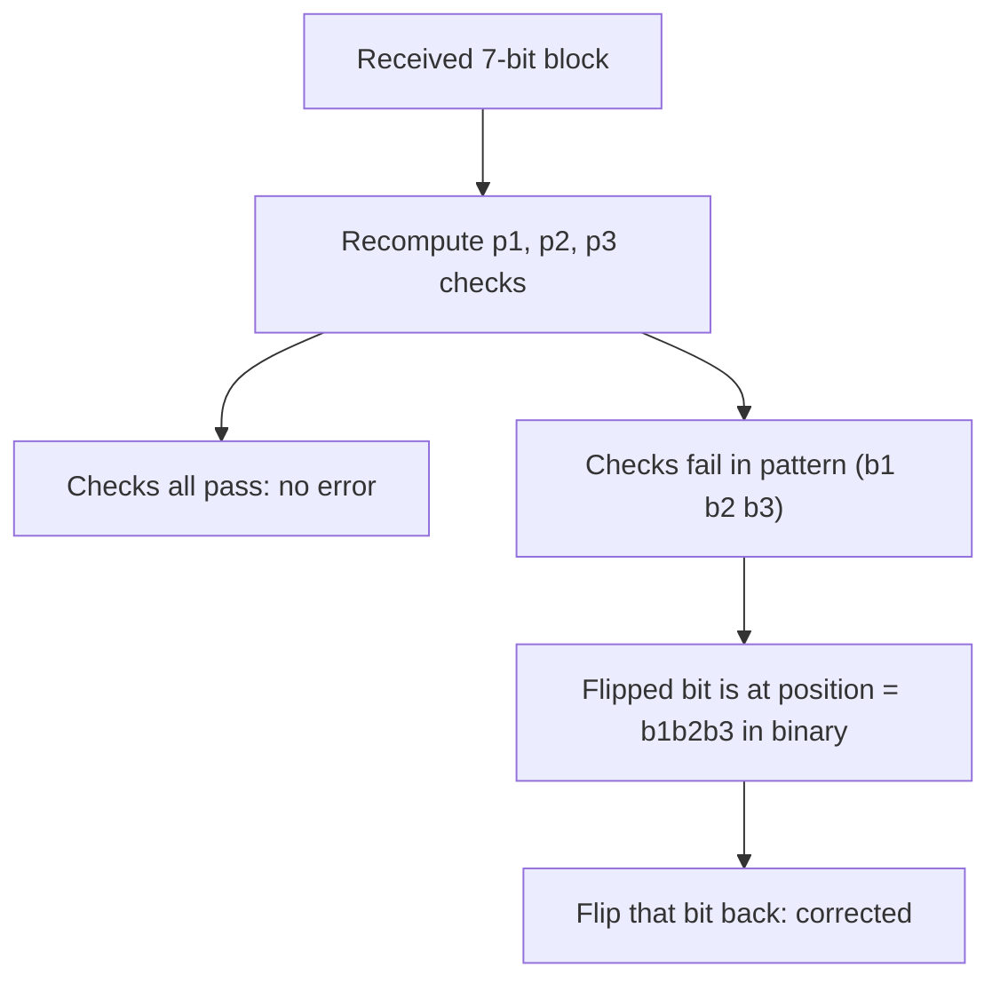

## Learning Objectives

- Distinguish error detection (knowing something went wrong) from error correction (knowing what the original data actually was), and explain why the two require genuinely different mechanisms.
- Construct a parity-bit scheme and explain exactly which error patterns it can and cannot detect.
- Build a (7,4) Hamming code by hand, encode a real 4-bit message, and correct a real single-bit error.
- Connect this concept directly back to `computer-networks`'s `the-link-layer-framing-and-error-detection`, developing the forward-error-correction technique that concept explicitly named but declined to build.

## Context & Motivation

The noisy-channel coding theorem proved that reliable communication below capacity is *possible* — but it did not hand over an actual code. This concept closes that gap at the level appropriate for this discipline: real, buildable, hand-traceable error-correcting codes, connecting the abstract capacity machinery to mechanisms genuinely used in real hardware and protocols.

`computer-networks`'s `the-link-layer-framing-and-error-detection` covered checksums and CRCs — detection only — and explicitly stated that "more sophisticated forward-error-correction codes that can, within limits, reconstruct the correct data from a corrupted frame do exist and are used in some specific real physical media... a real technique this introductory concept only names rather than developing in depth." This concept is exactly where that deferred development happens — the same deliberate loop-closing pattern already used for `kl-divergence-relative-entropy-and-cross-entropy`'s connection back to `deep-learning`.

## Core Theory

### Detection vs. correction: a genuinely different requirement

**Detection** only needs to distinguish "this data is definitely correct" from "something is wrong somewhere" — a single extra bit checked against the rest of the data can often achieve this cheaply. **Correction** needs to additionally pinpoint *where* the corruption occurred, well enough to reverse it — which requires enough redundant information not just to notice an error exists, but to narrow down its exact location among all the bits sent. This is why correction schemes need more redundancy than detection schemes for the same guarantee level, and why `the-link-layer-framing-and-error-detection` could get away with a comparatively lightweight checksum for detection while forward-error-correction, developed here, needs real additional structure.

### A single parity bit: detection only

The simplest scheme: append one **parity bit** to a block of data bits, set so that the total number of 1s (data bits plus parity bit) is even (**even parity**). Sending `1011` with even parity: the data has three 1s (odd), so the parity bit is set to `1`, making the transmitted block `10111` (four 1s, even). The receiver recomputes parity over all 5 received bits; if it comes out odd, exactly one (or any odd number of) bits were corrupted — an error is detected. But a single parity bit **cannot correct** anything: it identifies only that *some* bit flipped, not which one, and it is entirely blind to an *even* number of flips (two bits flipping simultaneously restores even parity by coincidence, and the error passes undetected) — exactly the same "detection has limits" caveat already flagged for CRC-style checksums in `the-link-layer-framing-and-error-detection`.

### The (7,4) Hamming code: real correction, built by hand

The **Hamming(7,4) code** encodes 4 data bits `d₁d₂d₃d₄` into 7 transmitted bits by adding 3 parity bits `p₁, p₂, p₃`, each covering a different, overlapping subset of the data bits, arranged so that the *pattern* of which parity checks fail identifies the exact position of a single flipped bit. Using the standard construction (positions 1–7, with parity bits at positions that are powers of 2):

```text
Position:   1   2   3   4   5   6   7
Content:   p₁  p₂  d₁  p₃  d₂  d₃  d₄
```

`p₁` covers positions whose binary index has bit 0 set (`1,3,5,7`): `p₁ = d₁ ⊕ d₂ ⊕ d₄`.
`p₂` covers positions whose binary index has bit 1 set (`2,3,6,7`): `p₂ = d₁ ⊕ d₃ ⊕ d₄`.
`p₃` covers positions whose binary index has bit 2 set (`4,5,6,7`): `p₃ = d₂ ⊕ d₃ ⊕ d₄`.

(`⊕` is XOR — parity computed over the covered positions.) At the receiver, three parity checks are recomputed over the received 7 bits; if a single bit was flipped, the *pattern* of which checks fail (as a 3-bit binary number) is exactly the 1-indexed position of the flipped bit — a direct, computable pinpointing mechanism that a bare parity bit cannot provide.



### Connecting back to the link layer's deferred thread

`the-link-layer-framing-and-error-detection` named "forward-error-correction codes that can, within limits, reconstruct the correct data from a corrupted frame" as real, used-in-practice technology, specifically citing wireless links as a common real deployment (wireless being especially error-prone). The Hamming code built above is exactly one member of that family — a small, hand-traceable instance of the general principle that real forward-error-correction hardware (in Wi-Fi, in deep-space communication, in flash memory and DRAM error-correcting-code memory) scales up considerably in sophistication and correction power, but shares the identical core idea: redundant bits arranged so that the specific pattern of parity failures identifies exactly where the corruption is, closing precisely the gap that concept flagged but chose not to develop.

## Worked Examples

### Example 1 — a parity bit detecting, and failing to detect, errors

Data `1011` (even parity bit `1`, transmitted as `10111`, per Core Theory). If bit 3 flips in transit (received `10011`... wait, flipping the third bit of `10111` gives `10011`): recomputed parity over `1,0,0,1,1` has three 1s (odd) — mismatch detected, an error is correctly flagged. Now suppose *two* bits flip (e.g., bits 1 and 3, giving `00011`): recomputed parity over `0,0,0,1,1` has two 1s (even) — parity checks out, and this genuine double-bit error passes completely undetected, exactly the blind spot described in Core Theory.

### Example 2 — encoding a real 4-bit message with Hamming(7,4)

Encode `d₁d₂d₃d₄ = 1101`:

```text
p1 = d1 ⊕ d2 ⊕ d4 = 1 ⊕ 1 ⊕ 1 = 1
p2 = d1 ⊕ d3 ⊕ d4 = 1 ⊕ 0 ⊕ 1 = 0
p3 = d2 ⊕ d3 ⊕ d4 = 1 ⊕ 0 ⊕ 1 = 0

Transmitted (pos 1-7): p1 p2 d1 p3 d2 d3 d4 = 1 0 1 0 1 0 1
```

### Example 3 — correcting a real single-bit error

Suppose position 5 (`d2`) flips during transmission: received `1 0 1 0 0 0 1` (bit 5 changed from `1` to `0`). Recompute the three checks over the received bits: check 1 (positions 1,3,5,7 → `1,1,0,1`, XOR = `1⊕1⊕0⊕1 = 1`, i.e., fails since it should XOR to 0 for a valid codeword); check 2 (positions 2,3,6,7 → `0,1,0,1`, XOR = `0⊕1⊕0⊕1=0`, passes); check 3 (positions 4,5,6,7 → `0,0,0,1`, XOR = `0⊕0⊕0⊕1=1`, fails). The failing pattern is (check1=1, check2=0, check3=1), read as binary `101` = decimal `5` — exactly position 5, the bit that actually flipped. Flipping position 5 back recovers the original transmitted codeword `1 0 1 0 1 0 1` exactly, and extracting the data positions (3,5,6,7) recovers `d1d2d3d4 = 1101`, the original message, fully corrected with no retransmission needed.

## Common Misconceptions & Pitfalls

- **"More parity bits always means proportionally better error correction."** Hamming(7,4) corrects exactly one bit flip per 7-bit block and cannot reliably correct two simultaneous flips (a well-known limitation of simple Hamming codes) — scaling up correction power to handle more simultaneous errors requires genuinely more sophisticated code families (Reed-Solomon, LDPC, Turbo codes, real technology used in QR codes, deep-space communication, and Wi-Fi respectively), not merely adding more of the same kind of parity bit.
- **"Error correction makes error detection (checksums/CRC) obsolete."** Real systems typically layer both: a link-layer checksum/CRC (as in `the-link-layer-framing-and-error-detection`) cheaply detects whether a frame needs attention at all, while forward-error-correction, when present, attempts to fix small numbers of errors without retransmission — the two serve complementary roles (cheap detection vs. more expensive but retransmission-free correction), matching the layered-technique pattern already seen with Huffman-plus-LZ77 in `beyond-huffman-arithmetic-coding-and-dictionary-methods`.
- **"Since Hamming codes can correct one error, they can also reliably detect two errors."** A double-bit error in a Hamming(7,4) block typically produces a nonzero failing-check pattern that gets *miscorrected* as if it were a different single-bit error, silently producing an incorrect "corrected" result rather than flagging a problem — an extended Hamming code (adding one more overall parity bit) is the standard fix, giving single-error-correction plus double-error-detection (SECDED), the scheme actually used in ECC computer memory.

## Summary

Detection (a parity bit, or the checksum/CRC family covered in `the-link-layer-framing-and-error-detection`) only needs to notice something is wrong; correction needs enough redundancy to pinpoint exactly where. The Hamming(7,4) code, built by hand here, adds 3 overlapping parity bits to 4 data bits so that the specific pattern of parity-check failures at the receiver directly encodes the position of a single flipped bit, letting it be corrected without retransmission — a concrete, real instance of the forward-error-correction family `the-link-layer-framing-and-error-detection` explicitly named but declined to develop, closing that concept's deferred thread. Real deployed systems (Wi-Fi, deep-space telemetry, ECC memory) use considerably more sophisticated members of this same family, but share the identical underlying principle demonstrated in full here on a small, completely traceable example.

## Documentation Links

- [Shannon — A Mathematical Theory of Communication (1948)](https://people.math.harvard.edu/~ctm/home/text/others/shannon/entropy/entropy.pdf) — doc
- [ACM/IEEE — Computer Science Curricula 2023 (CS2023)](https://csed.acm.org/wp-content/uploads/2023/03/Version-Beta-v2.pdf) — doc
