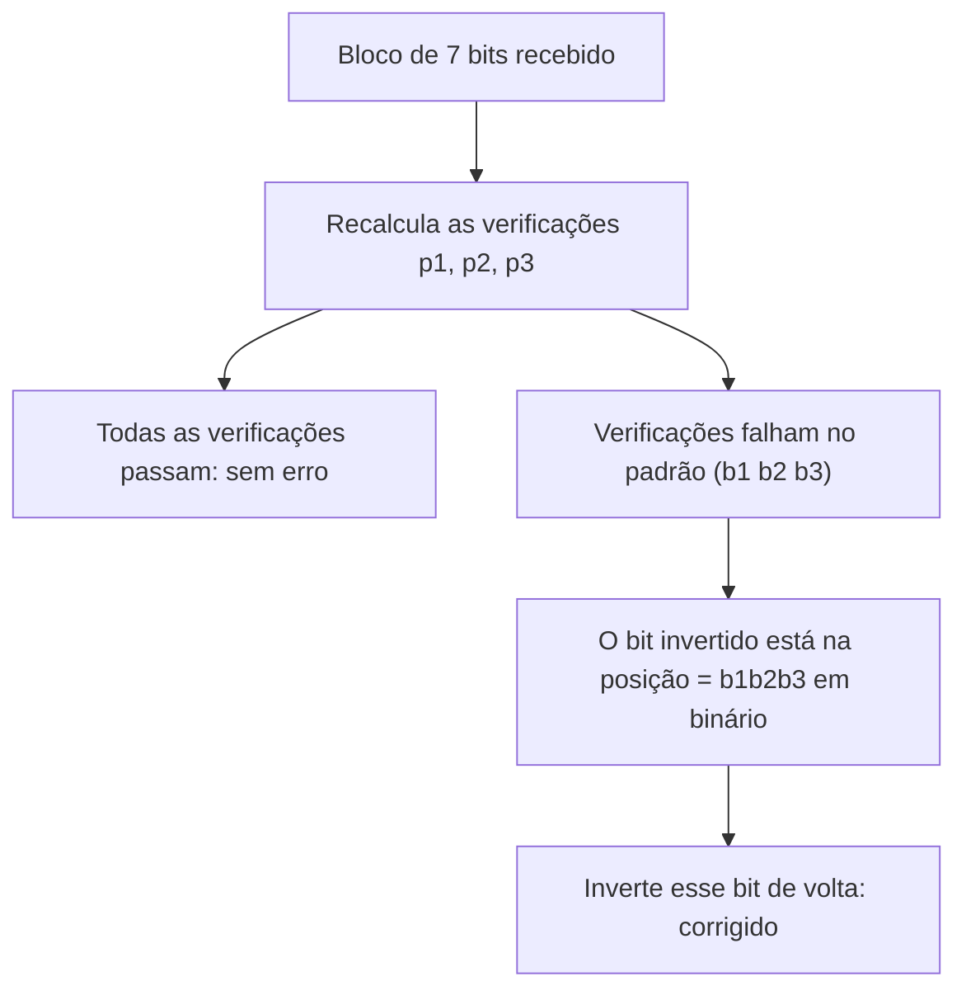

## Objetivos de Aprendizagem

- Distinguir detecção de erros (saber que algo deu errado) de correção de erros (saber quais eram de fato os dados originais) e explicar por que as duas exigem mecanismos genuinamente diferentes.
- Construir um esquema de bit de paridade e explicar exatamente quais padrões de erro ele consegue e não consegue detectar.
- Montar à mão um código de Hamming (7,4), codificar uma mensagem real de 4 bits e corrigir um erro real de um único bit.
- Ligar este conceito diretamente a `the-link-layer-framing-and-error-detection` de `computer-networks`, desenvolvendo a técnica de correção antecipada de erros que aquele conceito nomeou explicitamente mas optou por não construir.

## Contexto e Motivação

O teorema da codificação de canal ruidoso provou que a comunicação confiável abaixo da capacidade é *possível*, mas não entregou um código de verdade. Este conceito fecha essa lacuna no nível adequado a esta disciplina: códigos corretores de erros reais, construíveis e rastreáveis à mão, ligando a maquinaria abstrata de capacidade a mecanismos genuinamente usados em hardware e protocolos reais.

`the-link-layer-framing-and-error-detection` de `computer-networks` tratou de checksums e CRCs (só detecção) e afirmou explicitamente que "códigos mais sofisticados de correção antecipada de erros, que conseguem, dentro de limites, reconstruir os dados corretos a partir de um quadro corrompido, existem e são usados em alguns meios físicos reais específicos... uma técnica real que este conceito introdutório apenas nomeia, em vez de desenvolver em profundidade". Este conceito é exatamente onde esse desenvolvimento adiado acontece, o mesmo padrão deliberado de fechar ciclos já usado na ligação de `kl-divergence-relative-entropy-and-cross-entropy` de volta a `deep-learning`.

## Teoria Central

### Detecção vs. correção: uma exigência genuinamente diferente

A **detecção** só precisa distinguir "estes dados estão definitivamente corretos" de "algo está errado em algum lugar"; um único bit extra conferido contra o resto dos dados muitas vezes consegue isso a baixo custo. A **correção** precisa, além disso, apontar *onde* a corrupção ocorreu, com precisão suficiente para revertê-la, o que exige informação redundante suficiente não só para perceber que um erro existe, mas para restringir sua localização exata entre todos os bits enviados. É por isso que esquemas de correção precisam de mais redundância que esquemas de detecção para o mesmo nível de garantia, e por isso que `the-link-layer-framing-and-error-detection` pôde se virar com um checksum comparativamente leve para detecção, enquanto a correção antecipada de erros, desenvolvida aqui, precisa de estrutura adicional real.

### Um único bit de paridade: só detecção

O esquema mais simples: acrescentar um **bit de paridade** a um bloco de bits de dados, definido de modo que o número total de 1s (bits de dados mais o bit de paridade) seja par (**paridade par**). Enviando `1011` com paridade par: os dados têm três 1s (ímpar), então o bit de paridade vale `1`, tornando o bloco transmitido `10111` (quatro 1s, par). O receptor recalcula a paridade sobre os 5 bits recebidos; se der ímpar, exatamente um (ou qualquer número ímpar de) bit foi corrompido, e um erro é detectado. Mas um único bit de paridade **não consegue corrigir** nada: ele identifica só que *algum* bit foi invertido, não qual, e é totalmente cego a um número *par* de inversões (dois bits invertidos ao mesmo tempo restauram a paridade par por coincidência, e o erro passa sem ser detectado), exatamente a mesma ressalva de que "a detecção tem limites" já levantada para checksums no estilo CRC em `the-link-layer-framing-and-error-detection`.

### O código de Hamming (7,4): correção real, montada à mão

O **código Hamming(7,4)** codifica 4 bits de dados `d₁d₂d₃d₄` em 7 bits transmitidos, acrescentando 3 bits de paridade `p₁, p₂, p₃`, cada um cobrindo um subconjunto diferente e sobreposto dos bits de dados, organizados de modo que o *padrão* de quais verificações de paridade falham identifique a posição exata de um único bit invertido. Usando a construção padrão (posições 1 a 7, com bits de paridade nas posições que são potências de 2):

```text
Posição:    1   2   3   4   5   6   7
Conteúdo:  p₁  p₂  d₁  p₃  d₂  d₃  d₄
```

`p₁` cobre as posições cujo índice binário tem o bit 0 ligado (`1,3,5,7`): `p₁ = d₁ ⊕ d₂ ⊕ d₄`.
`p₂` cobre as posições cujo índice binário tem o bit 1 ligado (`2,3,6,7`): `p₂ = d₁ ⊕ d₃ ⊕ d₄`.
`p₃` cobre as posições cujo índice binário tem o bit 2 ligado (`4,5,6,7`): `p₃ = d₂ ⊕ d₃ ⊕ d₄`.

(`⊕` é XOR, a paridade calculada sobre as posições cobertas.) No receptor, as três verificações de paridade são recalculadas sobre os 7 bits recebidos; se um único bit foi invertido, o *padrão* de quais verificações falham (lido como um número binário de 3 bits) é exatamente a posição, indexada a partir de 1, do bit invertido: um mecanismo direto e calculável de localização que um bit de paridade isolado não consegue oferecer.



### Voltando à pendência da camada de enlace

`the-link-layer-framing-and-error-detection` citou "códigos de correção antecipada de erros que conseguem, dentro de limites, reconstruir os dados corretos a partir de um quadro corrompido" como tecnologia real e usada na prática, mencionando especificamente enlaces sem fio como um uso real comum (já que o sem fio é especialmente propenso a erros). O código de Hamming montado acima é exatamente um membro dessa família: uma instância pequena e rastreável à mão do princípio geral de que o hardware real de correção antecipada de erros (no Wi-Fi, na comunicação com o espaço profundo, na memória flash e na memória DRAM com código corretor de erros) cresce consideravelmente em sofisticação e poder de correção, mas compartilha a mesma ideia central: bits redundantes organizados de modo que o padrão específico de falhas de paridade identifique exatamente onde está a corrupção, fechando precisamente a lacuna que aquele conceito apontou mas optou por não desenvolver.

## Exemplos Resolvidos

### Exemplo 1: um bit de paridade detectando, e deixando de detectar, erros

Dados `1011` (bit de paridade par `1`, transmitido como `10111`, conforme a Teoria Central). Se o bit 3 for invertido no trânsito (inverter o terceiro bit de `10111` dá `10011`): a paridade recalculada sobre `1,0,0,1,1` tem três 1s (ímpar), a divergência é detectada e um erro é corretamente sinalizado. Agora suponha que *dois* bits sejam invertidos (por exemplo, os bits 1 e 3, dando `00011`): a paridade recalculada sobre `0,0,0,1,1` tem dois 1s (par), a paridade confere, e esse erro genuíno de dois bits passa totalmente despercebido, exatamente o ponto cego descrito na Teoria Central.

### Exemplo 2: codificando uma mensagem real de 4 bits com Hamming(7,4)

Codificar `d₁d₂d₃d₄ = 1101`:

```text
p1 = d1 ⊕ d2 ⊕ d4 = 1 ⊕ 1 ⊕ 1 = 1
p2 = d1 ⊕ d3 ⊕ d4 = 1 ⊕ 0 ⊕ 1 = 0
p3 = d2 ⊕ d3 ⊕ d4 = 1 ⊕ 0 ⊕ 1 = 0

Transmitido (pos 1-7): p1 p2 d1 p3 d2 d3 d4 = 1 0 1 0 1 0 1
```

### Exemplo 3: corrigindo um erro real de um único bit

Suponha que a posição 5 (`d2`) seja invertida durante a transmissão: recebido `1 0 1 0 0 0 1` (o bit 5 mudou de `1` para `0`). Recalcule as três verificações sobre os bits recebidos: verificação 1 (posições 1,3,5,7 → `1,1,0,1`, XOR = `1⊕1⊕0⊕1 = 1`, ou seja, falha, já que deveria dar 0 para uma palavra-código válida); verificação 2 (posições 2,3,6,7 → `0,1,0,1`, XOR = `0⊕1⊕0⊕1=0`, passa); verificação 3 (posições 4,5,6,7 → `0,0,0,1`, XOR = `0⊕0⊕0⊕1=1`, falha). O padrão de falha é (verificação1=1, verificação2=0, verificação3=1), lido como o binário `101` = decimal `5`, exatamente a posição 5, o bit que de fato foi invertido. Inverter a posição 5 de volta recupera exatamente a palavra-código transmitida original `1 0 1 0 1 0 1`, e extrair as posições de dados (3,5,6,7) recupera `d1d2d3d4 = 1101`, a mensagem original, totalmente corrigida sem precisar de retransmissão.

## Equívocos Comuns e Armadilhas

- **"Mais bits de paridade sempre significam correção de erros proporcionalmente melhor."** O Hamming(7,4) corrige exatamente uma inversão de bit por bloco de 7 bits e não consegue corrigir de forma confiável duas inversões simultâneas (uma limitação bem conhecida dos códigos de Hamming simples); aumentar o poder de correção para lidar com mais erros simultâneos exige famílias de códigos genuinamente mais sofisticadas (Reed-Solomon, LDPC, códigos Turbo, tecnologia real usada em QR codes, comunicação com o espaço profundo e Wi-Fi, respectivamente), e não apenas acrescentar mais bits de paridade do mesmo tipo.
- **"A correção de erros torna a detecção de erros (checksums/CRC) obsoleta."** Sistemas reais normalmente combinam as duas em camadas: um checksum/CRC na camada de enlace (como em `the-link-layer-framing-and-error-detection`) detecta a baixo custo se um quadro precisa de atenção, enquanto a correção antecipada de erros, quando presente, tenta consertar pequenas quantidades de erros sem retransmissão. As duas cumprem papéis complementares (detecção barata vs. correção mais cara, porém sem retransmissão), seguindo o padrão de técnicas em camadas já visto com Huffman mais LZ77 em `beyond-huffman-arithmetic-coding-and-dictionary-methods`.
- **"Como os códigos de Hamming corrigem um erro, eles também detectam dois erros de forma confiável."** Um erro de dois bits num bloco Hamming(7,4) normalmente produz um padrão de verificações com falha diferente de zero que acaba *corrigido erroneamente* como se fosse outro erro de um único bit, produzindo silenciosamente um resultado "corrigido" incorreto em vez de sinalizar um problema. Um código de Hamming estendido (que acrescenta mais um bit de paridade global) é a solução padrão, oferecendo correção de um erro mais detecção de dois erros (SECDED), o esquema de fato usado na memória ECC de computadores.

## Resumo

A detecção (um bit de paridade, ou a família de checksums/CRC tratada em `the-link-layer-framing-and-error-detection`) só precisa perceber que algo está errado; a correção precisa de redundância suficiente para apontar exatamente onde. O código Hamming(7,4), montado à mão aqui, acrescenta 3 bits de paridade sobrepostos a 4 bits de dados, de modo que o padrão específico de falhas nas verificações de paridade no receptor codifica diretamente a posição de um único bit invertido, permitindo corrigi-lo sem retransmissão. É uma instância concreta e real da família de correção antecipada de erros que `the-link-layer-framing-and-error-detection` nomeou explicitamente mas optou por não desenvolver, fechando a pendência daquele conceito. Sistemas reais em produção (Wi-Fi, telemetria do espaço profundo, memória ECC) usam membros consideravelmente mais sofisticados dessa mesma família, mas compartilham o mesmo princípio subjacente demonstrado por completo aqui num exemplo pequeno e totalmente rastreável.

## Documentation Links

- [Shannon: A Mathematical Theory of Communication (1948)](https://people.math.harvard.edu/~ctm/home/text/others/shannon/entropy/entropy.pdf): doc
- [ACM/IEEE: Computer Science Curricula 2023 (CS2023)](https://csed.acm.org/wp-content/uploads/2023/03/Version-Beta-v2.pdf): doc
