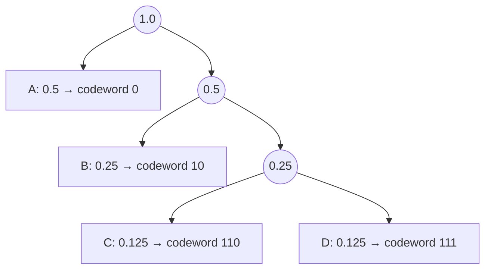

## Learning Objectives

- State the Huffman coding algorithm: repeatedly merge the two least-probable remaining nodes into a new combined node, until one tree remains.
- Build a complete Huffman tree by hand for a small real alphabet with real frequencies, and read off the resulting codewords.
- Compute a Huffman code's exact average length and compare it against the source's entropy.
- Explain the algorithm's greedy character, in the same terms `algorithms`'s `the-greedy-paradigm` already established.

## Context & Motivation

The previous concept established that a prefix-free code is exactly a binary tree with symbols at its leaves, and that Kraft's inequality tells us which sets of leaf depths are achievable — but it said nothing about which *specific* depths are best for a given source. David Huffman answered this question completely in his 1952 paper, written (famously) as a term-paper solution to a problem his professor, Robert Fano, had posed as still open — Huffman found a simple, greedy tree-construction procedure that is provably optimal among *all* prefix-free codes for a known symbol distribution, not merely a good heuristic. This concept builds the algorithm and a complete worked tree by hand; the next concept proves optimality rigorously, via an exchange argument in the exact template `algorithms` already established for greedy algorithms generally.

## Core Theory

### The algorithm

**Input:** a set of symbols with known probabilities (or, equivalently, frequencies) `p(x₁), ..., p(xₙ)`.

**Procedure:**
1. Create one leaf node per symbol, labeled with its probability.
2. While more than one node remains unmerged: take the **two nodes with the smallest probabilities** among those not yet merged, and create a new internal node that is their parent, labeled with the sum of their two probabilities. This new node re-enters the pool of nodes available for future merging.
3. When exactly one node remains (the root), the tree is complete. Each symbol's codeword is the sequence of left/right (0/1) branches on the path from the root down to that symbol's leaf.

```python
import heapq

def huffman_tree(freqs):
    # freqs: dict {symbol: probability}
    heap = [[p, [sym, ""]] for sym, p in freqs.items()]
    heapq.heapify(heap)
    while len(heap) > 1:
        lo = heapq.heappop(heap)
        hi = heapq.heappop(heap)
        for pair in lo[1:]:
            pair[1] = '0' + pair[1]
        for pair in hi[1:]:
            pair[1] = '1' + pair[1]
        heapq.heappush(heap, [lo[0] + hi[0]] + lo[1:] + hi[1:])
    return sorted(heap[0][1:], key=lambda p: (len(p[-1]), p))
```

This is deliberately the same "repeatedly combine the two smallest" structure already familiar from `algorithms` — the greedy rule here is: **always merge the two least-probable available nodes**, never looking ahead to how the rest of the tree will turn out. This is exactly the posture `the-greedy-paradigm` describes: commit to the locally-best-looking choice at each step, with no backtracking — and, as `proving-huffman-optimality-an-exchange-argument` will show next, this particular greedy rule is one of the ones that provably never costs optimality.

### Why "merge the two smallest" makes sense

The intuition behind the rule: symbols with low probability will necessarily end up deep in the tree (since there are, by Kraft's inequality, only so much "shallow tree" capacity to go around, and it should go to the most probable symbols). Merging the two least-probable nodes first guarantees that those two symbols end up as *siblings* at the deepest level constructed so far, and every subsequent merge only pushes both of them one level deeper together — so the two rarest symbols are treated identically and pay the same (large) codeword length, while progressively more probable symbols get merged later and therefore end up shallower.



## Worked Examples

### Example 1 — building the tree by hand for a real 5-symbol alphabet

Symbols with frequencies: `A: 0.35, B: 0.25, C: 0.20, D: 0.12, E: 0.08`.

**Step 1.** Smallest two: `E (0.08)` and `D (0.12)`. Merge into `DE (0.20)`. Remaining pool: `A(0.35), B(0.25), C(0.20), DE(0.20)`.

**Step 2.** Smallest two: `C (0.20)` and `DE (0.20)` (tie, broken arbitrarily — either choice yields an optimal tree, though not necessarily the same one). Merge into `CDE (0.40)`. Remaining pool: `A(0.35), B(0.25), CDE(0.40)`.

**Step 3.** Smallest two: `B (0.25)` and `A (0.35)`. Merge into `AB (0.60)`. Remaining pool: `AB(0.60), CDE(0.40)`.

**Step 4.** Only two remain: merge `CDE (0.40)` and `AB (0.60)` into the root `(1.00)`.

**Reading off codewords** (0 for the first-listed child, 1 for the second, by the convention used consistently here — either convention gives equally valid, equally optimal codes): tracing each symbol's path from root to leaf gives `A: 10, B: 11, C: 00, D: 010, E: 011`.

```text
Symbol   Frequency   Codeword   Length
A        0.35        10         2
B        0.25        11         2
C        0.20        00         2
D        0.12        010        3
E        0.08        011        3
```

### Example 2 — computing this code's average length and comparing to entropy

```text
L = 0.35·2 + 0.25·2 + 0.20·2 + 0.12·3 + 0.08·3
  = 0.70 + 0.50 + 0.40 + 0.36 + 0.24
  = 2.20 bits/symbol

H(X) = −(0.35log₂0.35 + 0.25log₂0.25 + 0.20log₂0.20 + 0.12log₂0.12 + 0.08log₂0.08)
     = −(0.35·(−1.515) + 0.25·(−2) + 0.20·(−2.322) + 0.12·(−3.059) + 0.08·(−3.644))
     = −(−0.530 − 0.500 − 0.464 − 0.367 − 0.292)
     = 2.153 bits/symbol
```

`L = 2.20` bits is very close to, and (as guaranteed by the source coding theorem's converse) never below, `H(X) = 2.153` bits — a gap of only `0.047` bits per symbol, extremely close to the theoretical limit despite using a simple single-symbol code with no block-length tricks at all.

### Example 3 — the power-of-2 case achieves entropy exactly

Reusing `entropy-the-expected-information-content`'s Example 3 distribution (`p(A)=0.5, p(B)=0.25, p(C)=p(D)=0.125`, `H(X) = 1.75` bits exactly): merging smallest-two-first gives `C,D → 0.25`, then `B, CD → 0.5`, then `A, BCD → 1.0`, yielding exactly the tree and codewords `{A→0, B→10, C→110, D→111}` from `kraft-inequality-and-prefix-free-codes`'s worked examples — average length exactly `1.75` bits, matching entropy exactly. This happens precisely because every probability here is an exact negative power of 2, so `−log₂p(x)` is already an integer for every symbol — the special case where Huffman coding has zero gap from the theoretical limit, confirming `the-source-coding-theorem`'s Example 2 was not a coincidence.

## Common Misconceptions & Pitfalls

- **"Huffman coding always achieves entropy exactly."** Example 2 shows a real gap (`2.20` vs. `2.153` bits) for a distribution whose probabilities aren't exact powers of 2 — Huffman coding is optimal *among prefix-free single-symbol codes*, which is a strictly weaker guarantee than "always equals entropy exactly"; the gap is provably bounded (always less than 1 bit per symbol above entropy) but generally nonzero.
- **"The order symbols are merged in doesn't affect the resulting code's average length."** While ties (as in Example 1's Step 2) can be broken arbitrarily without changing the *average* length, the specific codewords produced, and even the exact tree shape, can differ between tie-breaking choices — what's guaranteed to be identical across all valid tie-breaks is the multiset of codeword lengths and therefore the average length, not necessarily the tree itself.
- **"Huffman's greedy rule is just 'sort by frequency and assign shorter codes to more common symbols' — any such assignment would work."** The specific merge-smallest-two-first procedure is what guarantees optimality (proved next); simply assigning shorter codewords to more frequent symbols without following the actual tree-construction procedure does not, in general, produce a valid prefix-free code at all, let alone an optimal one — the tree structure is not optional bookkeeping, it's what makes the resulting code decodable.

## Summary

Huffman's algorithm builds an optimal prefix-free code by repeatedly merging the two least-probable remaining nodes into a new parent, until a single tree remains — traced by hand here for a real 5-symbol alphabet, producing a concrete code whose average length (2.20 bits/symbol) sits very close to, and never below, the source's entropy (2.153 bits/symbol), with the gap closing to exactly zero in the special case where every probability is an exact power of 2. The greedy rule — merge smallest-two-first, no lookahead, no backtracking — is exactly the posture `algorithms`'s `the-greedy-paradigm` describes, and the next concept proves this specific rule is one of the greedy rules that provably never sacrifices optimality, via the same exchange-argument template already established for activity selection.

## Documentation Links

- [Huffman — A Method for the Construction of Minimum-Redundancy Codes (1952)](https://www.cse.iitd.ac.in/~pkalra/siv864/huffman_1952.pdf) — doc
- [Stanford EE276 — Course Outline](https://web.stanford.edu/class/ee276/outline.html) — doc
