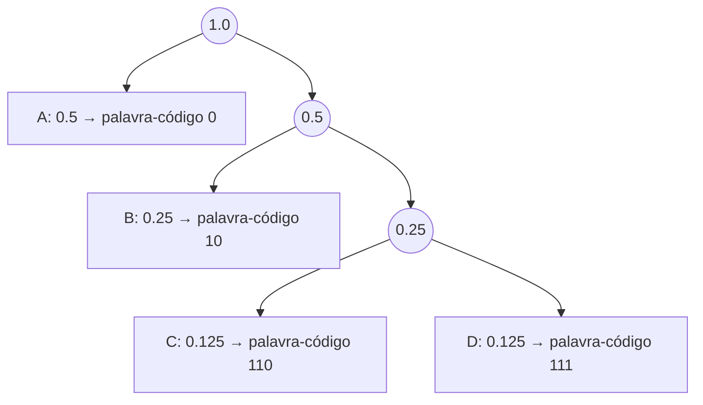

## Objetivos de Aprendizagem

- Enunciar o algoritmo de codificação de Huffman: fundir repetidamente os dois nós restantes menos prováveis num novo nó combinado, até sobrar uma única árvore.
- Construir à mão uma árvore de Huffman completa para um pequeno alfabeto real com frequências reais e ler as palavras-código resultantes.
- Calcular o comprimento médio exato de um código de Huffman e compará-lo com a entropia da fonte.
- Explicar o caráter guloso do algoritmo, nos mesmos termos que `the-greedy-paradigm` de `algorithms` já estabeleceu.

## Contexto e Motivação

O conceito anterior estabeleceu que um código livre de prefixo é exatamente uma árvore binária com os símbolos nas folhas, e que a desigualdade de Kraft diz quais conjuntos de profundidades de folhas são alcançáveis, mas não disse nada sobre quais profundidades *específicas* são as melhores para uma dada fonte. David Huffman respondeu essa pergunta por completo em seu artigo de 1952, escrito (famosamente) como solução de trabalho de fim de curso para um problema que seu professor, Robert Fano, tinha apresentado como ainda em aberto. Huffman encontrou um procedimento guloso e simples de construção de árvore que é comprovadamente ótimo entre *todos* os códigos livres de prefixo para uma distribuição de símbolos conhecida, e não apenas uma boa heurística. Este conceito constrói o algoritmo e uma árvore completa resolvida à mão; o próximo conceito prova a otimalidade com rigor, por meio de um argumento de troca exatamente no molde que `algorithms` já estabeleceu para algoritmos gulosos em geral.

## Teoria Central

### O algoritmo

**Entrada:** um conjunto de símbolos com probabilidades conhecidas (ou, equivalentemente, frequências) `p(x₁), ..., p(xₙ)`.

**Procedimento:**
1. Criar um nó folha por símbolo, rotulado com sua probabilidade.
2. Enquanto restar mais de um nó não fundido: pegar os **dois nós com as menores probabilidades** entre os ainda não fundidos e criar um novo nó interno que seja pai deles, rotulado com a soma das duas probabilidades. Esse novo nó volta ao conjunto de nós disponíveis para fusões futuras.
3. Quando restar exatamente um nó (a raiz), a árvore está completa. A palavra-código de cada símbolo é a sequência de ramos esquerda/direita (0/1) no caminho da raiz até a folha desse símbolo.

```python
import heapq

def huffman_tree(freqs):
    # freqs: dict {symbol: probability}
    heap = [[p, [sym, ""]] for sym, p in freqs.items()]
    heapq.heapify(heap)
    while len(heap) > 1:
        lo = heapq.heappop(heap)
        hi = heapq.heappop(heap)
        for pair in lo[1:]:
            pair[1] = '0' + pair[1]
        for pair in hi[1:]:
            pair[1] = '1' + pair[1]
        heapq.heappush(heap, [lo[0] + hi[0]] + lo[1:] + hi[1:])
    return sorted(heap[0][1:], key=lambda p: (len(p[-1]), p))
```

Essa é deliberadamente a mesma estrutura de "combinar repetidamente os dois menores" já conhecida de `algorithms`. A regra gulosa aqui é: **sempre fundir os dois nós disponíveis menos prováveis**, sem nunca olhar adiante para ver como o resto da árvore vai ficar. É exatamente a postura que `the-greedy-paradigm` descreve: comprometer-se com a escolha que parece localmente melhor a cada passo, sem retrocesso. E, como `proving-huffman-optimality-an-exchange-argument` vai mostrar em seguida, essa regra gulosa em particular é uma das que comprovadamente nunca custam a otimalidade.

### Por que "fundir os dois menores" faz sentido

A intuição por trás da regra: símbolos de baixa probabilidade necessariamente vão acabar no fundo da árvore (já que, pela desigualdade de Kraft, há uma quantidade limitada de capacidade de "árvore rasa" a distribuir, e ela deve ir para os símbolos mais prováveis). Fundir primeiro os dois nós menos prováveis garante que esses dois símbolos acabem como *irmãos* no nível mais profundo construído até então, e cada fusão seguinte só empurra os dois juntos um nível mais para baixo. Assim, os dois símbolos mais raros são tratados de forma idêntica e pagam o mesmo comprimento (grande) de palavra-código, enquanto símbolos progressivamente mais prováveis são fundidos mais tarde e, portanto, acabam mais rasos.



## Exemplos Resolvidos

### Exemplo 1: construindo a árvore à mão para um alfabeto real de 5 símbolos

Símbolos com frequências: `A: 0.35, B: 0.25, C: 0.20, D: 0.12, E: 0.08`.

**Passo 1.** Os dois menores: `E (0.08)` e `D (0.12)`. Fundir em `DE (0.20)`. Conjunto restante: `A(0.35), B(0.25), C(0.20), DE(0.20)`.

**Passo 2.** Os dois menores: `C (0.20)` e `DE (0.20)` (empate, desfeito arbitrariamente; qualquer escolha gera uma árvore ótima, embora não necessariamente a mesma). Fundir em `CDE (0.40)`. Conjunto restante: `A(0.35), B(0.25), CDE(0.40)`.

**Passo 3.** Os dois menores: `B (0.25)` e `A (0.35)`. Fundir em `AB (0.60)`. Conjunto restante: `AB(0.60), CDE(0.40)`.

**Passo 4.** Restam só dois: fundir `CDE (0.40)` e `AB (0.60)` na raiz `(1.00)`.

**Lendo as palavras-código** (0 para o primeiro filho listado, 1 para o segundo, pela convenção usada de forma consistente aqui; qualquer uma das convenções gera códigos igualmente válidos e igualmente ótimos): rastrear o caminho de cada símbolo da raiz até a folha dá `A: 10, B: 11, C: 00, D: 010, E: 011`.

```text
Símbolo  Frequência  Palavra-código  Comprimento
A        0.35        10              2
B        0.25        11              2
C        0.20        00              2
D        0.12        010             3
E        0.08        011             3
```

### Exemplo 2: calculando o comprimento médio deste código e comparando com a entropia

```text
L = 0.35·2 + 0.25·2 + 0.20·2 + 0.12·3 + 0.08·3
  = 0.70 + 0.50 + 0.40 + 0.36 + 0.24
  = 2.20 bits/símbolo

H(X) = −(0.35log₂0.35 + 0.25log₂0.25 + 0.20log₂0.20 + 0.12log₂0.12 + 0.08log₂0.08)
     = −(0.35·(−1.515) + 0.25·(−2) + 0.20·(−2.322) + 0.12·(−3.059) + 0.08·(−3.644))
     = −(−0.530 − 0.500 − 0.464 − 0.367 − 0.292)
     = 2.153 bits/símbolo
```

`L = 2.20` bits fica muito perto de `H(X) = 2.153` bits e (como garante a recíproca do teorema da codificação de fonte) nunca abaixo dela: uma diferença de só `0.047` bits por símbolo, extremamente perto do limite teórico, apesar de usar um código simples de um símbolo por vez, sem nenhum truque de comprimento de bloco.

### Exemplo 3: o caso de potências de 2 atinge a entropia exatamente

Reaproveitando a distribuição do Exemplo 3 de `entropy-the-expected-information-content` (`p(A)=0.5, p(B)=0.25, p(C)=p(D)=0.125`, `H(X) = 1.75` bits exatamente): fundir os dois menores primeiro dá `C,D → 0.25`, depois `B, CD → 0.5`, depois `A, BCD → 1.0`, gerando exatamente a árvore e as palavras-código `{A→0, B→10, C→110, D→111}` dos exemplos resolvidos de `kraft-inequality-and-prefix-free-codes`, com comprimento médio exatamente `1.75` bits, igual à entropia. Isso acontece precisamente porque toda probabilidade aqui é uma potência negativa exata de 2, então `−log₂p(x)` já é inteiro para todo símbolo: o caso especial em que a codificação de Huffman tem diferença zero em relação ao limite teórico, confirmando que o Exemplo 2 de `the-source-coding-theorem` não foi coincidência.

## Equívocos Comuns e Armadilhas

- **"A codificação de Huffman sempre atinge a entropia exatamente."** O Exemplo 2 mostra uma diferença real (`2.20` vs. `2.153` bits) para uma distribuição cujas probabilidades não são potências exatas de 2. A codificação de Huffman é ótima *entre os códigos livres de prefixo de um símbolo por vez*, o que é uma garantia estritamente mais fraca que "sempre igual à entropia"; a diferença é comprovadamente limitada (sempre menos de 1 bit por símbolo acima da entropia), mas em geral não é zero.
- **"A ordem em que os símbolos são fundidos não afeta o comprimento médio do código resultante."** Embora empates (como no Passo 2 do Exemplo 1) possam ser desfeitos arbitrariamente sem mudar o comprimento *médio*, as palavras-código específicas produzidas, e até o formato exato da árvore, podem diferir entre escolhas de desempate. O que é garantidamente idêntico entre todos os desempates válidos é o multiconjunto de comprimentos de palavras-código e, portanto, o comprimento médio, não necessariamente a própria árvore.
- **"A regra gulosa de Huffman é só 'ordenar por frequência e dar códigos mais curtos aos símbolos mais comuns'; qualquer atribuição desse tipo funcionaria."** É o procedimento específico de fundir os dois menores primeiro que garante a otimalidade (provada a seguir). Simplesmente atribuir palavras-código mais curtas aos símbolos mais frequentes sem seguir o procedimento real de construção da árvore, em geral, nem sequer produz um código livre de prefixo válido, quanto mais um ótimo. A estrutura de árvore não é uma contabilidade opcional: é o que torna o código resultante decodificável.

## Resumo

O algoritmo de Huffman constrói um código livre de prefixo ótimo fundindo repetidamente os dois nós restantes menos prováveis num novo pai, até restar uma única árvore. Ele foi rastreado à mão aqui para um alfabeto real de 5 símbolos, produzindo um código concreto cujo comprimento médio (2.20 bits/símbolo) fica muito perto da entropia da fonte (2.153 bits/símbolo) e nunca abaixo dela, com a diferença caindo exatamente a zero no caso especial em que toda probabilidade é uma potência exata de 2. A regra gulosa (fundir os dois menores primeiro, sem olhar adiante, sem retrocesso) é exatamente a postura que `the-greedy-paradigm` de `algorithms` descreve, e o próximo conceito prova que essa regra específica é uma das regras gulosas que comprovadamente nunca sacrificam a otimalidade, pelo mesmo molde de argumento de troca já estabelecido para a seleção de atividades.

## Documentation Links

- [Huffman: A Method for the Construction of Minimum-Redundancy Codes (1952)](https://www.cse.iitd.ac.in/~pkalra/siv864/huffman_1952.pdf): doc
- [Stanford EE276: Course Outline](https://web.stanford.edu/class/ee276/outline.html): doc
