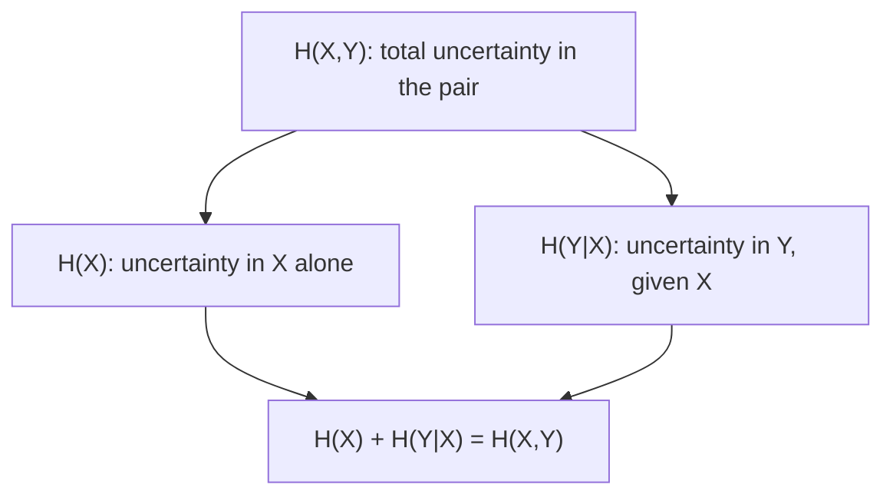

## Learning Objectives

- Define joint entropy H(X,Y) as the entropy of the pair (X,Y) treated as a single combined random variable.
- Define conditional entropy H(Y|X) as the expected remaining uncertainty in Y once X is known.
- Prove and apply the chain rule H(X,Y) = H(X) + H(Y|X).
- Compute joint and conditional entropy by hand for a small, concrete joint distribution.
- Explain why conditioning can never increase entropy: H(Y|X) ≤ H(Y).

## Context & Motivation

Entropy, as defined so far, describes a single random variable in isolation. But most of the interesting questions in this discipline — how much does observing one variable tell you about another, how much can a joint source be compressed — are fundamentally about *pairs* (or larger collections) of random variables together. `joint-distributions-and-independence-of-random-variables` already built the probabilistic machinery for reasoning about pairs: joint PMFs `p(x,y)`, and conditional PMFs `p(y|x)` derived from them. This concept extends entropy to that same setting, in exactly the way `expectation-and-variance`'s expectation extends to functions of two variables — no new probability theory is introduced here, only entropy applied to the joint and conditional distributions already available.

The resulting **chain rule for entropy** is the single most-used algebraic identity in the rest of this discipline: it is what lets mutual information (the next concept) be expressed two equivalent ways, and it is the same decomposition pattern — "the whole equals one part plus what's left over, given the first part" — that recurs constantly once channels enter the picture.

## Core Theory

### Joint entropy

For two random variables `X` and `Y` with joint PMF `p(x,y)`, the **joint entropy** treats the pair `(X,Y)` as a single combined random variable and applies the ordinary entropy definition to its joint distribution:

```text
H(X,Y) = −∑ₓ ∑ᵧ p(x,y)·log₂ p(x,y)
```

This is exactly entropy as already defined, with no new formula — only applied to a joint PMF instead of a single-variable PMF, the way any function of two random variables can be handled once their joint distribution is known.

### Conditional entropy

The **conditional entropy** `H(Y|X)` measures the *expected* remaining uncertainty in `Y`, once `X` is known. For a fixed value `x`, `H(Y|X=x) = −∑ᵧ p(y|x)·log₂p(y|x)` is the entropy of `Y`'s conditional distribution given that specific `x` — an ordinary entropy computation on the conditional PMF `p(y|x)`. Averaging this quantity over all possible values of `X`, weighted by `p(x)`, gives:

```text
H(Y|X) = ∑ₓ p(x)·H(Y|X=x) = −∑ₓ ∑ᵧ p(x,y)·log₂ p(y|x)
```

### The chain rule for entropy

**Claim.** `H(X,Y) = H(X) + H(Y|X)`.

**Proof.** Starting from joint entropy and using `p(x,y) = p(x)·p(y|x)` (the definition of conditional probability, already established):

```text
H(X,Y) = −∑ₓ ∑ᵧ p(x,y)·log₂ p(x,y)
       = −∑ₓ ∑ᵧ p(x,y)·log₂ [p(x)·p(y|x)]
       = −∑ₓ ∑ᵧ p(x,y)·[log₂ p(x) + log₂ p(y|x)]
       = −∑ₓ ∑ᵧ p(x,y)·log₂ p(x) − ∑ₓ ∑ᵧ p(x,y)·log₂ p(y|x)
```

The first term simplifies: `∑ᵧ p(x,y) = p(x)` (summing the joint over `y` recovers the marginal), so the first term becomes `−∑ₓ p(x)·log₂p(x) = H(X)`. The second term is, by definition above, exactly `H(Y|X)`. So `H(X,Y) = H(X) + H(Y|X)`. ∎

In words: the uncertainty in the pair equals the uncertainty in `X` alone, plus whatever uncertainty in `Y` remains once `X` has already been revealed — a clean decomposition of "total uncertainty" into "uncertainty about the first part" plus "leftover uncertainty about the second part, given the first."

### Conditioning never increases entropy

**Claim.** `H(Y|X) ≤ H(Y)`, with equality exactly when `X` and `Y` are independent.

Intuitively: knowing something (`X`) can only reduce, or at best leave unchanged, how uncertain you remain about something else (`Y`) — it can never make `Y` *more* uncertain on average. This is proved rigorously in the next concept, as a direct consequence of mutual information being non-negative; it is stated here because it is exactly the fact the chain rule needs to conclude `H(X,Y) ≤ H(X) + H(Y)` — the joint uncertainty of two variables is never more than the sum of their individual uncertainties, with equality exactly when they are independent.



## Worked Examples

### Example 1 — joint entropy of a simple 2×2 joint distribution

Let `X, Y ∈ {0,1}` with joint PMF: `p(0,0) = 0.4`, `p(0,1) = 0.1`, `p(1,0) = 0.1`, `p(1,1) = 0.4`.

```text
H(X,Y) = −(0.4·log₂0.4 + 0.1·log₂0.1 + 0.1·log₂0.1 + 0.4·log₂0.4)
       = −(0.4·(−1.322) + 0.1·(−3.322) + 0.1·(−3.322) + 0.4·(−1.322))
       = −(−0.529 − 0.332 − 0.332 − 0.529)
       = 1.722 bits
```

### Example 2 — conditional entropy H(Y|X) for the same distribution

First find the marginal `p(x)`: `p(X=0) = p(0,0)+p(0,1) = 0.5`, `p(X=1) = p(1,0)+p(1,1) = 0.5`. Then the conditionals: `p(Y=0|X=0) = 0.4/0.5 = 0.8`, `p(Y=1|X=0) = 0.1/0.5 = 0.2`; by the symmetry of this particular distribution, `p(Y=0|X=1) = 0.2`, `p(Y=1|X=1) = 0.8`.

```text
H(Y|X=0) = −(0.8·log₂0.8 + 0.2·log₂0.2) = −(0.8·(−0.322) + 0.2·(−2.322)) = 0.722 bits
H(Y|X=1) = 0.722 bits  (identical, by the symmetry of this distribution)

H(Y|X) = p(X=0)·H(Y|X=0) + p(X=1)·H(Y|X=1) = 0.5·0.722 + 0.5·0.722 = 0.722 bits
```

**Check via the chain rule:** `H(X) = −(0.5·log₂0.5 + 0.5·log₂0.5) = 1` bit. `H(X) + H(Y|X) = 1 + 0.722 = 1.722` bits — matches `H(X,Y) = 1.722` bits computed directly in Example 1, exactly as the chain rule guarantees.

### Example 3 — the independent case, where conditioning changes nothing

Suppose instead `p(0,0)=0.25, p(0,1)=0.25, p(1,0)=0.25, p(1,1)=0.25` (X and Y independent, each individually a fair coin). Then `p(y|x) = p(y)` for every `x` (the defining property of independence), so `H(Y|X=x) = H(Y) = 1` bit for every `x`, giving `H(Y|X) = 1` bit exactly — equal to `H(Y)`, confirming that conditioning on an independent variable removes no uncertainty at all, matching the equality case of `H(Y|X) ≤ H(Y)` stated in Core Theory.

## Common Misconceptions & Pitfalls

- **"H(Y|X) means the entropy of Y for one specific fixed value of X."** That quantity, `H(Y|X=x)`, is a valid but different thing — `H(Y|X)` without a specific `x` is the *average* of `H(Y|X=x)` over all values of `X`, weighted by `p(x)`, as defined in Core Theory. Conflating the two is a common source of off-by-a-sum errors.
- **"H(X,Y) = H(X) + H(Y) always."** This only holds when X and Y are independent — the general identity is the chain rule, `H(X,Y) = H(X) + H(Y|X)`, and `H(Y|X) ≤ H(Y)` in general (Example 3 shows the two coincide only in the independent case, and Example 2 shows a case where `H(Y|X) = 0.722 < H(Y) = 1`, strictly less).
- **"The chain rule only works in the order H(X) + H(Y|X); it must always list X first."** The chain rule is symmetric in the sense that `H(X,Y) = H(X) + H(Y|X) = H(Y) + H(X|Y)` also holds — joint entropy can be decomposed in either order, since `H(X,Y)` itself doesn't distinguish which variable is "first"; the specific decomposition used depends only on which conditional is more convenient to compute for the problem at hand.

## Summary

Joint entropy H(X,Y) applies the ordinary entropy formula to the joint distribution of a pair of random variables, while conditional entropy H(Y|X) averages, over all values of X, the entropy remaining in Y once each particular value of X is known. The chain rule H(X,Y) = H(X) + H(Y|X), proved directly from the definition of conditional probability, decomposes total joint uncertainty into "uncertainty about the first variable" plus "leftover uncertainty about the second, given the first" — and conditioning never increases entropy (H(Y|X) ≤ H(Y), with equality exactly under independence), matching the intuition that learning something can only reduce, never increase, remaining uncertainty about something else. This chain rule is the algebraic workhorse the next concept, mutual information, is built directly on top of.

## Documentation Links

- [Stanford EE276 — Course Outline](https://web.stanford.edu/class/ee276/outline.html) — doc
- [MIT 6.441 — Information Theory, Syllabus](https://ocw.mit.edu/courses/6-441-information-theory-spring-2016/pages/syllabus/) — doc
