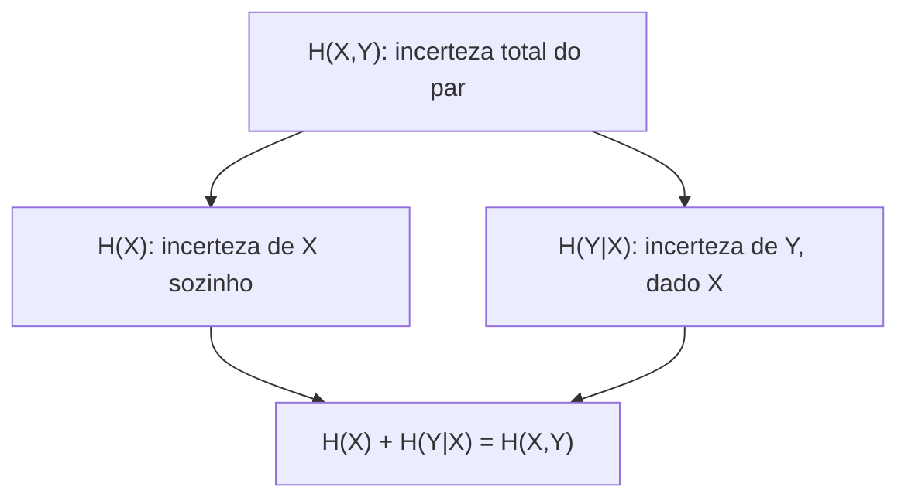

## Objetivos de Aprendizagem

- Definir a entropia conjunta H(X,Y) como a entropia do par (X,Y) tratado como uma única variável aleatória combinada.
- Definir a entropia condicional H(Y|X) como a incerteza esperada que resta em Y depois que X é conhecido.
- Provar e aplicar a regra da cadeia H(X,Y) = H(X) + H(Y|X).
- Calcular à mão a entropia conjunta e a condicional para uma distribuição conjunta pequena e concreta.
- Explicar por que condicionar nunca aumenta a entropia: H(Y|X) ≤ H(Y).

## Contexto e Motivação

A entropia, como definida até agora, descreve uma única variável aleatória isolada. Mas a maioria das perguntas interessantes desta disciplina (quanto observar uma variável diz sobre outra, quanto uma fonte conjunta pode ser comprimida) trata fundamentalmente de *pares* (ou coleções maiores) de variáveis aleatórias juntas. `joint-distributions-and-independence-of-random-variables` já construiu a maquinaria probabilística para raciocinar sobre pares: PMFs conjuntas `p(x,y)` e PMFs condicionais `p(y|x)` derivadas delas. Este conceito estende a entropia a esse mesmo cenário, exatamente do jeito que a esperança de `expectation-and-variance` se estende a funções de duas variáveis: nenhuma teoria de probabilidade nova é introduzida aqui, só a entropia aplicada às distribuições conjuntas e condicionais já disponíveis.

A **regra da cadeia da entropia** resultante é a identidade algébrica mais usada no resto desta disciplina: é ela que permite expressar a informação mútua (o próximo conceito) de duas formas equivalentes, e é o mesmo padrão de decomposição ("o todo é igual a uma parte mais o que sobra, dada a primeira parte") que reaparece o tempo todo quando os canais entram em cena.

## Teoria Central

### Entropia conjunta

Para duas variáveis aleatórias `X` e `Y` com PMF conjunta `p(x,y)`, a **entropia conjunta** trata o par `(X,Y)` como uma única variável aleatória combinada e aplica a definição comum de entropia à sua distribuição conjunta:

```text
H(X,Y) = −∑ₓ ∑ᵧ p(x,y)·log₂ p(x,y)
```

É exatamente a entropia já definida, sem fórmula nova; só aplicada a uma PMF conjunta em vez de uma PMF de uma variável, do mesmo jeito que qualquer função de duas variáveis aleatórias pode ser tratada uma vez conhecida a distribuição conjunta.

### Entropia condicional

A **entropia condicional** `H(Y|X)` mede a incerteza *esperada* que resta em `Y` depois que `X` é conhecido. Para um valor fixo `x`, `H(Y|X=x) = −∑ᵧ p(y|x)·log₂p(y|x)` é a entropia da distribuição condicional de `Y` dado aquele `x` específico, um cálculo comum de entropia sobre a PMF condicional `p(y|x)`. Tirar a média dessa quantidade sobre todos os valores possíveis de `X`, ponderada por `p(x)`, dá:

```text
H(Y|X) = ∑ₓ p(x)·H(Y|X=x) = −∑ₓ ∑ᵧ p(x,y)·log₂ p(y|x)
```

### A regra da cadeia da entropia

**Afirmação.** `H(X,Y) = H(X) + H(Y|X)`.

**Prova.** Partindo da entropia conjunta e usando `p(x,y) = p(x)·p(y|x)` (a definição de probabilidade condicional, já estabelecida):

```text
H(X,Y) = −∑ₓ ∑ᵧ p(x,y)·log₂ p(x,y)
       = −∑ₓ ∑ᵧ p(x,y)·log₂ [p(x)·p(y|x)]
       = −∑ₓ ∑ᵧ p(x,y)·[log₂ p(x) + log₂ p(y|x)]
       = −∑ₓ ∑ᵧ p(x,y)·log₂ p(x) − ∑ₓ ∑ᵧ p(x,y)·log₂ p(y|x)
```

O primeiro termo se simplifica: `∑ᵧ p(x,y) = p(x)` (somar a conjunta sobre `y` recupera a marginal), então o primeiro termo vira `−∑ₓ p(x)·log₂p(x) = H(X)`. O segundo termo é, pela definição acima, exatamente `H(Y|X)`. Logo, `H(X,Y) = H(X) + H(Y|X)`. ∎

Em palavras: a incerteza do par é igual à incerteza de `X` sozinho, mais a incerteza em `Y` que ainda resta depois que `X` já foi revelado; uma decomposição limpa da "incerteza total" em "incerteza sobre a primeira parte" mais "incerteza restante sobre a segunda parte, dada a primeira".

### Condicionar nunca aumenta a entropia

**Afirmação.** `H(Y|X) ≤ H(Y)`, com igualdade exatamente quando `X` e `Y` são independentes.

Intuitivamente: saber algo (`X`) só pode reduzir, ou no máximo deixar inalterada, a incerteza que você ainda tem sobre outra coisa (`Y`); nunca pode deixar `Y` *mais* incerto em média. Isso é provado com rigor no próximo conceito, como consequência direta de a informação mútua ser não negativa; é enunciado aqui porque é exatamente o fato de que a regra da cadeia precisa para concluir `H(X,Y) ≤ H(X) + H(Y)`: a incerteza conjunta de duas variáveis nunca é maior que a soma das incertezas individuais, com igualdade exatamente quando elas são independentes.



## Exemplos Resolvidos

### Exemplo 1: entropia conjunta de uma distribuição conjunta 2×2 simples

Sejam `X, Y ∈ {0,1}` com PMF conjunta: `p(0,0) = 0.4`, `p(0,1) = 0.1`, `p(1,0) = 0.1`, `p(1,1) = 0.4`.

```text
H(X,Y) = −(0.4·log₂0.4 + 0.1·log₂0.1 + 0.1·log₂0.1 + 0.4·log₂0.4)
       = −(0.4·(−1.322) + 0.1·(−3.322) + 0.1·(−3.322) + 0.4·(−1.322))
       = −(−0.529 − 0.332 − 0.332 − 0.529)
       = 1.722 bits
```

### Exemplo 2: entropia condicional H(Y|X) para a mesma distribuição

Primeiro, encontre a marginal `p(x)`: `p(X=0) = p(0,0)+p(0,1) = 0.5`, `p(X=1) = p(1,0)+p(1,1) = 0.5`. Depois, as condicionais: `p(Y=0|X=0) = 0.4/0.5 = 0.8`, `p(Y=1|X=0) = 0.1/0.5 = 0.2`; pela simetria desta distribuição em particular, `p(Y=0|X=1) = 0.2`, `p(Y=1|X=1) = 0.8`.

```text
H(Y|X=0) = −(0.8·log₂0.8 + 0.2·log₂0.2) = −(0.8·(−0.322) + 0.2·(−2.322)) = 0.722 bits
H(Y|X=1) = 0.722 bits  (idêntica, pela simetria desta distribuição)

H(Y|X) = p(X=0)·H(Y|X=0) + p(X=1)·H(Y|X=1) = 0.5·0.722 + 0.5·0.722 = 0.722 bits
```

**Conferindo pela regra da cadeia:** `H(X) = −(0.5·log₂0.5 + 0.5·log₂0.5) = 1` bit. `H(X) + H(Y|X) = 1 + 0.722 = 1.722` bits, igual a `H(X,Y) = 1.722` bits calculada diretamente no Exemplo 1, exatamente como a regra da cadeia garante.

### Exemplo 3: o caso independente, em que condicionar não muda nada

Suponha agora `p(0,0)=0.25, p(0,1)=0.25, p(1,0)=0.25, p(1,1)=0.25` (X e Y independentes, cada um individualmente uma moeda justa). Então `p(y|x) = p(y)` para todo `x` (a propriedade que define a independência), então `H(Y|X=x) = H(Y) = 1` bit para todo `x`, dando `H(Y|X) = 1` bit exatamente, igual a `H(Y)`. Isso confirma que condicionar numa variável independente não remove incerteza nenhuma, coincidindo com o caso de igualdade de `H(Y|X) ≤ H(Y)` enunciado na Teoria Central.

## Equívocos Comuns e Armadilhas

- **"H(Y|X) significa a entropia de Y para um valor específico e fixo de X."** Essa quantidade, `H(Y|X=x)`, é válida mas é outra coisa: `H(Y|X)` sem um `x` específico é a *média* de `H(Y|X=x)` sobre todos os valores de `X`, ponderada por `p(x)`, como definido na Teoria Central. Confundir as duas é uma fonte comum de erros de "esqueci uma soma".
- **"H(X,Y) = H(X) + H(Y) sempre."** Isso só vale quando X e Y são independentes. A identidade geral é a regra da cadeia, `H(X,Y) = H(X) + H(Y|X)`, e `H(Y|X) ≤ H(Y)` em geral (o Exemplo 3 mostra que as duas só coincidem no caso independente, e o Exemplo 2 mostra um caso em que `H(Y|X) = 0.722 < H(Y) = 1`, estritamente menor).
- **"A regra da cadeia só funciona na ordem H(X) + H(Y|X); ela sempre precisa listar X primeiro."** A regra da cadeia é simétrica no sentido de que `H(X,Y) = H(X) + H(Y|X) = H(Y) + H(X|Y)` também vale: a entropia conjunta pode ser decomposta em qualquer ordem, já que a própria `H(X,Y)` não distingue qual variável é a "primeira"; a decomposição usada depende só de qual condicional é mais conveniente de calcular no problema em questão.

## Resumo

A entropia conjunta H(X,Y) aplica a fórmula comum de entropia à distribuição conjunta de um par de variáveis aleatórias, enquanto a entropia condicional H(Y|X) tira a média, sobre todos os valores de X, da entropia que resta em Y depois que cada valor particular de X é conhecido. A regra da cadeia H(X,Y) = H(X) + H(Y|X), provada diretamente a partir da definição de probabilidade condicional, decompõe a incerteza conjunta total em "incerteza sobre a primeira variável" mais "incerteza restante sobre a segunda, dada a primeira". E condicionar nunca aumenta a entropia (H(Y|X) ≤ H(Y), com igualdade exatamente sob independência), de acordo com a intuição de que aprender algo só pode reduzir, nunca aumentar, a incerteza restante sobre outra coisa. Essa regra da cadeia é o burro de carga algébrico sobre o qual o próximo conceito, a informação mútua, é construído diretamente.

## Documentation Links

- [Stanford EE276: Course Outline](https://web.stanford.edu/class/ee276/outline.html): doc
- [MIT 6.441: Information Theory, Syllabus](https://ocw.mit.edu/courses/6-441-information-theory-spring-2016/pages/syllabus/): doc
