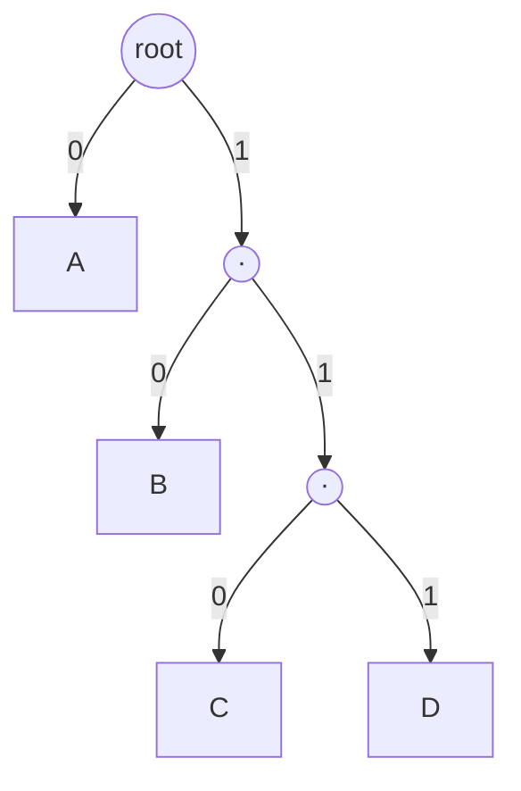

## Learning Objectives

- Define prefix-free (prefix) codes and explain why they allow instantaneous, unambiguous decoding without lookahead.
- Establish the exact correspondence between a prefix-free binary code and a binary tree with symbols at the leaves.
- State and prove Kraft's inequality: a set of codeword lengths admits a prefix-free code if and only if ∑ᵢ 2^(−lᵢ) ≤ 1.
- Use Kraft's inequality to check, by hand, whether a proposed set of codeword lengths is achievable.

## Context & Motivation

The source coding theorem just established that entropy is achievable in principle. Turning that into an actual algorithm requires first nailing down exactly which sets of codeword lengths are even *possible* to assemble into a valid, unambiguously-decodable code — and the answer turns out to have an exact, clean characterization. This concept establishes that characterization by making explicit a structural fact that has been implicit since `trees` and `binary-trees-terminology-and-representation` were first covered: a prefix-free binary code is, quite literally, nothing other than a binary tree with symbols living at its leaves. Kraft's inequality is the tree-counting fact this correspondence makes available, translated into a statement about codeword lengths.

## Core Theory

### Prefix-free codes and instantaneous decoding

A binary code assigns each symbol a distinct binary string (its **codeword**). A code is **prefix-free** (also called a **prefix code**) if no codeword is a prefix of any other codeword — for instance, `{0, 10, 110, 111}` is prefix-free (no codeword starts with another one in full), while `{0, 01, 10}` is not (`0` is a prefix of `01`). Prefix-freedom is exactly what allows a decoder to work **instantaneously**: reading bits one at a time from a stream, the decoder recognizes a complete codeword the moment it sees one, with no need to look ahead at subsequent bits to determine where the current codeword ends. `{A→0, B→10, C→110, D→111}`'s Example 2 from the previous concept is exactly such a code — decoding the stream `0 110 10` proceeds unambiguously left to right, one codeword at a time, with zero backtracking ever required.

### The tree correspondence

Every binary string can be thought of as a path from the root of an infinite binary tree — going left for each `0`, right for each `1`. A codeword `c` corresponds to a specific node in this tree; codeword `c` being a prefix of codeword `c'` corresponds exactly to `c'`'s node being a descendant of `c`'s node in the tree. **A code is prefix-free if and only if no codeword's node is an ancestor of another codeword's node** — equivalently, if every symbol's codeword sits at a leaf of some finite binary tree (once you place a symbol at a node, that node can have no further descendants used by any other symbol, exactly the property `trees`' rooted-tree vocabulary already gives a name to). Building a prefix-free code is therefore, always, exactly the same activity as building a binary tree and placing each symbol at one of its leaves — this is not a metaphor, it is a precise structural equivalence, and it is the reason `huffman-coding-construction`, the next concept, is described entirely as an algorithm for *building a tree*.



This is exactly the tree behind the code `{A→0, B→10, C→110, D→111}` from the previous concept: each symbol sits at a leaf, and the path from the root to that leaf, read as a sequence of left/right (0/1) branches, is exactly its codeword — `A` at depth 1 (codeword `0`), `D` at depth 3 (codeword `111`).

### Kraft's inequality

**Claim.** A set of positive integer lengths `l₁, l₂, ..., lₙ` admits a prefix-free binary code with those exact lengths if and only if:

```text
∑ᵢ 2^(−lᵢ) ≤ 1
```

**Proof, via the tree correspondence.** Consider a full binary tree of depth `L = max(lᵢ)`. A node at depth `lᵢ` (where codeword `i` sits, per the correspondence above) has exactly `2^(L − lᵢ)` descendant leaves at depth `L` in the full tree — its entire subtree, all the way down. Because the code is prefix-free, no codeword's node is an ancestor of another's, so these descendant-leaf sets, for different codewords, cannot overlap: they are disjoint subsets of the `2^L` total depth-`L` leaves of the full tree. Since disjoint subsets of a set of size `2^L` cannot together exceed `2^L` in total size: `∑ᵢ 2^(L−lᵢ) ≤ 2^L`. Dividing both sides by `2^L` gives exactly `∑ᵢ 2^(−lᵢ) ≤ 1`. This proves the "only if" direction directly from counting leaves in a tree — precisely the kind of counting argument `permutations-and-combinations` and `the-pigeonhole-principle` already established as tools, now applied inside a tree structure instead of a flat set. The converse ("if the inequality holds, a valid prefix-free code with those lengths can be constructed") follows by a direct construction: sort the lengths ascending and greedily assign each codeword the leftmost available node at its required depth, which the inequality guarantees never runs out of room. ∎

### Why Kraft's inequality justifies the source coding theorem's converse

The proof of the source coding theorem's converse, in the previous concept, assumed Kraft's inequality (`∑ₓ2^(−l(x)) ≤ 1`) as a starting fact about any uniquely-decodable code's lengths. Kraft's inequality, as proved here, is exactly and only about *prefix-free* codes — but it is a standard, separately-proved fact (McMillan's theorem, not reproduced here in full) that *any* uniquely-decodable code, even one that is not prefix-free, has lengths satisfying the exact same inequality. This means prefix-free codes lose nothing in principle compared to the broader class of all uniquely-decodable codes — restricting attention to prefix-free codes (as this discipline does from here on, since they are also the easiest to decode) sacrifices no achievable average length whatsoever.

## Worked Examples

### Example 1 — checking Kraft's inequality for the code from the previous concept

For `{A→0, B→10, C→110, D→111}` with lengths `1, 2, 3, 3`:

```text
2^(−1) + 2^(−2) + 2^(−3) + 2^(−3) = 0.5 + 0.25 + 0.125 + 0.125 = 1.0
```

Exactly equal to 1 — this code uses the tree "completely full," with no wasted leaves at all, which is exactly why it achieved the entropy bound exactly in the previous concept's Example 2 (its lengths were chosen to match `−log₂p(x)` exactly for a distribution whose probabilities are exact powers of 2).

### Example 2 — a set of lengths that fails Kraft's inequality

Can a prefix-free code exist with lengths `1, 1, 2`? Check: `2^(−1) + 2^(−1) + 2^(−2) = 0.5 + 0.5 + 0.25 = 1.25 > 1`. Kraft's inequality fails, so no such prefix-free code exists — confirmable directly: with two length-1 codewords, they must be `0` and `1` (the only two length-1 binary strings), leaving no room at all for a third codeword of any length without violating prefix-freedom (any longer string necessarily starts with `0` or `1`, making it a descendant of one of the two length-1 codewords already placed).

### Example 3 — using Kraft's inequality to check feasibility before building anything

For the skewed 4-symbol source from `entropy-the-expected-information-content`'s Example 3, suppose someone proposes lengths `1, 2, 3, 4` (one longer than Example 1's `1,2,3,3`, perhaps by mistake). Check: `2^(−1)+2^(−2)+2^(−3)+2^(−4) = 0.5+0.25+0.125+0.0625 = 0.9375 ≤ 1` — Kraft's inequality holds, so this is achievable, but it wastes capacity (the sum is strictly less than 1, meaning the resulting tree has an unused leaf slot) compared to Example 1's tight `1,2,3,3`, which achieves entropy exactly for this distribution — confirming that satisfying Kraft's inequality alone guarantees *achievability*, but not *optimality*; `huffman-coding-construction`, next, is precisely the algorithm for finding the lengths that are both.

## Common Misconceptions & Pitfalls

- **"Kraft's inequality being satisfied means the code is optimal."** Example 3 shows lengths satisfying the inequality strictly (sum < 1) while being clearly worse (longer, on average, for the same distribution) than a tight code (sum = 1) — Kraft's inequality only certifies *feasibility* (a valid prefix-free code with those lengths exists), never optimality.
- **"Prefix-free means no codeword is a prefix of the encoded stream, not of another codeword."** Prefix-freedom is a property of the *codeword set itself*, checked once at code design time — it says no single codeword is literally a text-prefix of any other codeword in the set, which is exactly the property that then makes decoding any stream built from those codewords unambiguous.
- **"Any uniquely-decodable code must be prefix-free."** The converse of Kraft's inequality (any lengths satisfying it admit *a* prefix-free code) does not mean *every* uniquely-decodable code is itself prefix-free — non-prefix-free uniquely-decodable codes exist (they require some lookahead to decode) but, per McMillan's theorem mentioned in Core Theory, can always be replaced by a prefix-free code with the identical lengths and no loss in average length, which is exactly why this discipline restricts attention to prefix-free codes without losing any real achievability.

## Summary

A prefix-free code corresponds exactly to a binary tree with symbols at its leaves — no codeword a prefix of another means no codeword's tree node is an ancestor of another's — and Kraft's inequality ∑ᵢ2^(−lᵢ) ≤ 1, proved directly by counting disjoint leaf-descendant sets in that tree, characterizes exactly which sets of codeword lengths are achievable by some prefix-free code. Satisfying the inequality guarantees a valid code exists (with equality meaning the tree is used completely, with no wasted capacity), but says nothing about whether those particular lengths are the *best* achievable for a given distribution — finding the lengths that are both feasible and optimal is exactly the job of the next concept, Huffman coding.

## Documentation Links

- [Stanford EE276 — Course Outline](https://web.stanford.edu/class/ee276/outline.html) — doc
