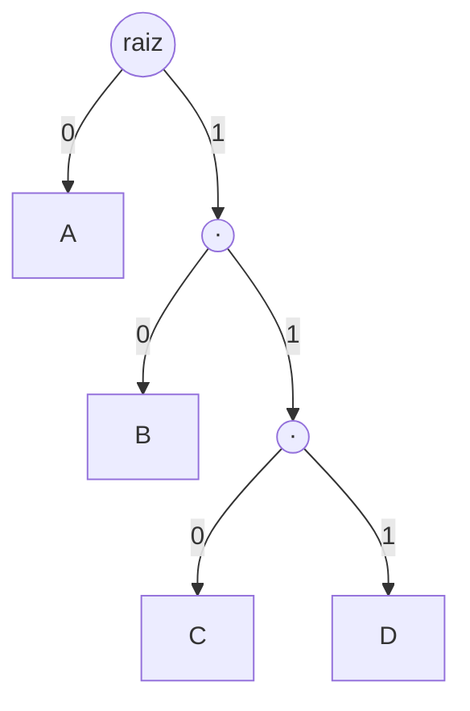

## Objetivos de Aprendizagem

- Definir códigos livres de prefixo (códigos de prefixo) e explicar por que eles permitem decodificação instantânea e sem ambiguidade, sem olhar adiante.
- Estabelecer a correspondência exata entre um código binário livre de prefixo e uma árvore binária com os símbolos nas folhas.
- Enunciar e provar a desigualdade de Kraft: um conjunto de comprimentos de palavras-código admite um código livre de prefixo se e somente se ∑ᵢ 2^(−lᵢ) ≤ 1.
- Usar a desigualdade de Kraft para verificar à mão se um conjunto proposto de comprimentos de palavras-código é alcançável.

## Contexto e Motivação

O teorema da codificação de fonte acabou de estabelecer que a entropia é alcançável em princípio. Transformar isso num algoritmo de verdade exige primeiro definir exatamente quais conjuntos de comprimentos de palavras-código são sequer *possíveis* de montar num código válido e decodificável sem ambiguidade, e a resposta acaba tendo uma caracterização exata e limpa. Este conceito estabelece essa caracterização tornando explícito um fato estrutural que está implícito desde que `trees` e `binary-trees-terminology-and-representation` foram vistos: um código binário livre de prefixo é, literalmente, nada mais que uma árvore binária com os símbolos morando nas folhas. A desigualdade de Kraft é o fato de contagem em árvores que essa correspondência disponibiliza, traduzido numa afirmação sobre comprimentos de palavras-código.

## Teoria Central

### Códigos livres de prefixo e decodificação instantânea

Um código binário atribui a cada símbolo uma cadeia binária distinta (sua **palavra-código**). Um código é **livre de prefixo** (também chamado de **código de prefixo**) se nenhuma palavra-código é prefixo de outra palavra-código. Por exemplo, `{0, 10, 110, 111}` é livre de prefixo (nenhuma palavra-código começa com outra inteira), enquanto `{0, 01, 10}` não é (`0` é prefixo de `01`). Ser livre de prefixo é exatamente o que permite a um decodificador trabalhar de forma **instantânea**: lendo bits um a um de um fluxo, o decodificador reconhece uma palavra-código completa no momento em que a vê, sem precisar olhar os bits seguintes para determinar onde a palavra-código atual termina. O código do Exemplo 2 do conceito anterior, `{A→0, B→10, C→110, D→111}`, é exatamente um código desses: decodificar o fluxo `0 110 10` avança sem ambiguidade da esquerda para a direita, uma palavra-código por vez, sem nunca precisar de retrocesso.

### A correspondência com árvores

Toda cadeia binária pode ser vista como um caminho a partir da raiz de uma árvore binária infinita: indo para a esquerda a cada `0` e para a direita a cada `1`. Uma palavra-código `c` corresponde a um nó específico dessa árvore; a palavra-código `c` ser prefixo da palavra-código `c'` corresponde exatamente a o nó de `c'` ser descendente do nó de `c` na árvore. **Um código é livre de prefixo se e somente se o nó de nenhuma palavra-código é ancestral do nó de outra palavra-código**; equivalentemente, se a palavra-código de todo símbolo fica numa folha de alguma árvore binária finita (uma vez que se coloca um símbolo num nó, esse nó não pode ter mais descendentes usados por nenhum outro símbolo, exatamente a propriedade a que o vocabulário de árvores enraizadas de `trees` já dá nome). Construir um código livre de prefixo é, portanto, sempre exatamente a mesma atividade que construir uma árvore binária e colocar cada símbolo numa de suas folhas. Isso não é uma metáfora, é uma equivalência estrutural precisa, e é a razão pela qual `huffman-coding-construction`, o próximo conceito, é descrito inteiramente como um algoritmo para *construir uma árvore*.



Essa é exatamente a árvore por trás do código `{A→0, B→10, C→110, D→111}` do conceito anterior: cada símbolo fica numa folha, e o caminho da raiz até essa folha, lido como uma sequência de ramos esquerda/direita (0/1), é exatamente a sua palavra-código: `A` na profundidade 1 (palavra-código `0`), `D` na profundidade 3 (palavra-código `111`).

### A desigualdade de Kraft

**Afirmação.** Um conjunto de comprimentos inteiros positivos `l₁, l₂, ..., lₙ` admite um código binário livre de prefixo com exatamente esses comprimentos se e somente se:

```text
∑ᵢ 2^(−lᵢ) ≤ 1
```

**Prova, pela correspondência com árvores.** Considere uma árvore binária cheia de profundidade `L = max(lᵢ)`. Um nó na profundidade `lᵢ` (onde a palavra-código `i` fica, conforme a correspondência acima) tem exatamente `2^(L − lᵢ)` folhas descendentes na profundidade `L` da árvore cheia: a subárvore inteira dele, até o fim. Como o código é livre de prefixo, o nó de nenhuma palavra-código é ancestral do de outra, então esses conjuntos de folhas descendentes, para palavras-código diferentes, não podem se sobrepor: são subconjuntos disjuntos das `2^L` folhas totais na profundidade `L` da árvore cheia. Como subconjuntos disjuntos de um conjunto de tamanho `2^L` não podem juntos passar de `2^L` em tamanho total: `∑ᵢ 2^(L−lᵢ) ≤ 2^L`. Dividir os dois lados por `2^L` dá exatamente `∑ᵢ 2^(−lᵢ) ≤ 1`. Isso prova a direção "somente se" diretamente pela contagem de folhas numa árvore, precisamente o tipo de argumento de contagem que `permutations-and-combinations` e `the-pigeonhole-principle` já estabeleceram como ferramentas, agora aplicado dentro de uma estrutura de árvore em vez de um conjunto plano. A recíproca ("se a desigualdade vale, um código livre de prefixo válido com esses comprimentos pode ser construído") segue por uma construção direta: ordenar os comprimentos em ordem crescente e atribuir gulosamente a cada palavra-código o nó disponível mais à esquerda na profundidade exigida, e a desigualdade garante que o espaço nunca acaba. ∎

### Por que a desigualdade de Kraft justifica a recíproca do teorema da codificação de fonte

A prova da recíproca do teorema da codificação de fonte, no conceito anterior, assumiu a desigualdade de Kraft (`∑ₓ2^(−l(x)) ≤ 1`) como fato de partida sobre os comprimentos de qualquer código unicamente decodificável. A desigualdade de Kraft, como provada aqui, trata exatamente e só de códigos *livres de prefixo*; mas é um fato padrão, provado separadamente (o teorema de McMillan, não reproduzido aqui por completo), que *qualquer* código unicamente decodificável, mesmo um que não seja livre de prefixo, tem comprimentos que satisfazem exatamente a mesma desigualdade. Isso significa que os códigos livres de prefixo não perdem nada em princípio em comparação com a classe mais ampla de todos os códigos unicamente decodificáveis: restringir a atenção a códigos livres de prefixo (como esta disciplina faz daqui em diante, já que eles também são os mais fáceis de decodificar) não sacrifica nenhum comprimento médio alcançável.

## Exemplos Resolvidos

### Exemplo 1: verificando a desigualdade de Kraft para o código do conceito anterior

Para `{A→0, B→10, C→110, D→111}` com comprimentos `1, 2, 3, 3`:

```text
2^(−1) + 2^(−2) + 2^(−3) + 2^(−3) = 0.5 + 0.25 + 0.125 + 0.125 = 1.0
```

Exatamente igual a 1: este código usa a árvore "totalmente cheia", sem nenhuma folha desperdiçada, e é exatamente por isso que ele atingiu o limite da entropia exatamente no Exemplo 2 do conceito anterior (seus comprimentos foram escolhidos para coincidir exatamente com `−log₂p(x)` para uma distribuição cujas probabilidades são potências exatas de 2).

### Exemplo 2: um conjunto de comprimentos que falha na desigualdade de Kraft

Pode existir um código livre de prefixo com comprimentos `1, 1, 2`? Verificando: `2^(−1) + 2^(−1) + 2^(−2) = 0.5 + 0.5 + 0.25 = 1.25 > 1`. A desigualdade de Kraft falha, então esse código livre de prefixo não existe, o que dá para confirmar diretamente: com duas palavras-código de comprimento 1, elas precisam ser `0` e `1` (as únicas duas cadeias binárias de comprimento 1), não deixando espaço algum para uma terceira palavra-código de qualquer comprimento sem violar a propriedade de ser livre de prefixo (qualquer cadeia mais longa necessariamente começa com `0` ou `1`, tornando-se descendente de uma das duas palavras-código de comprimento 1 já colocadas).

### Exemplo 3: usando a desigualdade de Kraft para verificar a viabilidade antes de construir qualquer coisa

Para a fonte desigual de 4 símbolos do Exemplo 3 de `entropy-the-expected-information-content`, suponha que alguém proponha os comprimentos `1, 2, 3, 4` (um a mais que o `1,2,3,3` do Exemplo 1, talvez por engano). Verificando: `2^(−1)+2^(−2)+2^(−3)+2^(−4) = 0.5+0.25+0.125+0.0625 = 0.9375 ≤ 1`. A desigualdade de Kraft vale, então isso é alcançável, mas desperdiça capacidade (a soma é estritamente menor que 1, o que significa que a árvore resultante tem uma posição de folha não usada) em comparação com o `1,2,3,3` justo do Exemplo 1, que atinge a entropia exatamente para essa distribuição. Isso confirma que satisfazer a desigualdade de Kraft por si só garante *alcançabilidade*, mas não *otimalidade*; `huffman-coding-construction`, a seguir, é precisamente o algoritmo para encontrar os comprimentos que são as duas coisas.

## Equívocos Comuns e Armadilhas

- **"Satisfazer a desigualdade de Kraft significa que o código é ótimo."** O Exemplo 3 mostra comprimentos que satisfazem a desigualdade de forma estrita (soma < 1) e são claramente piores (mais longos, em média, para a mesma distribuição) que um código justo (soma = 1). A desigualdade de Kraft só certifica a *viabilidade* (existe um código livre de prefixo válido com esses comprimentos), nunca a otimalidade.
- **"Livre de prefixo significa que nenhuma palavra-código é prefixo do fluxo codificado, e não de outra palavra-código."** Ser livre de prefixo é uma propriedade do *próprio conjunto de palavras-código*, verificada uma vez no projeto do código: diz que nenhuma palavra-código é literalmente um prefixo textual de outra palavra-código do conjunto, exatamente a propriedade que então torna sem ambiguidade a decodificação de qualquer fluxo montado com essas palavras-código.
- **"Todo código unicamente decodificável precisa ser livre de prefixo."** A recíproca da desigualdade de Kraft (quaisquer comprimentos que a satisfaçam admitem *um* código livre de prefixo) não significa que *todo* código unicamente decodificável seja ele próprio livre de prefixo. Existem códigos unicamente decodificáveis que não são livres de prefixo (eles exigem olhar adiante para decodificar), mas, pelo teorema de McMillan citado na Teoria Central, eles sempre podem ser substituídos por um código livre de prefixo com os mesmos comprimentos e sem perda no comprimento médio, e é exatamente por isso que esta disciplina restringe a atenção a códigos livres de prefixo sem perder nenhuma alcançabilidade real.

## Resumo

Um código livre de prefixo corresponde exatamente a uma árvore binária com os símbolos nas folhas (nenhuma palavra-código prefixo de outra significa que o nó de nenhuma palavra-código na árvore é ancestral do de outra), e a desigualdade de Kraft ∑ᵢ2^(−lᵢ) ≤ 1, provada diretamente pela contagem de conjuntos disjuntos de folhas descendentes nessa árvore, caracteriza exatamente quais conjuntos de comprimentos de palavras-código são alcançáveis por algum código livre de prefixo. Satisfazer a desigualdade garante que existe um código válido (com a igualdade significando que a árvore é usada por completo, sem capacidade desperdiçada), mas não diz nada sobre se esses comprimentos específicos são os *melhores* alcançáveis para uma dada distribuição. Encontrar os comprimentos que são ao mesmo tempo viáveis e ótimos é exatamente o trabalho do próximo conceito, a codificação de Huffman.

## Documentation Links

- [Stanford EE276: Course Outline](https://web.stanford.edu/class/ee276/outline.html): doc
