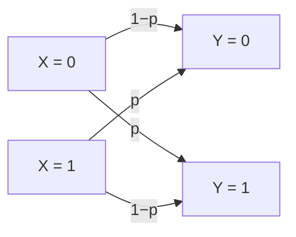

## Learning Objectives

- Define a discrete memoryless channel as a conditional probability distribution p(y|x) linking channel input to channel output.
- Define the binary symmetric channel (BSC) with crossover probability p, and explain why each transmitted bit is an independent Bernoulli trial.
- Compute, by hand, the probability of specific error patterns across a short bit sequence sent over a BSC.
- Explain why the BSC, despite its simplicity, is the standard teaching vehicle for every channel-capacity and coding-theorem idea that follows.

## Context & Motivation

Every concept so far has been about a *source*: how much uncertainty it has, and how far it can be compressed. This concept pivots to the other half of Shannon's 1948 framework — the **channel**, the noisy medium a compressed message actually has to travel across to reach its destination. Shannon's own paper frames the full communication system as exactly this pipeline: an information source, a transmitter (encoding, exactly what the last several concepts have built), a noisy channel, a receiver, and a destination. Before capacity or the coding theorem can be discussed meaningfully, a concrete model of "noisy" is needed — and information theory's standard answer, used across essentially every course this discipline draws on (Cover & Thomas, Stanford EE276, Shannon's own paper), is the simplest possible non-trivial noisy channel: the **binary symmetric channel**.

## Core Theory

### Discrete memoryless channels, generally

A **discrete channel** is specified by an input alphabet, an output alphabet, and a conditional probability distribution `p(y|x)` giving the probability of observing output `y` given that input `x` was transmitted. **Memoryless** means each use of the channel is statistically independent of every other use — the noise affecting one transmitted symbol has no bearing on the noise affecting any other. This is a direct application of the conditional-probability machinery already fully developed in `foundations/probability-statistics` and `joint-entropy-and-conditional-entropy`, now interpreted physically: `X` is what's sent, `Y` is what's received, and `p(y|x)` captures everything the channel does to corrupt the signal in transit.

### The binary symmetric channel (BSC)

The **binary symmetric channel** has input and output alphabets both `{0, 1}`, and a single parameter `p` (the **crossover probability**): each transmitted bit is flipped independently with probability `p`, and transmitted correctly with probability `1 − p`:

```text
p(Y=0 | X=0) = 1 − p        p(Y=1 | X=0) = p
p(Y=1 | X=1) = 1 − p        p(Y=0 | X=1) = p
```

"Symmetric" refers to the fact that the flip probability `p` is identical regardless of whether a `0` or a `1` was sent — the channel doesn't favor corrupting one bit value over the other.



### Each bit is an independent Bernoulli trial

Whether a given transmitted bit is flipped or not is exactly a **Bernoulli trial** with success probability `p` (already defined in `the-bernoulli-and-binomial-distributions`) — "success" here meaning "this bit got corrupted." Because the channel is memoryless, sending `n` bits across a BSC corresponds to `n` independent Bernoulli trials, and the *number* of bits corrupted out of `n` sent follows exactly a **Binomial distribution** with parameters `n` and `p` — the same distribution already fully derived in that earlier concept, now reused rather than re-derived, applied to a genuinely new physical setting.

### Why the BSC, despite its simplicity, anchors everything that follows

The BSC is deliberately the simplest possible non-trivial channel — one parameter, symmetric, memoryless — and this simplicity is exactly its pedagogical value: every subsequent concept in this cluster (channel capacity, the noisy-channel coding theorem, real error-correcting codes) can be worked out for the BSC with closed-form, hand-computable answers, making the underlying ideas concrete before any more complicated channel model (with asymmetric error rates, continuous-valued noise, or memory across uses) is even considered. Shannon's own 1948 paper builds its entire noisy-channel treatment on exactly this kind of discrete model before generalizing to the continuous Gaussian channel — this discipline follows the same order, and, matching the CS-oriented scope decision made for this whole channels cluster, stops at the discrete case rather than following Shannon (or Stanford EE276's later AWGN-channel lectures) into the continuous, differential-entropy treatment that a graduate EE course would cover next.

## Worked Examples

### Example 1 — probability of a specific 4-bit error pattern

Send `x = 1011` across a BSC with crossover probability `p = 0.1`. What is the probability that exactly the pattern `y = 1001` is received (i.e., the third bit flips, the others don't)?

```text
P(y=1001 | x=1011) = P(bit1 correct)·P(bit2 correct)·P(bit3 flips)·P(bit4 correct)
                    = (1−p)·(1−p)·p·(1−p)
                    = 0.9 · 0.9 · 0.1 · 0.9
                    = 0.0729
```

### Example 2 — probability of exactly one error, any position, in a 4-bit transmission

Using the Binomial distribution directly (as in `the-bernoulli-and-binomial-distributions`), the probability of exactly `k=1` error out of `n=4` independent bit transmissions, each with flip probability `p=0.1`:

```text
P(exactly 1 error) = C(4,1)·p¹·(1−p)³ = 4 · 0.1 · 0.729 = 0.2916
```

Compare to Example 1's single specific pattern (`0.0729`): the general "exactly one error, anywhere" probability (`0.2916`) is exactly `4×` the specific-pattern probability, matching `C(4,1) = 4` possible positions for that one error — a direct, concrete check that the Binomial framing and the per-bit independent-trial framing agree exactly.

### Example 3 — the all-correct and worst-case probabilities

For the same `n=4`, `p=0.1` channel: probability of zero errors (perfect transmission) is `(1−p)⁴ = 0.9⁴ = 0.6561` — a little under two-thirds of 4-bit transmissions arrive completely uncorrupted. Probability of all 4 bits flipping (the specific worst case) is `p⁴ = 0.1⁴ = 0.0001` — vanishingly rare, as expected since each individual flip is already unlikely and four independent unlikely events compound multiplicatively.

## Common Misconceptions & Pitfalls

- **"A 'symmetric' channel means half the bits get corrupted."** Symmetric refers to the flip probability being the *same for both input values* (0 and 1 are equally likely to be corrupted), not to the flip probability itself being 0.5 — a BSC with `p = 0.1` (as in the worked examples) is still symmetric, just not very noisy; a BSC becomes maximally destructive (output completely unpredictable from input) only as `p → 0.5`.
- **"If p is small, errors basically don't matter and can be ignored."** Example 2 shows that even a "small" per-bit error rate of 10% produces a non-trivial ~29% chance of at least one error somewhere in just a 4-bit message — the compounding effect across longer messages (which real transmissions always are) is exactly why channel coding, developed over the next few concepts, is necessary even for channels that look individually reliable.
- **"The BSC model is too simplistic to say anything about real communication systems."** Its simplicity is deliberate and pedagogically load-bearing, not a limitation being glossed over — it is the same model Shannon's own foundational 1948 paper uses to introduce every core noisy-channel concept before generalizing, and it captures the essential phenomenon (independent, memoryless bit corruption) that more complex real-world channel models refine but do not fundamentally replace.

## Summary

A discrete memoryless channel is fully specified by a conditional distribution p(y|x) linking input to output, with each use of the channel statistically independent of every other. The binary symmetric channel — the canonical example this cluster builds on — flips each transmitted bit independently with a fixed crossover probability p, making each bit's corruption exactly a Bernoulli trial and the total number of corrupted bits across a transmission exactly Binomially distributed, reusing rather than re-deriving both distributions from `foundations/probability-statistics`. Its deliberate simplicity — one parameter, symmetric, memoryless — is what makes it the standard vehicle, used from Shannon's original 1948 paper through every modern course this discipline draws on, for working out channel capacity and the noisy-channel coding theorem with concrete, hand-computable numbers, both taken up next.

## Documentation Links

- [Shannon — A Mathematical Theory of Communication (1948)](https://people.math.harvard.edu/~ctm/home/text/others/shannon/entropy/entropy.pdf) — doc
- [Stanford EE276 — Course Outline](https://web.stanford.edu/class/ee276/outline.html) — doc
