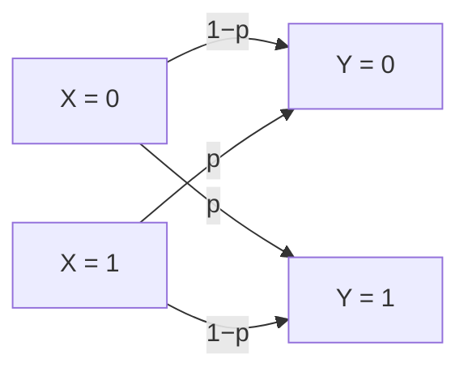

## Objetivos de Aprendizagem

- Definir um canal discreto sem memória como uma distribuição de probabilidade condicional p(y|x) que liga a entrada do canal à saída.
- Definir o canal binário simétrico (BSC) com probabilidade de cruzamento p e explicar por que cada bit transmitido é uma tentativa de Bernoulli independente.
- Calcular à mão a probabilidade de padrões de erro específicos numa curta sequência de bits enviada por um BSC.
- Explicar por que o BSC, apesar da simplicidade, é o veículo didático padrão para todas as ideias de capacidade de canal e do teorema da codificação que vêm a seguir.

## Contexto e Motivação

Todos os conceitos até agora trataram de uma *fonte*: quanta incerteza ela tem e quanto pode ser comprimida. Este conceito vira para a outra metade do arcabouço de Shannon de 1948: o **canal**, o meio ruidoso pelo qual uma mensagem comprimida de fato precisa viajar para chegar ao destino. O próprio artigo de Shannon enquadra o sistema de comunicação completo exatamente como esse pipeline: uma fonte de informação, um transmissor (a codificação, exatamente o que os últimos conceitos construíram), um canal ruidoso, um receptor e um destino. Antes que a capacidade ou o teorema da codificação possam ser discutidos com significado, é preciso um modelo concreto de "ruidoso", e a resposta padrão da teoria da informação, usada em essencialmente todos os cursos em que esta disciplina se apoia (Cover & Thomas, Stanford EE276, o próprio artigo de Shannon), é o canal ruidoso não trivial mais simples possível: o **canal binário simétrico**.

## Teoria Central

### Canais discretos sem memória, em geral

Um **canal discreto** é especificado por um alfabeto de entrada, um alfabeto de saída e uma distribuição de probabilidade condicional `p(y|x)` que dá a probabilidade de observar a saída `y` dado que a entrada `x` foi transmitida. **Sem memória** significa que cada uso do canal é estatisticamente independente de todos os outros: o ruído que afeta um símbolo transmitido não tem relação com o ruído que afeta qualquer outro. Isso é uma aplicação direta da maquinaria de probabilidade condicional já totalmente desenvolvida em `foundations/probability-statistics` e `joint-entropy-and-conditional-entropy`, agora interpretada fisicamente: `X` é o que é enviado, `Y` é o que é recebido, e `p(y|x)` captura tudo o que o canal faz para corromper o sinal no caminho.

### O canal binário simétrico (BSC)

O **canal binário simétrico** tem alfabetos de entrada e de saída ambos iguais a `{0, 1}` e um único parâmetro `p` (a **probabilidade de cruzamento**): cada bit transmitido é invertido de forma independente com probabilidade `p` e transmitido corretamente com probabilidade `1 − p`:

```text
p(Y=0 | X=0) = 1 − p        p(Y=1 | X=0) = p
p(Y=1 | X=1) = 1 − p        p(Y=0 | X=1) = p
```

"Simétrico" se refere ao fato de que a probabilidade de inversão `p` é idêntica quer se tenha enviado um `0` ou um `1`: o canal não favorece corromper um valor de bit em vez do outro.



### Cada bit é uma tentativa de Bernoulli independente

Se um dado bit transmitido é invertido ou não é exatamente uma **tentativa de Bernoulli** com probabilidade de sucesso `p` (já definida em `the-bernoulli-and-binomial-distributions`), em que "sucesso" aqui significa "este bit foi corrompido". Como o canal é sem memória, enviar `n` bits por um BSC corresponde a `n` tentativas de Bernoulli independentes, e o *número* de bits corrompidos entre os `n` enviados segue exatamente uma **distribuição Binomial** com parâmetros `n` e `p`: a mesma distribuição já totalmente derivada naquele conceito anterior, agora reaproveitada em vez de derivada de novo, aplicada a um cenário físico genuinamente novo.

### Por que o BSC, apesar da simplicidade, ancora tudo o que vem depois

O BSC é deliberadamente o canal não trivial mais simples possível (um parâmetro, simétrico, sem memória), e essa simplicidade é exatamente seu valor didático: todo conceito seguinte deste bloco (capacidade do canal, o teorema da codificação de canal ruidoso, códigos corretores de erros reais) pode ser resolvido para o BSC com respostas em forma fechada e calculáveis à mão, tornando as ideias subjacentes concretas antes que qualquer modelo de canal mais complicado (com taxas de erro assimétricas, ruído de valores contínuos ou memória entre usos) sequer seja considerado. O próprio artigo de Shannon de 1948 constrói todo o seu tratamento de canal ruidoso exatamente sobre esse tipo de modelo discreto antes de generalizar para o canal gaussiano contínuo. Esta disciplina segue a mesma ordem e, de acordo com a decisão de escopo voltada à computação tomada para todo este bloco de canais, para no caso discreto em vez de seguir Shannon (ou as aulas posteriores de canal AWGN do Stanford EE276) para o tratamento contínuo, com entropia diferencial, que um curso de pós-graduação em engenharia elétrica cobriria em seguida.

## Exemplos Resolvidos

### Exemplo 1: probabilidade de um padrão de erro específico de 4 bits

Envie `x = 1011` por um BSC com probabilidade de cruzamento `p = 0.1`. Qual é a probabilidade de receber exatamente o padrão `y = 1001` (ou seja, o terceiro bit é invertido e os outros não)?

```text
P(y=1001 | x=1011) = P(bit1 correto)·P(bit2 correto)·P(bit3 invertido)·P(bit4 correto)
                    = (1−p)·(1−p)·p·(1−p)
                    = 0.9 · 0.9 · 0.1 · 0.9
                    = 0.0729
```

### Exemplo 2: probabilidade de exatamente um erro, em qualquer posição, numa transmissão de 4 bits

Usando diretamente a distribuição Binomial (como em `the-bernoulli-and-binomial-distributions`), a probabilidade de exatamente `k=1` erro em `n=4` transmissões de bits independentes, cada uma com probabilidade de inversão `p=0.1`:

```text
P(exatamente 1 erro) = C(4,1)·p¹·(1−p)³ = 4 · 0.1 · 0.729 = 0.2916
```

Compare com o padrão específico único do Exemplo 1 (`0.0729`): a probabilidade geral de "exatamente um erro, em qualquer lugar" (`0.2916`) é exatamente `4×` a probabilidade do padrão específico, coincidindo com as `C(4,1) = 4` posições possíveis para esse único erro; uma verificação direta e concreta de que o enquadramento Binomial e o enquadramento de tentativas independentes por bit concordam exatamente.

### Exemplo 3: as probabilidades de tudo correto e do pior caso

Para o mesmo canal com `n=4`, `p=0.1`: a probabilidade de zero erros (transmissão perfeita) é `(1−p)⁴ = 0.9⁴ = 0.6561`, ou seja, um pouco menos de dois terços das transmissões de 4 bits chegam totalmente sem corrupção. A probabilidade de todos os 4 bits serem invertidos (o pior caso específico) é `p⁴ = 0.1⁴ = 0.0001`, extremamente rara, como esperado, já que cada inversão individual já é improvável e quatro eventos improváveis independentes se compõem de forma multiplicativa.

## Equívocos Comuns e Armadilhas

- **"Um canal 'simétrico' significa que metade dos bits é corrompida."** Simétrico se refere a a probabilidade de inversão ser *a mesma para os dois valores de entrada* (0 e 1 têm a mesma chance de ser corrompidos), e não a própria probabilidade de inversão ser 0.5. Um BSC com `p = 0.1` (como nos exemplos resolvidos) continua simétrico, só que pouco ruidoso; um BSC só se torna maximamente destrutivo (saída completamente imprevisível a partir da entrada) quando `p → 0.5`.
- **"Se p é pequeno, os erros basicamente não importam e podem ser ignorados."** O Exemplo 2 mostra que até uma taxa de erro por bit "pequena" de 10% produz uma chance nada trivial de cerca de 29% de pelo menos um erro em algum lugar numa mensagem de apenas 4 bits. O efeito composto em mensagens mais longas (que é o que transmissões reais sempre são) é exatamente o motivo pelo qual a codificação de canal, desenvolvida nos próximos conceitos, é necessária mesmo para canais que parecem individualmente confiáveis.
- **"O modelo BSC é simplista demais para dizer qualquer coisa sobre sistemas de comunicação reais."** Sua simplicidade é deliberada e sustenta a didática; não é uma limitação sendo varrida para debaixo do tapete. É o mesmo modelo que o próprio artigo fundador de Shannon de 1948 usa para introduzir todos os conceitos centrais de canal ruidoso antes de generalizar, e ele captura o fenômeno essencial (corrupção de bits independente e sem memória) que modelos de canal do mundo real mais complexos refinam, mas não substituem fundamentalmente.

## Resumo

Um canal discreto sem memória é totalmente especificado por uma distribuição condicional p(y|x) que liga entrada e saída, com cada uso do canal estatisticamente independente de todos os outros. O canal binário simétrico (o exemplo canônico sobre o qual este bloco se constrói) inverte cada bit transmitido de forma independente com uma probabilidade de cruzamento fixa p, tornando a corrupção de cada bit exatamente uma tentativa de Bernoulli e o número total de bits corrompidos numa transmissão exatamente distribuído como Binomial, reaproveitando, em vez de derivar de novo, as duas distribuições de `foundations/probability-statistics`. Sua simplicidade deliberada (um parâmetro, simétrico, sem memória) é o que o torna o veículo padrão, usado desde o artigo original de Shannon de 1948 até todo curso moderno em que esta disciplina se apoia, para resolver a capacidade do canal e o teorema da codificação de canal ruidoso com números concretos e calculáveis à mão, ambos abordados a seguir.

## Documentation Links

- [Shannon: A Mathematical Theory of Communication (1948)](https://people.math.harvard.edu/~ctm/home/text/others/shannon/entropy/entropy.pdf): doc
- [Stanford EE276: Course Outline](https://web.stanford.edu/class/ee276/outline.html): doc
