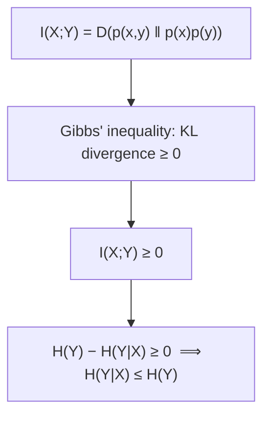

## Learning Objectives

- Define mutual information I(X;Y) as the KL divergence between the joint distribution and the product of the marginals.
- Prove the equivalent identity I(X;Y) = H(X) − H(X|Y) = H(Y) − H(X|Y), and explain what each form means intuitively.
- Prove I(X;Y) ≥ 0, and that I(X;Y) = 0 exactly when X and Y are independent — completing the proof, deferred from the previous concept, that H(Y|X) ≤ H(Y).
- Compute mutual information by hand for a small joint distribution.
- Explain why mutual information is symmetric (I(X;Y) = I(Y;X)) despite conditional entropy generally not being symmetric.

## Context & Motivation

The last two concepts built two separate pieces of machinery: joint and conditional entropy (how uncertainty decomposes across a pair of variables), and KL divergence (how far one distribution is from another, in bits). Mutual information is where these two threads meet: it is defined directly as a KL divergence, and it turns out to equal a specific, simple combination of the entropies already computed. The result answers, precisely and in bits, a question that comes up constantly once channels are introduced a few concepts ahead: exactly how much does observing one random variable (say, the channel's output) tell you about another (the channel's input)?

This concept also finally proves the fact stated but not yet justified in `joint-entropy-and-conditional-entropy`: that conditioning can never increase entropy. That fact turns out to be a direct, one-line consequence of mutual information's non-negativity — itself inherited immediately from Gibbs' inequality, already proved in the previous concept.

## Core Theory

### Definition: mutual information as KL divergence between joint and product-of-marginals

For two random variables `X` and `Y` with joint PMF `p(x,y)` and marginals `p(x)`, `p(y)`, the **mutual information** `I(X;Y)` is defined as the KL divergence between the true joint distribution and the distribution `X` and `Y` *would* have if they were independent (the product of their marginals):

```text
I(X;Y) = D( p(x,y) ‖ p(x)p(y) ) = ∑ₓ ∑ᵧ p(x,y)·log₂( p(x,y) / (p(x)p(y)) )
```

This framing makes the intuition immediate: mutual information measures exactly how far the actual joint distribution is, in bits, from the "no relationship at all" baseline of full independence — the further the real joint distribution is from that baseline, the more `X` and `Y` are statistically entangled with each other.

### Equivalent form: I(X;Y) = H(X) − H(X|Y)

**Claim.** `I(X;Y) = H(X) − H(X|Y) = H(Y) − H(X|Y)`... more precisely, `I(X;Y) = H(X) − H(X|Y)` and, symmetrically, `I(X;Y) = H(Y) − H(Y|X)`.

**Proof.** Starting from the definition and splitting the logarithm of a quotient into a difference:

```text
I(X;Y) = ∑ₓ∑ᵧ p(x,y)·log₂p(x,y) − ∑ₓ∑ᵧ p(x,y)·log₂(p(x)p(y))
       = −H(X,Y) − [∑ₓ∑ᵧ p(x,y)·log₂p(x) + ∑ₓ∑ᵧ p(x,y)·log₂p(y)]
       = −H(X,Y) − [−H(X)] − [−H(Y)]
       = H(X) + H(Y) − H(X,Y)
```

(using `∑ᵧp(x,y) = p(x)` and `∑ₓp(x,y) = p(y)` to collapse each double sum to a single-variable entropy, exactly as in the chain-rule proof of the previous concept). Substituting the chain rule `H(X,Y) = H(X) + H(Y|X)` from that same concept:

```text
I(X;Y) = H(X) + H(Y) − [H(X) + H(Y|X)] = H(Y) − H(Y|X)
```

and symmetrically, using `H(X,Y) = H(Y) + H(X|Y)` instead, `I(X;Y) = H(X) − H(X|Y)`. ∎

In words: `I(X;Y) = H(Y) − H(Y|X)` reads as "how much Y's uncertainty shrinks, on average, once X is known" — exactly the quantity of interest for a communication channel, where `Y` is the received signal and `X` is the transmitted message.

### Symmetry: I(X;Y) = I(Y;X)

The KL-divergence definition is manifestly symmetric in `X` and `Y` (`p(x,y)` and `p(x)p(y)` are unchanged by swapping the roles of `x` and `y` in the sum), so `I(X;Y) = I(Y;X)` immediately — even though `H(Y|X)` and `H(X|Y)` are generally *not* equal to each other, the specific combinations `H(Y) − H(Y|X)` and `H(X) − H(X|Y)` always agree.

### Non-negativity, and the proof deferred from the previous concept

**Claim.** `I(X;Y) ≥ 0`, with equality exactly when `X` and `Y` are independent.

Since `I(X;Y)` is *defined* as `D(p(x,y) ‖ p(x)p(y))`, this is immediate from Gibbs' inequality (proved in the previous concept): any KL divergence is non-negative, with equality exactly when the two distributions being compared are identical — here, exactly when `p(x,y) = p(x)p(y)` for every `x,y`, which is precisely the definition of `X` and `Y` being independent.

Combined with `I(X;Y) = H(Y) − H(Y|X) ≥ 0`, this immediately gives `H(Y|X) ≤ H(Y)` — completing, in one line, the proof that was stated but deferred in `joint-entropy-and-conditional-entropy`. Conditioning can never increase entropy, because doing so would require mutual information to be negative, which Gibbs' inequality rules out entirely.



## Worked Examples

### Example 1 — mutual information for the 2×2 distribution from the previous concept

Reusing `joint-entropy-and-conditional-entropy`'s Example 1: `p(0,0)=0.4, p(0,1)=0.1, p(1,0)=0.1, p(1,1)=0.4`, with `H(X) = 1` bit (fair marginal) and `H(Y|X) = 0.722` bits already computed there.

```text
I(X;Y) = H(Y) − H(Y|X)
```

By symmetry of this distribution, `H(Y) = 1` bit as well (Y's marginal is also fair: `p(Y=0) = 0.4+0.1 = 0.5`). So `I(X;Y) = 1 − 0.722 = 0.278` bits — knowing X reduces the uncertainty about Y by about 0.278 bits on average, reflecting the real (if partial) statistical dependence built into this joint distribution.

### Example 2 — the independent case gives zero mutual information

Reusing the independent case from the previous concept's Example 3 (`p(x,y) = 0.25` for all four combinations): `H(Y) = 1` bit, `H(Y|X) = 1` bit (computed there). `I(X;Y) = 1 − 1 = 0` bits — exactly zero, confirming the non-negativity theorem's equality case: independent variables share no mutual information at all, matching the intuitive claim that knowing an independent X tells you nothing new about Y.

### Example 3 — a fully deterministic relationship gives maximum mutual information

Suppose `Y = X` exactly (perfectly correlated), with `X` a fair coin: `p(0,0) = 0.5, p(1,1) = 0.5, p(0,1)=p(1,0)=0`. Here `H(Y|X) = 0` (once `X` is known, `Y` is completely determined — zero remaining uncertainty, matching `entropy-the-expected-information-content`'s result that a deterministic variable has zero entropy), so `I(X;Y) = H(Y) − H(Y|X) = 1 − 0 = 1` bit — mutual information equals the full entropy of either variable, reflecting that knowing one completely determines the other, the maximum possible degree of shared information for two fair-coin-distributed variables.

## Common Misconceptions & Pitfalls

- **"Mutual information measures correlation, in the statistical (Pearson) sense."** Mutual information captures *any* statistical dependence, not just linear correlation — two variables can have zero linear correlation (e.g., `Y = X²` for `X` symmetric around 0) while still having strongly positive mutual information, because knowing `X` still tells you a great deal about `Y` even though the relationship isn't linear.
- **"I(X;Y) = 0 just means X and Y are 'not very related'."** I(X;Y) = 0 is not approximate — by the theorem proved here, it holds if and only if X and Y are exactly, fully independent; any residual dependence at all, however subtle or nonlinear, produces strictly positive mutual information.
- **"H(X|Y) = H(Y|X) since they look symmetric."** These are generally different quantities — Example 1's numbers would differ if H(X|Y) were computed instead of H(Y|X) for an asymmetric distribution — it is specifically the combinations H(X) − H(X|Y) and H(Y) − H(Y|X) that coincide (both equal to the same I(X;Y)), not the conditional entropies themselves.

## Summary

Mutual information I(X;Y) = D(p(x,y) ‖ p(x)p(y)) measures how far a joint distribution is from full independence, and is provably equal to H(X) − H(X|Y) = H(Y) − H(Y|X) — the reduction in uncertainty about one variable once the other is known. It is always non-negative (an immediate consequence of Gibbs' inequality applied to its KL-divergence definition), with equality exactly under independence, and this non-negativity is precisely what proves conditioning can never increase entropy, completing an argument deferred from the previous concept. Mutual information is symmetric despite conditional entropy generally not being symmetric, and it is exactly the quantity `channel-capacity`, several concepts ahead, will maximize over all possible input distributions to define how much information a noisy channel can reliably carry.

## Documentation Links

- [Stanford EE276 — Course Outline](https://web.stanford.edu/class/ee276/outline.html) — doc
- [MIT 6.441 — Information Theory, Syllabus](https://ocw.mit.edu/courses/6-441-information-theory-spring-2016/pages/syllabus/) — doc
