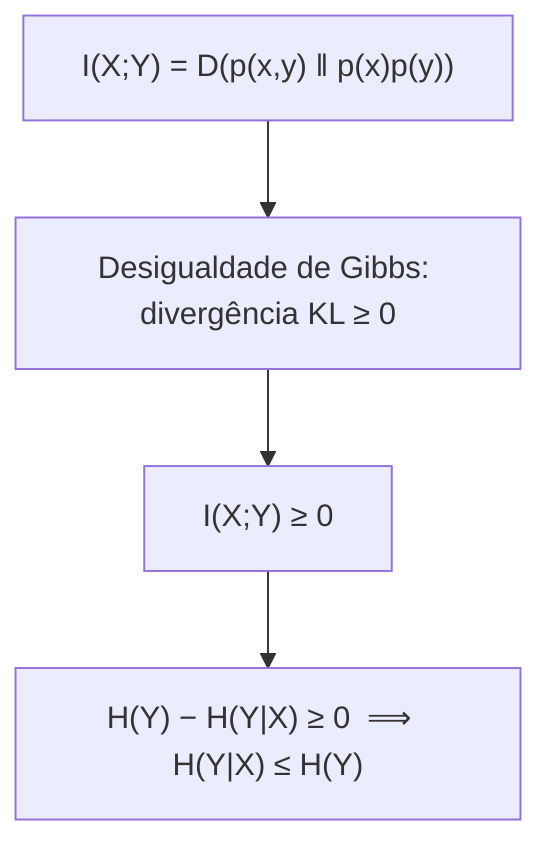

## Objetivos de Aprendizagem

- Definir a informação mútua I(X;Y) como a divergência KL entre a distribuição conjunta e o produto das marginais.
- Provar a identidade equivalente I(X;Y) = H(X) − H(X|Y) = H(Y) − H(Y|X) e explicar o que cada forma significa intuitivamente.
- Provar que I(X;Y) ≥ 0, e que I(X;Y) = 0 exatamente quando X e Y são independentes, completando a prova, adiada no conceito anterior, de que H(Y|X) ≤ H(Y).
- Calcular a informação mútua à mão para uma distribuição conjunta pequena.
- Explicar por que a informação mútua é simétrica (I(X;Y) = I(Y;X)) apesar de a entropia condicional em geral não ser.

## Contexto e Motivação

Os dois últimos conceitos construíram duas peças de maquinaria separadas: entropia conjunta e condicional (como a incerteza se decompõe num par de variáveis) e divergência KL (quão longe uma distribuição está de outra, em bits). A informação mútua é onde esses dois fios se encontram: ela é definida diretamente como uma divergência KL e acaba sendo igual a uma combinação específica e simples das entropias já calculadas. O resultado responde, com precisão e em bits, uma pergunta que aparece o tempo todo quando os canais são introduzidos, alguns conceitos adiante: exatamente quanto observar uma variável aleatória (por exemplo, a saída do canal) diz sobre outra (a entrada do canal)?

Este conceito também finalmente prova o fato enunciado, mas ainda não justificado, em `joint-entropy-and-conditional-entropy`: que condicionar nunca pode aumentar a entropia. Esse fato acaba sendo uma consequência direta, de uma linha, da não negatividade da informação mútua, que por sua vez é herdada imediatamente da desigualdade de Gibbs, já provada no conceito anterior.

## Teoria Central

### Definição: informação mútua como divergência KL entre a conjunta e o produto das marginais

Para duas variáveis aleatórias `X` e `Y` com PMF conjunta `p(x,y)` e marginais `p(x)`, `p(y)`, a **informação mútua** `I(X;Y)` é definida como a divergência KL entre a distribuição conjunta verdadeira e a distribuição que `X` e `Y` *teriam* se fossem independentes (o produto das marginais):

```text
I(X;Y) = D( p(x,y) ‖ p(x)p(y) ) = ∑ₓ ∑ᵧ p(x,y)·log₂( p(x,y) / (p(x)p(y)) )
```

Esse enquadramento torna a intuição imediata: a informação mútua mede exatamente quão longe, em bits, a distribuição conjunta real está da linha de base de "nenhuma relação", a independência total. Quanto mais longe a distribuição conjunta real estiver dessa linha de base, mais `X` e `Y` estão estatisticamente entrelaçadas.

### Forma equivalente: I(X;Y) = H(X) − H(X|Y)

**Afirmação.** `I(X;Y) = H(X) − H(X|Y)` e, simetricamente, `I(X;Y) = H(Y) − H(Y|X)`.

**Prova.** Partindo da definição e separando o logaritmo de um quociente numa diferença:

```text
I(X;Y) = ∑ₓ∑ᵧ p(x,y)·log₂p(x,y) − ∑ₓ∑ᵧ p(x,y)·log₂(p(x)p(y))
       = −H(X,Y) − [∑ₓ∑ᵧ p(x,y)·log₂p(x) + ∑ₓ∑ᵧ p(x,y)·log₂p(y)]
       = −H(X,Y) − [−H(X)] − [−H(Y)]
       = H(X) + H(Y) − H(X,Y)
```

(usando `∑ᵧp(x,y) = p(x)` e `∑ₓp(x,y) = p(y)` para reduzir cada soma dupla à entropia de uma variável, exatamente como na prova da regra da cadeia do conceito anterior). Substituindo a regra da cadeia `H(X,Y) = H(X) + H(Y|X)` daquele mesmo conceito:

```text
I(X;Y) = H(X) + H(Y) − [H(X) + H(Y|X)] = H(Y) − H(Y|X)
```

e, simetricamente, usando `H(X,Y) = H(Y) + H(X|Y)` no lugar, `I(X;Y) = H(X) − H(X|Y)`. ∎

Em palavras: `I(X;Y) = H(Y) − H(Y|X)` se lê como "quanto a incerteza de Y encolhe, em média, depois que X é conhecido", exatamente a quantidade de interesse para um canal de comunicação, em que `Y` é o sinal recebido e `X` é a mensagem transmitida.

### Simetria: I(X;Y) = I(Y;X)

A definição por divergência KL é claramente simétrica em `X` e `Y` (`p(x,y)` e `p(x)p(y)` não mudam ao trocar os papéis de `x` e `y` na soma), então `I(X;Y) = I(Y;X)` imediatamente. Mesmo que `H(Y|X)` e `H(X|Y)` em geral *não* sejam iguais entre si, as combinações específicas `H(Y) − H(Y|X)` e `H(X) − H(X|Y)` sempre concordam.

### Não negatividade, e a prova adiada no conceito anterior

**Afirmação.** `I(X;Y) ≥ 0`, com igualdade exatamente quando `X` e `Y` são independentes.

Como `I(X;Y)` é *definida* como `D(p(x,y) ‖ p(x)p(y))`, isso é imediato pela desigualdade de Gibbs (provada no conceito anterior): qualquer divergência KL é não negativa, com igualdade exatamente quando as duas distribuições comparadas são idênticas; aqui, exatamente quando `p(x,y) = p(x)p(y)` para todo `x,y`, que é precisamente a definição de `X` e `Y` serem independentes.

Combinado com `I(X;Y) = H(Y) − H(Y|X) ≥ 0`, isso dá imediatamente `H(Y|X) ≤ H(Y)`, completando, numa linha, a prova que foi enunciada mas adiada em `joint-entropy-and-conditional-entropy`. Condicionar nunca pode aumentar a entropia, porque isso exigiria que a informação mútua fosse negativa, o que a desigualdade de Gibbs descarta por completo.



## Exemplos Resolvidos

### Exemplo 1: informação mútua para a distribuição 2×2 do conceito anterior

Reaproveitando o Exemplo 1 de `joint-entropy-and-conditional-entropy`: `p(0,0)=0.4, p(0,1)=0.1, p(1,0)=0.1, p(1,1)=0.4`, com `H(X) = 1` bit (marginal justa) e `H(Y|X) = 0.722` bits já calculados lá.

```text
I(X;Y) = H(Y) − H(Y|X)
```

Pela simetria desta distribuição, `H(Y) = 1` bit também (a marginal de Y também é justa: `p(Y=0) = 0.4+0.1 = 0.5`). Então `I(X;Y) = 1 − 0.722 = 0.278` bits: saber X reduz a incerteza sobre Y em cerca de 0.278 bits em média, refletindo a dependência estatística real (ainda que parcial) embutida nesta distribuição conjunta.

### Exemplo 2: o caso independente dá informação mútua zero

Reaproveitando o caso independente do Exemplo 3 do conceito anterior (`p(x,y) = 0.25` para as quatro combinações): `H(Y) = 1` bit, `H(Y|X) = 1` bit (calculados lá). `I(X;Y) = 1 − 1 = 0` bits, exatamente zero, confirmando o caso de igualdade do teorema da não negatividade: variáveis independentes não compartilham informação mútua alguma, de acordo com a afirmação intuitiva de que saber um X independente não diz nada novo sobre Y.

### Exemplo 3: uma relação totalmente determinística dá a informação mútua máxima

Suponha `Y = X` exatamente (perfeitamente correlacionadas), com `X` uma moeda justa: `p(0,0) = 0.5, p(1,1) = 0.5, p(0,1)=p(1,0)=0`. Aqui `H(Y|X) = 0` (uma vez conhecido `X`, `Y` fica completamente determinado, com incerteza restante zero, coincidindo com o resultado de `entropy-the-expected-information-content` de que uma variável determinística tem entropia zero), então `I(X;Y) = H(Y) − H(Y|X) = 1 − 0 = 1` bit. A informação mútua é igual à entropia completa de qualquer uma das variáveis, refletindo que saber uma determina completamente a outra, o grau máximo possível de informação compartilhada para duas variáveis distribuídas como moedas justas.

## Equívocos Comuns e Armadilhas

- **"A informação mútua mede correlação, no sentido estatístico (de Pearson)."** A informação mútua captura *qualquer* dependência estatística, não só correlação linear. Duas variáveis podem ter correlação linear zero (por exemplo, `Y = X²` com `X` simétrico em torno de 0) e ainda assim ter informação mútua fortemente positiva, porque saber `X` ainda diz muito sobre `Y` mesmo que a relação não seja linear.
- **"I(X;Y) = 0 só significa que X e Y 'não são muito relacionadas'."** I(X;Y) = 0 não é aproximado: pelo teorema provado aqui, vale se e somente se X e Y são exatamente, totalmente independentes; qualquer dependência residual, por mais sutil ou não linear que seja, produz informação mútua estritamente positiva.
- **"H(X|Y) = H(Y|X), já que parecem simétricas."** Em geral são quantidades diferentes (os números do Exemplo 1 seriam diferentes se H(X|Y) fosse calculada em vez de H(Y|X) para uma distribuição assimétrica). São especificamente as combinações H(X) − H(X|Y) e H(Y) − H(Y|X) que coincidem (ambas iguais à mesma I(X;Y)), e não as próprias entropias condicionais.

## Resumo

A informação mútua I(X;Y) = D(p(x,y) ‖ p(x)p(y)) mede quão longe uma distribuição conjunta está da independência total, e é comprovadamente igual a H(X) − H(X|Y) = H(Y) − H(Y|X): a redução da incerteza sobre uma variável depois que a outra é conhecida. Ela é sempre não negativa (consequência imediata da desigualdade de Gibbs aplicada à sua definição por divergência KL), com igualdade exatamente sob independência, e essa não negatividade é precisamente o que prova que condicionar nunca pode aumentar a entropia, completando um argumento adiado no conceito anterior. A informação mútua é simétrica apesar de a entropia condicional em geral não ser, e é exatamente a quantidade que `channel-capacity`, alguns conceitos adiante, vai maximizar sobre todas as distribuições de entrada possíveis para definir quanta informação um canal ruidoso consegue transportar de forma confiável.

## Documentation Links

- [Stanford EE276: Course Outline](https://web.stanford.edu/class/ee276/outline.html): doc
- [MIT 6.441: Information Theory, Syllabus](https://ocw.mit.edu/courses/6-441-information-theory-spring-2016/pages/syllabus/): doc
