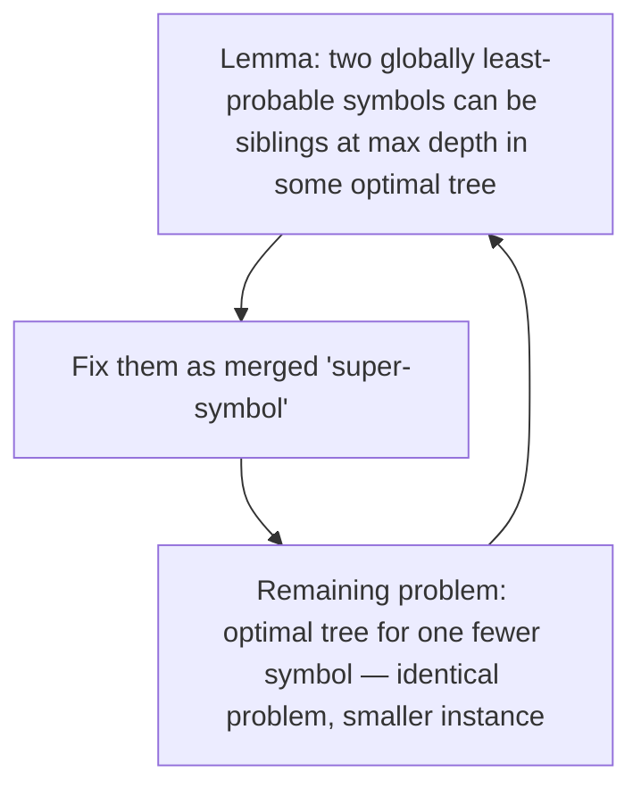

## Learning Objectives

- State precisely what "Huffman coding is optimal" means: no prefix-free code achieves a strictly lower average length for the same symbol distribution.
- Reproduce the key exchange-argument lemma: the two least-probable symbols can always be placed as siblings at maximum depth in some optimal tree.
- Follow the inductive argument extending that lemma into a full optimality proof, in the same structure `algorithms`'s activity-selection proof already established.
- Explain why this proof technique generalizes the exchange-argument pattern beyond activity selection to a genuinely different problem (tree construction rather than interval selection).

## Context & Motivation

The previous concept built and traced Huffman's algorithm by hand, and its worked examples suggested — but did not prove — that the resulting code is the best possible prefix-free code for the given distribution. `algorithms`'s `proving-greedy-optimality-activity-selection` already established, for a completely different problem, exactly what it takes to turn "this greedy rule looks reasonable" into "this greedy rule is provably optimal": an exchange argument, showing that any optimal solution can be transformed to agree with the greedy choice without any loss. This concept applies that identical proof template to Huffman coding — a genuinely different combinatorial structure (building an optimal binary tree, rather than selecting a maximum compatible subset of intervals) but the same underlying proof idea, confirming that concept's closing claim that the exchange-argument template "is a standard, reusable proof template applied across many other greedy algorithms... Huffman coding, and more."

## Core Theory

### What optimality means here

**Claim to prove.** Among all prefix-free codes for a distribution `p(x₁),...,p(xₙ)`, Huffman's algorithm produces one achieving the minimum possible average length `L = ∑ᵢp(xᵢ)lᵢ`.

### The key lemma: the two least-probable symbols can be siblings at maximum depth

**Lemma.** Let `x` and `y` be the two symbols with the smallest probabilities (Huffman's first merge choice). Then there exists an optimal prefix-free code in which `x` and `y` are siblings (share the same parent node) at the maximum depth of the tree.

*Proof, by exchange.* Let `T` be any optimal tree. First, in any optimal tree, every internal node must have exactly two children (an internal node with only one child could be removed and its single child promoted up one level, strictly shortening some codeword's length with no cost — contradicting optimality), so every leaf's sibling is also a leaf (a symbol), and there must exist at least one pair of sibling leaves at the tree's maximum depth. Let `a` and `b` be such a sibling pair at maximum depth in `T`. Since `a` and `b` sit at the maximum depth of an optimal tree, and longer codewords should be reserved for less-probable symbols (a swap argument, detailed next, confirms this), it must be that `p(a)` and `p(b)` are no larger than any other symbol's probability that sits at a shallower depth — but this alone doesn't yet show `{a,b} = {x,y}` exactly, so consider the **exchange**: swap symbols so that `x` and `y` (the two globally least-probable symbols) occupy the positions currently held by `a` and `b`, and vice versa. This exchange cannot increase the average length: `x` and `y` are moved to depth `depth(a)=depth(b)` (the maximum depth, at least as deep as their original position, since `depth(a)` is already the tree's maximum), and since `p(x) ≤ p(a)` and `p(y) ≤ p(b)` (by `x,y` being the two smallest probabilities overall) while `a,b` move to `x,y`'s original, shallower-or-equal position, a direct calculation of the resulting change in total weighted length shows it is non-positive — the swap either strictly improves the tree (contradicting `T`'s optimality, so this case cannot occur if `T` truly is optimal) or leaves the average length exactly unchanged (meaning the swapped tree, with `x,y` now siblings at maximum depth, is itself equally optimal). Either way, some optimal tree exists with `x` and `y` as siblings at maximum depth. ∎ (lemma)

This is the direct structural analogue of `proving-greedy-optimality-activity-selection`'s greedy-choice lemma: there, an arbitrary optimal solution was shown modifiable, via a direct exchange, to agree with greedy's first choice without loss; here, an arbitrary optimal tree is shown modifiable, via a direct exchange of two symbols' positions, to agree with Huffman's first merge choice without loss.

### Finishing the proof by induction on the number of symbols

Once `x` and `y` are fixed as siblings at maximum depth in some optimal tree, they can be treated as a single combined "super-symbol" `xy` with probability `p(x) + p(y)`, appearing at the depth immediately above where `x,y` sat — the parent node Huffman's algorithm creates when it merges them. The remaining problem — build an optimal tree for the symbol set `{xy, (all other original symbols)}` — is now **the same problem**, on a set with exactly one fewer symbol than before. This exactly mirrors the recursive structure `proving-greedy-optimality-activity-selection` used: after fixing greedy's first choice, the remaining subproblem is an identical, smaller instance of the same problem. By induction on the number of symbols (base case: a single symbol needs a length-0 codeword — the whole tree is just that one leaf, trivially optimal), the lemma reapplies at every step of Huffman's merging process, and the complete tree it constructs is optimal at every stage, hence optimal overall. ∎ (theorem)

### Why this generalizes the exchange-argument template, not just repeats it

`proving-greedy-optimality-activity-selection` closed by noting the exchange-argument template — "take an arbitrary optimal solution, show it can be modified to match the greedy choice without loss, then recurse on a smaller identical subproblem" — is reusable across many other greedy algorithms, naming Huffman coding explicitly as one of them. This concept is the concrete fulfillment of that forward reference: the *shape* of the argument (arbitrary-optimal-solution exchange, then induction on a shrinking identical subproblem) is exactly preserved, but the specific exchange operation had to be worked out anew for this specific structure (swapping two symbols' tree positions, rather than swapping one interval for another) — confirming the template is a genuine reusable proof pattern, not a coincidence specific to activity selection.

## Worked Examples

### Example 1 — seeing the exchange argument operate on a concrete case

Take the 5-symbol distribution from `huffman-coding-construction`'s Example 1 (`A:0.35, B:0.25, C:0.20, D:0.12, E:0.08`). Suppose (hypothetically, for the exchange) someone proposed an alternative optimal-looking tree where `C` and `D` are the maximum-depth siblings instead of `D` and `E`. Since `p(E)=0.08 < p(C)=0.20`, swapping `E` into `C`'s position and `C` into `E`'s position changes the average length by `(p(C) − p(E))·(depth(C)'s old position − new depth)`, and because `E` is strictly less probable than `C`, moving `E` deeper (to maximum depth) and `C` shallower strictly *decreases* total average length whenever `C` was not already at maximum depth — meaning any tree with `C` at maximum depth instead of `E` was not actually optimal, exactly matching the lemma's guarantee that the two *globally* least-probable symbols (`D` and `E` here, not `C`) can always be placed as maximum-depth siblings without loss, and confirming that Huffman's actual first merge (`D` with `E`) was the right one.

### Example 2 — the induction step made concrete

After merging `D` and `E` into `DE (0.20)` in Example 1, the remaining problem is exactly: build an optimal tree for `{A:0.35, B:0.25, C:0.20, DE:0.20}` — a 4-symbol instance of the identical problem. The lemma reapplies: the two smallest among these four are `C (0.20)` and `DE (0.20)` (a tie, either valid), matching exactly Huffman's actual second merge step traced in the previous concept — the proof isn't just abstractly guaranteeing *some* optimal continuation exists, it's guaranteeing the *specific* continuation Huffman's algorithm actually takes is one of the optimal ones at every single step.

### Example 3 — why a "second-smallest plus a random other" merge rule would break the lemma

Consider a flawed variant: "merge the smallest node with a randomly chosen *other* node, not necessarily the second-smallest." Using the same distribution, if this flawed rule merged `E (0.08)` with `A (0.35)` first instead of with `D (0.12)`, the resulting tree could place `D (0.12)` shallower than the merged `AE (0.43)` subtree's maximum depth — since `D`'s probability (`0.12`) is much smaller than several symbols that would end up sharing shallower positions, this violates the lemma's guaranteed structure (the two *smallest* probabilities as maximum-depth siblings) and produces a strictly worse average length than true Huffman merging — confirming that the specific "two smallest, always" rule is what the optimality proof actually requires, not any vaguely-similar-sounding merge heuristic.

## Common Misconceptions & Pitfalls

- **"The exchange-argument lemma proves the two least-probable symbols are always siblings in every optimal tree."** As with the activity-selection lemma's careful phrasing, this proves only that *some* optimal tree has this property — other, differently-structured optimal trees (with ties broken differently, for instance) might exist too, but at least one optimal tree always agrees with Huffman's first choice, which is exactly enough to carry the induction through.
- **"This proof only shows Huffman coding is 'pretty good,' not truly optimal."** The induction in Core Theory is a complete argument covering every merge step, not just the first — by the same logic that closed the activity-selection proof, the induction extends the single-step lemma into a guarantee about the *entire* sequence of merges, establishing genuine, complete optimality, not an approximation.
- **"Since both proofs use 'exchange arguments,' the actual mechanics of the swap must be identical between activity selection and Huffman coding."** The high-level *template* (arbitrary optimal solution → exchange to match greedy's choice → recurse on smaller identical subproblem) is shared, but the concrete exchange operation is necessarily specific to each problem's structure — swapping an interval in a schedule is mechanically nothing like swapping two symbols' positions in a binary tree; what's reused is the proof *strategy*, not a literal proof step.

## Summary

Huffman coding is proved optimal among all prefix-free codes via an exchange argument built on the exact template `algorithms` already established for activity selection: a lemma shows the two globally least-probable symbols can always be placed as siblings at the tree's maximum depth in some optimal tree, via a direct swap argument showing any deviation either strictly worsens or leaves unchanged the average length; an induction then treats those two symbols as a single merged unit and recurses on an identical, smaller instance of the same problem, exactly mirroring how the activity-selection proof recursed after fixing its own first choice. This confirms, concretely, that concept's forward-referenced claim that the exchange-argument pattern generalizes well beyond activity selection — the specific exchange mechanics differ entirely between an interval-scheduling problem and a tree-construction problem, but the overall proof strategy is identical.

## Documentation Links

- [Huffman — A Method for the Construction of Minimum-Redundancy Codes (1952)](https://www.cse.iitd.ac.in/~pkalra/siv864/huffman_1952.pdf) — doc
- [ACM/IEEE — Computer Science Curricula 2023 (CS2023)](https://csed.acm.org/wp-content/uploads/2023/03/Version-Beta-v2.pdf) — doc
