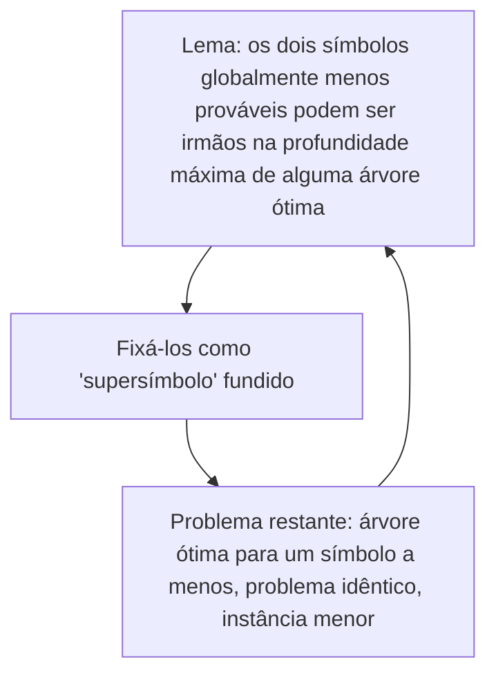

## Objetivos de Aprendizagem

- Enunciar com precisão o que significa "a codificação de Huffman é ótima": nenhum código livre de prefixo atinge um comprimento médio estritamente menor para a mesma distribuição de símbolos.
- Reproduzir o lema central do argumento de troca: os dois símbolos menos prováveis sempre podem ser colocados como irmãos na profundidade máxima de alguma árvore ótima.
- Acompanhar o argumento indutivo que estende esse lema a uma prova completa de otimalidade, na mesma estrutura que a prova de seleção de atividades de `algorithms` já estabeleceu.
- Explicar por que essa técnica de prova generaliza o padrão do argumento de troca para além da seleção de atividades, num problema genuinamente diferente (construção de árvores em vez de seleção de intervalos).

## Contexto e Motivação

O conceito anterior construiu e rastreou à mão o algoritmo de Huffman, e seus exemplos resolvidos sugeriram (mas não provaram) que o código resultante é o melhor código livre de prefixo possível para a distribuição dada. `proving-greedy-optimality-activity-selection` de `algorithms` já estabeleceu, para um problema completamente diferente, exatamente o que é preciso para transformar "esta regra gulosa parece razoável" em "esta regra gulosa é comprovadamente ótima": um argumento de troca, mostrando que qualquer solução ótima pode ser transformada para concordar com a escolha gulosa sem perda alguma. Este conceito aplica esse mesmo molde de prova à codificação de Huffman, uma estrutura combinatória genuinamente diferente (construir uma árvore binária ótima, em vez de selecionar um subconjunto compatível máximo de intervalos), mas com a mesma ideia de prova subjacente, confirmando a afirmação final daquele conceito de que o molde do argumento de troca "é um molde de prova padrão e reutilizável, aplicado em muitos outros algoritmos gulosos... codificação de Huffman, e mais".

## Teoria Central

### O que otimalidade significa aqui

**Afirmação a provar.** Entre todos os códigos livres de prefixo para uma distribuição `p(x₁),...,p(xₙ)`, o algoritmo de Huffman produz um que atinge o menor comprimento médio possível `L = ∑ᵢp(xᵢ)lᵢ`.

### O lema central: os dois símbolos menos prováveis podem ser irmãos na profundidade máxima

**Lema.** Sejam `x` e `y` os dois símbolos com as menores probabilidades (a primeira escolha de fusão de Huffman). Então existe um código livre de prefixo ótimo em que `x` e `y` são irmãos (compartilham o mesmo nó pai) na profundidade máxima da árvore.

*Prova, por troca.* Seja `T` qualquer árvore ótima. Primeiro, em qualquer árvore ótima, todo nó interno precisa ter exatamente dois filhos (um nó interno com um só filho poderia ser removido e seu único filho promovido um nível acima, encurtando estritamente o comprimento de alguma palavra-código sem custo algum, o que contradiz a otimalidade), então o irmão de toda folha também é uma folha (um símbolo), e precisa existir pelo menos um par de folhas irmãs na profundidade máxima da árvore. Sejam `a` e `b` um par desses na profundidade máxima de `T`. Como `a` e `b` ficam na profundidade máxima de uma árvore ótima, e palavras-código mais longas deveriam ficar reservadas a símbolos menos prováveis (um argumento de troca, detalhado a seguir, confirma isso), `p(a)` e `p(b)` não podem ser maiores que a probabilidade de nenhum outro símbolo que fique numa profundidade menor. Mas isso por si só ainda não mostra que `{a,b} = {x,y}` exatamente, então considere a **troca**: trocar os símbolos de modo que `x` e `y` (os dois símbolos globalmente menos prováveis) ocupem as posições hoje ocupadas por `a` e `b`, e vice-versa. Essa troca não pode aumentar o comprimento médio: `x` e `y` são movidos para a profundidade `depth(a)=depth(b)` (a profundidade máxima, pelo menos tão funda quanto sua posição original, já que `depth(a)` já é a máxima da árvore), e como `p(x) ≤ p(a)` e `p(y) ≤ p(b)` (por `x,y` serem as duas menores probabilidades no geral) enquanto `a,b` vão para a posição original de `x,y`, mais rasa ou igual, um cálculo direto da variação resultante no comprimento ponderado total mostra que ela é não positiva. A troca ou melhora estritamente a árvore (contradizendo a otimalidade de `T`, então esse caso não pode ocorrer se `T` é de fato ótima) ou deixa o comprimento médio exatamente inalterado (o que significa que a árvore trocada, com `x,y` agora irmãos na profundidade máxima, é ela própria igualmente ótima). De qualquer forma, existe alguma árvore ótima com `x` e `y` como irmãos na profundidade máxima. ∎ (lema)

Esse é o análogo estrutural direto do lema da escolha gulosa de `proving-greedy-optimality-activity-selection`: lá, mostrou-se que uma solução ótima arbitrária pode ser modificada, por uma troca direta, para concordar com a primeira escolha gulosa sem perda; aqui, mostra-se que uma árvore ótima arbitrária pode ser modificada, por uma troca direta das posições de dois símbolos, para concordar com a primeira escolha de fusão de Huffman sem perda.

### Concluindo a prova por indução no número de símbolos

Uma vez fixados `x` e `y` como irmãos na profundidade máxima de alguma árvore ótima, eles podem ser tratados como um único "supersímbolo" combinado `xy` com probabilidade `p(x) + p(y)`, aparecendo na profundidade imediatamente acima de onde `x,y` estavam: o nó pai que o algoritmo de Huffman cria ao fundi-los. O problema restante (construir uma árvore ótima para o conjunto de símbolos `{xy, (todos os outros símbolos originais)}`) passa a ser **o mesmo problema**, num conjunto com exatamente um símbolo a menos que antes. Isso espelha exatamente a estrutura recursiva que `proving-greedy-optimality-activity-selection` usou: depois de fixar a primeira escolha gulosa, o subproblema restante é uma instância idêntica e menor do mesmo problema. Por indução no número de símbolos (caso base: um único símbolo precisa de uma palavra-código de comprimento 0, e a árvore inteira é só essa folha, trivialmente ótima), o lema se reaplica a cada passo do processo de fusão de Huffman, e a árvore completa que ele constrói é ótima em cada etapa, portanto ótima no geral. ∎ (teorema)

### Por que isso generaliza o molde do argumento de troca, e não apenas o repete

`proving-greedy-optimality-activity-selection` terminou observando que o molde do argumento de troca ("pegar uma solução ótima arbitrária, mostrar que ela pode ser modificada para coincidir com a escolha gulosa sem perda, e então recorrer num subproblema idêntico e menor") é reutilizável em muitos outros algoritmos gulosos, citando explicitamente a codificação de Huffman como um deles. Este conceito é o cumprimento concreto dessa referência adiantada: a *forma* do argumento (troca numa solução ótima arbitrária, depois indução num subproblema idêntico que encolhe) é preservada exatamente, mas a operação de troca específica teve de ser trabalhada de novo para esta estrutura específica (trocar as posições de dois símbolos na árvore, em vez de trocar um intervalo por outro), confirmando que o molde é um padrão de prova genuinamente reutilizável, e não uma coincidência específica da seleção de atividades.

## Exemplos Resolvidos

### Exemplo 1: vendo o argumento de troca operar num caso concreto

Pegue a distribuição de 5 símbolos do Exemplo 1 de `huffman-coding-construction` (`A:0.35, B:0.25, C:0.20, D:0.12, E:0.08`). Suponha (hipoteticamente, para a troca) que alguém proponha uma árvore alternativa, aparentemente ótima, em que `C` e `D` são os irmãos de profundidade máxima em vez de `D` e `E`. Como `p(E)=0.08 < p(C)=0.20`, trocar `E` para a posição de `C` e `C` para a posição de `E` muda o comprimento médio em `(p(C) − p(E))·(posição antiga de depth(C) − nova profundidade)`, e como `E` é estritamente menos provável que `C`, mover `E` para mais fundo (até a profundidade máxima) e `C` para mais raso *diminui* estritamente o comprimento médio total sempre que `C` ainda não estava na profundidade máxima. Isso significa que qualquer árvore com `C` na profundidade máxima no lugar de `E` não era de fato ótima, coincidindo exatamente com a garantia do lema de que os dois símbolos *globalmente* menos prováveis (`D` e `E` aqui, e não `C`) sempre podem ser colocados como irmãos de profundidade máxima sem perda, e confirmando que a primeira fusão real de Huffman (`D` com `E`) foi a correta.

### Exemplo 2: o passo de indução tornado concreto

Depois de fundir `D` e `E` em `DE (0.20)` no Exemplo 1, o problema restante é exatamente: construir uma árvore ótima para `{A:0.35, B:0.25, C:0.20, DE:0.20}`, uma instância de 4 símbolos do mesmo problema. O lema se reaplica: os dois menores entre esses quatro são `C (0.20)` e `DE (0.20)` (um empate, qualquer um vale), coincidindo exatamente com o segundo passo real de fusão de Huffman rastreado no conceito anterior. A prova não está só garantindo abstratamente que existe *alguma* continuação ótima; está garantindo que a continuação *específica* que o algoritmo de Huffman de fato segue é uma das ótimas, em cada passo.

### Exemplo 3: por que uma regra de fusão "o menor mais algum outro aleatório" quebraria o lema

Considere uma variante falha: "fundir o menor nó com algum *outro* nó escolhido aleatoriamente, não necessariamente o segundo menor". Usando a mesma distribuição, se essa regra falha fundisse primeiro `E (0.08)` com `A (0.35)` em vez de com `D (0.12)`, a árvore resultante poderia colocar `D (0.12)` mais raso que a profundidade máxima da subárvore fundida `AE (0.43)`. Como a probabilidade de `D` (`0.12`) é bem menor que a de vários símbolos que acabariam dividindo posições mais rasas, isso viola a estrutura garantida pelo lema (as duas *menores* probabilidades como irmãs de profundidade máxima) e produz um comprimento médio estritamente pior que a verdadeira fusão de Huffman, confirmando que a regra específica "sempre os dois menores" é o que a prova de otimalidade de fato exige, e não qualquer heurística de fusão vagamente parecida.

## Equívocos Comuns e Armadilhas

- **"O lema do argumento de troca prova que os dois símbolos menos prováveis são sempre irmãos em toda árvore ótima."** Como na formulação cuidadosa do lema da seleção de atividades, ele prova só que *alguma* árvore ótima tem essa propriedade. Outras árvores ótimas com estruturas diferentes (com empates desfeitos de outro jeito, por exemplo) podem existir também, mas pelo menos uma árvore ótima sempre concorda com a primeira escolha de Huffman, o que é exatamente o suficiente para levar a indução adiante.
- **"Esta prova só mostra que a codificação de Huffman é 'bem boa', e não verdadeiramente ótima."** A indução na Teoria Central é um argumento completo que cobre todos os passos de fusão, não só o primeiro. Pela mesma lógica que fechou a prova da seleção de atividades, a indução estende o lema de um passo a uma garantia sobre a sequência *inteira* de fusões, estabelecendo otimalidade genuína e completa, não uma aproximação.
- **"Como as duas provas usam 'argumentos de troca', a mecânica real da troca deve ser idêntica entre seleção de atividades e codificação de Huffman."** O *molde* de alto nível (solução ótima arbitrária → troca para coincidir com a escolha gulosa → recorrer num subproblema idêntico e menor) é compartilhado, mas a operação concreta de troca é necessariamente específica da estrutura de cada problema: trocar um intervalo numa agenda não tem nada a ver, mecanicamente, com trocar as posições de dois símbolos numa árvore binária. O que se reaproveita é a *estratégia* de prova, não um passo de prova literal.

## Resumo

Prova-se que a codificação de Huffman é ótima entre todos os códigos livres de prefixo por meio de um argumento de troca construído exatamente sobre o molde que `algorithms` já estabeleceu para a seleção de atividades. Um lema mostra que os dois símbolos globalmente menos prováveis sempre podem ser colocados como irmãos na profundidade máxima de alguma árvore ótima, por um argumento direto de troca que mostra que qualquer desvio ou piora estritamente o comprimento médio ou o deixa inalterado; uma indução então trata esses dois símbolos como uma única unidade fundida e recorre numa instância idêntica e menor do mesmo problema, espelhando exatamente como a prova da seleção de atividades recorreu depois de fixar sua própria primeira escolha. Isso confirma, de forma concreta, a afirmação adiantada daquele conceito de que o padrão do argumento de troca generaliza bem além da seleção de atividades: a mecânica específica da troca difere completamente entre um problema de agendamento de intervalos e um problema de construção de árvores, mas a estratégia geral de prova é idêntica.

## Documentation Links

- [Huffman: A Method for the Construction of Minimum-Redundancy Codes (1952)](https://www.cse.iitd.ac.in/~pkalra/siv864/huffman_1952.pdf): doc
- [ACM/IEEE: Computer Science Curricula 2023 (CS2023)](https://csed.acm.org/wp-content/uploads/2023/03/Version-Beta-v2.pdf): doc
