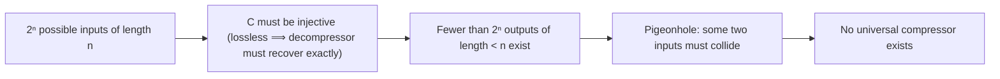

## Learning Objectives

- State, precisely, what it would mean for an algorithm to "losslessly compress every possible input."
- Prove, via a pigeonhole counting argument, that no such algorithm can exist.
- Quantify how rare truly-compressible inputs are among all inputs of a given length.
- Explain why this result is not pessimistic about compression in practice — it only rules out a universal compressor, not compression of the structured, non-random data real systems actually produce.

## Context & Motivation

Before any entropy, any code, any channel — this discipline opens with a question anyone who has used a zip utility eventually asks: could someone build a program that shrinks *any* file, no exceptions? Compress it once, get something smaller; compress that again, smaller still. Applied repeatedly, a genuinely universal compressor would eventually squeeze every file down to almost nothing, which is obviously absurd — and the absurdity is provable, cleanly, using nothing more than counting, before a single probability or logarithm enters the picture. This concept exists to make that proof precise and to establish, from the very first page, the discipline's central posture: information has a real, hard, mathematical floor beneath which no algorithm — however clever — can compress further. Everything that follows (entropy, Huffman coding, channel capacity) is this same idea, made increasingly quantitative.

The argument is a direct application of the pigeonhole principle already proved in `discrete-math-logic`, and the counting it requires is exactly the counting `permutations-and-combinations` already developed — this concept adds no new combinatorial machinery, it just aims tools already in hand at a genuinely new, and genuinely foundational, question for this discipline.

## Core Theory

### What "lossless compression" means, precisely

A **lossless compressor** for strings of length exactly `n` (over, say, the binary alphabet `{0,1}`) is a function `C` that maps each of the `2ⁿ` possible input strings to some output string, together with a decompressor `D` that recovers the original exactly: `D(C(x)) = x` for every input `x`. Since `D` must be able to recover `x` uniquely from `C(x)`, `C` must be **injective** (one-to-one) — two different inputs can never map to the same output, or `D` would have no way to tell them apart.

### The counting argument

**Claim.** No lossless compressor for length-`n` strings can map *every* input to a strictly shorter output.

**Proof.** There are exactly `2ⁿ` distinct input strings of length `n`. Suppose, for contradiction, that `C` mapped every one of them to an output of length strictly less than `n` — that is, length at most `n − 1`. The number of possible output strings of length at most `n − 1` is:

```text
2⁰ + 2¹ + 2² + ... + 2^(n−1) = 2ⁿ − 1
```

(a direct geometric-sum count, the same style of counting `permutations-and-combinations` establishes for other problems). This is exactly `2ⁿ − 1` possible outputs — one fewer than the `2ⁿ` inputs that must each be mapped somewhere. By the **pigeonhole principle** (already proved in `discrete-math-logic`: mapping more items into fewer bins than items forces at least one bin to receive two items), at least two distinct inputs `x ≠ y` must map to the same output, i.e., `C(x) = C(y)`. But then `D` cannot possibly recover both `x` and `y` correctly from that single shared output — `D(C(x))` can equal at most one of `x` or `y`, contradicting the requirement that `D(C(x)) = x` for *every* input `x`. This contradiction shows the assumption was false: no such `C` can exist. ∎

### How rare compressible inputs really are

The proof above only rules out compressing *every* input — a much sharper version of the same counting argument shows that compressible inputs are vanishingly rare. Suppose `C` compresses some subset `S` of the `2ⁿ` inputs down to length at most `n − k` for some `k ≥ 1` (a saving of at least `k` bits). Since `C` restricted to `S` must still be injective, and there are only `2⁰ + 2¹ + ... + 2^(n−k) = 2^(n−k+1) − 1` possible outputs of length at most `n − k`, it must be that `|S| ≤ 2^(n−k+1) − 1 < 2^(n−k+1)`. So the fraction of all `2ⁿ` inputs that can be compressed by at least `k` bits is strictly less than `2^(n−k+1) / 2ⁿ = 2^(1−k)`. Concretely: fewer than half of all inputs can be compressed by even 1 bit; fewer than 1 in 4 can be compressed by 2 bits; fewer than roughly 1 in 1000 can be compressed by 10 bits — compressibility falls off exponentially fast as the demanded saving grows.



### Why this doesn't contradict real-world compression

Real compressors (gzip, Huffman coding, and everything else this discipline builds toward) are not universal compressors, and they never claimed to be. They exploit **structure** — skewed symbol frequencies, repeated substrings, predictable patterns — that real-world data (English text, source code, photographs, log files) actually has and uniformly-random bit strings do not. A random string, sampled uniformly from all `2ⁿ` possibilities, has none of that structure to exploit, and the counting argument above shows precisely why: the overwhelming majority of such strings genuinely cannot be compressed at all, no matter how clever the algorithm. Every concept from here forward is really asking a sharper version of the same question this one raises: given a *known structure* (a probability distribution over symbols, specifically), exactly how far can compression go, and no further?

## Worked Examples

### Example 1 — counting outputs for n = 3

For `n = 3`, there are `2³ = 8` possible input strings (`000` through `111`). If a compressor tried to map every one of them to a string of length at most 2, the number of available outputs would be `2⁰ + 2¹ + 2² = 1 + 2 + 4 = 7` — one short of the 8 inputs needed, forcing at least one collision by pigeonhole. This matches the general formula `2ⁿ − 1 = 2³ − 1 = 7` exactly.

### Example 2 — how many 8-bit strings can be compressed by 3 bits?

For `n = 8` bits and a desired saving of `k = 3` bits (output length at most 5), the bound gives `|S| < 2^(n−k+1) = 2^(8−3+1) = 2⁶ = 64` compressible inputs, out of `2⁸ = 256` total — fewer than `64/256 = 25%` of all 8-bit strings can be compressed by 3 bits or more, confirming the `2^(1−k) = 2^(−2) = 0.25` bound derived above.

### Example 3 — the "compress it twice" thought experiment, made precise

Suppose someone claims a program `C` compresses *every* 1000-bit input by at least 1 bit. By the theorem, this is already impossible on its own — but tracing the "compress repeatedly" intuition further sharpens why: if it were possible, applying `C` again to the (now 999-bit) output would need to compress *that* smaller space losslessly too, and repeating this a thousand times would drive every original 1000-bit string down toward 0 bits — but there are `2^1000` distinct starting strings and only one possible 0-bit output, so this process cannot possibly stay injective past a certain point. The single-application counting argument in Core Theory is really the crisp version of exactly this intuition, made rigorous without needing to imagine repeated application at all.

## Common Misconceptions & Pitfalls

- **"A sufficiently clever algorithm could still compress everything — we just haven't found it yet."** This is not a matter of cleverness; the proof is an exact counting argument with no gap for a smarter algorithm to exploit. Any function claiming to compress every length-`n` input losslessly is provably not injective, and therefore provably not a valid lossless compressor, regardless of how it is constructed.
- **"Real compressors like gzip contradict this, since they clearly shrink files."** Real compressors shrink *most real-world files* because real-world files are highly structured (skewed letter frequencies, repeated words, redundant pixels) — not because they compress *every possible* bit string. Feed gzip a file of genuinely uniform random bits and it will typically produce an output the same size or slightly larger (accounting for format overhead), consistent with this concept's bound, not contradicting it.
- **"This means most of my files can't be compressed much."** The theorem is about the space of *all possible* bit strings of a given length, the vast majority of which are patternless noise — it says nothing about the compressibility of any *particular* structured data source, which is exactly the question entropy (the next few concepts) exists to answer precisely.

## Summary

A simple pigeonhole counting argument proves that no lossless compressor can shrink every possible input of a given length: since there are strictly fewer possible shorter outputs than there are inputs, at least two distinct inputs must collide under any injective mapping to a shorter length, making correct decompression of both impossible. A sharper version of the same count shows compressibility by `k` bits is possible for fewer than a `2^(1−k)` fraction of all inputs — compressible strings become exponentially rare as the demanded savings grow. This is not bad news for real compression, which succeeds precisely because real data is structured rather than uniformly random; it is the hard mathematical floor that motivates everything else in this discipline, starting with entropy as the precise measure of exactly how much structure a source has to exploit.

## Documentation Links

- [ACM/IEEE — Computer Science Curricula 2023 (CS2023)](https://csed.acm.org/wp-content/uploads/2023/03/Version-Beta-v2.pdf) — doc
- [Stanford EE276 — Course Outline](https://web.stanford.edu/class/ee276/outline.html) — doc
