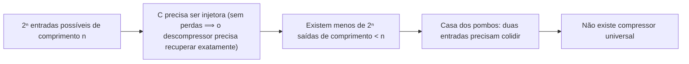

## Objetivos de Aprendizagem

- Enunciar, com precisão, o que significaria um algoritmo "comprimir sem perdas toda entrada possível".
- Provar, por um argumento de contagem pelo princípio da casa dos pombos, que tal algoritmo não pode existir.
- Quantificar quão raras são as entradas realmente compressíveis entre todas as entradas de um dado comprimento.
- Explicar por que esse resultado não é pessimista quanto à compressão na prática: ele só descarta um compressor universal, e não a compressão dos dados estruturados, não aleatórios, que sistemas reais de fato produzem.

## Contexto e Motivação

Antes de qualquer entropia, qualquer código, qualquer canal, esta disciplina começa com uma pergunta que todo mundo que já usou um utilitário zip acaba fazendo: alguém conseguiria construir um programa que encolhe *qualquer* arquivo, sem exceções? Comprima uma vez e obtenha algo menor; comprima de novo e fica menor ainda. Aplicado repetidamente, um compressor genuinamente universal acabaria espremendo todo arquivo até quase nada, o que é obviamente absurdo, e o absurdo pode ser provado de forma limpa usando nada além de contagem, antes que uma única probabilidade ou logaritmo entre em cena. Este conceito existe para tornar essa prova precisa e estabelecer, desde a primeira página, a postura central da disciplina: a informação tem um piso matemático real e rígido abaixo do qual nenhum algoritmo, por mais esperto que seja, consegue comprimir mais. Tudo o que vem depois (entropia, codificação de Huffman, capacidade de canal) é essa mesma ideia, tornada cada vez mais quantitativa.

O argumento é uma aplicação direta do princípio da casa dos pombos já provado em `discrete-math-logic`, e a contagem que ele exige é exatamente a contagem que `permutations-and-combinations` já desenvolveu. Este conceito não acrescenta maquinaria combinatória nova; apenas aponta ferramentas já disponíveis para uma pergunta genuinamente nova e genuinamente fundamental para esta disciplina.

## Teoria Central

### O que "compressão sem perdas" significa, com precisão

Um **compressor sem perdas** para cadeias de comprimento exatamente `n` (sobre, digamos, o alfabeto binário `{0,1}`) é uma função `C` que leva cada uma das `2ⁿ` cadeias de entrada possíveis a alguma cadeia de saída, junto com um descompressor `D` que recupera o original exatamente: `D(C(x)) = x` para toda entrada `x`. Como `D` precisa conseguir recuperar `x` de forma única a partir de `C(x)`, `C` precisa ser **injetora** (um para um): duas entradas diferentes nunca podem ir para a mesma saída, senão `D` não teria como distingui-las.

### O argumento de contagem

**Afirmação.** Nenhum compressor sem perdas para cadeias de comprimento `n` consegue levar *toda* entrada a uma saída estritamente mais curta.

**Prova.** Existem exatamente `2ⁿ` cadeias de entrada distintas de comprimento `n`. Suponha, por contradição, que `C` levasse cada uma delas a uma saída de comprimento estritamente menor que `n`, ou seja, de comprimento no máximo `n − 1`. O número de cadeias de saída possíveis de comprimento no máximo `n − 1` é:

```text
2⁰ + 2¹ + 2² + ... + 2^(n−1) = 2ⁿ − 1
```

(uma contagem direta por soma geométrica, no mesmo estilo de contagem que `permutations-and-combinations` estabelece para outros problemas). Isso dá exatamente `2ⁿ − 1` saídas possíveis, uma a menos que as `2ⁿ` entradas que precisam ser levadas a algum lugar. Pelo **princípio da casa dos pombos** (já provado em `discrete-math-logic`: colocar mais itens do que caixas força pelo menos uma caixa a receber dois itens), pelo menos duas entradas distintas `x ≠ y` precisam ir para a mesma saída, ou seja, `C(x) = C(y)`. Mas então `D` não tem como recuperar corretamente tanto `x` quanto `y` a partir dessa única saída compartilhada: `D(C(x))` pode ser igual a no máximo um entre `x` e `y`, contradizendo a exigência de que `D(C(x)) = x` para *toda* entrada `x`. Essa contradição mostra que a suposição era falsa: tal `C` não pode existir. ∎

### Quão raras as entradas compressíveis realmente são

A prova acima só descarta comprimir *toda* entrada; uma versão bem mais afiada do mesmo argumento de contagem mostra que as entradas compressíveis são extremamente raras. Suponha que `C` comprima algum subconjunto `S` das `2ⁿ` entradas para comprimento no máximo `n − k`, para algum `k ≥ 1` (uma economia de pelo menos `k` bits). Como `C` restrita a `S` ainda precisa ser injetora, e só existem `2⁰ + 2¹ + ... + 2^(n−k) = 2^(n−k+1) − 1` saídas possíveis de comprimento no máximo `n − k`, é preciso que `|S| ≤ 2^(n−k+1) − 1 < 2^(n−k+1)`. Então a fração de todas as `2ⁿ` entradas que pode ser comprimida em pelo menos `k` bits é estritamente menor que `2^(n−k+1) / 2ⁿ = 2^(1−k)`. Concretamente: menos da metade de todas as entradas pode ser comprimida em sequer 1 bit; menos de 1 em 4 pode ser comprimida em 2 bits; menos de cerca de 1 em 1000 pode ser comprimida em 10 bits. A compressibilidade despenca exponencialmente conforme a economia exigida cresce.



### Por que isso não contradiz a compressão do mundo real

Compressores reais (gzip, codificação de Huffman e tudo o que esta disciplina vai construir) não são compressores universais, e nunca afirmaram ser. Eles exploram **estrutura** (frequências de símbolos desiguais, subcadeias repetidas, padrões previsíveis) que os dados do mundo real (texto em inglês, código-fonte, fotografias, arquivos de log) de fato têm e que cadeias de bits uniformemente aleatórias não têm. Uma cadeia aleatória, sorteada uniformemente entre as `2ⁿ` possibilidades, não tem nada dessa estrutura para explorar, e o argumento de contagem acima mostra exatamente por quê: a esmagadora maioria dessas cadeias genuinamente não pode ser comprimida de jeito nenhum, por mais esperto que seja o algoritmo. Todo conceito daqui em diante está, na verdade, fazendo uma versão mais afiada da mesma pergunta que este levanta: dada uma *estrutura conhecida* (especificamente, uma distribuição de probabilidade sobre os símbolos), até onde exatamente a compressão pode ir, e não mais?

## Exemplos Resolvidos

### Exemplo 1: contando as saídas para n = 3

Para `n = 3`, existem `2³ = 8` cadeias de entrada possíveis (de `000` a `111`). Se um compressor tentasse levar cada uma delas a uma cadeia de comprimento no máximo 2, o número de saídas disponíveis seria `2⁰ + 2¹ + 2² = 1 + 2 + 4 = 7`, uma a menos que as 8 entradas necessárias, forçando pelo menos uma colisão pela casa dos pombos. Isso coincide exatamente com a fórmula geral `2ⁿ − 1 = 2³ − 1 = 7`.

### Exemplo 2: quantas cadeias de 8 bits podem ser comprimidas em 3 bits?

Para `n = 8` bits e uma economia desejada de `k = 3` bits (comprimento de saída no máximo 5), o limite dá `|S| < 2^(n−k+1) = 2^(8−3+1) = 2⁶ = 64` entradas compressíveis, de `2⁸ = 256` no total: menos de `64/256 = 25%` de todas as cadeias de 8 bits podem ser comprimidas em 3 bits ou mais, confirmando o limite `2^(1−k) = 2^(−2) = 0.25` derivado acima.

### Exemplo 3: o experimento mental de "comprimir duas vezes", tornado preciso

Suponha que alguém afirme que um programa `C` comprime *toda* entrada de 1000 bits em pelo menos 1 bit. Pelo teorema, isso já é impossível por si só, mas seguir mais adiante a intuição de "comprimir repetidamente" deixa ainda mais claro por quê: se fosse possível, aplicar `C` de novo à saída (agora de 999 bits) precisaria comprimir *esse* espaço menor sem perdas também, e repetir isso mil vezes levaria toda cadeia original de 1000 bits em direção a 0 bits. Mas existem `2^1000` cadeias iniciais distintas e só uma saída possível de 0 bits, então esse processo não tem como continuar injetor depois de certo ponto. O argumento de contagem de uma única aplicação na Teoria Central é, na verdade, a versão nítida exatamente dessa intuição, tornada rigorosa sem precisar imaginar aplicações repetidas.

## Equívocos Comuns e Armadilhas

- **"Um algoritmo esperto o bastante ainda conseguiria comprimir tudo; só não o encontramos ainda."** Não é questão de esperteza: a prova é um argumento de contagem exato, sem brecha que um algoritmo mais inteligente possa explorar. Qualquer função que afirme comprimir sem perdas toda entrada de comprimento `n` comprovadamente não é injetora e, portanto, comprovadamente não é um compressor sem perdas válido, não importa como seja construída.
- **"Compressores reais como o gzip contradizem isso, já que claramente encolhem arquivos."** Compressores reais encolhem *a maioria dos arquivos do mundo real* porque esses arquivos são altamente estruturados (frequências de letras desiguais, palavras repetidas, pixels redundantes), e não porque comprimem *toda* cadeia de bits possível. Dê ao gzip um arquivo de bits genuinamente uniformes e aleatórios e ele normalmente vai produzir uma saída do mesmo tamanho ou um pouco maior (contando a sobrecarga do formato), o que é consistente com o limite deste conceito, e não uma contradição.
- **"Isso significa que a maioria dos meus arquivos não pode ser muito comprimida."** O teorema trata do espaço de *todas as* cadeias de bits possíveis de um dado comprimento, cuja vasta maioria é ruído sem padrão; ele não diz nada sobre a compressibilidade de alguma fonte de dados estruturada *em particular*, que é exatamente a pergunta que a entropia (os próximos conceitos) existe para responder com precisão.

## Resumo

Um simples argumento de contagem pelo princípio da casa dos pombos prova que nenhum compressor sem perdas consegue encolher toda entrada possível de um dado comprimento: como há estritamente menos saídas mais curtas possíveis do que entradas, pelo menos duas entradas distintas precisam colidir em qualquer mapeamento injetor para um comprimento menor, tornando impossível descomprimir as duas corretamente. Uma versão mais afiada da mesma contagem mostra que a compressão em `k` bits é possível para menos de uma fração `2^(1−k)` de todas as entradas: cadeias compressíveis ficam exponencialmente raras conforme a economia exigida cresce. Isso não é uma má notícia para a compressão real, que dá certo justamente porque dados reais são estruturados em vez de uniformemente aleatórios; é o piso matemático rígido que motiva todo o resto desta disciplina, começando pela entropia como a medida precisa de quanta estrutura uma fonte tem para ser explorada.

## Documentation Links

- [ACM/IEEE: Computer Science Curricula 2023 (CS2023)](https://csed.acm.org/wp-content/uploads/2023/03/Version-Beta-v2.pdf): doc
- [Stanford EE276: Course Outline](https://web.stanford.edu/class/ee276/outline.html): doc
