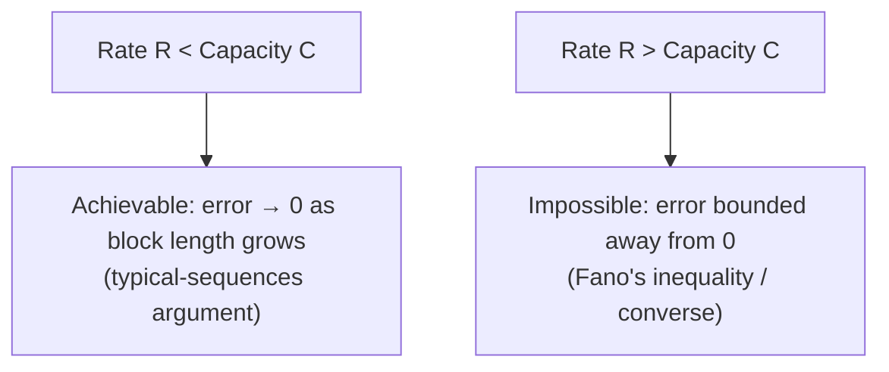

## Learning Objectives

- State Shannon's noisy-channel coding theorem precisely: reliable communication at any rate below capacity is achievable, and impossible above it.
- Explain the theorem's real-world implication: reliability is a property achievable through coding, not something that necessarily degrades gradually and unavoidably as a channel gets noisier.
- Describe, at an intuition level, the typical-sequences argument behind the achievability direction, without the full random-coding proof.
- Explain, at a sketch level, why exceeding capacity makes reliable communication provably impossible (the converse direction).

## Context & Motivation

This is, by wide agreement across every anchor source this discipline draws on, Shannon's single most surprising and consequential result — described directly in his 1948 paper as showing that a noisy channel's unreliability need not translate into an unavoidable, ever-accumulating error rate in the messages actually sent across it. Before 1948, the intuitive expectation was that sending information across a noisy channel more reliably always meant sending it more slowly, with reliability and rate locked in an unavoidable, ever-worsening trade-off as more noise-tolerance is demanded. Shannon proved this intuition wrong: there is a sharp threshold, exactly the capacity `C` defined in the previous concept, below which arbitrarily reliable communication is achievable at a fixed rate — and only above which reliability becomes provably impossible to guarantee at all, no matter how clever the coding scheme.

Matching the scope decision already established for the BSC and capacity concepts, this concept states the theorem precisely and develops its real implication and achievability intuition at the depth appropriate for a CS-oriented introduction, following the fork Stanford EE276 and MIT 6.441 both take in their own course structure — full random-coding and converse proofs are reserved for a graduate-level treatment (à la Cover & Thomas's fuller chapters), and are not reproduced here in complete formal detail.

## Core Theory

### Statement of the theorem

**Shannon's noisy-channel coding theorem (Shannon's second theorem).** For a discrete memoryless channel with capacity `C`:

1. **(Achievability.)** For any transmission rate `R < C` and any desired error probability `ε > 0`, there exists a code (for sufficiently long messages, encoded in sufficiently long blocks) achieving rate `R` with probability of decoding error less than `ε`.
2. **(Converse.)** For any rate `R > C`, no code — however long its blocks, however cleverly designed — can achieve reliable communication at rate `R`; the probability of decoding error is bounded away from zero no matter how much coding cleverness is applied.

The threshold is exact and sharp: below `C`, error can be driven arbitrarily close to zero (at the cost of longer and longer codewords); above `C`, no amount of engineering ingenuity can overcome the gap.

### The real-world implication, made concrete

The everyday-intuitive picture is: "the noisier the channel, the more errors creep into what actually arrives, no matter what you do." Shannon's theorem replaces this with a sharper and far more useful picture: as long as the *rate* of information you're trying to push through stays below the channel's capacity, arbitrarily low error rates are achievable — corrupted bits get corrected away almost entirely by a sufficiently good code, not merely reduced. This is exactly why real, deployed systems (deep-space probes transmitting across a channel with a very low, fixed capacity; a Wi-Fi link operating well below its theoretical maximum throughput to stay robust to interference) can and do achieve extremely low, practically-negligible error rates over channels that are, per-symbol, quite noisy — the "trick" is not eliminating noise physically, but coding at a rate safely below capacity and letting redundancy absorb the noise.

### Achievability, intuitively: typical sequences and random coding

The full achievability proof (random coding: show that a *randomly chosen* code, averaged over all possible random choices, achieves low error probability whenever `R < C`, so *at least one* particular such code must achieve it too) is genuinely advanced machinery, appropriate to a graduate course but reserved here at the intuition level already previewed in `the-source-coding-theorem`'s achievability sketch. The core idea, extended from that earlier sketch: encode messages using long blocks of `n` channel uses. By the law of large numbers, a transmitted codeword's *actual* received sequence, after passing through the noisy channel, becomes overwhelmingly likely to be one of a relatively small set of **jointly typical sequences** — pairs `(input codeword, received sequence)` whose empirical statistics match the channel's true `p(y|x)` closely. As long as the number of codewords used is small enough relative to how many *distinguishable* typical output sequences exist (a count controlled directly by `I(X;Y)`, and therefore, at best, by capacity `C`), a decoder can, with high probability, correctly match a received sequence back to the one codeword that actually produced it — this "enough room for distinguishable outputs" condition is exactly what forces the achievable rate to stay below `C`.

### The converse, sketched: why exceeding capacity is provably impossible

The converse direction leans on a fact from information theory called **Fano's inequality** (not derived here in full), which bounds the probability of a decoding error from below in terms of the conditional entropy `H(X|Y)` of the input given the received output — intuitively, if the decoder's remaining uncertainty about which message was sent (after seeing the channel's output) is large, decoding errors cannot be driven arbitrarily low no matter what decoding rule is used. Combined with the chain-rule and mutual-information identities already established (`joint-entropy-and-conditional-entropy`, `mutual-information`), this can be used to show that attempting to communicate at any rate `R > C` forces `H(X|Y)` to stay bounded away from zero as block length grows — meaning some fixed, nonzero probability of error persists no matter how the code is designed or how long the blocks are made.

## Worked Examples

### Example 1 — checking whether a target rate is achievable on a concrete BSC

For the BSC with `p = 0.1` from `channel-capacity`'s Example 1, `C = 0.531` bits per channel use. A system wanting to transmit at `R = 0.4` bits per channel use satisfies `R < C` (`0.4 < 0.531`), so the theorem guarantees a code exists achieving arbitrarily low error probability at this rate — not a promise of *some* improvement, but a promise of error rates driven as close to zero as desired, at the cost of using longer and longer block codes.

### Example 2 — a rate that provably cannot be made reliable

For the same channel (`C = 0.531` bits), a system attempting `R = 0.7` bits per channel use has `R > C`. The converse guarantees no code, however sophisticated, can achieve reliable communication at this rate on this channel — the error probability is provably bounded away from zero for any code, a hard mathematical impossibility rather than merely "difficult with current techniques."

### Example 3 — how capacity constrains a real design decision

A deep-space probe needs to send telemetry reliably across a channel modeled as a BSC with a harsh crossover probability `p = 0.4` (heavy noise, e.g., due to extreme signal attenuation over interplanetary distances). `channel-capacity`'s formula gives `C = 1 − H(0.4) = 1 − (−0.4log₂0.4 − 0.6log₂0.6) = 1 − (0.529 + 0.442) = 1 − 0.971 = 0.029` bits per channel use — very low, but strictly positive. The coding theorem guarantees that even at this harsh noise level, a sufficiently long, sufficiently clever code can still communicate reliably, just at a very low rate (well below `0.029` bits per raw channel symbol) — exactly the real design principle behind actual deep-space communication systems, which trade a great deal of raw transmission rate for extremely strong error-correcting codes to operate safely under the channel's true, low capacity.

## Common Misconceptions & Pitfalls

- **"A noisier channel just means somewhat higher error rates in what's received, proportional to the noise level."** The coding theorem shows something qualitatively different: as long as the transmission rate is kept below capacity, error rates are not merely "somewhat higher" — they can be driven arbitrarily close to zero regardless of how noisy the channel is (as Example 3's harsh, low-capacity channel still shows), by using a sufficiently strong code; there is no unavoidable, fixed error floor imposed by noise alone, only by choosing a rate too close to or above capacity.
- **"The theorem tells you exactly how to build the code that achieves near-zero error at a given rate."** The theorem is an existence result — it proves such a code exists whenever `R < C`, via typical sequences and (in the full proof) random coding arguments, but constructing *specific*, practical codes that approach capacity (Hamming codes, LDPC codes, Turbo codes, polar codes — real families developed over decades after 1948) is a separate, substantial engineering and mathematical achievement the theorem itself does not hand over directly.
- **"Since the converse only says errors can't be driven to exactly zero above capacity, a 'good enough' small error rate might still be achievable above C."** The converse (via Fano's inequality) shows the error probability is bounded *away* from zero by some fixed positive amount for any rate above capacity — it is not merely "can't reach exactly zero," it is "cannot be made arbitrarily small," a categorically stronger and more useful impossibility result.

## Summary

Shannon's noisy-channel coding theorem draws a sharp line at channel capacity C: at any rate below C, error probability can be driven arbitrarily close to zero by a sufficiently good code (achievability, sketched here via typical sequences and the law of large numbers, extending the same intuition already used for the source coding theorem's achievability direction); at any rate above C, reliable communication is provably impossible, with error probability bounded away from zero no matter the coding scheme (the converse, sketched via Fano's inequality). This replaces the naive intuition that noise inevitably causes proportional, unavoidable errors with a far sharper and more useful picture — reliability below capacity is a coding problem with an achievable solution, not a physical limit to merely be endured — and it directly explains why real systems, from Wi-Fi to deep-space telemetry, can and do achieve extremely low error rates over channels that are, per raw symbol, genuinely noisy.

## Documentation Links

- [Shannon — A Mathematical Theory of Communication (1948)](https://people.math.harvard.edu/~ctm/home/text/others/shannon/entropy/entropy.pdf) — doc
- [MIT 6.441 — Information Theory, Syllabus](https://ocw.mit.edu/courses/6-441-information-theory-spring-2016/pages/syllabus/) — doc
- [Stanford EE276 — Course Outline](https://web.stanford.edu/class/ee276/outline.html) — doc
