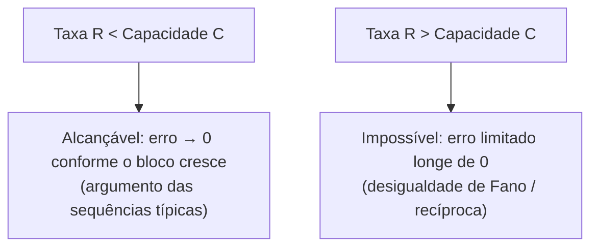

## Objetivos de Aprendizagem

- Enunciar com precisão o teorema da codificação de canal ruidoso de Shannon: a comunicação confiável a qualquer taxa abaixo da capacidade é alcançável, e impossível acima dela.
- Explicar a implicação do teorema no mundo real: a confiabilidade é uma propriedade alcançável por meio de codificação, e não algo que necessariamente se degrada de forma gradual e inevitável conforme o canal fica mais ruidoso.
- Descrever, em nível de intuição, o argumento das sequências típicas por trás da direção de alcançabilidade, sem a prova completa por codificação aleatória.
- Explicar, em nível de esboço, por que ultrapassar a capacidade torna a comunicação confiável comprovadamente impossível (a direção recíproca).

## Contexto e Motivação

Este é, por amplo consenso entre todas as fontes de referência em que esta disciplina se apoia, o resultado isolado mais surpreendente e mais influente de Shannon, descrito diretamente em seu artigo de 1948 como a demonstração de que a falta de confiabilidade de um canal ruidoso não precisa se traduzir numa taxa de erro inevitável e cada vez maior nas mensagens de fato enviadas por ele. Antes de 1948, a expectativa intuitiva era que enviar informação de forma mais confiável por um canal ruidoso sempre significava enviá-la mais devagar, com confiabilidade e taxa presas numa troca inevitável que piora cada vez mais conforme se exige mais tolerância a ruído. Shannon provou que essa intuição estava errada: existe um limiar nítido, exatamente a capacidade `C` definida no conceito anterior, abaixo do qual a comunicação arbitrariamente confiável é alcançável a uma taxa fixa, e só acima do qual a confiabilidade se torna comprovadamente impossível de garantir, por mais engenhoso que seja o esquema de codificação.

De acordo com a decisão de escopo já estabelecida para os conceitos de BSC e capacidade, este conceito enuncia o teorema com precisão e desenvolve sua implicação real e a intuição da alcançabilidade na profundidade adequada a uma introdução voltada à computação, seguindo a bifurcação que tanto o Stanford EE276 quanto o MIT 6.441 fazem na estrutura dos próprios cursos. As provas completas por codificação aleatória e da recíproca ficam reservadas a um tratamento de pós-graduação (como nos capítulos mais completos de Cover & Thomas) e não são reproduzidas aqui em todo o detalhe formal.

## Teoria Central

### Enunciado do teorema

**Teorema da codificação de canal ruidoso de Shannon (segundo teorema de Shannon).** Para um canal discreto sem memória com capacidade `C`:

1. **(Alcançabilidade.)** Para qualquer taxa de transmissão `R < C` e qualquer probabilidade de erro desejada `ε > 0`, existe um código (para mensagens suficientemente longas, codificadas em blocos suficientemente longos) que atinge a taxa `R` com probabilidade de erro de decodificação menor que `ε`.
2. **(Recíproca.)** Para qualquer taxa `R > C`, nenhum código (por mais longos que sejam seus blocos, por mais engenhoso que seja seu projeto) consegue atingir comunicação confiável à taxa `R`; a probabilidade de erro de decodificação fica limitada longe de zero, por mais engenho de codificação que se aplique.

O limiar é exato e nítido: abaixo de `C`, o erro pode ser levado arbitrariamente perto de zero (ao custo de palavras-código cada vez mais longas); acima de `C`, nenhuma engenhosidade de engenharia consegue vencer a diferença.

### A implicação no mundo real, tornada concreta

O quadro da intuição cotidiana é: "quanto mais ruidoso o canal, mais erros entram no que chega, não importa o que você faça". O teorema de Shannon substitui isso por um quadro mais nítido e muito mais útil: desde que a *taxa* de informação que se tenta empurrar fique abaixo da capacidade do canal, taxas de erro arbitrariamente baixas são alcançáveis; os bits corrompidos são corrigidos quase por completo por um código suficientemente bom, e não apenas reduzidos. É exatamente por isso que sistemas reais em operação (sondas do espaço profundo transmitindo por um canal de capacidade muito baixa e fixa; um enlace Wi-Fi operando bem abaixo da sua vazão máxima teórica para continuar robusto a interferências) conseguem, e de fato atingem, taxas de erro extremamente baixas, praticamente desprezíveis, em canais que são bem ruidosos por símbolo. O "truque" não é eliminar o ruído fisicamente, e sim codificar a uma taxa com folga abaixo da capacidade e deixar a redundância absorver o ruído.

### Alcançabilidade, intuitivamente: sequências típicas e codificação aleatória

A prova completa da alcançabilidade (codificação aleatória: mostrar que um código *escolhido ao acaso*, em média sobre todas as escolhas aleatórias possíveis, atinge baixa probabilidade de erro sempre que `R < C`, então *pelo menos um* código específico desses também precisa atingi-la) é uma maquinaria genuinamente avançada, adequada a um curso de pós-graduação, mas mantida aqui no nível de intuição já antecipado no esboço de alcançabilidade de `the-source-coding-theorem`. A ideia central, estendida daquele esboço anterior: codificar mensagens usando blocos longos de `n` usos do canal. Pela lei dos grandes números, a sequência *efetivamente* recebida de uma palavra-código transmitida, depois de passar pelo canal ruidoso, fica esmagadoramente provável de ser uma de um conjunto relativamente pequeno de **sequências conjuntamente típicas**: pares `(palavra-código de entrada, sequência recebida)` cujas estatísticas empíricas correspondem de perto ao verdadeiro `p(y|x)` do canal. Desde que o número de palavras-código usadas seja pequeno o suficiente em relação a quantas sequências típicas de saída *distinguíveis* existem (uma contagem controlada diretamente por `I(X;Y)` e, portanto, no máximo pela capacidade `C`), um decodificador consegue, com alta probabilidade, associar corretamente uma sequência recebida à única palavra-código que de fato a produziu. Essa condição de "espaço suficiente para saídas distinguíveis" é exatamente o que obriga a taxa alcançável a ficar abaixo de `C`.

### A recíproca, esboçada: por que ultrapassar a capacidade é comprovadamente impossível

A direção recíproca se apoia num fato da teoria da informação chamado **desigualdade de Fano** (não derivada aqui por completo), que limita inferiormente a probabilidade de um erro de decodificação em termos da entropia condicional `H(X|Y)` da entrada dada a saída recebida. Intuitivamente, se a incerteza restante do decodificador sobre qual mensagem foi enviada (depois de ver a saída do canal) é grande, os erros de decodificação não podem ser levados arbitrariamente para baixo, qualquer que seja a regra de decodificação. Combinado com as identidades da regra da cadeia e da informação mútua já estabelecidas (`joint-entropy-and-conditional-entropy`, `mutual-information`), isso pode ser usado para mostrar que tentar comunicar a qualquer taxa `R > C` força `H(X|Y)` a ficar limitada longe de zero conforme o comprimento do bloco cresce, o que significa que alguma probabilidade de erro fixa e não nula persiste, não importa como o código seja projetado nem quão longos sejam os blocos.

## Exemplos Resolvidos

### Exemplo 1: verificando se uma taxa-alvo é alcançável num BSC concreto

Para o BSC com `p = 0.1` do Exemplo 1 de `channel-capacity`, `C = 0.531` bits por uso do canal. Um sistema que quer transmitir a `R = 0.4` bits por uso do canal satisfaz `R < C` (`0.4 < 0.531`), então o teorema garante que existe um código que atinge probabilidade de erro arbitrariamente baixa a essa taxa. Não é uma promessa de *alguma* melhoria, e sim de taxas de erro levadas tão perto de zero quanto se queira, ao custo de usar códigos de bloco cada vez mais longos.

### Exemplo 2: uma taxa que comprovadamente não pode ser tornada confiável

Para o mesmo canal (`C = 0.531` bits), um sistema que tenta `R = 0.7` bits por uso do canal tem `R > C`. A recíproca garante que nenhum código, por mais sofisticado que seja, consegue atingir comunicação confiável a essa taxa nesse canal: a probabilidade de erro é comprovadamente limitada longe de zero para qualquer código, uma impossibilidade matemática rígida, e não algo apenas "difícil com as técnicas atuais".

### Exemplo 3: como a capacidade restringe uma decisão de projeto real

Uma sonda do espaço profundo precisa enviar telemetria de forma confiável por um canal modelado como um BSC com uma probabilidade de cruzamento severa `p = 0.4` (ruído pesado, por exemplo devido à atenuação extrema do sinal em distâncias interplanetárias). A fórmula de `channel-capacity` dá `C = 1 − H(0.4) = 1 − (−0.4log₂0.4 − 0.6log₂0.6) = 1 − (0.529 + 0.442) = 1 − 0.971 = 0.029` bits por uso do canal: muito baixa, mas estritamente positiva. O teorema da codificação garante que, mesmo nesse nível severo de ruído, um código suficientemente longo e suficientemente engenhoso ainda consegue comunicar de forma confiável, só que a uma taxa muito baixa (bem abaixo de `0.029` bits por símbolo bruto do canal). É exatamente o princípio de projeto real por trás dos sistemas de comunicação com o espaço profundo, que trocam muita taxa bruta de transmissão por códigos corretores de erros extremamente fortes para operar com segurança abaixo da capacidade verdadeira, e baixa, do canal.

## Equívocos Comuns e Armadilhas

- **"Um canal mais ruidoso só significa taxas de erro um pouco maiores no que é recebido, proporcionais ao nível de ruído."** O teorema da codificação mostra algo qualitativamente diferente: desde que a taxa de transmissão seja mantida abaixo da capacidade, as taxas de erro não são só "um pouco maiores"; elas podem ser levadas arbitrariamente perto de zero, por mais ruidoso que seja o canal (como mostra ainda o canal severo e de baixa capacidade do Exemplo 3), usando um código suficientemente forte. Não existe um piso de erro fixo e inevitável imposto só pelo ruído, apenas por escolher uma taxa perto demais da capacidade ou acima dela.
- **"O teorema diz exatamente como construir o código que atinge erro quase zero a uma dada taxa."** O teorema é um resultado de existência: prova que tal código existe sempre que `R < C`, por sequências típicas e (na prova completa) argumentos de codificação aleatória, mas construir códigos *específicos* e práticos que se aproximem da capacidade (códigos de Hamming, LDPC, Turbo, polares, famílias reais desenvolvidas ao longo de décadas depois de 1948) é uma conquista separada e substancial de engenharia e matemática que o teorema em si não entrega diretamente.
- **"Como a recíproca só diz que os erros não podem chegar exatamente a zero acima da capacidade, uma taxa de erro pequena 'boa o bastante' ainda poderia ser alcançável acima de C."** A recíproca (pela desigualdade de Fano) mostra que a probabilidade de erro fica limitada *longe* de zero por algum valor positivo fixo para qualquer taxa acima da capacidade. Não é apenas "não dá para chegar exatamente a zero", e sim "não dá para torná-la arbitrariamente pequena", um resultado de impossibilidade categoricamente mais forte e mais útil.

## Resumo

O teorema da codificação de canal ruidoso de Shannon traça uma linha nítida na capacidade do canal C: a qualquer taxa abaixo de C, a probabilidade de erro pode ser levada arbitrariamente perto de zero por um código suficientemente bom (alcançabilidade, esboçada aqui por sequências típicas e pela lei dos grandes números, estendendo a mesma intuição já usada na direção de alcançabilidade do teorema da codificação de fonte); a qualquer taxa acima de C, a comunicação confiável é comprovadamente impossível, com a probabilidade de erro limitada longe de zero qualquer que seja o esquema de codificação (a recíproca, esboçada pela desigualdade de Fano). Isso substitui a intuição ingênua de que o ruído inevitavelmente causa erros proporcionais e inevitáveis por um quadro muito mais nítido e útil (a confiabilidade abaixo da capacidade é um problema de codificação com solução alcançável, e não um limite físico a ser apenas suportado) e explica diretamente por que sistemas reais, do Wi-Fi à telemetria do espaço profundo, conseguem atingir, e de fato atingem, taxas de erro extremamente baixas em canais que são genuinamente ruidosos por símbolo bruto.

## Documentation Links

- [Shannon: A Mathematical Theory of Communication (1948)](https://people.math.harvard.edu/~ctm/home/text/others/shannon/entropy/entropy.pdf): doc
- [MIT 6.441: Information Theory, Syllabus](https://ocw.mit.edu/courses/6-441-information-theory-spring-2016/pages/syllabus/): doc
- [Stanford EE276: Course Outline](https://web.stanford.edu/class/ee276/outline.html): doc
