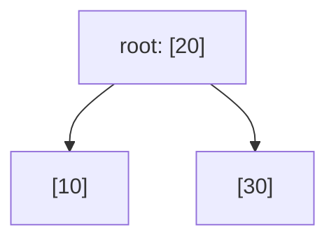
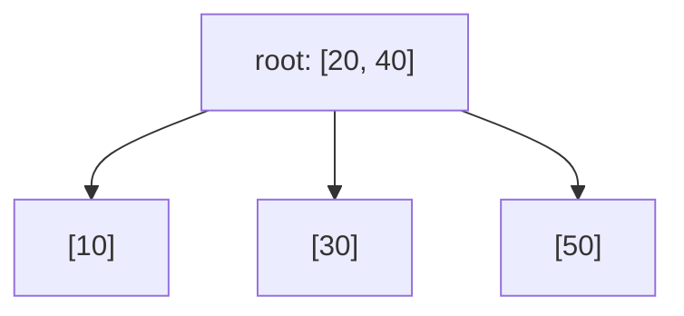

## Learning Objectives

- Explain why AVL and red-black trees, despite guaranteeing O(log n) height, are still a poor fit for data stored on disk, and what specific cost a disk-backed structure needs to minimize instead.
- Explain the B-tree shape precisely: many keys per node, correspondingly many children per node, all leaves at the same depth, governed by a single "order" (branching factor) parameter.
- Explain why a B-tree node is sized to match one disk block, and how that alignment turns "find a key" into "a small, bounded number of disk reads" rather than "a small, bounded number of comparisons."
- Implement search in a B-tree of a given order.
- Implement insert in a B-tree of a given order, including the node-splitting operation triggered when a node overflows its key capacity, and trace a concrete split by hand.

## Context & Motivation

**Comparing AVL and Red-Black Trees in Practice** closed out a two-structure comparison built entirely around one shared shape constraint: both structures are binary — at most two children per node — and both guarantee O(log n) height by enforcing a local balance invariant on top of that binary shape. Everything in that comparison (the 1.44·log₂n versus 2·log₂(n+1) height bounds, the rotation-count trade-offs, the read-heavy-versus-write-heavy workload rule) is a comparison of *two answers to the same question*: given a binary tree, how do you keep it balanced?

A B-tree does not answer that question at all — it rejects the premise. Instead of asking "how do I keep a binary tree balanced," it asks "why constrain the tree to be binary in the first place," and the answer turns out to matter enormously once the data being searched no longer fits in memory. AVL and red-black trees were designed with an implicit assumption baked in: that visiting a node is cheap, dominated by a single value comparison, and that the cost to optimize is the *number of comparisons* on the path from root to target — which is exactly what minimizing tree height accomplishes. That assumption holds for in-memory trees, where every node access is a fast pointer dereference. It breaks completely for data stored on disk (or over a network, or in any medium where reading is orders of magnitude slower than an in-memory comparison): there, the operation to minimize is not "how many nodes do I compare against" but **"how many separate disk reads (seeks) do I need to perform"** — and a disk read is slow enough (measured in milliseconds, versus nanoseconds for an in-memory comparison) that even a well-balanced binary tree with height ≈ 30 for a billion keys would require up to 30 separate, slow disk seeks just to find one record. A structure genuinely suited to disk needs a fundamentally different shape, not just a better balance invariant on the same binary shape — and that different shape is exactly what a B-tree is.

This lab covers that shape and why it is what it is, then implements search and insert (with the node-splitting operation insert requires) for a real, working, simplified B-tree.

## Core Theory

### The B-tree shape: many keys, many children, uniform leaf depth

A B-tree of **order** `m` (also called its branching factor) is defined by these rules, applied to every node:

- Each node holds up to `m − 1` keys, stored in sorted order within the node.
- A non-leaf node with `k` keys has exactly `k + 1` children (not 2 — one child "between" and "around" each pair of adjacent keys, geometrically the same idea as a BST's left/right children, generalized from one key with two neighboring regions to `k` keys with `k + 1` neighboring regions).
- Every key in the subtree rooted at child `i` falls between the node's key `i − 1` and key `i` (with the obvious boundary rule at the first and last child) — the direct generalization of the BST invariant to more than one key per node.
- A node (other than the root) must hold at least `⌈m/2⌉ − 1` keys — no node is allowed to become too sparse, which is what keeps the tree from degenerating.
- **Every leaf sits at exactly the same depth.** Unlike a BST, an AVL tree, or a red-black tree, where different leaves can (and typically do) sit at different depths, a B-tree's leaves are always perfectly level — height is controlled directly by capacity per node rather than by any rotation or recoloring mechanism.

This is the entire new idea this lab introduces, and it is a genuinely different shape, not a variation on the binary theme covered previously: where an AVL or red-black node holds exactly one key and at most two children, a B-tree node holds up to `m − 1` keys and up to `m` children, and increasing `m` shrinks the tree's height directly, because each node now absorbs the branching work that a binary tree would have spread across many separate one-key nodes. A B-tree of order 1001, holding a billion keys, has a height of roughly log₁₀₀₀(1,000,000,000) ≈ 3 — three levels, versus roughly 30 for any binary balanced tree holding the same billion keys.

### Why this shape specifically suits disk-backed storage

The reason the B-tree shape exists is not an abstract preference for shorter trees — it is a direct consequence of matching the tree's node size to the unit a disk actually transfers in a single operation. Disks (and filesystems built on top of them) read and write data in fixed-size chunks called **blocks** (commonly 4 KB, 8 KB, or larger, depending on the system) — reading even a single byte from disk still costs one full block-sized read, because that is the smallest unit the hardware and OS will fetch in one operation. Reading a second byte from the *same* block costs nothing extra if it's already in memory from the first read; reading a byte from a *different* block costs a whole additional slow seek.

A B-tree node is deliberately sized so that one full node — all `m − 1` of its keys, plus its child pointers — fits in exactly one disk block. This means **descending one level in the B-tree costs exactly one disk read**, regardless of how many keys are packed into that level's node — comparing against 1 key or against `m − 1` keys inside an already-loaded block is a cheap in-memory operation once the block is in hand, so the real cost is dominated entirely by how many blocks (equivalently, tree levels) must be read, not by how many individual key comparisons happen within each block. This is precisely why a large branching factor is not merely "allowed" but actively the goal: cramming as many keys as possible into each block-sized node directly minimizes the number of slow disk seeks needed to reach any given key, which is exactly why real database engines (this idea underlies most relational databases' index structures) and real filesystems use B-trees (or the closely related B+-tree variant) rather than a balanced binary tree for anything stored on disk — a binary tree's one-key-per-node shape would waste almost the entire disk block on each read, fetching one key's worth of information at the cost of one full, slow seek, then needing dramatically more of those seeks (one per tree level, and there are many more levels in a binary tree over the same data) to reach the same key.

### Search and insert, generalized from BST

Search walks down from the root exactly as in a BST, generalized to more than two branches per step: at each node, scan its sorted keys to find either an exact match (done) or the correct gap between two keys (or before the first / after the last), and descend into the single child corresponding to that gap. Insert also walks down to find the correct leaf, adds the new key there in sorted position — and then handles the one genuinely new mechanism this shape requires: **splitting** a node that has grown past its capacity.

## Worked Examples

### API specification

```python
class BTreeNode:
    def __init__(self, leaf: bool):
        self.leaf = leaf
        self.keys = []      # sorted list, len(keys) <= order - 1
        self.children = []  # len(children) == len(keys) + 1, empty for a leaf

class BTree:
    def __init__(self, order: int = 4):
        self.order = order              # max children per node; max keys = order - 1
        self.root = BTreeNode(leaf=True)

    def search(self, key) -> bool: ...
    def insert(self, key) -> None: ...
```

Performance requirement, stated precisely: for a B-tree of order `m` holding `n` keys, both `search` and `insert` must perform O(log_m n) node visits (equivalently, disk reads in a real disk-backed implementation) — not merely O(log n) in the generic binary sense, but specifically shrinking as `m` grows, since `m` is exactly the parameter this lab controls to demonstrate that relationship.

### Step 1 — search

```python
def search(node, key):
    i = 0
    while i < len(node.keys) and key > node.keys[i]:
        i += 1
    if i < len(node.keys) and key == node.keys[i]:
        return True                      # found in this node
    if node.leaf:
        return False                     # no children left to descend into
    return search(node.children[i], key)

class BTree:
    # ...
    def search(self, key) -> bool:
        return search(self.root, key)
```

The scan `while ... key > node.keys[i]` finds the correct gap among the node's (few, sorted) keys in one pass; `children[i]` is exactly the child whose entire subtree lies between `keys[i-1]` and `keys[i]`, the direct many-key generalization of a BST's "go left or right."

### Step 2 — insert, with node splitting on overflow

The core new mechanism: when a leaf's key count would exceed `order - 1` after insertion, the node **splits** into two nodes around its median key, and that median key moves *up* into the parent — which can, in turn, overflow the parent and trigger another split, propagating upward, occasionally all the way to a brand-new root (the only way a B-tree's height ever grows, and the reason every leaf always stays at the same depth: growth happens only at the top, uniformly, never by extending one lone leaf deeper than the rest).

```python
def split_child(parent, i, order):
    child = parent.children[i]
    mid = (order - 1) // 2                    # median key index
    median_key = child.keys[mid]

    right = BTreeNode(leaf=child.leaf)
    right.keys = child.keys[mid + 1:]
    child.keys = child.keys[:mid]
    if not child.leaf:
        right.children = child.children[mid + 1:]
        child.children = child.children[:mid + 1]

    parent.keys.insert(i, median_key)
    parent.children.insert(i + 1, right)

def insert_nonfull(node, key, order):
    if node.leaf:
        pos = 0
        while pos < len(node.keys) and key > node.keys[pos]:
            pos += 1
        node.keys.insert(pos, key)
    else:
        pos = 0
        while pos < len(node.keys) and key > node.keys[pos]:
            pos += 1
        if len(node.children[pos].keys) == order - 1:      # child is full — split before descending
            split_child(node, pos, order)
            if key > node.keys[pos]:
                pos += 1
        insert_nonfull(node.children[pos], key, order)

class BTree:
    def insert(self, key) -> None:
        root = self.root
        if len(root.keys) == self.order - 1:               # root itself is full
            new_root = BTreeNode(leaf=False)
            new_root.children.append(root)
            split_child(new_root, 0, self.order)
            self.root = new_root
            insert_nonfull(self.root, key, self.order)
        else:
            insert_nonfull(self.root, key, self.order)
```

The `if len(node.children[pos].keys) == order - 1` check inside `insert_nonfull` is the standard "split preemptively, on the way down" strategy: a full child is split *before* descending into it, which guarantees the recursion only ever inserts into a node it already knows has room, and avoids ever needing to propagate a split back *up* through a call stack after the fact.

### Step 3 — a full worked example: inserting into an order-3 B-tree, showing a real split

Order `m = 3` means at most `m − 1 = 2` keys per node, at most `m = 3` children. Insert, in order: `10, 20, 30, 40, 50`.

**Insert 10, 20.** Root is a leaf, starts empty. `10` → root keys `[10]`. `20` → root keys `[10, 20]` (still ≤ 2, no split needed).

**Insert 30.** Root already has 2 keys (`order - 1 = 2`, full) — but the check for a full node happens on the way down, and here the root *is* the node being inserted into and is full, so `BTree.insert` detects the full root first: a new root is created, `split_child` splits the old root (`keys = [10, 20]`) around its median (`mid = (3-1)//2 = 1`, median key = `20`): left child keeps `[10]`, right child gets `[]` (keys after index `mid+1=2`, which is empty since there are only 2 keys), and `20` moves up into the new root. Now insert `30` into the new structure: new root is `[20]`, descend right (since `30 > 20`) into the right child (`keys = []`), insert `30` there → right child becomes `[30]`.



**Insert 40.** Descend right (`40 > 20`) into `[30]` — this child has only 1 key, room for one more (`order - 1 = 2`): insert directly, no split. Right child becomes `[30, 40]`.

**Insert 50.** Descend right (`50 > 20`) — but the right child `[30, 40]` already has `order - 1 = 2` keys, i.e., it's full. Per the preemptive-split rule, split it *before* descending: median of `[30, 40]` at `mid = 1` is `40`; left keeps `[30]`, right gets `[]`; `40` moves up into the root, which becomes `[20, 40]`. Now compare `50` against the (now 2-key) root: `50 > 40`, descend into the new rightmost child (`[]`), insert `50` there.



**Final tree:** root `[20, 40]` with three leaf children `[10]`, `[30]`, `[50]` — every leaf at depth 1, exactly as the uniform-leaf-depth rule requires, and the tree grew in height (from a single leaf-root to a root-plus-three-leaves) by splitting upward through the root, never by any one leaf extending deeper than the others.

## Common Misconceptions & Pitfalls

- **Confusing "order" with "number of keys per node."** Order `m` bounds the number of *children* (`m`) and, correspondingly, the number of keys (`m − 1`) — a common off-by-one bug is using `m` directly as the max key count instead of `m − 1`, which silently changes the tree's actual capacity and desynchronizes the split-trigger condition (`len(keys) == order - 1`, not `== order`) from the node's real limit.
- **Splitting after descending into a full child, rather than before.** Splitting reactively (descend first, discover the child is over capacity, then try to split and re-insert) requires propagating the split result back *up* the call stack and handling the parent's own possible overflow separately — genuinely more error-prone. The preemptive strategy in Step 2 (check and split *before* descending) guarantees the node being recursed into always already has room, at the cost of occasionally splitting a node that turns out not to have needed it on this particular insert — a deliberate, standard trade-off, not an oversight.
- **Forgetting to also split a full node's children list, not just its keys list.** A non-leaf node's `children` array must be split at `mid + 1`, matching the keys split at `mid`, so that each half retains exactly the children whose key ranges belong with it — splitting only the `keys` list while leaving `children` unsplit (or split at the wrong offset) silently corrupts the invariant that a node with `k` keys has `k + 1` children, and search will silently return wrong answers for keys that end up on the wrong side of the split.
- **Assuming every insert costs the same.** Most inserts are cheap (just a sorted-position insert into an already-non-full leaf); a split is comparatively rare and its cost (and the possibility of it cascading upward through several ancestors, or all the way to a new root) depends entirely on how full the path to the insertion point already was — a test suite that only ever inserts a handful of keys can pass while never actually exercising the split logic at all, so a real test must deliberately insert enough keys, in an order chosen to force at least one split, the way Step 3 does.
- **Treating the "at least `⌈m/2⌉ − 1` keys per non-root node" minimum as optional to enforce during insert.** This lab's simplified insert path never needs to *check* the minimum, because insert only ever adds keys (a node can only grow), but a full B-tree implementation that also supports deletion must actively rebalance (via key redistribution between siblings, or merging siblings) whenever a deletion would drop a node below this minimum — a concern this lab does not implement, but one worth naming explicitly so it is not mistaken for a detail insert already handles.

## Summary

A B-tree abandons the binary-node premise that AVL and red-black trees both keep: instead of one key and at most two children per node, a B-tree of order `m` packs up to `m − 1` keys and up to `m` children into every node, keeps every leaf at exactly the same depth, and controls height directly through this per-node capacity rather than through any rotation or recoloring mechanism. That shape exists specifically because it is sized to match one disk block — descending one level costs one disk read regardless of how many keys that block holds, so maximizing keys per node directly minimizes the number of slow disk seeks needed to find anything, which is why real databases and filesystems use B-trees (or B+-trees) rather than any binary balanced tree. Search generalizes a BST's single comparison into a scan across a node's sorted keys followed by a descent into the matching child; insert adds the one genuinely new mechanism this shape requires — splitting an overfull node around its median key and pushing that median up into the parent, propagating upward and, when the root itself splits, growing the tree's height uniformly from the top. The order-3 worked example traced exactly one such split concretely, from a single overfull leaf to a three-leaf tree with a new root.

## Documentation Links

- [MIT 6.046J — Recitation 2: 2-3 Trees and B-Trees (PDF)](https://ocw.mit.edu/courses/6-046j-design-and-analysis-of-algorithms-spring-2015/8fd15588f584c518b6ec83aedb2b96c9_MIT6_046JS15_Recitation2.pdf) — doc
- [MIT 6.046J — Course Home (OCW)](https://ocw.mit.edu/courses/6-046j-design-and-analysis-of-algorithms-spring-2015/) — doc
