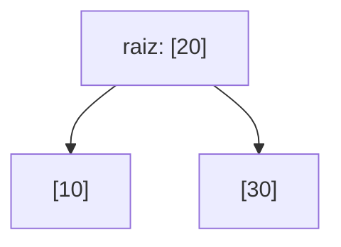
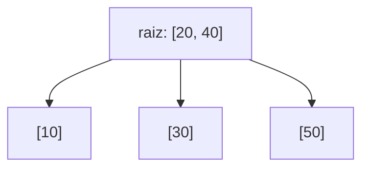

## Objetivos de Aprendizagem

- Explicar por que árvores AVL e red-black, apesar de garantirem altura O(log n), ainda são um mau ajuste para dados armazenados em disco, e qual custo específico uma estrutura apoiada em disco precisa minimizar em vez disso.
- Explicar a forma de B-tree com precisão: muitas chaves por nó, correspondentemente muitos filhos por nó, todas as folhas na mesma profundidade, governado por um único parâmetro "ordem" (fator de ramificação).
- Explicar por que um nó de B-tree é dimensionado para corresponder a um bloco de disco, e como esse alinhamento transforma "encontre uma chave" em "um número pequeno, limitado, de leituras de disco" em vez de "um número pequeno, limitado, de comparações."
- Implementar busca em uma B-tree de uma dada ordem.
- Implementar inserção em uma B-tree de uma dada ordem, incluindo a operação de divisão de nó disparada quando um nó excede sua capacidade de chaves, e rastrear uma divisão concreta à mão.

## Contexto e Motivação

**Comparando Árvores AVL e Red-Black na Prática** encerrou uma comparação de duas estruturas construída inteiramente em torno de uma restrição de forma compartilhada: ambas as estruturas são binárias, no máximo dois filhos por nó, e ambas garantem altura O(log n) impondo um invariante de balanceamento local em cima daquela forma binária. Tudo naquela comparação (os limites de altura 1.44·log₂n versus 2·log₂(n+1), os trade-offs de contagem de rotação, a regra de carga de trabalho leitura-pesada-versus-escrita-pesada) é uma comparação de *duas respostas para a mesma pergunta*: dada uma árvore binária, como você a mantém balanceada?

Uma B-tree não responde a essa pergunta de forma alguma, ela rejeita a premissa. Em vez de perguntar "como eu mantenho uma árvore binária balanceada," ela pergunta "por que restringir a árvore a ser binária em primeiro lugar," e a resposta acaba importando imensamente uma vez que os dados sendo buscados não cabem mais em memória. Árvores AVL e red-black foram desenhadas com uma suposição implícita embutida: que visitar um nó é barato, dominado por uma única comparação de valor, e que o custo a otimizar é o *número de comparações* no caminho da raiz até o alvo, que é exatamente o que minimizar a altura da árvore realiza. Essa suposição vale para árvores em memória, onde todo acesso a nó é uma desreferência de ponteiro rápida. Ela quebra completamente para dados armazenados em disco (ou em rede, ou em qualquer meio onde ler é ordens de magnitude mais lento que uma comparação em memória): lá, a operação a minimizar não é "quantos nós eu comparo contra" mas **"quantas leituras de disco separadas (buscas) eu preciso realizar"**, e uma leitura de disco é lenta o suficiente (medida em milissegundos, versus nanossegundos para uma comparação em memória) que mesmo uma árvore binária bem balanceada com altura ≈ 30 para um bilhão de chaves exigiria até 30 buscas de disco separadas, lentas, só para encontrar um registro. Uma estrutura genuinamente adequada para disco precisa de uma forma fundamentalmente diferente, não só um invariante de balanceamento melhor na mesma forma binária, e essa forma diferente é exatamente o que uma B-tree é.

Este laboratório cobre aquela forma e por que ela é o que é, depois implementa busca e inserção (com a operação de divisão de nó que inserção exige) para uma B-tree real, funcional, simplificada.

## Teoria Central

### A forma de B-tree: muitas chaves, muitos filhos, profundidade de folha uniforme

Uma B-tree de **ordem** `m` (também chamada seu fator de ramificação) é definida por estas regras, aplicadas a todo nó:

- Todo nó mantém até `m − 1` chaves, armazenadas em ordem crescente dentro do nó.
- Um nó não-folha com `k` chaves tem exatamente `k + 1` filhos (não 2, um filho "entre" e "ao redor" de todo par de chaves adjacentes, geometricamente a mesma ideia dos filhos esquerdo/direito de uma BST, generalizada de uma chave com duas regiões vizinhas para `k` chaves com `k + 1` regiões vizinhas).
- Toda chave na subárvore com raiz no filho `i` cai entre a chave `i − 1` e a chave `i` do nó (com a regra de fronteira óbvia no primeiro e último filho), a generalização direta do invariante de BST para mais de uma chave por nó.
- Um nó (além da raiz) precisa manter ao menos `⌈m/2⌉ − 1` chaves, nenhum nó tem permissão de se tornar esparso demais, o que é o que impede a árvore de degenerar.
- **Toda folha fica em exatamente a mesma profundidade.** Diferente de uma BST, uma árvore AVL, ou uma árvore red-black, onde folhas diferentes podem (e tipicamente ficam) em profundidades diferentes, as folhas de uma B-tree estão sempre perfeitamente niveladas, altura é controlada diretamente por capacidade por nó em vez de por qualquer mecanismo de rotação ou recoloração.

Esta é a ideia nova inteira que este laboratório introduz, e é uma forma genuinamente diferente, não uma variação no tema binário coberto anteriormente: onde um nó AVL ou red-black mantém exatamente uma chave e no máximo dois filhos, um nó de B-tree mantém até `m − 1` chaves e até `m` filhos, e aumentar `m` encolhe a altura da árvore diretamente, porque cada nó agora absorve o trabalho de ramificação que uma árvore binária teria espalhado através de muitos nós separados de uma chave. Uma B-tree de ordem 1001, mantendo um bilhão de chaves, tem uma altura de aproximadamente log₁₀₀₀(1.000.000.000) ≈ 3, três níveis, versus aproximadamente 30 para qualquer árvore binária balanceada mantendo o mesmo bilhão de chaves.

### Por que essa forma especificamente se adequa a armazenamento apoiado em disco

A razão pela qual a forma de B-tree existe não é uma preferência abstrata por árvores mais curtas, é uma consequência direta de alinhar o tamanho de nó da árvore à unidade que um disco de fato transfere em uma única operação. Discos (e sistemas de arquivo construídos em cima deles) leem e escrevem dados em pedaços de tamanho fixo chamados **blocos** (comumente 4 KB, 8 KB, ou maiores, dependendo do sistema), ler até mesmo um único byte de disco ainda custa uma leitura completa do tamanho de um bloco, porque essa é a menor unidade que o hardware e o SO vão buscar em uma operação. Ler um segundo byte do *mesmo* bloco não custa nada extra se já está em memória da primeira leitura; ler um byte de um bloco *diferente* custa uma busca lenta adicional inteira.

Um nó de B-tree é deliberadamente dimensionado para que um nó completo, todas as `m − 1` de suas chaves, mais seus ponteiros de filho, caiba em exatamente um bloco de disco. Isso significa que **descer um nível na B-tree custa exatamente uma leitura de disco**, independentemente de quantas chaves estão empacotadas no nó daquele nível, comparar contra 1 chave ou contra `m − 1` chaves dentro de um bloco já carregado é uma operação em memória barata uma vez que o bloco está em mãos, então o custo real é dominado inteiramente por quantos blocos (equivalentemente, níveis de árvore) precisam ser lidos, não por quantas comparações de chave individuais acontecem dentro de cada bloco. Isto é precisamente por que um fator de ramificação grande não é meramente "permitido" mas ativamente o objetivo: espremer tantas chaves quanto possível em cada nó do tamanho de um bloco minimiza diretamente o número de buscas de disco lentas necessárias para alcançar qualquer chave dada, o que é exatamente por que motores de banco de dados reais (essa ideia é a base das estruturas de índice da maioria dos bancos de dados relacionais) e sistemas de arquivo reais usam B-trees (ou a variante B+-tree intimamente relacionada) em vez de uma árvore binária balanceada para qualquer coisa armazenada em disco, a forma de uma-chave-por-nó de uma árvore binária desperdiçaria quase o bloco de disco inteiro a cada leitura, buscando o valor de uma chave ao custo de uma busca completa, lenta, depois precisando de dramaticamente mais dessas buscas (uma por nível de árvore, e há muito mais níveis em uma árvore binária sobre os mesmos dados) para alcançar a mesma chave.

### Busca e inserção, generalizadas de BST

Busca desce da raiz exatamente como em uma BST, generalizada para mais de dois ramos por passo: em cada nó, varre suas chaves ordenadas para encontrar ou uma correspondência exata (pronto) ou a lacuna correta entre duas chaves (ou antes da primeira / depois da última), e desce para o único filho correspondente àquela lacuna. Inserção também desce para encontrar a folha correta, adiciona a chave nova ali em posição ordenada, e depois trata o único mecanismo genuinamente novo que essa forma exige: **dividir** um nó que cresceu além de sua capacidade.

## Exemplos Resolvidos

### Especificação de API

```python
class BTreeNode:
    def __init__(self, leaf: bool):
        self.leaf = leaf
        self.keys = []      # lista ordenada, len(keys) <= order - 1
        self.children = []  # len(children) == len(keys) + 1, vazio para uma folha

class BTree:
    def __init__(self, order: int = 4):
        self.order = order              # máximo de filhos por nó; máximo de chaves = order - 1
        self.root = BTreeNode(leaf=True)

    def search(self, key) -> bool: ...
    def insert(self, key) -> None: ...
```

Requisito de desempenho, enunciado com precisão: para uma B-tree de ordem `m` mantendo `n` chaves, tanto `search` quanto `insert` precisam realizar O(log_m n) visitas de nó (equivalentemente, leituras de disco em uma implementação real apoiada em disco), não meramente O(log n) no sentido binário genérico, mas especificamente encolhendo conforme `m` cresce, já que `m` é exatamente o parâmetro que este laboratório controla para demonstrar aquela relação.

### Passo 1: busca

```python
def search(node, key):
    i = 0
    while i < len(node.keys) and key > node.keys[i]:
        i += 1
    if i < len(node.keys) and key == node.keys[i]:
        return True                      # encontrada neste nó
    if node.leaf:
        return False                     # nenhum filho restante para descer
    return search(node.children[i], key)

class BTree:
    # ...
    def search(self, key) -> bool:
        return search(self.root, key)
```

A varredura `while ... key > node.keys[i]` encontra a lacuna correta entre as (poucas, ordenadas) chaves do nó em uma passagem; `children[i]` é exatamente o filho cuja subárvore inteira fica entre `keys[i-1]` e `keys[i]`, a generalização direta de muitas-chaves do "vá esquerda ou direita" de uma BST.

### Passo 2: inserção, com divisão de nó em overflow

O mecanismo novo central: quando a contagem de chaves de uma folha excederia `order - 1` depois da inserção, o nó **divide** em dois nós ao redor de sua chave mediana, e aquela chave mediana se move *para cima* no pai, o que pode, por sua vez, causar overflow no pai e disparar outra divisão, propagando para cima, ocasionalmente até uma raiz inteiramente nova (a única forma pela qual a altura de uma B-tree alguma vez cresce, e a razão pela qual toda folha sempre permanece na mesma profundidade: crescimento acontece só no topo, uniformemente, nunca estendendo uma única folha solitária mais fundo que o resto).

```python
def split_child(parent, i, order):
    child = parent.children[i]
    mid = (order - 1) // 2                    # índice da chave mediana
    median_key = child.keys[mid]

    right = BTreeNode(leaf=child.leaf)
    right.keys = child.keys[mid + 1:]
    child.keys = child.keys[:mid]
    if not child.leaf:
        right.children = child.children[mid + 1:]
        child.children = child.children[:mid + 1]

    parent.keys.insert(i, median_key)
    parent.children.insert(i + 1, right)

def insert_nonfull(node, key, order):
    if node.leaf:
        pos = 0
        while pos < len(node.keys) and key > node.keys[pos]:
            pos += 1
        node.keys.insert(pos, key)
    else:
        pos = 0
        while pos < len(node.keys) and key > node.keys[pos]:
            pos += 1
        if len(node.children[pos].keys) == order - 1:      # filho está cheio -- divide antes de descer
            split_child(node, pos, order)
            if key > node.keys[pos]:
                pos += 1
        insert_nonfull(node.children[pos], key, order)

class BTree:
    def insert(self, key) -> None:
        root = self.root
        if len(root.keys) == self.order - 1:               # a própria raiz está cheia
            new_root = BTreeNode(leaf=False)
            new_root.children.append(root)
            split_child(new_root, 0, self.order)
            self.root = new_root
            insert_nonfull(self.root, key, self.order)
        else:
            insert_nonfull(self.root, key, self.order)
```

A checagem `if len(node.children[pos].keys) == order - 1` dentro de `insert_nonfull` é a estratégia padrão de "divida preemptivamente, no caminho para baixo": um filho cheio é dividido *antes* de descer nele, o que garante que a recursão só sempre insere em um nó que já sabe ter espaço, e evita jamais precisar propagar uma divisão de volta *para cima* através de uma pilha de chamadas depois do fato.

### Passo 3: um exemplo resolvido completo: inserindo em uma B-tree de ordem-3, mostrando uma divisão real

Ordem `m = 3` significa no máximo `m − 1 = 2` chaves por nó, no máximo `m = 3` filhos. Insira, em ordem: `10, 20, 30, 40, 50`.

**Insira 10, 20.** A raiz é uma folha, começa vazia. `10` → chaves da raiz `[10]`. `20` → chaves da raiz `[10, 20]` (ainda ≤ 2, nenhuma divisão necessária).

**Insira 30.** A raiz já tem 2 chaves (`order - 1 = 2`, cheia), mas a checagem por um nó cheio acontece no caminho para baixo, e aqui a raiz *é* o nó sendo inserido e está cheia, então `BTree.insert` detecta a raiz cheia primeiro: uma raiz nova é criada, `split_child` divide a raiz antiga (`keys = [10, 20]`) ao redor de sua mediana (`mid = (3-1)//2 = 1`, chave mediana = `20`): filho esquerdo mantém `[10]`, filho direito recebe `[]` (chaves depois do índice `mid+1=2`, que é vazio já que há só 2 chaves), e `20` se move para cima na raiz nova. Agora insira `30` na estrutura nova: raiz nova é `[20]`, desça à direita (já que `30 > 20`) no filho direito (`keys = []`), insira `30` ali → filho direito se torna `[30]`.



**Insira 40.** Desça à direita (`40 > 20`) em `[30]`, este filho tem só 1 chave, espaço para mais uma (`order - 1 = 2`): insira diretamente, nenhuma divisão. Filho direito se torna `[30, 40]`.

**Insira 50.** Desça à direita (`50 > 20`), mas o filho direito `[30, 40]` já tem `order - 1 = 2` chaves, ou seja, está cheio. Pela regra de divisão preemptiva, divida-o *antes* de descer: mediana de `[30, 40]` em `mid = 1` é `40`; esquerda mantém `[30]`, direita recebe `[]`; `40` se move para cima na raiz, que se torna `[20, 40]`. Agora compare `50` contra a raiz (agora com 2 chaves): `50 > 40`, desça no filho mais à direita novo (`[]`), insira `50` ali.



**Árvore final:** raiz `[20, 40]` com três filhos folha `[10]`, `[30]`, `[50]`, toda folha na profundidade 1, exatamente como a regra de profundidade-de-folha-uniforme exige, e a árvore cresceu em altura (de uma única raiz-folha para uma raiz-mais-três-folhas) dividindo para cima através da raiz, nunca por qualquer única folha se estendendo mais fundo que as outras.

## Equívocos Comuns e Armadilhas

- **Confundir "ordem" com "número de chaves por nó."** Ordem `m` limita o número de *filhos* (`m`) e, correspondentemente, o número de chaves (`m − 1`), um bug off-by-one comum é usar `m` diretamente como a contagem máxima de chaves em vez de `m − 1`, o que silenciosamente muda a capacidade real da árvore e dessincroniza a condição de disparo-de-divisão (`len(keys) == order - 1`, não `== order`) do limite real do nó.
- **Dividir depois de descer em um filho cheio, em vez de antes.** Dividir reativamente (desça primeiro, descubra que o filho excedeu capacidade, depois tente dividir e reinserir) exige propagar o resultado da divisão de volta *para cima* através da pilha de chamadas e tratar o possível overflow do próprio pai separadamente, genuinamente mais propenso a erro. A estratégia preemptiva no Passo 2 (checa e divide *antes* de descer) garante que o nó no qual está recursando sempre já tem espaço, ao custo de ocasionalmente dividir um nó que acaba não precisando disso nesta inserção particular, um trade-off deliberado, padrão, não um descuido.
- **Esquecer de também dividir a lista de filhos de um nó cheio, não só sua lista de chaves.** O array `children` de um nó não-folha precisa ser dividido em `mid + 1`, correspondendo à divisão de chaves em `mid`, para que cada metade retenha exatamente os filhos cujas faixas de chave pertencem a ela, dividir só a lista `keys` enquanto deixa `children` não dividido (ou dividido no deslocamento errado) corrompe silenciosamente o invariante de que um nó com `k` chaves tem `k + 1` filhos, e busca vai silenciosamente retornar respostas erradas para chaves que acabam no lado errado da divisão.
- **Assumir que toda inserção custa o mesmo.** A maioria das inserções é barata (só uma inserção em posição ordenada em uma folha já não cheia); uma divisão é comparativamente rara e seu custo (e a possibilidade de ela cascatear para cima através de vários ancestrais, ou até uma raiz nova) depende inteiramente de quão cheio o caminho até o ponto de inserção já estava, uma suíte de testes que só sempre insere um punhado de chaves pode passar enquanto nunca de fato exercita a lógica de divisão de forma alguma, então um teste real precisa deliberadamente inserir chaves suficientes, em uma ordem escolhida para forçar ao menos uma divisão, da forma que o Passo 3 faz.
- **Tratar o mínimo de "ao menos `⌈m/2⌉ − 1` chaves por nó não-raiz" como opcional de impor durante inserção.** O caminho de inserção simplificado deste laboratório nunca precisa *checar* o mínimo, porque inserção só sempre adiciona chaves (um nó só pode crescer), mas uma implementação de B-tree completa que também suporta deleção precisa rebalancear ativamente (via redistribuição de chave entre irmãos, ou mesclagem de irmãos) sempre que uma deleção derrubaria um nó abaixo deste mínimo, uma preocupação que este laboratório não implementa, mas que vale a pena nomear explicitamente para que não seja confundida com um detalhe que inserção já trata.

## Resumo

Uma B-tree abandona a premissa de nó binário que tanto árvores AVL quanto red-black mantêm: em vez de uma chave e no máximo dois filhos por nó, uma B-tree de ordem `m` empacota até `m − 1` chaves e até `m` filhos em todo nó, mantém toda folha em exatamente a mesma profundidade, e controla altura diretamente através dessa capacidade por nó em vez de através de qualquer mecanismo de rotação ou recoloração. Essa forma existe especificamente porque é dimensionada para corresponder a um bloco de disco, descer um nível custa uma leitura de disco independentemente de quantas chaves aquele bloco mantém, então maximizar chaves por nó minimiza diretamente o número de buscas de disco lentas necessárias para encontrar qualquer coisa, o que é por que bancos de dados e sistemas de arquivo reais usam B-trees (ou B+-trees) em vez de qualquer árvore binária balanceada. Busca generaliza a única comparação de uma BST em uma varredura através das chaves ordenadas de um nó seguida por uma descida no filho correspondente; inserção adiciona o único mecanismo genuinamente novo que essa forma exige, dividir um nó cheio demais ao redor de sua chave mediana e empurrar aquela mediana para cima no pai, propagando para cima e, quando a própria raiz divide, crescendo a altura da árvore uniformemente a partir do topo. O exemplo resolvido de ordem-3 rastreou exatamente uma tal divisão concretamente, de uma única folha cheia demais para uma árvore de três folhas com uma raiz nova.

## Documentation Links

- [MIT 6.046J — Recitation 2: 2-3 Trees and B-Trees (PDF)](https://ocw.mit.edu/courses/6-046j-design-and-analysis-of-algorithms-spring-2015/8fd15588f584c518b6ec83aedb2b96c9_MIT6_046JS15_Recitation2.pdf) — doc
- [MIT 6.046J — Course Home (OCW)](https://ocw.mit.edu/courses/6-046j-design-and-analysis-of-algorithms-spring-2015/) — doc
