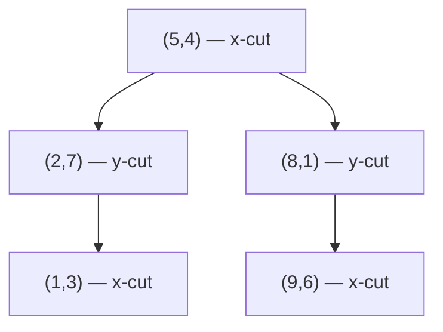
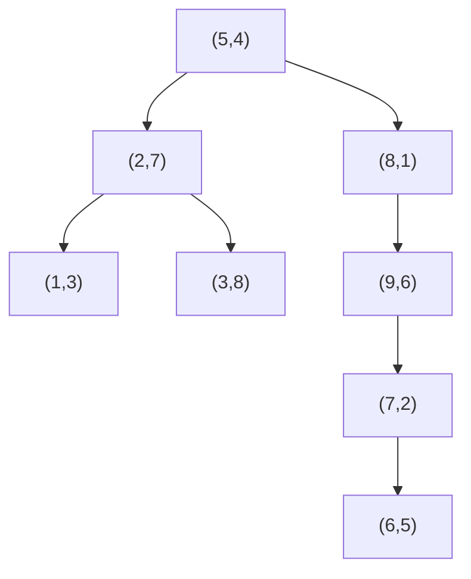

## Learning Objectives

- Explain why a plain one-dimensional binary search tree has no natural comparison rule for two-dimensional points, and what "alternating the compared coordinate per level" fixes.
- Explain how a 2D tree's structure corresponds geometrically to a recursive partition of the plane into axis-aligned rectangles, one rectangle per node.
- Implement `insert` for a 2D tree, tracking each node's bounding rectangle as it is created.
- Implement a range-search query that returns every stored point inside a given query rectangle, pruning any subtree whose rectangle cannot possibly intersect the query rectangle.
- Measure, on a worked example, which subtrees a range query actually visits versus which it prunes, and explain why that pruning is the entire performance argument for using a 2D tree instead of a linear scan.

## Context & Motivation

**Binary Search Trees: Search, Insert, Delete** established the whole idea this lab extends: a BST's invariant — everything smaller goes left, everything larger goes right — gives every comparison the power to discard an entire subtree, and that single property is why search, insert, and delete are all fast on a well-shaped tree. That idea is built entirely on keys having one dimension: at any node, "smaller" and "larger" are unambiguous, because there is exactly one number to compare.

A 2D point has no such single ordering. Given two points `(3, 7)` and `(5, 2)`, there is no context-free answer to "which one is smaller" — smaller in x, or smaller in y, are both legitimate, incompatible answers. Comparing only on x throughout the whole tree would give a structure that is well-organized for x-range queries but useless for y-range queries (it degenerates into an unordered list once two points share an x-comparison outcome but differ in y). This lab covers the fix: a **2D tree** (kd-tree with k = 2) resolves the ambiguity not by picking one coordinate permanently, but by **alternating** which coordinate is compared at each depth level — x at the root, y at the root's children, x again at the grandchildren, and so on. That single change is enough to make the familiar BST machinery — walk down, compare, go left or right, recurse — work correctly and efficiently in two dimensions, and it is exactly what makes a genuinely useful geometric query possible: given a rectangle, find every stored point inside it, without checking every point in the whole data set one by one.

The reason this matters beyond a geometric curiosity is the same reason the original BST mattered: without the tree, answering "which points fall in this region" requires scanning every point — O(n) work regardless of how few points actually fall inside the rectangle. A 2D tree with a well-designed range-search routine can answer the same query by inspecting only the points near or inside the rectangle, skipping entire regions of the plane it can prove contain nothing relevant — the exact "eliminate a whole subtree from consideration" idea a 1D BST search already relies on, now applied to space instead of to a single ordered dimension.

## Core Theory

### Alternating the compared coordinate by depth

Structurally, a 2D tree is a binary tree of 2D points where every node still has at most two children, and the invariant is still an ordering invariant — but which coordinate the ordering applies to depends on the node's depth, not on some fixed global choice. By convention: the root and every node at an even depth compares on **x**; every node at an odd depth compares on **y**. At an x-comparing node with point `(px, py)`, a candidate point `(qx, qy)` goes to the left subtree if `qx < px`, right otherwise (ties broken consistently, e.g., always right). At a y-comparing node, the same rule applies to the y-coordinates instead.

### The geometric meaning: nested rectangles

The alternation has a direct geometric reading, and this is the actual new idea this lab introduces. The root's comparison (on x) splits the entire plane into two half-planes: everything with x less than the root's x, and everything with x greater. The root's left child, comparing on y, splits its inherited left half-plane again — this time by a horizontal line — into two rectangles. Each subsequent node inherits a rectangle from its parent (implicitly, the intersection of every ancestor's half-plane constraint) and splits that rectangle again along the other axis. The result: every node in a 2D tree owns an axis-aligned rectangle, and a node's own point always lies inside its own rectangle; the rectangle shrinks strictly with every level of depth, and the whole tree corresponds exactly to a recursive partition of the plane into nested, non-overlapping rectangles — one leaf-region per rectangle, in the same way a 1D BST's nodes correspond to nested sub-*intervals* of the number line, just extended to two axes taking turns.



`(5,4)` splits the whole plane at x = 5. `(2,7)`, in the left half (x < 5), splits *that* half-plane at y = 7. `(1,3)`, under `(2,7)` and in the region x < 5, y < 7, splits *that* rectangle at x = 1. Each rectangle is strictly smaller than its parent's, and every node's own point sits inside the rectangle it owns.

### Range search: pruning by rectangle, not by point

A **range query** asks for every stored point inside a given axis-aligned query rectangle `R`. The naive approach — check every stored point against `R` one at a time — costs O(n) regardless of how the points are organized, because it never uses the tree structure at all.

A 2D tree range search instead recurses down the tree, and at each node does three separate checks:

1. **Does the node's own point lie inside `R`?** If so, report it.
2. **Does the node's rectangle intersect `R` at all?** If the node's rectangle and `R` do not overlap even partially, **no point anywhere in that node's subtree can possibly be inside `R`** — every point in the subtree is, by construction, confined to that rectangle. The entire subtree is pruned: neither child is visited, and no further comparisons happen anywhere below this node.
3. **If the rectangle does intersect `R`,** recurse into whichever children's rectangles could still contain a point in `R` (in the worst case, both).

This pruning step — check the rectangle before descending, and skip the whole subtree when there is no overlap — is the entire performance argument for building a 2D tree in the first place. A balanced 2D tree with n points answers a typical range query by visiting a number of nodes closer to O(√n + m) (where m is the number of points actually reported) rather than O(n), because most of the plane's area, and therefore most subtrees, get eliminated by the rectangle-overlap test without ever inspecting an individual point inside them.

## Worked Examples

### API specification

```python
class Node:
    def __init__(self, point, rect):
        self.point = point      # (x, y)
        self.rect = rect        # (xmin, ymin, xmax, ymax) — this node's owned rectangle
        self.left = None
        self.right = None

class KdTree:
    def __init__(self):
        self.root = None

    def insert(self, point: tuple[float, float]) -> None: ...
    def range_search(self, query_rect: tuple[float, float, float, float]) -> list[tuple[float, float]]: ...
```

`range_search` returns every stored point `(x, y)` with `xmin <= x <= xmax` and `ymin <= y <= ymax` for the given `query_rect`. Duplicate points are permitted to be inserted (a duplicate is simply routed by the same tie-breaking rule as any other insert) but are out of scope for this lab's test cases, which use distinct points only.

### Step 1 — insert, tracking each node's rectangle

```python
NEG_INF, POS_INF = float("-inf"), float("inf")

def insert(root, point, rect=(NEG_INF, NEG_INF, POS_INF, POS_INF), depth=0):
    if root is None:
        return Node(point, rect)
    px, py = point
    nx, ny = root.point
    use_x = (depth % 2 == 0)
    if use_x:
        if px < nx:
            xmin, ymin, xmax, ymax = root.rect
            child_rect = (xmin, ymin, nx, ymax)      # left: x < nx
            root.left = insert(root.left, point, child_rect, depth + 1)
        else:
            xmin, ymin, xmax, ymax = root.rect
            child_rect = (nx, ymin, xmax, ymax)      # right: x >= nx
            root.right = insert(root.right, point, child_rect, depth + 1)
    else:
        if py < ny:
            xmin, ymin, xmax, ymax = root.rect
            child_rect = (xmin, ymin, xmax, ny)      # left: y < ny
            root.left = insert(root.left, point, child_rect, depth + 1)
        else:
            xmin, ymin, xmax, ymax = root.rect
            child_rect = (xmin, ny, xmax, ymax)      # right: y >= ny
            root.right = insert(root.right, point, child_rect, depth + 1)
    return root

class KdTree:
    def __init__(self):
        self.root = None

    def insert(self, point):
        self.root = insert(self.root, point)
```

Each recursive call passes down the child's *narrowed* rectangle — computed from the parent's own rectangle by clamping one edge at the parent's coordinate — so every node, by the time it's created, already owns the exact rectangle Core Theory describes, with no separate pass needed to compute it afterward.

### Step 2 — range search with pruning

```python
def rects_intersect(r1, r2):
    ax1, ay1, ax2, ay2 = r1
    bx1, by1, bx2, by2 = r2
    return not (ax2 < bx1 or bx2 < ax1 or ay2 < by1 or by2 < ay1)

def point_in_rect(point, rect):
    x, y = point
    xmin, ymin, xmax, ymax = rect
    return xmin <= x <= xmax and ymin <= y <= ymax

def range_search(node, query_rect, found):
    if node is None:
        return
    if not rects_intersect(node.rect, query_rect):
        return                                        # PRUNE: whole subtree ruled out
    if point_in_rect(node.point, query_rect):
        found.append(node.point)
    range_search(node.left, query_rect, found)
    range_search(node.right, query_rect, found)

class KdTree:
    # ... insert as above ...
    def range_search(self, query_rect):
        found = []
        range_search(self.root, query_rect, found)
        return found
```

The pruning check happens before either recursive call, on the node's *rectangle*, not on the node's point — this is the one line (`if not rects_intersect(...): return`) that turns this from "visit every node" into "visit only nodes whose region could matter."

### Step 3 — a full worked example: 8 points, one query, tracing the prune/explore split

**Insert, in this order:** `(5,4), (2,7), (8,1), (1,3), (9,6), (7,2), (3,8), (6,5)`.

Building the tree (root splits on x at depth 0, its children split on y at depth 1, grandchildren split on x again, and so on):

- `(5,4)` — root, rect = whole plane.
- `(2,7)`: `2 < 5` → left of root. Rect: `x < 5`.
- `(8,1)`: `8 >= 5` → right of root. Rect: `x >= 5`.
- `(1,3)`: `1 < 5` → left of root, then compares on y at `(2,7)`: `3 < 7` → left of `(2,7)`. Rect: `x < 5, y < 7`.
- `(9,6)`: `9 >= 5` → right of root, then compares on y at `(8,1)`: `6 >= 1` → right of `(8,1)`. Rect: `x >= 5, y >= 1`.
- `(7,2)`: `7 >= 5` → right of root, then y at `(8,1)`: `2 >= 1` → right of `(8,1)`, then x at `(9,6)`: `7 < 9` → left of `(9,6)`. Rect: `x >= 5, y >= 1, x < 9`.
- `(3,8)`: `3 < 5` → left of root, then y at `(2,7)`: `8 >= 7` → right of `(2,7)`. Rect: `x < 5, y >= 7`.
- `(6,5)`: `6 >= 5` → right of root, then y at `(8,1)`: `5 >= 1` → right of `(8,1)`, then x at `(9,6)`: `6 < 9` → left of `(9,6)`, then y at `(7,2)`: `5 >= 2` → right of `(7,2)`. Rect: `x >= 5, y >= 1, x < 9, y >= 2`.



**Query rectangle:** `R = (0, 0, 4, 5)` — the region `0 <= x <= 4, 0 <= y <= 5`.

- **`(5,4)`, root, rect = whole plane.** Whole plane always intersects `R`. Point `(5,4)`: x = 5 is not `<= 4` → not in `R`. Recurse into both children.
- **`(2,7)`, rect = `x < 5`.** Intersects `R` (x from 0 to 4 overlaps x < 5). Point `(2,7)`: y = 7 not `<= 5` → not in `R`. Recurse into both children.
  - **`(1,3)`, rect = `x < 5, y < 7`.** Intersects `R`. Point `(1,3)`: inside `R` → **reported**. No children.
  - **`(3,8)`, rect = `x < 5, y >= 7`.** Does this rectangle intersect `R = (0,0,4,5)`? `R`'s y-range tops out at 5; this rectangle's y-range starts at 7 — no overlap. **Pruned** — subtree skipped entirely (it has no children here anyway, but in general this is where a whole branch would be skipped without visiting a single point in it).
- **`(8,1)`, rect = `x >= 5`.** Does `x >= 5` intersect `R`'s x-range (`0` to `4`)? No overlap at all. **Pruned** — the entire right subtree of the root (`(8,1)`, `(9,6)`, `(7,2)`, `(6,5)` — four points) is skipped without a single one of them being checked individually.

**Result:** `range_search` returns `[(1,3)]`. Of 8 stored points, only 3 nodes were ever visited (`(5,4)`, `(2,7)`, `(1,3)`) plus one rejected-by-rectangle check each at `(3,8)` and `(8,1)` — five node-visits total, and the four-point subtree under `(8,1)` was eliminated in a single rectangle comparison rather than four individual point comparisons. A naive linear scan would have checked all 8 points individually; the tree checked effectively 5, and would have skipped proportionally more on a larger data set with the same query, since the pruned-away subtree can be arbitrarily large without changing the cost of the one check that rules it out.

## Common Misconceptions & Pitfalls

- **Comparing on the same coordinate at every level, as if it were an ordinary 1D BST keyed on x.** This produces a tree where points with equal or nearby x-values but wildly different y-values all cluster into the same comparison path, degenerating toward a linked list in the worst case and losing the ability to prune on y at all during range search. The alternation by depth is not a minor implementation detail — it is the entire mechanism that makes the tree balanced with respect to *both* dimensions.
- **Pruning based on whether the node's own point is in the query rectangle, instead of whether the node's rectangle intersects the query rectangle.** A node's point can lie outside the query rectangle while points deeper in its subtree still lie inside it (as `(5,4)` and `(2,7)` both do in the worked example, neither being in `R`, while `(1,3)` beneath them is). The correct prune test is always against the *rectangle*, never against the single stored point — checking the point only tells you whether to report that one node, not whether to descend further.
- **Forgetting to recompute the child's rectangle correctly, and instead passing the parent's rectangle down unchanged.** If a child's rectangle is never narrowed relative to its parent's, every rectangle in the tree ends up identical to the root's (the whole plane), which makes the prune check (`rects_intersect`) always succeed and never actually prune anything — the range search degrades silently into visiting every node, with no error raised anywhere to reveal the bug.
- **Getting the left/right split direction backwards between x-levels and y-levels.** Because the axis used alternates by depth, a bug that flips "less than goes left" only on odd (y-comparing) levels but not even (x-comparing) levels is easy to introduce and easy to miss with a small hand-built tree, since a handful of points might still happen to end up findable by both `insert` and `range_search` even with the direction flipped — inconsistency only surfaces as wrong or missing points reported once the tree is exercised at nontrivial size or by directly cross-checking against a linear scan.
- **Not validating against a brute-force reference implementation.** Because a 2D tree's correctness bugs (a mis-set rectangle boundary, an off-by-one in `<` versus `<=`) can silently produce a *plausible-looking but wrong* set of results rather than crashing, the only reliable check is comparing `range_search`'s output against a linear scan (checking every stored point against the query rectangle directly) on the same data, for a range of query rectangles including ones with no matches, one match, and every point matching.

## Summary

A 2D tree extends the familiar BST idea — one ordering invariant, halving the search space on every comparison — to two-dimensional points by alternating which coordinate is compared at each depth level (x, then y, then x, ...), which corresponds geometrically to recursively splitting the plane into nested, non-overlapping rectangles, one per node. Insert follows the same walk-down-and-attach logic as a 1D BST, narrowing each child's rectangle relative to its parent's as it goes. Range search is the real payoff: given a query rectangle, it reports any node whose own point falls inside it, but — critically — it prunes an entire subtree without visiting a single point inside it whenever that subtree's owned rectangle does not intersect the query rectangle at all, which is what lets a range query cost far less than the O(n) a naive linear scan requires. The worked example traced exactly this: an 8-point tree, a single query rectangle, one subtree of four points eliminated by a single rectangle check, and only one point ultimately reported.

## Documentation Links

- [Princeton algs4 Assignments Index](https://coursera.cs.princeton.edu/algs4/assignments/) — doc
- [Sedgewick & Wayne — Algorithms, 4th ed. Companion Site](https://algs4.cs.princeton.edu/home/) — doc
