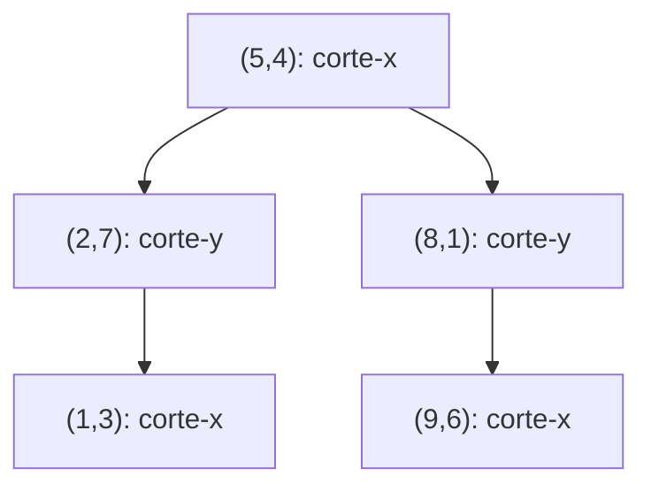
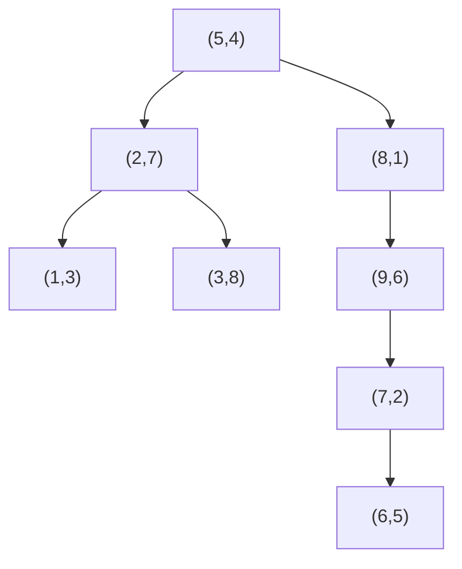

## Objetivos de Aprendizagem

- Explicar por que uma árvore de busca binária unidimensional comum não tem nenhuma regra de comparação natural para pontos bidimensionais, e o que "alternar a coordenada comparada por nível" corrige.
- Explicar como a estrutura de uma árvore 2D corresponde geometricamente a uma partição recursiva do plano em retângulos alinhados aos eixos, um retângulo por nó.
- Implementar `insert` para uma árvore 2D, rastreando o retângulo delimitador de cada nó conforme é criado.
- Implementar uma consulta de busca por intervalo que retorna todo ponto armazenado dentro de um retângulo de consulta dado, podando qualquer subárvore cujo retângulo não pode possivelmente cruzar o retângulo de consulta.
- Medir, em um exemplo resolvido, quais subárvores uma consulta de intervalo de fato visita versus quais poda, e explicar por que aquela poda é o argumento de desempenho inteiro para usar uma árvore 2D em vez de uma varredura linear.

## Contexto e Motivação

**Árvores de Busca Binária: Busca, Inserção, Deleção** estabeleceu a ideia inteira que este laboratório estende: o invariante de uma BST, tudo menor vai para a esquerda, tudo maior vai para a direita, dá a toda comparação o poder de descartar uma subárvore inteira, e essa única propriedade é por que busca, inserção, e deleção são todas rápidas em uma árvore bem formada. Aquela ideia é construída inteiramente sobre chaves tendo uma dimensão: em qualquer nó, "menor" e "maior" não têm ambiguidade, porque há exatamente um número para comparar.

Um ponto 2D não tem tal única ordenação. Dados dois pontos `(3, 7)` e `(5, 2)`, não há nenhuma resposta livre de contexto para "qual é menor", menor em x, ou menor em y, são ambas respostas legítimas, incompatíveis. Comparar só em x por toda a árvore daria uma estrutura que é bem organizada para consultas de intervalo em x mas inútil para consultas de intervalo em y (degenera em uma lista não ordenada uma vez que dois pontos compartilham um resultado de comparação em x mas diferem em y). Este laboratório cobre a correção: uma **árvore 2D** (kd-tree com k = 2) resolve a ambiguidade não escolhendo uma coordenada permanentemente, mas **alternando** qual coordenada é comparada a cada nível de profundidade, x na raiz, y nos filhos da raiz, x de novo nos netos, e assim por diante. Essa única mudança é suficiente para fazer a maquinaria familiar de BST, desça, compare, vá para esquerda ou direita, recurse, funcionar correta e eficientemente em duas dimensões, e é exatamente o que torna possível uma consulta geométrica genuinamente útil: dado um retângulo, encontre todo ponto armazenado dentro dele, sem checar cada ponto do conjunto de dados inteiro um de cada vez.

A razão pela qual isso importa além de uma curiosidade geométrica é a mesma razão pela qual a BST original importava: sem a árvore, responder "quais pontos caem nesta região" exige varrer todo ponto, trabalho O(n) independentemente de quão poucos pontos de fato caem dentro do retângulo. Uma árvore 2D com uma rotina de busca por intervalo bem desenhada consegue responder a mesma consulta inspecionando só os pontos perto ou dentro do retângulo, pulando regiões inteiras do plano que consegue provar não contêm nada relevante, a exata ideia de "elimine uma subárvore inteira de consideração" da qual uma busca BST 1D já depende, agora aplicada a espaço em vez de a uma única dimensão ordenada.

## Teoria Central

### Alternando a coordenada comparada por profundidade

Estruturalmente, uma árvore 2D é uma árvore binária de pontos 2D onde todo nó ainda tem no máximo dois filhos, e o invariante ainda é um invariante de ordenação, mas a qual coordenada a ordenação se aplica depende da profundidade do nó, não de alguma escolha global fixa. Por convenção: a raiz e todo nó em profundidade par compara em **x**; todo nó em profundidade ímpar compara em **y**. Em um nó comparando-x com ponto `(px, py)`, um ponto candidato `(qx, qy)` vai para a subárvore esquerda se `qx < px`, direita caso contrário (empates desempatados consistentemente, ex., sempre direita). Em um nó comparando-y, a mesma regra se aplica às coordenadas y em vez disso.

### O significado geométrico: retângulos aninhados

A alternância tem uma leitura geométrica direta, e esta é a ideia nova real que este laboratório introduz. A comparação da raiz (em x) divide o plano inteiro em dois semiplanos: tudo com x menor que o x da raiz, e tudo com x maior. O filho esquerdo da raiz, comparando em y, divide seu semiplano esquerdo herdado de novo, desta vez por uma linha horizontal, em dois retângulos. Cada nó subsequente herda um retângulo de seu pai (implicitamente, a interseção da restrição de semiplano de todo ancestral) e divide aquele retângulo de novo ao longo do outro eixo. O resultado: todo nó em uma árvore 2D possui um retângulo alinhado aos eixos, e o próprio ponto de um nó sempre está dentro de seu próprio retângulo; o retângulo encolhe estritamente a cada nível de profundidade, e a árvore inteira corresponde exatamente a uma partição recursiva do plano em retângulos aninhados, sem sobreposição, uma região-folha por retângulo, da mesma forma que os nós de uma BST 1D correspondem a sub-*intervalos* aninhados da reta numérica, só estendidos a dois eixos se revezando.



`(5,4)` divide o plano inteiro em x = 5. `(2,7)`, na metade esquerda (x < 5), divide *aquele* semiplano em y = 7. `(1,3)`, sob `(2,7)` e na região x < 5, y < 7, divide *aquele* retângulo em x = 1. Cada retângulo é estritamente menor que o de seu pai, e o próprio ponto de todo nó fica dentro do retângulo que possui.

### Busca por intervalo: poda por retângulo, não por ponto

Uma **consulta de intervalo** pede todo ponto armazenado dentro de um retângulo de consulta alinhado aos eixos dado `R`. A abordagem ingênua, checar todo ponto armazenado contra `R` um de cada vez, custa O(n) independentemente de como os pontos estão organizados, porque nunca usa a estrutura de árvore de forma alguma.

Uma busca por intervalo em árvore 2D em vez disso recursa pela árvore, e em cada nó faz três checagens separadas:

1. **O próprio ponto do nó fica dentro de `R`?** Se sim, reporte-o.
2. **O retângulo do nó cruza `R` de forma alguma?** Se o retângulo do nó e `R` não se sobrepõem mesmo que parcialmente, **nenhum ponto em lugar nenhum da subárvore daquele nó pode possivelmente estar dentro de `R`**, todo ponto na subárvore é, por construção, confinado àquele retângulo. A subárvore inteira é podada: nenhum filho é visitado, e nenhuma comparação adicional acontece em lugar nenhum abaixo deste nó.
3. **Se o retângulo de fato cruza `R`,** recurse em qualquer filho cujo retângulo ainda poderia conter um ponto em `R` (no pior caso, ambos).

Este passo de poda, checar o retângulo antes de descer, e pular a subárvore inteira quando não há sobreposição, é o argumento de desempenho inteiro para construir uma árvore 2D em primeiro lugar. Uma árvore 2D balanceada com n pontos responde uma consulta de intervalo típica visitando um número de nós mais próximo de O(√n + m) (onde m é o número de pontos de fato reportados) em vez de O(n), porque a maior parte da área do plano, e portanto a maioria das subárvores, é eliminada pelo teste de sobreposição de retângulo sem jamais inspecionar um ponto individual dentro delas.

## Exemplos Resolvidos

### Especificação de API

```python
class Node:
    def __init__(self, point, rect):
        self.point = point      # (x, y)
        self.rect = rect        # (xmin, ymin, xmax, ymax) -- o retângulo possuído por este nó
        self.left = None
        self.right = None

class KdTree:
    def __init__(self):
        self.root = None

    def insert(self, point: tuple[float, float]) -> None: ...
    def range_search(self, query_rect: tuple[float, float, float, float]) -> list[tuple[float, float]]: ...
```

`range_search` retorna todo ponto armazenado `(x, y)` com `xmin <= x <= xmax` e `ymin <= y <= ymax` para o `query_rect` dado. Pontos duplicados têm permissão de ser inseridos (uma duplicata é simplesmente roteada pela mesma regra de desempate que qualquer outra inserção) mas estão fora de escopo para os casos de teste deste laboratório, que usam só pontos distintos.

### Passo 1: insert, rastreando o retângulo de cada nó

```python
NEG_INF, POS_INF = float("-inf"), float("inf")

def insert(root, point, rect=(NEG_INF, NEG_INF, POS_INF, POS_INF), depth=0):
    if root is None:
        return Node(point, rect)
    px, py = point
    nx, ny = root.point
    use_x = (depth % 2 == 0)
    if use_x:
        if px < nx:
            xmin, ymin, xmax, ymax = root.rect
            child_rect = (xmin, ymin, nx, ymax)      # esquerda: x < nx
            root.left = insert(root.left, point, child_rect, depth + 1)
        else:
            xmin, ymin, xmax, ymax = root.rect
            child_rect = (nx, ymin, xmax, ymax)      # direita: x >= nx
            root.right = insert(root.right, point, child_rect, depth + 1)
    else:
        if py < ny:
            xmin, ymin, xmax, ymax = root.rect
            child_rect = (xmin, ymin, xmax, ny)      # esquerda: y < ny
            root.left = insert(root.left, point, child_rect, depth + 1)
        else:
            xmin, ymin, xmax, ymax = root.rect
            child_rect = (xmin, ny, xmax, ymax)      # direita: y >= ny
            root.right = insert(root.right, point, child_rect, depth + 1)
    return root

class KdTree:
    def __init__(self):
        self.root = None

    def insert(self, point):
        self.root = insert(self.root, point)
```

Cada chamada recursiva passa adiante o retângulo *estreitado* do filho, calculado a partir do próprio retângulo do pai limitando uma borda na coordenada do pai, então todo nó, no momento em que é criado, já possui o retângulo exato que a Teoria Central descreve, sem nenhuma passagem separada necessária para calculá-lo depois.

### Passo 2: busca por intervalo com poda

```python
def rects_intersect(r1, r2):
    ax1, ay1, ax2, ay2 = r1
    bx1, by1, bx2, by2 = r2
    return not (ax2 < bx1 or bx2 < ax1 or ay2 < by1 or by2 < ay1)

def point_in_rect(point, rect):
    x, y = point
    xmin, ymin, xmax, ymax = rect
    return xmin <= x <= xmax and ymin <= y <= ymax

def range_search(node, query_rect, found):
    if node is None:
        return
    if not rects_intersect(node.rect, query_rect):
        return                                        # PODA: subárvore inteira descartada
    if point_in_rect(node.point, query_rect):
        found.append(node.point)
    range_search(node.left, query_rect, found)
    range_search(node.right, query_rect, found)

class KdTree:
    # ... insert como acima ...
    def range_search(self, query_rect):
        found = []
        range_search(self.root, query_rect, found)
        return found
```

A checagem de poda acontece antes de qualquer chamada recursiva, no *retângulo* do nó, não no ponto do nó, esta é a única linha (`if not rects_intersect(...): return`) que transforma isso de "visite todo nó" em "visite só nós cuja região poderia importar."

### Passo 3: um exemplo resolvido completo: 8 pontos, uma consulta, rastreando a divisão poda/explora

**Insira, nesta ordem:** `(5,4), (2,7), (8,1), (1,3), (9,6), (7,2), (3,8), (6,5)`.

Construindo a árvore (a raiz divide em x na profundidade 0, seus filhos dividem em y na profundidade 1, netos dividem em x de novo, e assim por diante):

- `(5,4)`: raiz, rect = plano inteiro.
- `(2,7)`: `2 < 5` → esquerda da raiz. Rect: `x < 5`.
- `(8,1)`: `8 >= 5` → direita da raiz. Rect: `x >= 5`.
- `(1,3)`: `1 < 5` → esquerda da raiz, depois compara em y em `(2,7)`: `3 < 7` → esquerda de `(2,7)`. Rect: `x < 5, y < 7`.
- `(9,6)`: `9 >= 5` → direita da raiz, depois compara em y em `(8,1)`: `6 >= 1` → direita de `(8,1)`. Rect: `x >= 5, y >= 1`.
- `(7,2)`: `7 >= 5` → direita da raiz, depois y em `(8,1)`: `2 >= 1` → direita de `(8,1)`, depois x em `(9,6)`: `7 < 9` → esquerda de `(9,6)`. Rect: `x >= 5, y >= 1, x < 9`.
- `(3,8)`: `3 < 5` → esquerda da raiz, depois y em `(2,7)`: `8 >= 7` → direita de `(2,7)`. Rect: `x < 5, y >= 7`.
- `(6,5)`: `6 >= 5` → direita da raiz, depois y em `(8,1)`: `5 >= 1` → direita de `(8,1)`, depois x em `(9,6)`: `6 < 9` → esquerda de `(9,6)`, depois y em `(7,2)`: `5 >= 2` → direita de `(7,2)`. Rect: `x >= 5, y >= 1, x < 9, y >= 2`.



**Retângulo de consulta:** `R = (0, 0, 4, 5)`, a região `0 <= x <= 4, 0 <= y <= 5`.

- **`(5,4)`, raiz, rect = plano inteiro.** O plano inteiro sempre cruza `R`. Ponto `(5,4)`: x = 5 não é `<= 4` → não em `R`. Recurse em ambos os filhos.
- **`(2,7)`, rect = `x < 5`.** Cruza `R` (x de 0 a 4 se sobrepõe a x < 5). Ponto `(2,7)`: y = 7 não é `<= 5` → não em `R`. Recurse em ambos os filhos.
  - **`(1,3)`, rect = `x < 5, y < 7`.** Cruza `R`. Ponto `(1,3)`: dentro de `R` → **reportado**. Nenhum filho.
  - **`(3,8)`, rect = `x < 5, y >= 7`.** Este retângulo cruza `R = (0,0,4,5)`? O intervalo y de `R` termina em 5; o intervalo y deste retângulo começa em 7, nenhuma sobreposição. **Podado**, subárvore pulada por completo (não tem filhos aqui de qualquer forma, mas em geral é aqui que um ramo inteiro seria pulado sem visitar um único ponto nele).
- **`(8,1)`, rect = `x >= 5`.** `x >= 5` cruza o intervalo x de `R` (`0` a `4`)? Nenhuma sobreposição de forma alguma. **Podado**, a subárvore direita inteira da raiz (`(8,1)`, `(9,6)`, `(7,2)`, `(6,5)`, quatro pontos) é pulada sem que um único deles seja checado individualmente.

**Resultado:** `range_search` retorna `[(1,3)]`. Dos 8 pontos armazenados, só 3 nós foram jamais visitados (`(5,4)`, `(2,7)`, `(1,3)`) mais uma checagem rejeitada-por-retângulo cada em `(3,8)` e `(8,1)`, cinco visitas de nó no total, e a subárvore de quatro pontos sob `(8,1)` foi eliminada em uma única comparação de retângulo em vez de quatro comparações de ponto individuais. Uma varredura linear ingênua teria checado todos os 8 pontos individualmente; a árvore checou efetivamente 5, e teria pulado proporcionalmente mais em um conjunto de dados maior com a mesma consulta, já que a subárvore podada pode ser arbitrariamente grande sem mudar o custo da única checagem que a descarta.

## Equívocos Comuns e Armadilhas

- **Comparar na mesma coordenada em todo nível, como se fosse uma BST 1D comum indexada em x.** Isso produz uma árvore onde pontos com valores de x iguais ou próximos mas valores de y radicalmente diferentes todos se agrupam no mesmo caminho de comparação, degenerando em direção a uma lista encadeada no pior caso e perdendo a capacidade de podar em y de forma alguma durante busca por intervalo. A alternância por profundidade não é um detalhe de implementação menor, é o mecanismo inteiro que torna a árvore balanceada em relação a *ambas* as dimensões.
- **Podar com base em se o próprio ponto do nó está no retângulo de consulta, em vez de se o retângulo do nó cruza o retângulo de consulta.** O ponto de um nó pode ficar fora do retângulo de consulta enquanto pontos mais fundo em sua subárvore ainda ficam dentro dele (como tanto `(5,4)` quanto `(2,7)` fazem no exemplo resolvido, nenhum estando em `R`, enquanto `(1,3)` sob eles está). O teste de poda correto é sempre contra o *retângulo*, nunca contra o único ponto armazenado, checar o ponto só diz se deve reportar aquele único nó, não se deve descer mais.
- **Esquecer de recalcular o retângulo do filho corretamente, e em vez disso passar o retângulo do pai adiante inalterado.** Se o retângulo de um filho nunca é estreitado em relação ao de seu pai, todo retângulo na árvore acaba idêntico ao da raiz (o plano inteiro), o que faz a checagem de poda (`rects_intersect`) sempre ter sucesso e nunca de fato podar nada, a busca por intervalo degrada silenciosamente em visitar todo nó, sem nenhum erro levantado em lugar nenhum para revelar o bug.
- **Trocar a direção de divisão esquerda/direita entre níveis-x e níveis-y.** Já que o eixo usado alterna por profundidade, um bug que inverte "menor que vai para esquerda" só em níveis ímpares (comparando-y) mas não pares (comparando-x) é fácil de introduzir e fácil de perder com uma pequena árvore construída à mão, já que um punhado de pontos ainda pode acontecer de acabar encontrável tanto por `insert` quanto por `range_search` mesmo com a direção invertida, inconsistência só aparece como pontos errados ou faltando reportados uma vez que a árvore é exercitada em tamanho não trivial ou checada diretamente contra uma varredura linear.
- **Não validar contra uma implementação de referência de força bruta.** Porque bugs de correção de uma árvore 2D (um limite de retângulo mal definido, um off-by-one em `<` versus `<=`) podem silenciosamente produzir um conjunto de resultados *de aparência plausível mas errado* em vez de travar, a única checagem confiável é comparar a saída de `range_search` contra uma varredura linear (checando todo ponto armazenado contra o retângulo de consulta diretamente) nos mesmos dados, para uma faixa de retângulos de consulta incluindo alguns sem correspondências, uma correspondência, e todo ponto correspondendo.

## Resumo

Uma árvore 2D estende a ideia familiar de BST, um invariante de ordenação, reduzindo pela metade o espaço de busca a cada comparação, para pontos bidimensionais alternando qual coordenada é comparada a cada nível de profundidade (x, depois y, depois x, ...), o que corresponde geometricamente a dividir recursivamente o plano em retângulos aninhados, sem sobreposição, um por nó. Insert segue a mesma lógica de descer-e-anexar de uma BST 1D, estreitando o retângulo de cada filho em relação ao de seu pai conforme avança. Busca por intervalo é o retorno real: dado um retângulo de consulta, reporta qualquer nó cujo próprio ponto cai dentro dele, mas, criticamente, poda uma subárvore inteira sem visitar um único ponto dentro dela sempre que o retângulo possuído por aquela subárvore não cruza o retângulo de consulta de forma alguma, o que é o que deixa uma consulta de intervalo custar muito menos que o O(n) que uma varredura linear ingênua exige. O exemplo resolvido rastreou exatamente isso: uma árvore de 8 pontos, um único retângulo de consulta, uma subárvore de quatro pontos eliminada por uma única checagem de retângulo, e só um ponto finalmente reportado.

## Documentation Links

- [Princeton algs4 Assignments Index](https://coursera.cs.princeton.edu/algs4/assignments/) — doc
- [Sedgewick & Wayne — Algorithms, 4th ed. Companion Site](https://algs4.cs.princeton.edu/home/) — doc
