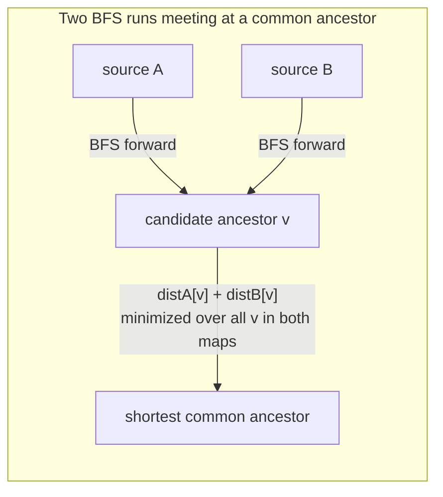

## Learning Objectives

- Implement breadth-first search over a directed acyclic graph (DAG), recording per-vertex distance from a single source.
- Implement the shortest common ancestor query: run BFS from each of two query vertices, and combine the two resulting distance maps into a single answer.
- Trace both BFS distance maps by hand on a concrete DAG, and identify the ancestor minimizing their sum.
- Distinguish "an ancestor" (any vertex reachable-from, in reverse, from both queries) from "the shortest common ancestor" (the one minimizing total combined distance) and construct a DAG where these are genuinely different vertices.
- Validate the implementation against an independently hand-traced example, including a case with more than one common ancestor.

## Context & Motivation

Breadth-first search — level-by-level exploration via a queue, and the distance-from-source guarantee that comes with it — was already covered in full in [Depth-First Search](../../../algorithms/content/graph-traversal-dfs/en.md)'s companion BFS material. This lab does not re-teach BFS. It builds a specific, real application of it directly on top of the DAG structure: Princeton's WordNet-style shortest common ancestor problem, where "ancestor" means a node reachable by following edges *backward* from both query vertices (in a hypernym DAG, "mammal" is a backward-reachable ancestor of both "cat" and "dog," since both point toward it through an is-a chain), and "shortest" means the one minimizing the *combined* path length from both queries, not merely the first ancestor found by either search alone.

## Core Theory

The algorithm needs nothing beyond two ordinary BFS runs and a linear scan. Run BFS from query vertex A over the DAG traversed in the ancestor direction (from each node, visit the nodes it points to as an "is-a" parent — i.e., follow edges forward if edges are drawn child→parent, which is the natural direction for a hypernym DAG), recording `distA[v]` for every reachable v. Run BFS from query vertex B the same way, recording `distB[v]`. Any vertex v present in *both* distance maps is a common ancestor; the **shortest common ancestor** is the v minimizing `distA[v] + distB[v]`. This is a direct generalization of Dijkstra-style thinking to two simultaneous sources with unit edge weights: BFS is exactly Dijkstra's algorithm specialized to a graph where every edge costs 1 (the priority queue degenerates to a plain FIFO queue, since every tentative distance increases by exactly 1 per level), so summing two independently-correct BFS distances and minimizing is safe precisely because each `distX[v]` is already a proven-correct shortest distance on its own.



Because the graph is acyclic, no vertex can be its own ancestor through a cycle back to itself, and BFS from a single source terminates cleanly with no risk of infinite re-visitation — the DAG property is what makes "distance to an ancestor" a well-defined, finite, unambiguous number for every reachable vertex, without needing cycle-detection bookkeeping layered on top of plain BFS.

## Worked Examples

### The DAG and the API

```python
from collections import deque

# hypernym-style DAG: edges point from a term to its immediate parent category (is-a)
dag = {
    'cat':          ['feline'],
    'dog':          ['canine'],
    'feline':       ['carnivore'],
    'canine':       ['carnivore'],
    'carnivore':    ['mammal'],
    'mammal':       ['animal'],
    'reptile':      ['animal'],
    'animal':       [],
}

def bfs_distances(dag, source):
    """Returns {vertex: distance} for every vertex reachable from source."""
    dist = {source: 0}
    queue = deque([source])
    while queue:
        u = queue.popleft()
        for v in dag.get(u, []):
            if v not in dist:
                dist[v] = dist[u] + 1
                queue.append(v)
    return dist

def shortest_common_ancestor(dag, a, b):
    """
    Returns (ancestor, total_distance) minimizing distA[v] + distB[v]
    over every v reachable (as an ancestor) from both a and b.
    Returns (None, None) if no common ancestor exists.
    """
    dist_a = bfs_distances(dag, a)
    dist_b = bfs_distances(dag, b)
    common = set(dist_a) & set(dist_b)
    if not common:
        return None, None
    best = min(common, key=lambda v: dist_a[v] + dist_b[v])
    return best, dist_a[best] + dist_b[best]
```

### Trace: cat and dog

**BFS from `cat`:** `dist_a = {cat: 0, feline: 1, carnivore: 2, mammal: 3, animal: 4}`.

**BFS from `dog`:** `dist_b = {dog: 0, canine: 1, carnivore: 2, mammal: 3, animal: 4}`.

**Common ancestors:** `{carnivore, mammal, animal}` — every vertex present in both maps.

**Combined distances:** `carnivore`: 2+2=4. `mammal`: 3+3=6. `animal`: 4+4=8.

**Result:** `shortest_common_ancestor(dag, 'cat', 'dog')` returns `('carnivore', 4)` — the minimum among 4, 6, 8. This matches intuition directly: `cat` and `dog` first meet in the hierarchy at `carnivore` (one step up from `feline`/`canine` each), and every ancestor further up (`mammal`, `animal`) is still a valid common ancestor but not the *shortest* one, since both queries have to travel farther to reach it.

### Trace: cat and reptile — the two notions genuinely diverge

**BFS from `cat`:** `dist_a = {cat: 0, feline: 1, carnivore: 2, mammal: 3, animal: 4}` (unchanged).

**BFS from `reptile`:** `dist_b = {reptile: 0, animal: 1}`.

**Common ancestors:** `{animal}` — the *only* vertex present in both maps; `carnivore` and `mammal` are ancestors of `cat` but not of `reptile`, so they are excluded entirely, not merely deprioritized.

**Result:** `('animal', 5)` — 4 (from cat) + 1 (from reptile). This example is worth tracing specifically because it shows "an ancestor" and "the shortest common ancestor" are not always resolved the same way a more familiar tree-lowest-common-ancestor intuition might suggest: here there is only one candidate at all, so the "shortest" one is also the only one — a case where the sum-minimization and the mere-existence questions happen to coincide, precisely because `cat`'s branch and `reptile`'s branch only reconnect at the very top of the hierarchy.

### Validating against a DAG with multiple genuine ancestor choices

```python
dag2 = {
    'X': ['P', 'Q'],
    'Y': ['P'],
    'P': ['R'],
    'Q': ['R'],
    'R': [],
}
# X's ancestors: P(1), Q(1), R(2)
# Y's ancestors: P(1), R(2)
# common: {P, R} -> P: 1+1=2, R: 2+2=4 -> shortest common ancestor is P, distance 2
assert shortest_common_ancestor(dag2, 'X', 'Y') == ('P', 2)
```

This case matters because `R` is *also* a common ancestor (both X and Y reach it), and a naive implementation that just returns "the first common vertex found by either BFS" rather than actually minimizing the combined sum could wrongly report `R` if it happened to be discovered first in some traversal order — the explicit `min(..., key=...)` step is what guarantees correctness here, not the mere existence of a shared vertex.

## Common Misconceptions & Pitfalls

- **"The shortest common ancestor is just the first vertex both BFS traversals happen to visit."** BFS visits vertices in order of distance from *its own* source only; there is no guarantee the first vertex appearing in both traversals (in wall-clock or insertion order) is the one minimizing the *combined* distance — Example with `dag2` above shows `R` is discovered by both searches, but `P` is the actual answer, found only by explicitly minimizing `dist_a[v] + dist_b[v]` over every shared vertex, not by watching for the first overlap.
- **"Any vertex reachable from both queries counts as *a* common ancestor, so the algorithm can stop as soon as it finds one."** Existence and optimality are different questions; the algorithm needs the *entire* distance map from both sources (or at least until confident no cheaper candidate remains) before it can identify which shared vertex actually minimizes the sum — stopping early risks returning a valid but non-shortest common ancestor.
- **"This only works because the graph has no cycles — a cyclic graph would need something more complicated."** BFS itself doesn't need the DAG property to terminate (a `dist` check against already-visited vertices prevents infinite loops in any graph, cyclic or not); what the DAG property actually buys here is a clean semantic story — "ancestor" straightforwardly means "reachable by following is-a edges upward," a notion that gets murkier and less useful once cycles are allowed, since a cycle would let a vertex be considered its own indirect ancestor.
- **"A vertex can only be a common ancestor if it's the *lowest* one in a tree-like sense, the way tree LCA works."** In `dag2`, `P` and `R` are both common ancestors of `X` and `Y`, and they are directly comparable here (`P → R` makes `R` an ancestor of `P` too) — but in a DAG with a wider structure, two common ancestors need not be comparable at all, sitting in genuinely incomparable branches with neither an ancestor of the other. "Shortest," defined by the combined-distance sum, is the only tiebreaker that produces a single well-defined answer in the general DAG case, unlike the single unique LCA a tree structurally guarantees.
- **"Running one BFS and checking membership in a `visited` set for the other query is equivalent to running two separate BFS traversals."** It is not — membership alone loses the distance information entirely, which is exactly what the minimization step needs; two independent `dist` maps, not two independent `visited` sets, are the actual requirement.

## Summary

The shortest common ancestor of two vertices in a DAG is found by running BFS from each query vertex independently, recording a full distance map for both, then selecting whichever vertex appears in both maps while minimizing the sum of the two distances — not merely the first shared vertex either search happens to encounter. Traced on a small hypernym DAG, `cat` and `dog` shared `carnivore` as their shortest common ancestor at combined distance 4, while `mammal` and `animal` remained valid but non-shortest common ancestors further up the hierarchy; `cat` and `reptile` had only one common ancestor at all (`animal`), and a separate constructed example (`dag2`) demonstrated a case where the minimization step is not optional — a differently-discovered but more expensive shared vertex (`R`) would have been wrongly returned without it.

## Documentation Links

- [Princeton algs4 Assignments Index](https://coursera.cs.princeton.edu/algs4/assignments/) — doc
- [Sedgewick & Wayne — Algorithms, 4th ed. Companion Site](https://algs4.cs.princeton.edu/home/) — doc
