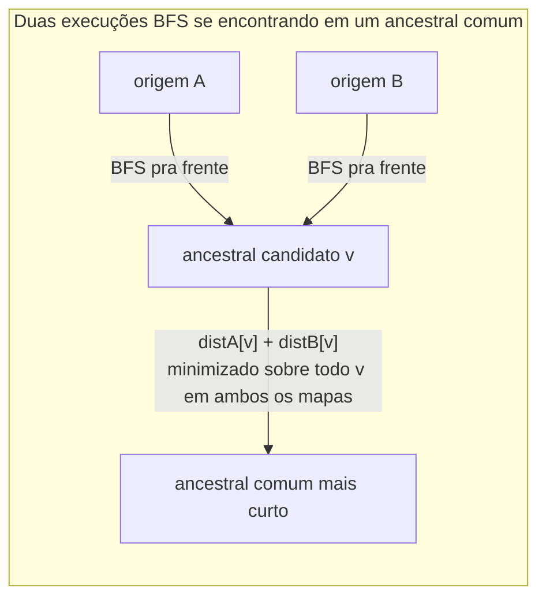

## Objetivos de Aprendizagem

- Implementar busca em largura sobre um grafo acíclico direcionado (DAG), registrando a distância por vértice a partir de uma única origem.
- Implementar a consulta de ancestral comum mais curto: rode BFS a partir de cada um de dois vértices de consulta, e combine os dois mapas de distância resultantes em uma única resposta.
- Rastrear ambos os mapas de distância BFS à mão em um DAG concreto, e identificar o ancestral que minimiza sua soma.
- Distinguir "um ancestral" (qualquer vértice alcançável-a-partir-de, em reverso, de ambas as consultas) de "o ancestral comum mais curto" (o que minimiza a distância combinada total) e construir um DAG onde esses são genuinamente vértices diferentes.
- Validar a implementação contra um exemplo rastreado à mão independentemente, incluindo um caso com mais de um ancestral comum.

## Contexto e Motivação

Busca em largura, exploração nível a nível via uma fila, e a garantia de distância-da-origem que vem com ela, já foi coberta por completo no material companheiro de BFS de [Busca em Profundidade](../../../algorithms/content/graph-traversal-dfs/pt-BR.md). Este laboratório não reensina BFS. Ele constrói uma aplicação específica, real, dela diretamente em cima da estrutura DAG: o problema de ancestral comum mais curto estilo WordNet de Princeton, onde "ancestral" significa um nó alcançável seguindo arestas *para trás* de ambos os vértices de consulta (em um DAG de hipônimos, "mamífero" é um ancestral alcançável-para-trás tanto de "gato" quanto de "cachorro", já que ambos apontam em direção a ele através de uma cadeia é-um), e "mais curto" significa aquele que minimiza o comprimento de caminho *combinado* de ambas as consultas, não meramente o primeiro ancestral encontrado por qualquer busca sozinha.

## Teoria Central

O algoritmo não precisa de nada além de duas execuções de BFS comuns e uma varredura linear. Rode BFS a partir do vértice de consulta A sobre o DAG percorrido na direção de ancestral (de cada nó, visite os nós para os quais ele aponta como um pai "é-um", ou seja, siga arestas para frente se arestas são desenhadas filho→pai, que é a direção natural para um DAG de hipônimos), registrando `distA[v]` para todo v alcançável. Rode BFS a partir do vértice de consulta B da mesma forma, registrando `distB[v]`. Qualquer vértice v presente em *ambos* os mapas de distância é um ancestral comum; o **ancestral comum mais curto** é o v que minimiza `distA[v] + distB[v]`. Esta é uma generalização direta do pensamento estilo-Dijkstra para duas origens simultâneas com pesos de aresta unitários: BFS é exatamente o algoritmo de Dijkstra especializado para um grafo onde toda aresta custa 1 (a fila de prioridade degenera para uma fila FIFO simples, já que toda distância tentativa aumenta em exatamente 1 por nível), então somar duas distâncias BFS independentemente corretas e minimizar é seguro precisamente porque cada `distX[v]` já é uma distância mais curta provadamente correta por si só.



Como o grafo é acíclico, nenhum vértice pode ser seu próprio ancestral através de um ciclo de volta a si mesmo, e BFS a partir de uma única origem termina de forma limpa sem risco de re-visitação infinita, a propriedade DAG é o que torna "distância até um ancestral" um número bem definido, finito, sem ambiguidade para todo vértice alcançável, sem precisar de contabilidade de detecção de ciclo empilhada em cima de BFS comum.

## Exemplos Resolvidos

### O DAG e a API

```python
from collections import deque

# DAG estilo hipônimo: arestas apontam de um termo para sua categoria pai imediata (é-um)
dag = {
    'cat':          ['feline'],
    'dog':          ['canine'],
    'feline':       ['carnivore'],
    'canine':       ['carnivore'],
    'carnivore':    ['mammal'],
    'mammal':       ['animal'],
    'reptile':      ['animal'],
    'animal':       [],
}

def bfs_distances(dag, source):
    """Retorna {vertex: distance} para todo vértice alcançável a partir de source."""
    dist = {source: 0}
    queue = deque([source])
    while queue:
        u = queue.popleft()
        for v in dag.get(u, []):
            if v not in dist:
                dist[v] = dist[u] + 1
                queue.append(v)
    return dist

def shortest_common_ancestor(dag, a, b):
    """
    Retorna (ancestor, total_distance) minimizando distA[v] + distB[v]
    sobre todo v alcançável (como um ancestral) tanto de a quanto de b.
    Retorna (None, None) se nenhum ancestral comum existir.
    """
    dist_a = bfs_distances(dag, a)
    dist_b = bfs_distances(dag, b)
    common = set(dist_a) & set(dist_b)
    if not common:
        return None, None
    best = min(common, key=lambda v: dist_a[v] + dist_b[v])
    return best, dist_a[best] + dist_b[best]
```

### Rastro: cat e dog

**BFS a partir de `cat`:** `dist_a = {cat: 0, feline: 1, carnivore: 2, mammal: 3, animal: 4}`.

**BFS a partir de `dog`:** `dist_b = {dog: 0, canine: 1, carnivore: 2, mammal: 3, animal: 4}`.

**Ancestrais comuns:** `{carnivore, mammal, animal}`, todo vértice presente em ambos os mapas.

**Distâncias combinadas:** `carnivore`: 2+2=4. `mammal`: 3+3=6. `animal`: 4+4=8.

**Resultado:** `shortest_common_ancestor(dag, 'cat', 'dog')` retorna `('carnivore', 4)`, o mínimo entre 4, 6, 8. Isso corresponde à intuição diretamente: `cat` e `dog` primeiro se encontram na hierarquia em `carnivore` (um passo acima de `feline`/`canine` cada), e todo ancestral mais acima (`mammal`, `animal`) ainda é um ancestral comum válido mas não o *mais curto*, já que ambas as consultas precisam viajar mais longe para alcançá-lo.

### Rastro: cat e reptile, as duas noções genuinamente divergem

**BFS a partir de `cat`:** `dist_a = {cat: 0, feline: 1, carnivore: 2, mammal: 3, animal: 4}` (inalterado).

**BFS a partir de `reptile`:** `dist_b = {reptile: 0, animal: 1}`.

**Ancestrais comuns:** `{animal}`, o *único* vértice presente em ambos os mapas; `carnivore` e `mammal` são ancestrais de `cat` mas não de `reptile`, então são excluídos por completo, não meramente despriorizados.

**Resultado:** `('animal', 5)`, 4 (de cat) + 1 (de reptile). Este exemplo vale a pena rastrear especificamente porque mostra que "um ancestral" e "o ancestral comum mais curto" nem sempre são resolvidos da mesma forma que uma intuição de ancestral-comum-mais-baixo-de-árvore mais familiar poderia sugerir: aqui só há um candidato de forma alguma, então o "mais curto" também é o único, um caso onde a minimização de soma e a pergunta de mera-existência acontecem de coincidir, precisamente porque o ramo de `cat` e o ramo de `reptile` só se reconectam bem no topo da hierarquia.

### Validando contra um DAG com múltiplas escolhas de ancestral genuínas

```python
dag2 = {
    'X': ['P', 'Q'],
    'Y': ['P'],
    'P': ['R'],
    'Q': ['R'],
    'R': [],
}
# ancestrais de X: P(1), Q(1), R(2)
# ancestrais de Y: P(1), R(2)
# comum: {P, R} -> P: 1+1=2, R: 2+2=4 -> ancestral comum mais curto é P, distância 2
assert shortest_common_ancestor(dag2, 'X', 'Y') == ('P', 2)
```

Este caso importa porque `R` *também* é um ancestral comum (tanto X quanto Y o alcançam), e uma implementação ingênua que só retorna "o primeiro vértice comum encontrado por qualquer BFS" em vez de de fato minimizar a soma combinada poderia erroneamente reportar `R` se ele acontecesse de ser descoberto primeiro em alguma ordem de travessia, o passo explícito `min(..., key=...)` é o que garante correção aqui, não a mera existência de um vértice compartilhado.

## Equívocos Comuns e Armadilhas

- **"O ancestral comum mais curto é só o primeiro vértice que ambas as travessias BFS acontecem de visitar."** BFS visita vértices em ordem de distância só da *sua própria* origem; não há nenhuma garantia de que o primeiro vértice aparecendo em ambas as travessias (em ordem de relógio de parede ou inserção) é o que minimiza a distância *combinada*, o exemplo com `dag2` acima mostra que `R` é descoberto por ambas as buscas, mas `P` é a resposta real, encontrada só minimizando explicitamente `dist_a[v] + dist_b[v]` sobre todo vértice compartilhado, não observando pela primeira sobreposição.
- **"Qualquer vértice alcançável de ambas as consultas conta como *um* ancestral comum, então o algoritmo pode parar assim que encontra um."** Existência e otimalidade são perguntas diferentes; o algoritmo precisa do mapa de distância *inteiro* de ambas as origens (ou ao menos até estar confiante de que nenhum candidato mais barato resta) antes de conseguir identificar qual vértice compartilhado de fato minimiza a soma, parar cedo arrisca retornar um ancestral comum válido mas não o mais curto.
- **"Isso só funciona porque o grafo não tem ciclos, um grafo cíclico precisaria de algo mais complicado."** A própria BFS não precisa da propriedade DAG para terminar (uma checagem `dist` contra vértices já visitados previne loops infinitos em qualquer grafo, cíclico ou não); o que a propriedade DAG de fato compra aqui é uma história semântica limpa, "ancestral" diretamente significa "alcançável seguindo arestas é-um para cima," uma noção que fica mais turva e menos útil uma vez que ciclos são permitidos, já que um ciclo deixaria um vértice ser considerado seu próprio ancestral indireto.
- **"Um vértice só pode ser um ancestral comum se é o *mais baixo* em um sentido estilo árvore, da forma que LCA de árvore funciona."** Em `dag2`, `P` e `R` são ambos ancestrais comuns de `X` e `Y`, e são diretamente comparáveis aqui (`P → R` faz `R` um ancestral de `P` também), mas em um DAG com uma estrutura mais ampla, dois ancestrais comuns não precisam ser comparáveis de forma alguma, sentados em ramos genuinamente incomparáveis sem que nenhum seja ancestral do outro. "Mais curto," definido pela soma de distância combinada, é o único desempate que produz uma única resposta bem definida no caso DAG geral, diferente do único LCA único que uma árvore estruturalmente garante.
- **"Rodar uma BFS e checar associação em um conjunto `visited` para a outra consulta é equivalente a rodar duas travessias BFS separadas."** Não é, associação sozinha perde a informação de distância por completo, que é exatamente o que o passo de minimização precisa; dois mapas `dist` independentes, não dois conjuntos `visited` independentes, são o requisito real.

## Resumo

O ancestral comum mais curto de dois vértices em um DAG é encontrado rodando BFS a partir de cada vértice de consulta independentemente, registrando um mapa de distância completo para ambos, depois selecionando qual vértice aparece em ambos os mapas enquanto minimiza a soma das duas distâncias, não meramente o primeiro vértice compartilhado que qualquer busca acontece de encontrar. Rastreado em um pequeno DAG de hipônimos, `cat` e `dog` compartilharam `carnivore` como seu ancestral comum mais curto na distância combinada 4, enquanto `mammal` e `animal` permaneceram ancestrais comuns válidos mas não mais curtos mais acima na hierarquia; `cat` e `reptile` tiveram só um ancestral comum de forma alguma (`animal`), e um exemplo construído separado (`dag2`) demonstrou um caso onde o passo de minimização não é opcional, um vértice compartilhado descoberto de forma diferente mas mais caro (`R`) teria sido erroneamente retornado sem ele.

## Documentation Links

- [Princeton algs4 Assignments Index](https://coursera.cs.princeton.edu/algs4/assignments/) — doc
- [Sedgewick & Wayne — Algorithms, 4th ed. Companion Site](https://algs4.cs.princeton.edu/home/) — doc
