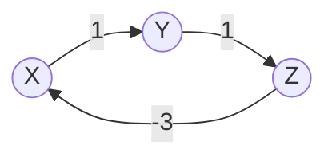

## Learning Objectives

- Implement the Bellman-Ford algorithm: relax every edge in the graph, V−1 times total, in any fixed order.
- Prove that V−1 rounds of relaxing every edge are always sufficient to compute correct shortest distances, provided no negative-weight cycle is reachable from the source.
- Explain why a Vth round that still finds an improvement proves a negative-weight cycle exists, and why fewer than V rounds cannot detect this.
- Trace the algorithm by hand on a graph with a negative edge, confirming it produces the correct distances where Dijkstra's algorithm was shown to fail.
- Trace the algorithm on a second graph containing a negative-weight cycle, and identify the round at which the detection check fires.

## Context & Motivation

Dijkstra's algorithm's correctness proof leaned on one specific structural guarantee: once a vertex is finalized, no later relaxation could possibly find a cheaper route into it, because every remaining edge weight was assumed non-negative. The worked counterexample in that topic showed exactly how this guarantee collapses the moment a single negative edge is introduced — a vertex can be finalized too early, based on a tentative distance that a not-yet-explored negative edge would have undercut. Dijkstra's algorithm has no way to recover from this: it structurally never reconsiders a finalized vertex, so once the wrong distance is locked in, it stays wrong.

The Bellman-Ford algorithm is the direct answer to this failure, and its fix is almost aggressively simple: give up on the greedy "always pick the closest vertex next" strategy entirely, and instead relax *every* edge in the graph, repeatedly, enough times that it no longer matters what order they were relaxed in or which vertex looked closest at any intermediate point. This costs real speed — O(VE) instead of Dijkstra's O((V+E) log V) — but buys back correctness even in the presence of negative edges, and adds a capability Dijkstra's algorithm cannot offer at all: the ability to detect a negative-weight cycle, a structure that makes "shortest path" stop being a meaningful question altogether (a path could loop around such a cycle indefinitely, decreasing its total cost every time, so no finite shortest path exists).

## Core Theory

### The algorithm: relax every edge, V−1 times

Initialize `dist[source] = 0`, `dist[v] = ∞` for every other vertex. Then perform V−1 rounds (where V is the number of vertices): in each round, relax every edge in the graph, in any fixed order. After V−1 rounds, every `dist[v]` is guaranteed correct, *provided* the graph contains no negative-weight cycle reachable from the source. A final, Vth round can then be run purely as a check: if any edge still relaxes successfully (finds an improvement) during this extra round, a negative-weight cycle exists somewhere reachable from the source (and reaching into whatever vertex was just improved).

```python
def bellman_ford(vertices, edges, source):
    # edges: list of (u, v, weight) triples
    dist = {v: float('inf') for v in vertices}
    parent = {v: None for v in vertices}
    dist[source] = 0

    for _ in range(len(vertices) - 1):
        for u, v, weight in edges:
            if dist[u] + weight < dist[v]:
                dist[v] = dist[u] + weight
                parent[v] = u

    # Vth round: detect a negative-weight cycle
    for u, v, weight in edges:
        if dist[u] + weight < dist[v]:
            return None, None, True   # negative cycle detected

    return dist, parent, False
```

### Theorem: V−1 rounds always suffice, absent a negative cycle

**Claim.** If no negative-weight cycle is reachable from the source, then after V−1 rounds of relaxing every edge, `dist[v]` equals the true shortest-path distance from the source to v, for every vertex v.

**Proof.** Any shortest path (with no negative cycle reachable from the source, some shortest path is guaranteed to exist and to be *simple* — no repeated vertices, since a repeated vertex would mean the path traverses a cycle, and traversing a non-negative cycle could only be removed without increasing cost, while traversing a negative cycle would mean no finite shortest path exists at all, contradicting the assumption). A simple path in a graph with V vertices has at most V−1 edges (it visits at most V distinct vertices, hence at most V−1 edges between consecutive ones). Consider any shortest path to v, s = v₀, v₁, …, v_k = v, with k ≤ V−1 edges. **Claim, by induction on i:** after round i, `dist[v_i]` is at most the true shortest distance to v_i along this path. Base case (i=0): `dist[v₀] = dist[source] = 0`, correct before any round even runs. Inductive step: assume after round i, `dist[v_i]` already equals (or is at most) the correct value. Round i+1 relaxes every edge, including specifically (v_i, v_{i+1}) — so after round i+1, `dist[v_{i+1}] ≤ dist[v_i] + weight(v_i, v_{i+1})`, which by the inductive hypothesis is at most the true shortest distance to v_{i+1} along this path. So after round k (and k ≤ V−1, so definitely after V−1 rounds, since extra rounds can only leave an already-correct value unchanged or lower — but it's already at its true minimum, so no lower value is possible), `dist[v_k] = dist[v]` has reached its true shortest-path value. Since this argument applies to the shortest path to *every* vertex v, all distances are correct after V−1 rounds. ∎

### Why the Vth round proves a negative cycle exists

If no negative-weight cycle is reachable from the source, the theorem above guarantees every `dist[v]` is already exactly correct after V−1 rounds — and a value already at its true minimum can never be improved by relaxing any edge again (relaxation only ever lowers a distance to match some real path's cost, and no real path can beat the true minimum). So if a Vth round of relaxing every edge *still* finds some edge (u, v) that improves `dist[v]`, the V−1-round guarantee must have failed to hold — meaning the assumption it depended on (no reachable negative-weight cycle) must be false. A negative-weight cycle reachable from the source exists, and is precisely what keeps offering an ever-cheaper route into whichever vertex the Vth round catches improving. Fewer than V rounds cannot serve as this check: nothing rules out a legitimate (non-cyclic) shortest path needing exactly V−1 rounds to fully propagate, so an improvement in round V−1 itself is expected and not evidence of a cycle — only an improvement in a round *beyond* the V−1 that any simple path could ever require is conclusive.



The cycle X→Y→Z→X has total weight 1 + 1 + (−3) = −1, a negative-weight cycle — traversing it repeatedly decreases total cost without bound, so no finite shortest path from X back to X (or through this cycle to anywhere reachable from it) exists.

## Worked Examples

### Example 1 — correctly handling a negative edge that broke Dijkstra

**Problem:** Run Bellman-Ford on A→C (2), A→B (3), B→C (−2) — the exact graph where Dijkstra's algorithm was shown to produce the wrong answer, `dist[C] = 2`, when the true shortest distance is 1.

V = 3, so V−1 = 2 rounds. Edge list, fixed order: A→C(2), A→B(3), B→C(−2).

**Round 1.** `dist = {A: 0, B: ∞, C: ∞}`. Relax A→C(2): `0+2=2 < ∞` — `dist[C] = 2`. Relax A→B(3): `0+3=3 < ∞` — `dist[B] = 3`. Relax B→C(−2): `3+(−2)=1 < 2` (current `dist[C]`) — update `dist[C] = 1`. After round 1: `dist = {A: 0, B: 3, C: 1}`.

**Round 2.** Relax A→C(2): `0+2=2`, not `< 1` — no change. Relax A→B(3): `0+3=3`, not `< 3` — no change. Relax B→C(−2): `3+(−2)=1`, not `< 1` — no change. Nothing improved in round 2 (the values had already converged after round 1, and round 2 confirms this — no further work needed, though the algorithm doesn't know this in advance and must still run all V−1 rounds in general).

**Result:** `dist = {A: 0, B: 3, C: 1}` — `dist[C] = 1`, the correct shortest distance, via A→B→C, exactly where Dijkstra's algorithm reported the wrong value 2. Bellman-Ford's brute-force "relax everything, repeatedly" strategy sidesteps the early-finalization mistake entirely, since it never commits to any vertex's distance as final until every round has run.

### Example 2 — detecting a negative-weight cycle

**Problem:** Run Bellman-Ford, source X, on the graph X→Y (1), Y→Z (1), Z→X (−3), and show the Vth round detects the negative cycle.

V = 3, so V−1 = 2 rounds, then a 3rd (Vth) round as the check. Edge list order: X→Y(1), Y→Z(1), Z→X(−3).

**Round 1.** `dist = {X: 0, Y: ∞, Z: ∞}`. Relax X→Y(1): `dist[Y] = 1`. Relax Y→Z(1): `dist[Z] = 1+1=2`. Relax Z→X(−3): `2+(−3)=−1 < 0` — update `dist[X] = −1`. After round 1: `{X: −1, Y: 1, Z: 2}`.

**Round 2.** Relax X→Y(1): `−1+1=0 < 1` — update `dist[Y] = 0`. Relax Y→Z(1): `0+1=1 < 2` — update `dist[Z] = 1`. Relax Z→X(−3): `1+(−3)=−2 < −1` — update `dist[X] = −2`. After round 2: `{X: −2, Y: 0, Z: 1}`. Notice distances are *still dropping* every round.

**Round 3 (the Vth round — the check).** Relax X→Y(1): `−2+1=−1 < 0` — **still improves.** This is exactly the signal: an improvement found in a round beyond V−1 proves a negative-weight cycle is reachable from the source.

**Conclusion.** The algorithm reports a negative-weight cycle, correctly — X→Y→Z→X has total weight 1+1−3 = −1 < 0, and the ever-decreasing `dist[X]` across rounds (0 → −1 → −2 → still improving) directly reflects that going around this cycle one more time always finds a cheaper "path," which is precisely why no finite shortest-path distance can exist for these vertices.

## Common Misconceptions & Pitfalls

- **"If nothing improves in some round before round V−1, the algorithm can just stop early — running the remaining rounds is wasted work."** This is actually a valid and common optimization (Example 1 illustrates it — round 2 changed nothing, so a real implementation could safely stop there) — but it must specifically be "no edge improved in this entire round," checked freshly, not just an assumption; the algorithm cannot skip rounds without actually checking, since there's no way to know in advance which round will be the last one that finds an improvement.
- **"Only V−1 rounds are needed, full stop — the extra round is optional bookkeeping."** The extra Vth round is what makes negative-cycle *detection* possible at all — without it, the algorithm would simply report whatever (incorrect) values happened to result after V−1 rounds on a graph with a negative cycle, with no way to distinguish "these are the correct final answers" from "these are still-changing intermediate values on a graph where no correct final answer exists."
- **"An improvement found in round V−1 itself proves a negative cycle."** It does not — a legitimate simple shortest path can have up to V−1 edges, and fully propagating its distance can legitimately require exactly V−1 rounds (this is the content of the correctness theorem itself). Only an improvement found in a round *after* V−1 — the dedicated Vth check round — is conclusive evidence of a cycle, since no simple (cycle-free) path could possibly need more than V−1 rounds to converge.
- **"Bellman-Ford is strictly better than Dijkstra's algorithm, since it handles more cases."** It handles negative edges and detects negative cycles that Dijkstra's algorithm cannot, but at real cost: O(VE) versus O((V+E) log V) — for a large, sparse, non-negative-weight graph (the common case in practice), Dijkstra's algorithm is meaningfully faster, and the extra generality Bellman-Ford buys is only worth paying for when negative weights are actually possible in the problem being modeled.

## Summary

Bellman-Ford trades Dijkstra's speed for robustness: instead of greedily finalizing the closest vertex and never reconsidering it, it relaxes every edge in the graph, V−1 times over, guaranteeing every distance converges to its true value regardless of relaxation order — a guarantee that follows directly from the fact that any shortest path, being simple, has at most V−1 edges, and each round of relaxing every edge propagates one more edge's worth of a correct distance along any such path. This costs O(VE), slower than Dijkstra's O((V+E) log V), but it works correctly even with negative edge weights, as the corrected A→B→C example shows directly. A further, Vth round of relaxation, run purely as a check, detects a negative-weight cycle reachable from the source: since V−1 rounds are provably sufficient absent such a cycle, any improvement found beyond that point is conclusive proof one exists — exactly the structure the X→Y→Z→X example demonstrates, with distances still dropping in the round beyond V−1.

## Documentation Links

- [MIT 6.006 — Lecture Notes (OCW)](https://ocw.mit.edu/courses/6-006-introduction-to-algorithms-spring-2020/pages/lecture-notes/) — doc
- [Sedgewick & Wayne — Algorithms Lectures (Princeton)](https://algs4.cs.princeton.edu/lectures/) — doc
