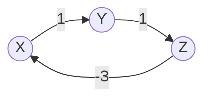

## Objetivos de Aprendizagem

- Implementar o algoritmo de Bellman-Ford: relaxe toda aresta no grafo, V−1 vezes no total, em qualquer ordem fixa.
- Provar que V−1 rodadas de relaxar toda aresta são sempre suficientes para calcular distâncias mais curtas corretas, desde que nenhum ciclo de peso negativo seja alcançável a partir da fonte.
- Explicar por que uma V-ésima rodada que ainda encontra uma melhoria prova que existe um ciclo de peso negativo, e por que menos de V rodadas não conseguem detectar isso.
- Rastrear o algoritmo manualmente em um grafo com uma aresta negativa, confirmando que produz as distâncias corretas onde o algoritmo de Dijkstra foi mostrado falhar.
- Rastrear o algoritmo em um segundo grafo contendo um ciclo de peso negativo, e identificar a rodada em que a verificação de detecção dispara.

## Contexto e Motivação

A prova de correção do algoritmo de Dijkstra se apoiou em uma garantia estrutural específica: uma vez que um vértice é finalizado, nenhum relaxamento posterior poderia possivelmente encontrar uma rota mais barata para dentro dele, porque todo peso de aresta restante era assumido não negativo. O contraexemplo resolvido naquele tópico mostrou exatamente como essa garantia desmorona no momento em que uma única aresta negativa é introduzida, um vértice pode ser finalizado cedo demais, baseado em uma distância tentativa que uma aresta negativa ainda não explorada teria superado. O algoritmo de Dijkstra não tem como se recuperar disso: estruturalmente nunca reconsidera um vértice finalizado, então uma vez que a distância errada é travada, permanece errada.

O algoritmo de Bellman-Ford é a resposta direta a essa falha, e seu conserto é quase agressivamente simples: abandone a estratégia gulosa "sempre escolha o vértice mais próximo em seguida" inteiramente, e em vez disso relaxe *toda* aresta no grafo, repetidamente, o suficiente para que não importe mais em que ordem foram relaxadas ou qual vértice parecia mais próximo em qualquer ponto intermediário. Isso custa velocidade real, O(VE) em vez do O((V+E) log V) de Dijkstra, mas recompra correção mesmo na presença de arestas negativas, e adiciona uma capacidade que o algoritmo de Dijkstra não pode oferecer de forma alguma: a capacidade de detectar um ciclo de peso negativo, uma estrutura que faz "caminho mais curto" parar de ser uma pergunta significativa de forma alguma (um caminho poderia dar voltas em torno de tal ciclo indefinidamente, diminuindo seu custo total toda vez, então nenhum caminho mais curto finito existe).

## Teoria Central

### O algoritmo: relaxe toda aresta, V−1 vezes

Inicialize `dist[fonte] = 0`, `dist[v] = ∞` para todo outro vértice. Depois realize V−1 rodadas (onde V é o número de vértices): em cada rodada, relaxe toda aresta no grafo, em qualquer ordem fixa. Depois de V−1 rodadas, todo `dist[v]` é garantido correto, *desde que* o grafo não contenha nenhum ciclo de peso negativo alcançável a partir da fonte. Uma rodada final, V-ésima, pode então ser rodada puramente como uma verificação: se qualquer aresta ainda relaxa com sucesso (encontra uma melhoria) durante essa rodada extra, um ciclo de peso negativo existe em algum lugar alcançável a partir da fonte (e alcançando dentro de qualquer vértice que acabou de ser melhorado).

```python
def bellman_ford(vertices, edges, source):
    # edges: lista de triplas (u, v, peso)
    dist = {v: float('inf') for v in vertices}
    parent = {v: None for v in vertices}
    dist[source] = 0

    for _ in range(len(vertices) - 1):
        for u, v, weight in edges:
            if dist[u] + weight < dist[v]:
                dist[v] = dist[u] + weight
                parent[v] = u

    # V-ésima rodada: detecta um ciclo de peso negativo
    for u, v, weight in edges:
        if dist[u] + weight < dist[v]:
            return None, None, True   # ciclo negativo detectado

    return dist, parent, False
```

### Teorema: V−1 rodadas sempre bastam, na ausência de um ciclo negativo

**Afirmação.** Se nenhum ciclo de peso negativo é alcançável a partir da fonte, então depois de V−1 rodadas de relaxar toda aresta, `dist[v]` é igual à distância verdadeira de caminho mais curto da fonte até v, para todo vértice v.

**Prova.** Qualquer caminho mais curto (com nenhum ciclo negativo alcançável a partir da fonte, algum caminho mais curto é garantido existir e ser *simples*, sem vértices repetidos, já que um vértice repetido significaria que o caminho atravessa um ciclo, e atravessar um ciclo não negativo só poderia ser removido sem aumentar custo, enquanto atravessar um ciclo negativo significaria que nenhum caminho mais curto finito existe de forma alguma, contradizendo a suposição). Um caminho simples em um grafo com V vértices tem no máximo V−1 arestas (visita no máximo V vértices distintos, portanto no máximo V−1 arestas entre consecutivos). Considere qualquer caminho mais curto até v, s = v₀, v₁, …, v_k = v, com k ≤ V−1 arestas. **Afirmação, por indução em i:** depois da rodada i, `dist[v_i]` é no máximo a distância verdadeira mais curta até v_i ao longo desse caminho. Caso base (i=0): `dist[v₀] = dist[fonte] = 0`, correto antes mesmo de qualquer rodada rodar. Passo indutivo: assuma que depois da rodada i, `dist[v_i]` já é igual a (ou no máximo) o valor correto. A rodada i+1 relaxa toda aresta, incluindo especificamente (v_i, v_{i+1}), então depois da rodada i+1, `dist[v_{i+1}] ≤ dist[v_i] + peso(v_i, v_{i+1})`, que pela hipótese indutiva é no máximo a distância verdadeira mais curta até v_{i+1} ao longo desse caminho. Então depois da rodada k (e k ≤ V−1, então definitivamente depois de V−1 rodadas, já que rodadas extras só podem deixar um valor já correto inalterado ou diminuí-lo, mas já está em seu mínimo verdadeiro, então nenhum valor menor é possível), `dist[v_k] = dist[v]` alcançou seu valor verdadeiro de caminho mais curto. Já que esse argumento se aplica ao caminho mais curto de *todo* vértice v, todas as distâncias estão corretas depois de V−1 rodadas. ∎

### Por que a V-ésima rodada prova que um ciclo negativo existe

Se nenhum ciclo de peso negativo é alcançável a partir da fonte, o teorema acima garante que todo `dist[v]` já está exatamente correto depois de V−1 rodadas, e um valor já em seu mínimo verdadeiro nunca pode ser melhorado relaxando qualquer aresta de novo (relaxamento só jamais abaixa uma distância para combinar com o custo de algum caminho real, e nenhum caminho real pode vencer o mínimo verdadeiro). Então se uma V-ésima rodada de relaxar toda aresta *ainda* encontra alguma aresta (u, v) que melhora `dist[v]`, a garantia de V−1 rodadas deve ter falhado em valer, significando que a suposição da qual dependia (nenhum ciclo de peso negativo alcançável) deve ser falsa. Um ciclo de peso negativo alcançável a partir da fonte existe, e é precisamente o que continua oferecendo uma rota cada vez mais barata para dentro de qualquer vértice que a V-ésima rodada pega melhorando. Menos de V rodadas não podem servir como essa verificação: nada elimina um caminho mais curto legítimo (não cíclico) precisando de exatamente V−1 rodadas para se propagar completamente, então uma melhoria na própria rodada V−1 é esperada e não é evidência de um ciclo, só uma melhoria em uma rodada *além* das V−1 que qualquer caminho simples poderia jamais exigir é conclusiva.



O ciclo X→Y→Z→X tem peso total 1 + 1 + (−3) = −1, um ciclo de peso negativo, atravessá-lo repetidamente diminui o custo total sem limite, então nenhum caminho mais curto finito de X de volta a X (ou através desse ciclo até qualquer lugar alcançável a partir dele) existe.

## Exemplos Resolvidos

### Exemplo 1 — lidando corretamente com uma aresta negativa que quebrou Dijkstra

**Problema:** Rode Bellman-Ford em A→C (2), A→B (3), B→C (−2), o grafo exato onde o algoritmo de Dijkstra foi mostrado produzir a resposta errada, `dist[C] = 2`, quando a distância verdadeira mais curta é 1.

V = 3, então V−1 = 2 rodadas. Lista de arestas, ordem fixa: A→C(2), A→B(3), B→C(−2).

**Rodada 1.** `dist = {A: 0, B: ∞, C: ∞}`. Relaxa A→C(2): `0+2=2 < ∞`, `dist[C] = 2`. Relaxa A→B(3): `0+3=3 < ∞`, `dist[B] = 3`. Relaxa B→C(−2): `3+(−2)=1 < 2` (`dist[C]` atual), atualiza `dist[C] = 1`. Depois da rodada 1: `dist = {A: 0, B: 3, C: 1}`.

**Rodada 2.** Relaxa A→C(2): `0+2=2`, não `< 1`, sem mudança. Relaxa A→B(3): `0+3=3`, não `< 3`, sem mudança. Relaxa B→C(−2): `3+(−2)=1`, não `< 1`, sem mudança. Nada melhorou na rodada 2 (os valores já haviam convergido depois da rodada 1, e a rodada 2 confirma isso, nenhum trabalho adicional necessário, embora o algoritmo não saiba disso antecipadamente e deva ainda rodar todas as V−1 rodadas em geral).

**Resultado:** `dist = {A: 0, B: 3, C: 1}`, `dist[C] = 1`, a distância mais curta correta, via A→B→C, exatamente onde o algoritmo de Dijkstra relatou o valor errado 2. A estratégia de força bruta de Bellman-Ford, "relaxe tudo, repetidamente," contorna inteiramente o erro de finalização precoce, já que nunca se compromete com a distância de nenhum vértice como final até que toda rodada tenha rodado.

### Exemplo 2 — detectando um ciclo de peso negativo

**Problema:** Rode Bellman-Ford, fonte X, no grafo X→Y (1), Y→Z (1), Z→X (−3), e mostre que a V-ésima rodada detecta o ciclo negativo.

V = 3, então V−1 = 2 rodadas, depois uma 3ª (V-ésima) rodada como verificação. Ordem da lista de arestas: X→Y(1), Y→Z(1), Z→X(−3).

**Rodada 1.** `dist = {X: 0, Y: ∞, Z: ∞}`. Relaxa X→Y(1): `dist[Y] = 1`. Relaxa Y→Z(1): `dist[Z] = 1+1=2`. Relaxa Z→X(−3): `2+(−3)=−1 < 0`, atualiza `dist[X] = −1`. Depois da rodada 1: `{X: −1, Y: 1, Z: 2}`.

**Rodada 2.** Relaxa X→Y(1): `−1+1=0 < 1`, atualiza `dist[Y] = 0`. Relaxa Y→Z(1): `0+1=1 < 2`, atualiza `dist[Z] = 1`. Relaxa Z→X(−3): `1+(−3)=−2 < −1`, atualiza `dist[X] = −2`. Depois da rodada 2: `{X: −2, Y: 0, Z: 1}`. Note que as distâncias *ainda estão caindo* toda rodada.

**Rodada 3 (a V-ésima rodada, a verificação).** Relaxa X→Y(1): `−2+1=−1 < 0`, **ainda melhora.** Esse é exatamente o sinal: uma melhoria encontrada em uma rodada além de V−1 prova que um ciclo de peso negativo é alcançável a partir da fonte.

**Conclusão.** O algoritmo relata um ciclo de peso negativo, corretamente, X→Y→Z→X tem peso total 1+1−3 = −1 < 0, e o `dist[X]` sempre decrescente através das rodadas (0 → −1 → −2 → ainda melhorando) reflete diretamente que dar mais uma volta nesse ciclo sempre encontra um "caminho" mais barato, que é precisamente por que nenhuma distância finita de caminho mais curto pode existir para esses vértices.

## Equívocos Comuns e Armadilhas

- **"Se nada melhora em alguma rodada antes da rodada V−1, o algoritmo pode simplesmente parar cedo, rodar as rodadas restantes é trabalho desperdiçado."** Isso na verdade é uma otimização válida e comum (o Exemplo 1 a ilustra, a rodada 2 não mudou nada, então uma implementação real poderia parar ali com segurança), mas deve ser especificamente "nenhuma aresta melhorou nessa rodada inteira," verificado de fato, não apenas uma suposição; o algoritmo não pode pular rodadas sem de fato verificar, já que não há como saber antecipadamente qual rodada será a última que encontra uma melhoria.
- **"Só V−1 rodadas são necessárias, ponto final, a rodada extra é contabilidade opcional."** A V-ésima rodada extra é o que torna a *detecção* de ciclo negativo possível de forma alguma, sem ela, o algoritmo simplesmente relataria quaisquer valores (incorretos) que resultassem depois de V−1 rodadas em um grafo com um ciclo negativo, sem forma de distinguir "essas são as respostas finais corretas" de "esses ainda são valores intermediários mudando em um grafo onde nenhuma resposta final correta existe."
- **"Uma melhoria encontrada na própria rodada V−1 prova um ciclo negativo."** Não prova, um caminho mais curto simples legítimo pode ter até V−1 arestas, e propagar completamente sua distância pode legitimamente exigir exatamente V−1 rodadas (isso é o conteúdo do próprio teorema de correção). Só uma melhoria encontrada em uma rodada *depois* de V−1, a rodada de verificação dedicada V-ésima, é evidência conclusiva de um ciclo, já que nenhum caminho simples (sem ciclo) poderia possivelmente precisar de mais que V−1 rodadas para convergir.
- **"Bellman-Ford é estritamente melhor que o algoritmo de Dijkstra, já que lida com mais casos."** Lida com arestas negativas e detecta ciclos negativos que o algoritmo de Dijkstra não pode, mas a um custo real: O(VE) versus O((V+E) log V), para um grafo grande, esparso, de peso não negativo (o caso comum na prática), o algoritmo de Dijkstra é significativamente mais rápido, e a generalidade extra que Bellman-Ford compra só vale a pena pagar quando pesos negativos são de fato possíveis no problema sendo modelado.

## Resumo

Bellman-Ford troca a velocidade de Dijkstra por robustez: em vez de finalizar gulosamente o vértice mais próximo e nunca reconsiderá-lo, relaxa toda aresta no grafo, V−1 vezes, garantindo que toda distância converge para seu valor verdadeiro independentemente da ordem de relaxamento, uma garantia que decorre diretamente do fato de que qualquer caminho mais curto, sendo simples, tem no máximo V−1 arestas, e cada rodada de relaxar toda aresta propaga mais uma aresta de uma distância correta ao longo de qualquer tal caminho. Isso custa O(VE), mais lento que o O((V+E) log V) de Dijkstra, mas funciona corretamente mesmo com pesos de aresta negativos, como o exemplo corrigido A→B→C mostra diretamente. Uma rodada adicional, V-ésima, de relaxamento, rodada puramente como verificação, detecta um ciclo de peso negativo alcançável a partir da fonte: já que V−1 rodadas são comprovadamente suficientes na ausência de tal ciclo, qualquer melhoria encontrada além desse ponto é prova conclusiva de que um existe, exatamente a estrutura que o exemplo X→Y→Z→X demonstra, com distâncias ainda caindo na rodada além de V−1.

## Documentation Links

- [MIT 6.006 — Lecture Notes (OCW)](https://ocw.mit.edu/courses/6-006-introduction-to-algorithms-spring-2020/pages/lecture-notes/) — doc
- [Sedgewick & Wayne — Algorithms Lectures (Princeton)](https://algs4.cs.princeton.edu/lectures/) — doc
