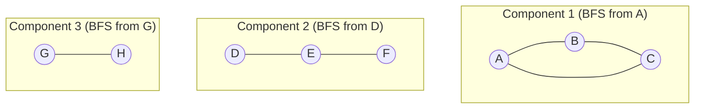

## Learning Objectives

- Define a connected component of an undirected graph, and explain why "reachable from" is an equivalence relation that partitions the vertex set.
- Implement a connected-components routine by running BFS from every not-yet-visited vertex, in turn, over the whole vertex set.
- Prove that each BFS run in this process discovers exactly one connected component — no more, no less.
- Trace the algorithm by hand on a graph with several disconnected pieces, labeling each vertex with the component index that discovers it.
- State the running time of the whole procedure, O(V + E), and explain why looping over all vertices does not change this bound.

## Context & Motivation

Breadth-first search, as covered so far, was always run from a single, given source vertex, and its guarantee — level-by-level exploration, shortest paths in edge count — was implicitly scoped to whatever part of the graph that source can actually reach. Nothing so far has addressed the graph as a whole when it isn't fully connected: a social network with several isolated friend groups that never interact, a set of course prerequisites where some subjects have no path to others, a road network with an island unreachable by the roads under consideration. Real graphs are very often not connected, and the very first question to ask of such a graph — "how many separate pieces does this split into, and which vertices belong to which piece?" — turns out to have an almost embarrassingly direct answer once BFS is already in hand.

The payoff here is a genuine "aha": nothing new needs to be invented. Running BFS once from an arbitrary vertex discovers precisely the set of vertices reachable from it — and if any vertices remain undiscovered afterward, they are, by definition, unreachable from the first source, meaning they belong to an entirely separate piece of the graph. Running BFS again, from any one of those leftover vertices, discovers that next piece in its entirety, and so on until every vertex has been visited by some run. This "run BFS from every vertex not yet claimed" pattern is one of the most reused techniques in graph algorithms — the same idea (repeat a single-source routine from every unvisited vertex to cover a disconnected graph) reappears verbatim with DFS in the next topic, and is the standard way any single-source graph algorithm gets extended to handle a graph that isn't fully connected.

## Core Theory

### Connected components, formally

For an undirected graph G = (V, E), define a relation on V: u ~ v if there is a path between u and v (or u = v). This relation is an equivalence relation — reflexive (a vertex reaches itself via the trivial zero-edge path), symmetric (a path traversed in reverse is still a valid path, since edges in an undirected graph have no direction), and transitive (concatenating a path from u to v with a path from v to w gives a walk from u to w, and any walk contains a path between its endpoints, by dropping repeated vertices). Because it is an equivalence relation, ~ partitions V into disjoint equivalence classes; each class is called a **connected component** of G. A graph is connected, in the sense covered previously, exactly when it has a single connected component containing all of V.

### The algorithm: BFS from every unvisited vertex

Maintain one shared `visited` set across the entire procedure. Iterate over every vertex v in the graph, in any fixed order (typically just the order vertices are listed); whenever v has not yet been visited, it must be the first vertex encountered from some new component, so start a fresh BFS from v, assign the current component index to every vertex that BFS visits, and increment the component counter. Continue the outer loop; vertices already claimed by an earlier BFS run are skipped.

```python
from collections import deque

def connected_components(adj, vertices):
    visited = set()
    component_of = {}
    num_components = 0

    for start in vertices:
        if start in visited:
            continue  # already claimed by an earlier BFS run
        # a fresh, unvisited vertex — begin a new component
        num_components += 1
        visited.add(start)
        component_of[start] = num_components
        queue = deque([start])
        while queue:
            u = queue.popleft()
            for v in adj[u]:
                if v not in visited:
                    visited.add(v)
                    component_of[v] = num_components
                    queue.append(v)

    return component_of, num_components
```

### Theorem: each BFS run discovers exactly one component, completely

**Claim.** When the outer loop starts a fresh BFS from an unvisited vertex s, that BFS run visits every vertex in s's connected component, and no vertex outside it.

**Proof.** *No vertex outside s's component is visited:* BFS only ever discovers a vertex by following an edge from an already-discovered vertex, so every vertex BFS visits is reachable from s by some path built one edge at a time — i.e., every visited vertex is, by definition, in the same equivalence class (component) as s. *Every vertex inside s's component is visited:* suppose, for contradiction, some vertex w is in s's component (so some path s = v₀, v₁, …, v_k = w exists) but is never visited by this BFS run. Let i be the smallest index such that v_i is not visited (i ≥ 1, since v₀ = s is visited by construction). Then v_{i-1} was visited, and v_i is one of v_{i-1}'s neighbors — but BFS visits every unvisited neighbor of every vertex it dequeues, so when v_{i-1} is dequeued, v_i would be visited at that point, contradicting the choice of i. So no such w exists — every vertex in s's component is visited. Combining both directions: the set of vertices visited by this BFS run is *exactly* s's connected component. ∎

This is exactly the same core argument used to justify BFS's correctness at all (that it visits every reachable vertex, and only reachable vertices) — the connected-components use case doesn't require any new proof technique, only the observation that "reachable from s" and "s's connected component" are the same set when the graph is undirected.



### Running time: still O(V + E)

The outer `for` loop visits every vertex exactly once as a loop iteration (whether it triggers a new BFS run or is skipped as already visited), contributing Θ(V). Across *all* the BFS runs combined, every vertex is enqueued in exactly one of them (since `visited` is shared and never reset between runs), and every vertex's adjacency list is scanned exactly once, in whichever run visits it — so the total work spent inside every BFS call, summed over all calls, is still Θ(V) for enqueue/dequeue operations plus Θ(E) for the combined neighbor scans, exactly as for a single BFS run on a connected graph. Looping over unvisited vertices to launch new BFS runs adds no extra asymptotic cost; it is a constant amount of bookkeeping per vertex layered on top of work that BFS was already going to do exactly once per vertex and edge, component boundaries notwithstanding.

## Worked Examples

### Example 1 — a graph with three disconnected pieces

**Problem:** Find the connected components of the undirected graph:

```python
adj = {
    'A': ['B', 'C'], 'B': ['A', 'C'], 'C': ['A', 'B'],
    'D': ['E'], 'E': ['D', 'F'], 'F': ['E'],
    'G': ['H'], 'H': ['G'],
}
vertices = ['A', 'B', 'C', 'D', 'E', 'F', 'G', 'H']
```

**Trace.** Outer loop reaches A first; A is unvisited, so start component 1: BFS from A visits A, then its neighbors B, C (both unvisited); B and C's neighbors are all already visited. Component 1 = {A, B, C}, and `visited` now includes exactly these three.

Outer loop continues: B, C are already visited, skip both. Reaches D; unvisited, start component 2: BFS from D visits D, then neighbor E (unvisited); E's neighbors are D (visited) and F (unvisited) — visit F; F's only neighbor E is visited. Component 2 = {D, E, F}.

Outer loop continues: E, F already visited, skip. Reaches G; unvisited, start component 3: BFS from G visits G, then neighbor H; H's only neighbor G is visited. Component 3 = {G, H}.

Outer loop reaches H; already visited, skip. Loop ends (all 8 vertices processed).

**Result:** 3 connected components — {A, B, C} (a triangle), {D, E, F} (a path), {G, H} (a single edge) — and every vertex has been assigned to exactly one of them, matching the partition guaranteed by the equivalence-relation argument.

### Example 2 — component count as a quick structural check

**Problem:** Given the same graph, without listing the components explicitly, how many BFS runs does the algorithm perform, and what does that number mean?

**Solution.** The algorithm performs exactly one BFS run per connected component — three runs here, matching `num_components = 3` returned by the function. This count is itself a useful, cheaply computed structural fact: for instance, in a network-reliability setting, the number of connected components of a graph after some edges are removed (say, to model failed links) directly answers "into how many mutually unreachable groups has the network split?" — a single BFS-based pass over all vertices answers this in O(V + E), without needing to test reachability between every pair of vertices individually (which would cost far more).

## Common Misconceptions & Pitfalls

- **"Running BFS from every vertex, one at a time, is needed to find all components."** Only unvisited vertices need to trigger a fresh BFS run — a vertex already claimed by an earlier run is guaranteed (by the theorem above) to already be in some already-discovered component, so re-running BFS from it would only rediscover vertices already accounted for, wasting time without changing the answer. The `visited` set shared across the whole procedure is what prevents this redundant work.
- **"The component count depends on which vertex you start BFS from."** The starting vertex of the very first BFS run affects *which* component gets labeled "1," but not how many components exist in total, nor which vertices end up grouped together — the partition into components is a property of the graph itself (via the reachability equivalence relation), entirely independent of traversal order or starting choice.
- **"This technique only applies to undirected graphs."** The equivalence-relation argument relies specifically on symmetry (u reaches v implies v reaches u), which holds for undirected graphs but not directed ones in general — a directed graph's analogous notion is *strongly connected components*, which requires a different (though related) algorithm, since directed reachability is not automatically symmetric.
- **"A vertex with no edges at all can't be part of any component."** An isolated vertex (degree 0) is still its own connected component, of size 1 — the outer loop reaches it, finds it unvisited, and BFS from it discovers only itself before the queue empties immediately. Forgetting to count size-1 components is a common off-by-some-count error when tallying components by hand.

## Summary

A connected component is an equivalence class under the "there is a path between them" relation, and this relation genuinely partitions an undirected graph's vertices — every vertex belongs to exactly one component. Repeatedly running BFS from every not-yet-visited vertex, in any fixed order, discovers these components one at a time: each BFS run visits precisely the vertices reachable from its starting vertex, which is precisely that vertex's connected component, by the same reachability argument that already justified BFS's correctness on a connected graph. The whole procedure still runs in O(V + E), since the shared `visited` set guarantees every vertex is enqueued exactly once and every edge examined at most twice, across all the BFS runs combined — looping over unvisited vertices adds no new asymptotic cost. The same "repeat a single-source traversal from every unvisited vertex" pattern reappears with DFS next, as the general technique for handling any graph that isn't fully connected.

## Documentation Links

- [Sedgewick & Wayne — Algorithms Lectures (Princeton)](https://algs4.cs.princeton.edu/lectures/) — doc
- [MIT 6.006 — Lecture Notes (OCW)](https://ocw.mit.edu/courses/6-006-introduction-to-algorithms-spring-2020/pages/lecture-notes/) — doc
