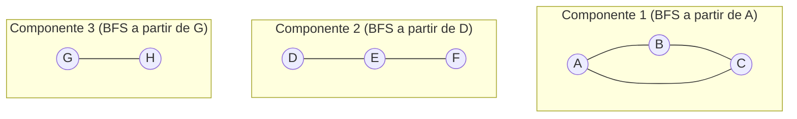

## Objetivos de Aprendizagem

- Definir um componente conexo de um grafo não direcionado, e explicar por que "alcançável a partir de" é uma relação de equivalência que particiona o conjunto de vértices.
- Implementar uma rotina de componentes conexos rodando BFS a partir de todo vértice ainda não visitado, por sua vez, sobre o conjunto de vértices inteiro.
- Provar que cada execução de BFS neste processo descobre exatamente um componente conexo, nem mais nem menos.
- Rastrear o algoritmo manualmente em um grafo com várias peças desconectadas, rotulando cada vértice com o índice do componente que o descobre.
- Enunciar o tempo de execução do procedimento inteiro, O(V + E), e explicar por que fazer laço sobre todos os vértices não muda esse limite.

## Contexto e Motivação

Busca em largura, como coberta até agora, sempre foi rodada a partir de um único vértice fonte dado, e sua garantia, exploração nível-por-nível, caminhos mais curtos em contagem de arestas, foi implicitamente restrita a qualquer parte do grafo que aquela fonte pode de fato alcançar. Nada até agora abordou o grafo como um todo quando não está completamente conexo: uma rede social com vários grupos de amigos isolados que nunca interagem, um conjunto de pré-requisitos de curso onde algumas disciplinas não têm caminho para outras, uma rede de estradas com uma ilha inalcançável pelas estradas em consideração. Grafos reais são muito frequentemente não conexos, e a primeiríssima pergunta a fazer de tal grafo, "em quantas peças separadas isso se divide, e quais vértices pertencem a qual peça?", acaba tendo uma resposta quase embaraçosamente direta uma vez que BFS já está à mão.

O ganho aqui é um genuíno "aha": nada novo precisa ser inventado. Rodar BFS uma vez a partir de um vértice arbitrário descobre precisamente o conjunto de vértices alcançáveis a partir dele, e se algum vértice permanece não descoberto depois, é, por definição, inalcançável a partir da primeira fonte, significando que pertence a uma peça inteiramente separada do grafo. Rodar BFS de novo, a partir de qualquer um daqueles vértices restantes, descobre a próxima peça em sua totalidade, e assim por diante até que todo vértice tenha sido visitado por alguma execução. Este padrão "rode BFS a partir de todo vértice ainda não reivindicado" é uma das técnicas mais reutilizadas em algoritmos de grafo, a mesma ideia (repita uma rotina de fonte única a partir de todo vértice ainda não visitado para cobrir um grafo desconexo) reaparece palavra por palavra com DFS no próximo tópico, e é a forma padrão pela qual qualquer algoritmo de grafo de fonte única é estendido para lidar com um grafo que não é completamente conexo.

## Teoria Central

### Componentes conexos, formalmente

Para um grafo não direcionado G = (V, E), defina uma relação em V: u ~ v se existe um caminho entre u e v (ou u = v). Essa relação é uma relação de equivalência, reflexiva (um vértice alcança a si mesmo via o caminho trivial de zero arestas), simétrica (um caminho percorrido ao contrário ainda é um caminho válido, já que arestas em um grafo não direcionado não têm direção), e transitiva (concatenar um caminho de u a v com um caminho de v a w dá um passeio de u a w, e todo passeio contém um caminho entre seus extremos, descartando vértices repetidos). Porque é uma relação de equivalência, ~ particiona V em classes de equivalência disjuntas; cada classe é chamada de **componente conexo** de G. Um grafo é conexo, no sentido coberto anteriormente, exatamente quando tem um único componente conexo contendo todo V.

### O algoritmo: BFS a partir de todo vértice não visitado

Mantenha um único conjunto `visited` compartilhado através do procedimento inteiro. Itere sobre todo vértice v no grafo, em qualquer ordem fixa (tipicamente apenas a ordem em que vértices são listados); sempre que v ainda não foi visitado, deve ser o primeiro vértice encontrado de algum novo componente, então comece um BFS fresco a partir de v, atribua o índice de componente atual a todo vértice que BFS visita, e incremente o contador de componente. Continue o laço externo; vértices já reivindicados por uma execução de BFS anterior são pulados.

```python
from collections import deque

def connected_components(adj, vertices):
    visited = set()
    component_of = {}
    num_components = 0

    for start in vertices:
        if start in visited:
            continue  # já reivindicado por uma execução BFS anterior
        # um vértice novo, não visitado — começa um novo componente
        num_components += 1
        visited.add(start)
        component_of[start] = num_components
        queue = deque([start])
        while queue:
            u = queue.popleft()
            for v in adj[u]:
                if v not in visited:
                    visited.add(v)
                    component_of[v] = num_components
                    queue.append(v)

    return component_of, num_components
```

### Teorema: cada execução de BFS descobre exatamente um componente, completamente

**Afirmação.** Quando o laço externo começa um BFS fresco a partir de um vértice não visitado s, aquela execução de BFS visita todo vértice no componente conexo de s, e nenhum vértice fora dele.

**Prova.** *Nenhum vértice fora do componente de s é visitado:* BFS só jamais descobre um vértice seguindo uma aresta a partir de um vértice já descoberto, então todo vértice que BFS visita é alcançável a partir de s por algum caminho construído uma aresta de cada vez, ou seja, todo vértice visitado está, por definição, na mesma classe de equivalência (componente) que s. *Todo vértice dentro do componente de s é visitado:* suponha, por contradição, que algum vértice w está no componente de s (então algum caminho s = v₀, v₁, …, v_k = w existe) mas nunca é visitado por essa execução de BFS. Seja i o menor índice tal que v_i não é visitado (i ≥ 1, já que v₀ = s é visitado por construção). Então v_{i-1} foi visitado, e v_i é um dos vizinhos de v_{i-1}, mas BFS visita todo vizinho não visitado de todo vértice que desenfileira, então quando v_{i-1} é desenfileirado, v_i seria visitado naquele ponto, contradizendo a escolha de i. Então tal w não existe, todo vértice no componente de s é visitado. Combinando ambas as direções: o conjunto de vértices visitados por essa execução de BFS é *exatamente* o componente conexo de s. ∎

Este é exatamente o mesmo argumento central usado para justificar a correção de BFS afinal (que visita todo vértice alcançável, e só vértices alcançáveis), o caso de uso de componentes conexos não exige nenhuma nova técnica de prova, apenas a observação de que "alcançável a partir de s" e "o componente conexo de s" são o mesmo conjunto quando o grafo é não direcionado.



### Tempo de execução: ainda O(V + E)

O laço `for` externo visita todo vértice exatamente uma vez como uma iteração de laço (seja disparando uma nova execução de BFS ou sendo pulado como já visitado), contribuindo Θ(V). Através de *todas* as execuções de BFS combinadas, todo vértice é enfileirado em exatamente uma delas (já que `visited` é compartilhado e nunca reiniciado entre execuções), e a lista de adjacência de todo vértice é varrida exatamente uma vez, em qualquer execução que o visite, então o trabalho total gasto dentro de toda chamada de BFS, somado sobre todas as chamadas, ainda é Θ(V) para operações de enfileirar/desenfileirar mais Θ(E) para as varreduras de vizinhos combinadas, exatamente como para uma única execução de BFS em um grafo conexo. Fazer laço sobre vértices não visitados para lançar novas execuções de BFS não adiciona custo assintótico extra; é uma quantidade constante de contabilidade por vértice sobreposta a um trabalho que BFS já ia fazer exatamente uma vez por vértice e aresta, fronteiras de componente à parte.

## Exemplos Resolvidos

### Exemplo 1 — um grafo com três peças desconectadas

**Problema:** Encontre os componentes conexos do grafo não direcionado:

```python
adj = {
    'A': ['B', 'C'], 'B': ['A', 'C'], 'C': ['A', 'B'],
    'D': ['E'], 'E': ['D', 'F'], 'F': ['E'],
    'G': ['H'], 'H': ['G'],
}
vertices = ['A', 'B', 'C', 'D', 'E', 'F', 'G', 'H']
```

**Rastreamento.** O laço externo alcança A primeiro; A não visitado, então começa componente 1: BFS a partir de A visita A, depois seus vizinhos B, C (ambos não visitados); os vizinhos de B e C já estão todos visitados. Componente 1 = {A, B, C}, e `visited` agora inclui exatamente esses três.

O laço externo continua: B, C já visitados, pula ambos. Alcança D; não visitado, começa componente 2: BFS a partir de D visita D, depois vizinho E (não visitado); os vizinhos de E são D (visitado) e F (não visitado), visita F; o único vizinho de F, E, está visitado. Componente 2 = {D, E, F}.

O laço externo continua: E, F já visitados, pula. Alcança G; não visitado, começa componente 3: BFS a partir de G visita G, depois vizinho H; o único vizinho de H, G, está visitado. Componente 3 = {G, H}.

O laço externo alcança H; já visitado, pula. O laço termina (todos os 8 vértices processados).

**Resultado:** 3 componentes conexos, {A, B, C} (um triângulo), {D, E, F} (um caminho), {G, H} (uma única aresta), e todo vértice foi atribuído a exatamente um deles, combinando com a partição garantida pelo argumento da relação de equivalência.

### Exemplo 2 — contagem de componente como uma verificação estrutural rápida

**Problema:** Dado o mesmo grafo, sem listar os componentes explicitamente, quantas execuções de BFS o algoritmo realiza, e o que esse número significa?

**Solução.** O algoritmo realiza exatamente uma execução de BFS por componente conexo, três execuções aqui, combinando com `num_components = 3` retornado pela função. Essa contagem é ela própria um fato estrutural útil, calculado de forma barata: por exemplo, em um cenário de confiabilidade de rede, o número de componentes conexos de um grafo depois que algumas arestas são removidas (digamos, para modelar links falhos) responde diretamente "em quantos grupos mutuamente inalcançáveis a rede se dividiu?", uma única passagem baseada em BFS sobre todos os vértices responde isso em O(V + E), sem precisar testar alcançabilidade entre todo par de vértices individualmente (o que custaria muito mais).

## Equívocos Comuns e Armadilhas

- **"Rodar BFS a partir de todo vértice, um de cada vez, é necessário para encontrar todos os componentes."** Só vértices não visitados precisam disparar uma execução de BFS fresca, um vértice já reivindicado por uma execução anterior é garantido (pelo teorema acima) por já estar em algum componente já descoberto, então rodar BFS de novo a partir dele só redescobriria vértices já contabilizados, desperdiçando tempo sem mudar a resposta. O conjunto `visited` compartilhado através do procedimento inteiro é o que previne esse trabalho redundante.
- **"A contagem de componente depende de qual vértice você começa BFS."** O vértice inicial da primeiríssima execução de BFS afeta *qual* componente é rotulado "1", mas não quantos componentes existem no total, nem quais vértices acabam agrupados juntos, a partição em componentes é uma propriedade do próprio grafo (via a relação de equivalência de alcançabilidade), inteiramente independente da ordem de travessia ou escolha inicial.
- **"Essa técnica só se aplica a grafos não direcionados."** O argumento da relação de equivalência depende especificamente de simetria (u alcança v implica v alcança u), que vale para grafos não direcionados mas não direcionados em geral, a noção análoga de um grafo direcionado é *componentes fortemente conexos*, que exige um algoritmo diferente (embora relacionado), já que alcançabilidade direcionada não é automaticamente simétrica.
- **"Um vértice sem nenhuma aresta não pode fazer parte de nenhum componente."** Um vértice isolado (grau 0) ainda é seu próprio componente conexo, de tamanho 1, o laço externo o alcança, o encontra não visitado, e BFS a partir dele descobre apenas a si mesmo antes que a fila esvazie imediatamente. Esquecer de contar componentes de tamanho 1 é um erro comum de contagem fora-por-alguns ao apurar componentes manualmente.

## Resumo

Um componente conexo é uma classe de equivalência sob a relação "existe um caminho entre eles", e essa relação genuinamente particiona os vértices de um grafo não direcionado, todo vértice pertence a exatamente um componente. Rodar BFS repetidamente a partir de todo vértice ainda não visitado, em qualquer ordem fixa, descobre esses componentes um de cada vez: cada execução de BFS visita precisamente os vértices alcançáveis a partir de seu vértice inicial, que é precisamente o componente conexo daquele vértice, pelo mesmo argumento de alcançabilidade que já justificou a correção de BFS em um grafo conexo. O procedimento inteiro ainda roda em O(V + E), já que o conjunto `visited` compartilhado garante que todo vértice é enfileirado exatamente uma vez e toda aresta examinada no máximo duas vezes, através de todas as execuções de BFS combinadas, fazer laço sobre vértices não visitados não adiciona nenhum custo assintótico novo. O mesmo padrão "repita uma travessia de fonte única a partir de todo vértice não visitado" reaparece com DFS em seguida, como a técnica geral para lidar com qualquer grafo que não é completamente conexo.

## Documentation Links

- [Sedgewick & Wayne — Algorithms Lectures (Princeton)](https://algs4.cs.princeton.edu/lectures/) — doc
- [MIT 6.006 — Lecture Notes (OCW)](https://ocw.mit.edu/courses/6-006-introduction-to-algorithms-spring-2020/pages/lecture-notes/) — doc
