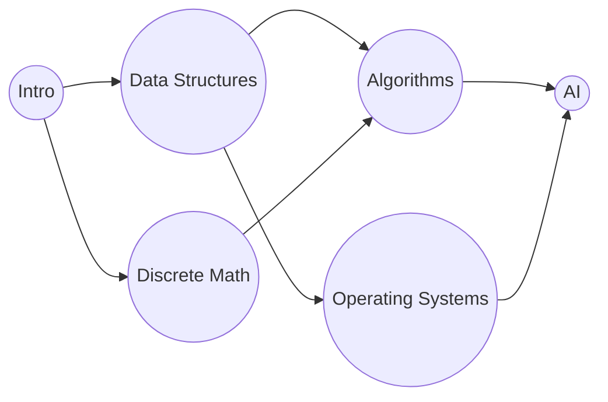

## Learning Objectives

- Classify the edges DFS encounters on a directed graph into tree edges and back edges, and state which classification indicates a cycle.
- Prove that a directed graph contains a cycle if and only if DFS encounters a back edge (an edge to an ancestor still on the recursion stack).
- Produce a topological sort of a directed acyclic graph (DAG) by running DFS to completion and reversing the order of finish times.
- Prove that reverse-finish-time order is a valid topological order for any DAG.
- Trace both procedures by hand: cycle detection on a small directed graph with a cycle, and topological sort on a small DAG of task dependencies.

## Context & Motivation

The discovery and finish timestamps DFS tracks were introduced in the previous topic as bookkeeping whose payoff would come later — this is that payoff. On a *directed* graph specifically, the nesting structure of these intervals turns out to encode exactly the information needed to answer two questions that come up constantly when a graph represents dependencies: does this dependency structure contain a cycle (an impossible circular requirement, like course A needing course B which needs course A), and, if not, in what order can every item be processed so that every dependency is satisfied before the item that needs it?

Both questions matter well beyond a toy example. Build systems must detect circular dependencies between compilation units before attempting to compile anything. Spreadsheet software must detect a cell that circularly refers to itself through a chain of formulas. Course catalogs, task schedulers, and package managers all need a valid order to process a set of items whose dependencies form a DAG. What makes DFS the right tool for both is a single unifying fact about the recursion stack: a back edge — an edge from the vertex currently being explored to some ancestor still active on the stack — exists if and only if the graph has a cycle, and, in the cycle-free case, the very same traversal that would have found a back edge instead produces, for free, a valid processing order once its finish times are read in reverse.

## Core Theory

### Classifying edges during a directed DFS

When DFS explores a directed graph, every edge (u, v) examined during the traversal falls into one of a few categories, determined by the state of v when the edge is examined:

- **Tree edge:** v is undiscovered when (u, v) is examined — DFS recurses into v, and (u, v) becomes an edge of the DFS tree.
- **Back edge:** v is already discovered *and currently on the recursion stack* (an ancestor of u in the DFS tree, still mid-recursion) — this is exactly the case that indicates a cycle: the path down the tree from v to u, followed by the edge (u, v) back up to v, traces out a cycle.
- **Forward or cross edge:** v is already discovered and *already finished* — v is not an ancestor of u, so no cycle is indicated; this edge just connects to an already-fully-explored part of the graph (a descendant already finished, or an unrelated subtree).

Tracking which vertices are currently "on the stack" (discovered but not yet finished) is what lets DFS distinguish a back edge (cycle) from a forward/cross edge (no cycle) — both connect to an already-visited vertex, but only a back edge connects to one still active in the current call chain.

```python
def has_cycle(adj, vertices):
    WHITE, GRAY, BLACK = 0, 1, 2   # undiscovered, on stack, finished
    color = {v: WHITE for v in vertices}

    def visit(u):
        color[u] = GRAY
        for v in adj[u]:
            if color[v] == GRAY:
                return True         # back edge: v is an ancestor still on the stack
            if color[v] == WHITE and visit(v):
                return True
        color[u] = BLACK
        return False

    return any(color[v] == WHITE and visit(v) for v in vertices)
```

### Theorem: a directed graph has a cycle if and only if DFS finds a back edge

**If DFS finds a back edge, the graph has a cycle:** a back edge (u, v) means v is an ancestor of u on the DFS tree — so there is a tree path from v down to u, and the edge (u, v) closes it into a cycle v → … → u → v.

**If the graph has a cycle, DFS finds a back edge:** let C = v₀ → v₁ → … → v_{k-1} → v₀ be a cycle, and let v_i be the vertex of C with the *earliest* discovery time among all of C's vertices (some vertex must be discovered first). When v_i is discovered, every other vertex of C is still undiscovered (by the choice of v_i as earliest). Following the cycle around from v_i — v_i → v_{i+1} → … → v_{i-1} → v_i — every one of these edges is examined while v_i is still on the stack (v_i cannot finish until every vertex reachable through its tree descendants, which by induction along the cycle includes every other vertex of C, has itself finished first — because each is discovered only through a path of tree edges originating at v_i). So by the time DFS is ready to examine the final edge of the cycle, v_{i-1} → v_i, vertex v_i is still gray (on the stack) — this edge is a back edge. ∎

### Topological sort: reverse finish-time order

A **topological sort** of a DAG is an ordering of its vertices such that for every directed edge (u, v), u appears before v in the ordering — every dependency is listed before whatever depends on it. Given a DAG (already confirmed cycle-free by the check above), running DFS to completion over every vertex and then listing vertices in *decreasing* order of finish time produces a valid topological sort.

```python
def topological_sort(adj, vertices):
    visited = set()
    finish_order = []

    def visit(u):
        visited.add(u)
        for v in adj[u]:
            if v not in visited:
                visit(v)
        finish_order.append(u)   # append on finish

    for v in vertices:
        if v not in visited:
            visit(v)

    return list(reversed(finish_order))
```

**Why this works.** Take any edge (u, v) in the DAG. Two cases when (u, v) is examined during DFS: either v is undiscovered, in which case v becomes a descendant of u and must finish *before* u does (a call cannot return before every recursive call it made has returned) — so f(v) < f(u); or v is already discovered. Since the graph is a DAG, (u, v) cannot be a back edge (that would create a cycle, by the theorem above, contradicting acyclicity) — so v must already be finished or still being explored on some already-completed branch, and in either remaining case (forward or cross edge) v was discovered, and necessarily finished, entirely before u's own exploration of that edge could register it as anything but "already black" — meaning f(v) < f(u) here too. In every case, f(v) < f(u) for every edge (u, v) in a DAG. So listing vertices in *decreasing* finish-time order always places u before v whenever (u, v) is an edge — exactly the topological-sort requirement.



## Worked Examples

### Example 1 — detecting a cycle via a back edge

**Problem:** Does the directed graph with edges X→Y, Y→Z, Z→X contain a cycle? Trace DFS from X to confirm.

**Trace.** `visit(X)`: color[X] = GRAY. Neighbor Y is WHITE, recurse. `visit(Y)`: color[Y] = GRAY. Neighbor Z is WHITE, recurse. `visit(Z)`: color[Z] = GRAY. Neighbor X is examined — color[X] is GRAY (X is still on the stack, mid-recursion, as an ancestor of Z). **Back edge found: (Z, X).**

**Conclusion.** A back edge exists, so by the theorem, the graph has a cycle — indeed X → Y → Z → X traces it out directly, exactly the cycle the back edge (Z, X) closes.

### Example 2 — topological sort of a course-prerequisite DAG

**Problem:** Using the graph above (Intro=A, Data Structures=B, Discrete Math=C, Algorithms=D, Operating Systems=E, AI=F; edges A→B, A→C, B→D, B→E, C→D, D→F, E→F), find a valid topological order via DFS finish times, starting DFS from A and visiting neighbors in list order (adj: A→[B,C], B→[D,E], C→[D], D→[F], E→[F], F→[]).

**Trace.** `visit(A)`: d=1. First neighbor B. `visit(B)`: d=2. First neighbor D. `visit(D)`: d=3. Neighbor F. `visit(F)`: d=4, no neighbors, finish F: f=5. Back in D: no more neighbors, finish D: f=6. Back in B: next neighbor E. `visit(E)`: d=7. Neighbor F, already visited (finished, not an ancestor — forward/cross edge, no cycle). No unvisited neighbors, finish E: f=8. Back in B: no more neighbors, finish B: f=9. Back in A: next neighbor C. `visit(C)`: d=10. Neighbor D, already visited (finished — cross edge). No unvisited neighbors, finish C: f=11. Back in A: no more neighbors, finish A: f=12.

**Finish times:** F=5, D=6, E=8, B=9, C=11, A=12.

**Topological order (decreasing finish time):** A, C, B, E, D, F.

**Verification.** Check every edge points forward in this order (positions: A=1, C=2, B=3, E=4, D=5, F=6): A→B (1<3 ✓), A→C (1<2 ✓), B→D (3<5 ✓), B→E (3<4 ✓), C→D (2<5 ✓), D→F (5<6 ✓), E→F (4<6 ✓). Every edge satisfied — Intro, Discrete Math, Data Structures, Operating Systems, Algorithms, AI is one valid order to take these courses. It is not the *only* valid order (a different DFS starting vertex or neighbor ordering could produce a different, equally valid, topological sort of the same DAG) — the algorithm guarantees *a* correct order, not a unique one.

## Common Misconceptions & Pitfalls

- **"Any edge to an already-visited vertex indicates a cycle."** Only a back edge does — an edge to a vertex that is already visited *and finished* (a forward or cross edge) does not indicate a cycle, since that vertex is not an ancestor of the current one; Example 2's edges E→F and C→D both hit an already-visited vertex without creating a cycle, precisely because F and D were already finished (off the stack) by the time those edges were examined.
- **"Topological sort works on any directed graph."** It is only meaningful for a DAG — if a cycle exists, no valid topological order can exist at all (some vertex in the cycle would need to appear both before and after another vertex in the same cycle), which is exactly why cycle detection is checked first, or built into the same pass, before trusting a topological-sort result.
- **"Finish-time order itself (not reversed) is the topological order."** It is exactly backwards: a vertex finishes *after* everything reachable from it has finished, so the vertex with the largest finish time is a "source" with no unprocessed dependencies among what it points to, and belongs first, not last, in the topological order — using finish-time order directly, without reversing, produces the *reverse* of a valid topological sort.
- **"Topological sort is unique for a given DAG."** Example 2's result, A-C-B-E-D-F, is only one of several valid orders (swapping the relative position of B and C is also valid, since neither depends on the other) — a DAG has a unique topological order only in the special case where every vertex has a total order forced by the edges (a Hamiltonian path through the DAG); in general, DFS produces one valid order among possibly many.

## Summary

Directed DFS classifies every edge it examines by the state of its target vertex, and the one classification that matters most is the back edge — an edge to an ancestor still active on the recursion stack — which exists if and only if the graph contains a cycle, since a back edge closes a chain of tree edges back into a cycle, and any cycle is guaranteed to produce a back edge when its earliest-discovered vertex is still gray. When no back edge is found (the graph is a DAG), the very same traversal's finish times, read in decreasing order, produce a valid topological sort: every edge (u, v) in a DAG satisfies f(v) < f(u), so listing vertices from largest to smallest finish time always places every dependency before whatever needs it. Both results come from the same single DFS pass, at no extra asymptotic cost — still O(V + E) — and together they set up the entire next cluster of topics: shortest paths on a DAG, covered later, will rely on exactly this topological order.

## Documentation Links

- [Sedgewick & Wayne — Algorithms Lectures (Princeton)](https://algs4.cs.princeton.edu/lectures/) — doc
- [MIT 6.006 — Lecture Notes (OCW)](https://ocw.mit.edu/courses/6-006-introduction-to-algorithms-spring-2020/pages/lecture-notes/) — doc
