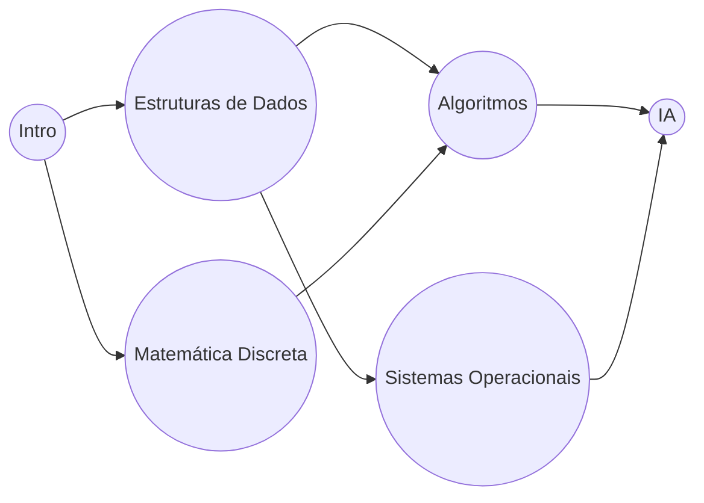

## Objetivos de Aprendizagem

- Classificar as arestas que DFS encontra em um grafo direcionado em arestas de árvore e arestas de retorno, e enunciar qual classificação indica um ciclo.
- Provar que um grafo direcionado contém um ciclo se e somente se DFS encontra uma aresta de retorno (uma aresta para um ancestral ainda na pilha de recursão).
- Produzir uma ordenação topológica de um grafo acíclico direcionado (DAG) rodando DFS até completar e invertendo a ordem dos tempos de término.
- Provar que a ordem de tempo-de-término-invertida é uma ordem topológica válida para qualquer DAG.
- Rastrear ambos os procedimentos manualmente: detecção de ciclo em um pequeno grafo direcionado com um ciclo, e ordenação topológica em um pequeno DAG de dependências de tarefa.

## Contexto e Motivação

Os timestamps de descoberta e término que DFS rastreia foram introduzidos no tópico anterior como contabilidade cujo ganho viria depois, este é aquele ganho. Em um grafo *direcionado* especificamente, a estrutura de aninhamento desses intervalos acaba codificando exatamente a informação necessária para responder duas perguntas que aparecem constantemente quando um grafo representa dependências: essa estrutura de dependência contém um ciclo (um requisito circular impossível, como o curso A precisando do curso B que precisa do curso A), e, se não, em que ordem todo item pode ser processado de forma que toda dependência seja satisfeita antes do item que precisa dela?

Ambas as perguntas importam muito além de um exemplo de brinquedo. Sistemas de build devem detectar dependências circulares entre unidades de compilação antes de tentar compilar qualquer coisa. Software de planilha deve detectar uma célula que se refere circularmente a si mesma através de uma cadeia de fórmulas. Catálogos de curso, agendadores de tarefa, e gerenciadores de pacote todos precisam de uma ordem válida para processar um conjunto de itens cujas dependências formam um DAG. O que torna DFS a ferramenta certa para ambas é um único fato unificador sobre a pilha de recursão: uma aresta de retorno, uma aresta do vértice atualmente sendo explorado para algum ancestral ainda ativo na pilha, existe se e somente se o grafo tem um ciclo, e, no caso sem ciclo, a mesmíssima travessia que teria encontrado uma aresta de retorno em vez disso produz, de graça, uma ordem de processamento válida uma vez que seus tempos de término são lidos ao contrário.

## Teoria Central

### Classificando arestas durante um DFS direcionado

Quando DFS explora um grafo direcionado, toda aresta (u, v) examinada durante a travessia cai em uma de algumas categorias, determinada pelo estado de v quando a aresta é examinada:

- **Aresta de árvore:** v não está descoberto quando (u, v) é examinada, DFS recursa em v, e (u, v) se torna uma aresta da árvore DFS.
- **Aresta de retorno:** v já está descoberto e *atualmente na pilha de recursão* (um ancestral de u na árvore DFS, ainda em meio à recursão), este é exatamente o caso que indica um ciclo: o caminho descendo a árvore de v até u, seguido pela aresta (u, v) de volta a v, traça um ciclo.
- **Aresta de avanço ou cruzada:** v já está descoberto e *já terminado*, v não é um ancestral de u, então nenhum ciclo é indicado; essa aresta apenas se conecta a uma parte já completamente explorada do grafo (um descendente já terminado, ou uma subárvore não relacionada).

Rastrear quais vértices estão atualmente "na pilha" (descobertos mas ainda não terminados) é o que permite DFS distinguir uma aresta de retorno (ciclo) de uma aresta de avanço/cruzada (sem ciclo), ambas se conectam a um vértice já visitado, mas só uma aresta de retorno se conecta a um ainda ativo na cadeia de chamada atual.

```python
def has_cycle(adj, vertices):
    WHITE, GRAY, BLACK = 0, 1, 2   # não descoberto, na pilha, terminado
    color = {v: WHITE for v in vertices}

    def visit(u):
        color[u] = GRAY
        for v in adj[u]:
            if color[v] == GRAY:
                return True         # aresta de retorno: v é um ancestral ainda na pilha
            if color[v] == WHITE and visit(v):
                return True
        color[u] = BLACK
        return False

    return any(color[v] == WHITE and visit(v) for v in vertices)
```

### Teorema: um grafo direcionado tem um ciclo se e somente se DFS encontra uma aresta de retorno

**Se DFS encontra uma aresta de retorno, o grafo tem um ciclo:** uma aresta de retorno (u, v) significa que v é um ancestral de u na árvore DFS, então há um caminho de árvore de v descendo até u, e a aresta (u, v) o fecha em um ciclo v → … → u → v.

**Se o grafo tem um ciclo, DFS encontra uma aresta de retorno:** seja C = v₀ → v₁ → … → v_{k-1} → v₀ um ciclo, e seja v_i o vértice de C com o tempo de descoberta *mais cedo* entre todos os vértices de C (algum vértice deve ser descoberto primeiro). Quando v_i é descoberto, todo outro vértice de C ainda está não descoberto (pela escolha de v_i como o mais cedo). Seguindo o ciclo a partir de v_i, v_i → v_{i+1} → … → v_{i-1} → v_i, cada uma dessas arestas é examinada enquanto v_i ainda está na pilha (v_i não pode terminar até que todo vértice alcançável através de seus descendentes de árvore, que por indução ao longo do ciclo inclui todo outro vértice de C, tenha ele próprio terminado primeiro, porque cada um é descoberto apenas através de um caminho de arestas de árvore originando em v_i). Então no momento em que DFS está pronto para examinar a aresta final do ciclo, v_{i-1} → v_i, o vértice v_i ainda está cinza (na pilha), essa aresta é uma aresta de retorno. ∎

### Ordenação topológica: ordem de tempo-de-término invertida

Uma **ordenação topológica** de um DAG é uma ordenação de seus vértices tal que para toda aresta direcionada (u, v), u aparece antes de v na ordenação, toda dependência é listada antes do que quer que dependa dela. Dado um DAG (já confirmado sem ciclo pela verificação acima), rodar DFS até completar sobre todo vértice e depois listar vértices em ordem *decrescente* de tempo de término produz uma ordenação topológica válida.

```python
def topological_sort(adj, vertices):
    visited = set()
    finish_order = []

    def visit(u):
        visited.add(u)
        for v in adj[u]:
            if v not in visited:
                visit(v)
        finish_order.append(u)   # anexa no término

    for v in vertices:
        if v not in visited:
            visit(v)

    return list(reversed(finish_order))
```

**Por que isso funciona.** Tome qualquer aresta (u, v) no DAG. Dois casos quando (u, v) é examinada durante DFS: ou v não está descoberto, caso em que v se torna um descendente de u e deve terminar *antes* de u terminar (uma chamada não pode retornar antes que toda chamada recursiva que fez tenha retornado), então f(v) < f(u); ou v já está descoberto. Já que o grafo é um DAG, (u, v) não pode ser uma aresta de retorno (isso criaria um ciclo, pelo teorema acima, contradizendo acíclicidade), então v deve já estar terminado ou ainda estar sendo explorado em algum ramo já completado, e em qualquer caso restante (aresta de avanço ou cruzada) v foi descoberto, e necessariamente terminado, inteiramente antes que a própria exploração de u daquela aresta pudesse registrá-lo como qualquer coisa além de "já preto", significando f(v) < f(u) aqui também. Em todo caso, f(v) < f(u) para toda aresta (u, v) em um DAG. Então listar vértices em ordem de tempo de término *decrescente* sempre coloca u antes de v sempre que (u, v) é uma aresta, exatamente o requisito de ordenação topológica.



## Exemplos Resolvidos

### Exemplo 1 — detectando um ciclo via uma aresta de retorno

**Problema:** O grafo direcionado com arestas X→Y, Y→Z, Z→X contém um ciclo? Rastreie DFS a partir de X para confirmar.

**Rastreamento.** `visit(X)`: color[X] = CINZA. Vizinho Y é BRANCO, recursa. `visit(Y)`: color[Y] = CINZA. Vizinho Z é BRANCO, recursa. `visit(Z)`: color[Z] = CINZA. Vizinho X é examinado, color[X] é CINZA (X ainda está na pilha, em meio à recursão, como um ancestral de Z). **Aresta de retorno encontrada: (Z, X).**

**Conclusão.** Uma aresta de retorno existe, então pelo teorema, o grafo tem um ciclo, de fato X → Y → Z → X o traça diretamente, exatamente o ciclo que a aresta de retorno (Z, X) fecha.

### Exemplo 2 — ordenação topológica de um DAG de pré-requisitos de curso

**Problema:** Usando o grafo acima (Intro=A, Estruturas de Dados=B, Matemática Discreta=C, Algoritmos=D, Sistemas Operacionais=E, IA=F; arestas A→B, A→C, B→D, B→E, C→D, D→F, E→F), encontre uma ordem topológica válida via tempos de término de DFS, começando DFS a partir de A e visitando vizinhos na ordem da lista (adj: A→[B,C], B→[D,E], C→[D], D→[F], E→[F], F→[]).

**Rastreamento.** `visit(A)`: d=1. Primeiro vizinho B. `visit(B)`: d=2. Primeiro vizinho D. `visit(D)`: d=3. Vizinho F. `visit(F)`: d=4, sem vizinhos, termina F: f=5. De volta em D: sem mais vizinhos, termina D: f=6. De volta em B: próximo vizinho E. `visit(E)`: d=7. Vizinho F, já visitado (terminado, não um ancestral, aresta de avanço/cruzada, sem ciclo). Sem vizinhos não visitados, termina E: f=8. De volta em B: sem mais vizinhos, termina B: f=9. De volta em A: próximo vizinho C. `visit(C)`: d=10. Vizinho D, já visitado (terminado, aresta cruzada). Sem vizinhos não visitados, termina C: f=11. De volta em A: sem mais vizinhos, termina A: f=12.

**Tempos de término:** F=5, D=6, E=8, B=9, C=11, A=12.

**Ordem topológica (tempo de término decrescente):** A, C, B, E, D, F.

**Verificação.** Verifique que toda aresta aponta para frente nessa ordem (posições: A=1, C=2, B=3, E=4, D=5, F=6): A→B (1<3 ✓), A→C (1<2 ✓), B→D (3<5 ✓), B→E (3<4 ✓), C→D (2<5 ✓), D→F (5<6 ✓), E→F (4<6 ✓). Toda aresta satisfeita, Intro, Matemática Discreta, Estruturas de Dados, Sistemas Operacionais, Algoritmos, IA é uma ordem válida para fazer esses cursos. Não é a *única* ordem válida (um vértice inicial de DFS diferente ou ordenação de vizinho diferente poderia produzir uma ordenação topológica diferente, igualmente válida, do mesmo DAG), o algoritmo garante *uma* ordem correta, não uma única.

## Equívocos Comuns e Armadilhas

- **"Qualquer aresta para um vértice já visitado indica um ciclo."** Só uma aresta de retorno indica, uma aresta para um vértice que já está visitado *e terminado* (uma aresta de avanço ou cruzada) não indica um ciclo, já que aquele vértice não é um ancestral do atual; as arestas E→F e C→D do Exemplo 2 ambas atingem um vértice já visitado sem criar um ciclo, precisamente porque F e D já estavam terminados (fora da pilha) no momento em que essas arestas foram examinadas.
- **"Ordenação topológica funciona em qualquer grafo direcionado."** Só faz sentido para um DAG, se um ciclo existe, nenhuma ordem topológica válida pode existir de forma alguma (algum vértice no ciclo precisaria aparecer tanto antes quanto depois de outro vértice no mesmo ciclo), que é exatamente por que detecção de ciclo é verificada primeiro, ou embutida na mesma passagem, antes de confiar em um resultado de ordenação topológica.
- **"A ordem de tempo de término em si (não invertida) é a ordem topológica."** É exatamente ao contrário: um vértice termina *depois* que tudo alcançável a partir dele terminou, então o vértice com o maior tempo de término é uma "fonte" sem dependências não processadas entre o que aponta, e pertence primeiro, não último, na ordem topológica, usar a ordem de tempo de término diretamente, sem inverter, produz o *inverso* de uma ordenação topológica válida.
- **"Ordenação topológica é única para um dado DAG."** O resultado do Exemplo 2, A-C-B-E-D-F, é apenas uma entre várias ordens válidas (trocar a posição relativa de B e C também é válido, já que nenhum depende do outro), um DAG tem uma ordem topológica única só no caso especial onde todo vértice tem uma ordem total forçada pelas arestas (um caminho Hamiltoniano através do DAG); em geral, DFS produz uma ordem válida entre possivelmente várias.

## Resumo

DFS direcionado classifica toda aresta que examina pelo estado de seu vértice alvo, e a classificação que mais importa é a aresta de retorno, uma aresta para um ancestral ainda ativo na pilha de recursão, que existe se e somente se o grafo contém um ciclo, já que uma aresta de retorno fecha uma cadeia de arestas de árvore de volta em um ciclo, e qualquer ciclo é garantido produzir uma aresta de retorno quando seu vértice descoberto mais cedo ainda está cinza. Quando nenhuma aresta de retorno é encontrada (o grafo é um DAG), os mesmos tempos de término da mesma travessia, lidos em ordem decrescente, produzem uma ordenação topológica válida: toda aresta (u, v) em um DAG satisfaz f(v) < f(u), então listar vértices do maior para o menor tempo de término sempre coloca toda dependência antes do que quer que precise dela. Ambos os resultados vêm da mesma única passagem de DFS, sem custo assintótico extra, ainda O(V + E), e juntos preparam o grupo de tópicos inteiro seguinte: caminhos mais curtos em um DAG, coberto depois, dependerá exatamente dessa ordem topológica.

## Documentation Links

- [Sedgewick & Wayne — Algorithms Lectures (Princeton)](https://algs4.cs.princeton.edu/lectures/) — doc
- [MIT 6.006 — Lecture Notes (OCW)](https://ocw.mit.edu/courses/6-006-introduction-to-algorithms-spring-2020/pages/lecture-notes/) — doc
