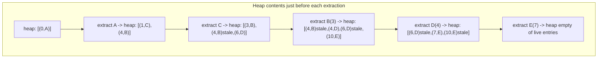

## Learning Objectives

- Implement Dijkstra's algorithm using a binary min-heap as the priority queue, over an adjacency list of weighted edges.
- Explain concretely why a binary heap's O(log n) insert and extract-min are exactly what gives Dijkstra its O((V + E) log V) running time.
- Trace the algorithm by hand on a small weighted graph, recording the heap's contents at every extraction and every relaxation.
- Prove why Dijkstra's algorithm requires every edge weight to be non-negative, and construct a concrete counterexample showing it fails otherwise.
- Distinguish "finalized" (settled, shortest distance known for certain) from "tentative" (a current best guess, possibly still improvable) as applied to a vertex's distance during the algorithm.

## Context & Motivation

The previous topic left the weighted shortest-path problem with a specific, unanswered efficiency question: relaxation alone guarantees correctness eventually, but gives no guarantee about *how many* relaxations are needed, or in what order they should happen, to reach every vertex's true distance quickly. Dijkstra's algorithm answers this question with a single, elegant greedy strategy: always relax outward from whichever not-yet-finalized vertex currently has the smallest tentative distance. Once that greedy choice is trusted (and it is provably correct, given non-negative weights, exactly because no cheaper route through an even-more-distant vertex could ever undercut the closest one), the entire algorithm reduces to a repeated question a computer needs to answer efficiently, over and over: *of all the vertices not yet finalized, which one currently has the smallest tentative distance?*

This is precisely the extract-min operation already covered in full — insert and extract-max/min on a binary heap — and the connection is not a passing resemblance, it is the entire reason Dijkstra's algorithm has the running time it does. Without a heap, finding the minimum among n tentative distances by scanning them all costs O(n) every single time, and Dijkstra needs to do this once per vertex, giving O(V²) overall — perfectly fine for a dense graph, but wasteful for the sparse graphs (road networks, dependency graphs, most real networks) that dominate practice. Swapping that linear scan for a binary heap's O(log n) extract-min, and using the heap's O(log n) insert to register each newly discovered or improved tentative distance, is exactly what turns Dijkstra's algorithm into O((V + E) log V) — the heap is not an implementation detail bolted on afterward, it is the mechanism that makes the greedy strategy fast enough to be worth using.

## Core Theory

### The algorithm: repeatedly extract the closest not-yet-finalized vertex

Initialize `dist[source] = 0`, `dist[v] = ∞` for every other vertex, and a min-heap (priority queue) containing every vertex, keyed by its tentative distance — or, more practically, an empty heap that grows as vertices are discovered, starting with just the source. Repeatedly: extract the vertex u with the smallest key currently in the heap (this is the extract-min operation), mark u as finalized (its `dist[u]` is now provably its true shortest distance — proved below), and relax every outgoing edge (u, v): if this relaxation improves `dist[v]`, push (or update) v's entry in the heap with its new, smaller key. The algorithm terminates when the heap is empty; every vertex reachable from the source has by then been finalized.

```python
import heapq

def dijkstra(adj, source):
    # adj[u] is a list of (v, weight) pairs
    dist = {source: 0}
    parent = {source: None}
    finalized = set()
    heap = [(0, source)]   # (tentative distance, vertex) — heap ordered by distance

    while heap:
        d, u = heapq.heappop(heap)   # extract-min: O(log n)
        if u in finalized:
            continue                 # a stale entry (u was already finalized more cheaply)
        finalized.add(u)

        for v, weight in adj[u]:
            if v in finalized:
                continue
            candidate = dist[u] + weight
            if candidate < dist.get(v, float('inf')):
                dist[v] = candidate
                parent[v] = u
                heapq.heappush(heap, (candidate, v))   # insert: O(log n)

    return dist, parent
```

### Why a binary heap, specifically, gives the running time it does

Every vertex is extracted from the heap at most once as its *finalizing* extraction (later, stale entries for already-finalized vertices are simply discarded in O(1) once popped — a cheap check, not a second real extraction). Each extraction costs O(log V) — the heap-insert-and-extract concept proved this bound directly: extract-min swaps the root with the array's last element, then sifts down along a single root-to-leaf path, and completeness guarantees that path has length Θ(log n) regardless of the values involved. Every edge, when examined during relaxation, triggers at most one heap insertion (if the relaxation improves a distance) — and insertion, by the same earlier concept, costs O(log V): append at the array's end, then sift up along a single leaf-to-root path, again bounded by the tree's height.

Summed over the whole algorithm: V extractions at O(log V) each gives O(V log V); E relaxations, each potentially triggering one insertion at O(log V), gives O(E log V). Total: O((V + E) log V). Every one of these log V factors is the heap's height — the same Θ(log n) bound proved once, for a general priority queue, now doing the specific work of always handing Dijkstra's algorithm "the not-yet-finalized vertex with the smallest tentative distance" in logarithmic time rather than the O(V) linear scan a plain array would require. Without the heap (using a plain array and scanning for the minimum each time), the same algorithm costs O(V²) — correct, but far slower on the sparse graphs (E = O(V)) most real applications actually have, where O((V+E) log V) is close to O(V log V), dramatically better than O(V²) once V is large.

### Correctness: why extracting the smallest tentative distance is safe to finalize

**Claim.** When u is extracted from the heap with the smallest tentative distance among all non-finalized vertices, `dist[u]` at that moment already equals u's true shortest-path distance from the source.

**Proof sketch.** Suppose not — some path to u shorter than the current `dist[u]` exists. That path must, at some point, leave the set of already-finalized vertices for the first time, crossing some edge (x, y) where x is finalized and y is not yet finalized (y could be u itself, or an earlier vertex on the path to u). Since x is finalized, `dist[x]` is already its true shortest distance (by induction on the order of finalization), and the edge (x, y) has already been relaxed when x was finalized — so `dist[y] ≤ dist[x] + weight(x, y)`, the exact cost of reaching y along this supposedly shorter path. Because every edge weight is **non-negative**, continuing from y to u along the rest of this path can only add more non-negative cost, so the true distance to u along this path is at least `dist[y]`. But `dist[y] ≥ dist[u]`, since u — not y — was the vertex chosen for extraction, meaning u had the *smallest* tentative distance among all non-finalized vertices at this step. So the supposedly shorter path to u costs at least `dist[u]` — contradicting that it was shorter. No shorter path exists; `dist[u]` is correct. ∎

Notice exactly where non-negativity is used: "continuing from y to u can only add more cost" requires every remaining edge weight to be ≥ 0 — a single negative edge later on the path could make the total cost to u *smaller* than `dist[y]`, breaking the whole argument.



### Why non-negative weights are non-negotiable

Dijkstra's algorithm never revisits a vertex once finalized — the entire point of the greedy strategy, and the heap-driven efficiency built on top of it, is that finalization happens once per vertex, in increasing order of true distance, and is never reconsidered. A negative edge discovered *after* a vertex has been finalized could, in principle, offer a cheaper route into that vertex than the one already recorded — but the algorithm has no mechanism to detect or apply this, since it structurally never relaxes an edge into an already-finalized vertex again. Worked Example 2 constructs this failure concretely.

## Worked Examples

### Example 1 — full Dijkstra trace with heap contents at every step

**Problem:** Run Dijkstra from source A on the directed weighted graph: A→B (4), A→C (1), C→B (2), C→D (5), B→D (1), D→E (3), B→E (7).

```python
adj = {
    'A': [('B', 4), ('C', 1)],
    'B': [('D', 1), ('E', 7)],
    'C': [('B', 2), ('D', 5)],
    'D': [('E', 3)],
    'E': [],
}
```

**Trace.** `dist = {A: 0}`. Heap: `[(0, A)]`.

Extract (0, A). Finalize A. Relax A→B(4): `dist[B] = 4`, push (4, B). Relax A→C(1): `dist[C] = 1`, push (1, C). Heap: `[(1,C), (4,B)]`.

Extract (1, C). Finalize C. Relax C→B(2): candidate `1+2=3 < 4` — update `dist[B] = 3`, push (3, B) (the old (4, B) entry becomes a **stale entry**, left in the heap but harmless). Relax C→D(5): candidate `1+5=6` — `dist[D] = 6`, push (6, D). Heap: `[(3,B), (4,B) stale, (6,D)]`.

Extract (3, B) — the smallest live entry. Finalize B. Relax B→D(1): candidate `3+1=4 < 6` — update `dist[D] = 4`, push (4, D). Relax B→E(7): candidate `3+7=10` — `dist[E] = 10`, push (10, E). Heap: `[(4,B) stale, (4,D), (6,D) stale, (10,E)]`.

Extract (4, B) — B is already finalized; **discard as stale**, no work done. Extract (4, D). Finalize D. Relax D→E(3): candidate `4+3=7 < 10` — update `dist[E] = 7`, push (7, E). Heap: `[(6,D) stale, (7,E), (10,E) stale]`.

Extract (6, D) — stale, discard. Extract (7, E). Finalize E. No outgoing edges. Extract (10, E) — stale, discard. Heap empty. Done.

**Result:** `dist = {A: 0, C: 1, B: 3, D: 4, E: 7}`. Every vertex's finalized distance matches its true shortest distance — for instance E's shortest path is A→C→B→D→E, cost 1+2+1+3 = 7, matching `dist[E] = 7` exactly, and beating the direct-seeming A→B→E (4+7=11) or A→C→B→E (1+2+7=10) alternatives.

### Example 2 — a negative edge breaking Dijkstra's algorithm

**Problem:** Run Dijkstra on the graph A→C (2), A→B (3), B→C (−2), and show it produces the wrong answer for `dist[C]`.

**True shortest distance to C.** Path A→C directly: cost 2. Path A→B→C: cost `3 + (−2) = 1`. The true shortest distance to C is 1, via A→B→C.

**Dijkstra's trace.** `dist = {A: 0}`. Heap: `[(0,A)]`. Extract A, finalize. Relax A→C(2): `dist[C] = 2`, push (2, C). Relax A→B(3): `dist[B] = 3`, push (3, B). Heap: `[(2,C), (3,B)]`.

Extract (2, C) — the smallest tentative distance. **Finalize C at distance 2.** No outgoing edges from C to relax.

Extract (3, B). Finalize B. Relax B→C(−2): candidate `3 + (−2) = 1 < 2` — this *would* improve `dist[C]`, but C is already finalized, and the algorithm's `if v in finalized: continue` check (or, in a version without that check, the fact that C will never be extracted again to propagate this improvement further) means this relaxation is either skipped entirely or has no further effect on the final answer. `dist[C]` remains 2.

**Result:** Dijkstra reports `dist[C] = 2` — but the true shortest distance is 1. The algorithm produced a wrong answer, precisely because C was finalized (its heap-extraction order was based on the smaller *tentative* distance 2, which beat B's tentative distance 3) before the cheaper route through B, with its negative edge, could be discovered. This is exactly the failure the correctness proof's non-negativity requirement predicts: extracting the smallest tentative distance is only safe to finalize immediately when no later, negative-weight edge could ever undercut it.

## Common Misconceptions & Pitfalls

- **"Any priority queue implementation gives the same running time — the heap is just a convenient way to write the code."** The specific O(log n) bound for insert and extract-min is what turns Dijkstra's O(V²) array-scanning version into O((V+E) log V) — a plain unsorted array (O(1) insert, O(n) extract-min) or a sorted array (O(n) insert, O(1) extract-min) both give worse combined bounds for Dijkstra's actual usage pattern, which needs many of both operations; the binary heap's balanced O(log n) for both is specifically what the running-time analysis depends on.
- **"Stale heap entries are a bug that needs fixing before the algorithm can be correct."** They are an accepted, harmless byproduct of the standard heap-based implementation — pushing a new, better entry for a vertex rather than trying to decrease-key an old one in place; the `if u in finalized: continue` check discards stale entries cheaply when they're eventually popped, and this costs at most one extra O(log n) extraction per stale entry, which does not change the overall asymptotic bound.
- **"Dijkstra's algorithm just needs a small tweak to handle negative weights, like relaxing finalized vertices again when a negative edge appears."** Example 2 shows the failure is structural, not a missing special case: the entire efficiency argument (each vertex finalized exactly once, in increasing distance order) depends on never reconsidering a finalized vertex. Allowing re-finalization abandons that structure and the running-time guarantee along with it — at that point, a fundamentally different algorithm (Bellman-Ford, covered next) is the correct tool.
- **"The order vertices are finalized in doesn't matter, only the final distances do."** The finalization order is exactly what the correctness proof depends on — vertices are finalized in strictly increasing order of true shortest distance, and this order is precisely what guarantees no later relaxation could ever improve an already-finalized vertex, given non-negative weights. This ordering, not just the final numbers, is the mechanism the whole proof rests on.

## Summary

Dijkstra's algorithm answers the general relaxation setup's efficiency question with a greedy strategy: always extract and finalize the not-yet-finalized vertex with the smallest tentative distance, relax its outgoing edges, and repeat. That extraction is exactly the binary heap's extract-min operation, and every relaxation that improves a distance triggers exactly one heap insertion — both O(log V), for the same structural reason proved in the heap concept (each operation walks a single root-to-leaf path, bounded by the heap's guaranteed Θ(log n) height). This gives Dijkstra's algorithm its O((V + E) log V) running time, a direct improvement over the O(V²) a naive linear scan for the minimum would cost. The algorithm's correctness — and its restriction to non-negative edge weights — both hinge on the same fact: once a vertex is finalized, it is never reconsidered, which is only safe when no later edge could possibly offer a cheaper route into it, a guarantee that a negative edge can violate outright, as the worked counterexample shows directly.

## Documentation Links

- [MIT 6.006 — Lecture Notes (OCW)](https://ocw.mit.edu/courses/6-006-introduction-to-algorithms-spring-2020/pages/lecture-notes/) — doc
- [Sedgewick & Wayne — Algorithms Lectures (Princeton)](https://algs4.cs.princeton.edu/lectures/) — doc
