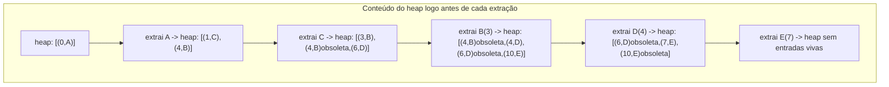

## Objetivos de Aprendizagem

- Implementar o algoritmo de Dijkstra usando um heap binário mínimo como fila de prioridade, sobre uma lista de adjacência de arestas ponderadas.
- Explicar concretamente por que a inserção e extração-mínima O(log n) de um heap binário são exatamente o que dá a Dijkstra seu tempo de execução O((V + E) log V).
- Rastrear o algoritmo manualmente em um pequeno grafo ponderado, registrando o conteúdo do heap a cada extração e cada relaxamento.
- Provar por que o algoritmo de Dijkstra exige que todo peso de aresta seja não negativo, e construir um contraexemplo concreto mostrando que falha caso contrário.
- Distinguir "finalizado" (definido, distância mais curta conhecida com certeza) de "tentativo" (um melhor palpite atual, possivelmente ainda melhorável) como aplicado à distância de um vértice durante o algoritmo.

## Contexto e Motivação

O tópico anterior deixou o problema de caminho mais curto ponderado com uma pergunta específica, sem resposta, de eficiência: relaxamento sozinho garante correção eventualmente, mas não dá nenhuma garantia sobre *quantos* relaxamentos são necessários, ou em que ordem devem acontecer, para alcançar a distância verdadeira de todo vértice rapidamente. O algoritmo de Dijkstra responde essa pergunta com uma única, elegante estratégia gulosa: sempre relaxe para fora a partir de qualquer vértice ainda não finalizado que atualmente tenha a menor distância tentativa. Uma vez que essa escolha gulosa é confiada (e é comprovadamente correta, dado pesos não negativos, exatamente porque nenhuma rota mais barata através de um vértice ainda mais distante poderia jamais superar a mais próxima), o algoritmo inteiro se reduz a uma pergunta repetida que um computador precisa responder eficientemente, repetidamente: *de todos os vértices ainda não finalizados, qual atualmente tem a menor distância tentativa?*

Isso é precisamente a operação extract-min já coberta por completo, inserção e extração-max/min em um heap binário, e a conexão não é uma semelhança passageira, é a razão inteira pela qual o algoritmo de Dijkstra tem o tempo de execução que tem. Sem um heap, encontrar o mínimo entre n distâncias tentativas varrendo todas custa O(n) toda única vez, e Dijkstra precisa fazer isso uma vez por vértice, dando O(V²) no geral, perfeitamente bem para um grafo denso, mas desperdiçador para os grafos esparsos (redes rodoviárias, grafos de dependência, a maioria das redes reais) que dominam a prática. Trocar aquela varredura linear por uma extração-mínima O(log n) de heap binário, e usar a inserção O(log n) do heap para registrar toda distância tentativa recém-descoberta ou melhorada, é exatamente o que transforma o algoritmo de Dijkstra em O((V + E) log V), o heap não é um detalhe de implementação acoplado depois, é o mecanismo que torna a estratégia gulosa rápida o suficiente para valer a pena usar.

## Teoria Central

### O algoritmo: extraia repetidamente o vértice não finalizado mais próximo

Inicialize `dist[fonte] = 0`, `dist[v] = ∞` para todo outro vértice, e um min-heap (fila de prioridade) contendo todo vértice, chaveado por sua distância tentativa, ou, mais praticamente, um heap vazio que cresce conforme vértices são descobertos, começando só com a fonte. Repetidamente: extraia o vértice u com a menor chave atualmente no heap (essa é a operação extract-min), marque u como finalizado (seu `dist[u]` agora é comprovadamente sua distância mais curta verdadeira, provado abaixo), e relaxe toda aresta de saída (u, v): se esse relaxamento melhora `dist[v]`, empurre (ou atualize) a entrada de v no heap com sua nova, menor chave. O algoritmo termina quando o heap está vazio; todo vértice alcançável a partir da fonte foi então finalizado.

```python
import heapq

def dijkstra(adj, source):
    # adj[u] é uma lista de pares (v, peso)
    dist = {source: 0}
    parent = {source: None}
    finalized = set()
    heap = [(0, source)]   # (distância tentativa, vértice) — heap ordenado por distância

    while heap:
        d, u = heapq.heappop(heap)   # extract-min: O(log n)
        if u in finalized:
            continue                 # uma entrada obsoleta (u já foi finalizado mais barato)
        finalized.add(u)

        for v, weight in adj[u]:
            if v in finalized:
                continue
            candidate = dist[u] + weight
            if candidate < dist.get(v, float('inf')):
                dist[v] = candidate
                parent[v] = u
                heapq.heappush(heap, (candidate, v))   # inserção: O(log n)

    return dist, parent
```

### Por que um heap binário, especificamente, dá o tempo de execução que dá

Todo vértice é extraído do heap no máximo uma vez como sua extração *finalizadora* (mais tarde, entradas obsoletas para vértices já finalizados são simplesmente descartadas em O(1) uma vez retiradas, uma verificação barata, não uma segunda extração real). Cada extração custa O(log V), o conceito de inserção-e-extração de heap provou esse limite diretamente: extract-min troca a raiz com o último elemento do array, depois faz sift-down ao longo de um único caminho raiz-para-folha, e completude garante que aquele caminho tem comprimento Θ(log n) independentemente dos valores envolvidos. Toda aresta, quando examinada durante relaxamento, dispara no máximo uma inserção no heap (se o relaxamento melhora uma distância), e inserção, pelo mesmo conceito anterior, custa O(log V): anexa no fim do array, depois faz sift-up ao longo de um único caminho folha-para-raiz, de novo limitado pela altura da árvore.

Somado sobre o algoritmo inteiro: V extrações a O(log V) cada dá O(V log V); E relaxamentos, cada um potencialmente disparando uma inserção a O(log V), dá O(E log V). Total: O((V + E) log V). Cada um desses fatores log V é a altura do heap, o mesmo limite Θ(log n) provado uma vez, para uma fila de prioridade geral, agora fazendo o trabalho específico de sempre entregar ao algoritmo de Dijkstra "o vértice ainda não finalizado com a menor distância tentativa" em tempo logarítmico em vez da varredura linear O(V) que um array simples exigiria. Sem o heap (usando um array simples e varrendo pelo mínimo toda vez), o mesmo algoritmo custa O(V²), correto, mas muito mais lento nos grafos esparsos (E = O(V)) que a maioria das aplicações reais de fato têm, onde O((V+E) log V) é próximo de O(V log V), dramaticamente melhor que O(V²) uma vez que V é grande.

### Correção: por que extrair a menor distância tentativa é seguro para finalizar

**Afirmação.** Quando u é extraído do heap com a menor distância tentativa entre todos os vértices não finalizados, `dist[u]` naquele momento já é igual à distância verdadeira de caminho mais curto de u a partir da fonte.

**Esboço de prova.** Suponha que não, algum caminho até u mais curto que o `dist[u]` atual existe. Esse caminho deve, em algum ponto, deixar o conjunto de vértices já finalizados pela primeira vez, cruzando alguma aresta (x, y) onde x é finalizado e y ainda não é finalizado (y poderia ser o próprio u, ou um vértice anterior no caminho até u). Já que x é finalizado, `dist[x]` já é sua distância mais curta verdadeira (por indução na ordem de finalização), e a aresta (x, y) já foi relaxada quando x foi finalizado, então `dist[y] ≤ dist[x] + peso(x, y)`, o custo exato de alcançar y ao longo desse caminho supostamente mais curto. Porque todo peso de aresta é **não negativo**, continuar de y até u ao longo do resto desse caminho só pode adicionar mais custo não negativo, então a distância verdadeira até u ao longo desse caminho é pelo menos `dist[y]`. Mas `dist[y] ≥ dist[u]`, já que u, não y, foi o vértice escolhido para extração, significando que u tinha a *menor* distância tentativa entre todos os vértices não finalizados nesse passo. Então o caminho supostamente mais curto até u custa pelo menos `dist[u]`, contradizendo que era mais curto. Nenhum caminho mais curto existe; `dist[u]` está correto. ∎

Note exatamente onde não negatividade é usada: "continuar de y até u só pode adicionar mais custo" exige que todo peso de aresta restante seja ≥ 0, uma única aresta negativa mais adiante no caminho poderia tornar o custo total até u *menor* que `dist[y]`, quebrando o argumento inteiro.



### Por que pesos não negativos não são negociáveis

O algoritmo de Dijkstra nunca revisita um vértice uma vez finalizado, o ponto inteiro da estratégia gulosa, e a eficiência guiada por heap construída sobre ela, é que finalização acontece uma vez por vértice, em ordem crescente de distância verdadeira, e nunca é reconsiderada. Uma aresta negativa descoberta *depois* que um vértice foi finalizado poderia, em princípio, oferecer uma rota mais barata para dentro daquele vértice do que a já registrada, mas o algoritmo não tem mecanismo para detectar ou aplicar isso, já que estruturalmente nunca relaxa uma aresta em um vértice já finalizado de novo. O Exemplo Resolvido 2 constrói essa falha concretamente.

## Exemplos Resolvidos

### Exemplo 1 — rastreamento completo de Dijkstra com conteúdo do heap a cada passo

**Problema:** Rode Dijkstra a partir da fonte A no grafo ponderado direcionado: A→B (4), A→C (1), C→B (2), C→D (5), B→D (1), D→E (3), B→E (7).

```python
adj = {
    'A': [('B', 4), ('C', 1)],
    'B': [('D', 1), ('E', 7)],
    'C': [('B', 2), ('D', 5)],
    'D': [('E', 3)],
    'E': [],
}
```

**Rastreamento.** `dist = {A: 0}`. Heap: `[(0, A)]`.

Extrai (0, A). Finaliza A. Relaxa A→B(4): `dist[B] = 4`, empurra (4, B). Relaxa A→C(1): `dist[C] = 1`, empurra (1, C). Heap: `[(1,C), (4,B)]`.

Extrai (1, C). Finaliza C. Relaxa C→B(2): candidato `1+2=3 < 4`, atualiza `dist[B] = 3`, empurra (3, B) (a entrada antiga (4, B) se torna uma **entrada obsoleta**, deixada no heap mas inofensiva). Relaxa C→D(5): candidato `1+5=6`, `dist[D] = 6`, empurra (6, D). Heap: `[(3,B), (4,B) obsoleta, (6,D)]`.

Extrai (3, B), a menor entrada viva. Finaliza B. Relaxa B→D(1): candidato `3+1=4 < 6`, atualiza `dist[D] = 4`, empurra (4, D). Relaxa B→E(7): candidato `3+7=10`, `dist[E] = 10`, empurra (10, E). Heap: `[(4,B) obsoleta, (4,D), (6,D) obsoleta, (10,E)]`.

Extrai (4, B), B já está finalizado; **descarta como obsoleta**, nenhum trabalho feito. Extrai (4, D). Finaliza D. Relaxa D→E(3): candidato `4+3=7 < 10`, atualiza `dist[E] = 7`, empurra (7, E). Heap: `[(6,D) obsoleta, (7,E), (10,E) obsoleta]`.

Extrai (6, D), obsoleta, descarta. Extrai (7, E). Finaliza E. Sem arestas de saída. Extrai (10, E), obsoleta, descarta. Heap vazio. Terminado.

**Resultado:** `dist = {A: 0, C: 1, B: 3, D: 4, E: 7}`. A distância finalizada de todo vértice combina com sua distância verdadeira mais curta, por exemplo o caminho mais curto de E é A→C→B→D→E, custo 1+2+1+3 = 7, combinando exatamente com `dist[E] = 7`, e vencendo as alternativas aparentemente diretas A→B→E (4+7=11) ou A→C→B→E (1+2+7=10).

### Exemplo 2 — uma aresta negativa quebrando o algoritmo de Dijkstra

**Problema:** Rode Dijkstra no grafo A→C (2), A→B (3), B→C (−2), e mostre que produz a resposta errada para `dist[C]`.

**Distância verdadeira mais curta até C.** Caminho A→C diretamente: custo 2. Caminho A→B→C: custo `3 + (−2) = 1`. A distância verdadeira mais curta até C é 1, via A→B→C.

**Rastreamento de Dijkstra.** `dist = {A: 0}`. Heap: `[(0,A)]`. Extrai A, finaliza. Relaxa A→C(2): `dist[C] = 2`, empurra (2, C). Relaxa A→B(3): `dist[B] = 3`, empurra (3, B). Heap: `[(2,C), (3,B)]`.

Extrai (2, C), a menor distância tentativa. **Finaliza C na distância 2.** Nenhuma aresta de saída de C para relaxar.

Extrai (3, B). Finaliza B. Relaxa B→C(−2): candidato `3 + (−2) = 1 < 2`, isso *melhoraria* `dist[C]`, mas C já está finalizado, e a verificação `if v in finalized: continue` do algoritmo (ou, em uma versão sem essa verificação, o fato de que C nunca será extraído de novo para propagar essa melhoria adiante) significa que esse relaxamento ou é pulado inteiramente ou não tem mais efeito na resposta final. `dist[C]` permanece 2.

**Resultado:** Dijkstra relata `dist[C] = 2`, mas a distância verdadeira mais curta é 1. O algoritmo produziu uma resposta errada, precisamente porque C foi finalizado (sua ordem de extração do heap foi baseada na distância *tentativa* menor 2, que venceu a distância tentativa de B, 3) antes que a rota mais barata através de B, com sua aresta negativa, pudesse ser descoberta. Isso é exatamente a falha que o requisito de não negatividade da prova de correção prevê: extrair a menor distância tentativa só é seguro para finalizar imediatamente quando nenhuma aresta posterior, de peso negativo, poderia jamais superá-la.

## Equívocos Comuns e Armadilhas

- **"Qualquer implementação de fila de prioridade dá o mesmo tempo de execução, o heap é só uma forma conveniente de escrever o código."** O limite específico O(log n) para inserção e extract-min é o que transforma a versão de varredura de array O(V²) de Dijkstra em O((V+E) log V), um array não ordenado simples (inserção O(1), extract-min O(n)) ou um array ordenado (inserção O(n), extract-min O(1)) ambos dão limites combinados piores para o padrão de uso real de Dijkstra, que precisa de muitas de ambas as operações; o O(log n) balanceado do heap binário para ambas é especificamente do que a análise de tempo de execução depende.
- **"Entradas obsoletas do heap são um bug que precisa ser corrigido antes que o algoritmo possa estar correto."** São um subproduto aceito, inofensivo, da implementação padrão baseada em heap, empurrar uma nova entrada melhor para um vértice em vez de tentar diminuir a chave de uma antiga no lugar; a verificação `if u in finalized: continue` descarta entradas obsoletas baratamente quando eventualmente são retiradas, e isso custa no máximo uma extração O(log n) extra por entrada obsoleta, o que não muda o limite assintótico geral.
- **"O algoritmo de Dijkstra só precisa de um pequeno ajuste para lidar com pesos negativos, tipo relaxar vértices finalizados de novo quando uma aresta negativa aparece."** O Exemplo 2 mostra que a falha é estrutural, não um caso especial faltando: o argumento de eficiência inteiro (cada vértice finalizado exatamente uma vez, em ordem de distância crescente) depende de nunca reconsiderar um vértice finalizado. Permitir re-finalização abandona essa estrutura e a garantia de tempo de execução junto com ela, nesse ponto, um algoritmo fundamentalmente diferente (Bellman-Ford, coberto em seguida) é a ferramenta correta.
- **"A ordem em que vértices são finalizados não importa, só as distâncias finais importam."** A ordem de finalização é exatamente do que a prova de correção depende, vértices são finalizados em ordem estritamente crescente de distância verdadeira mais curta, e essa ordem é precisamente o que garante que nenhum relaxamento posterior jamais poderia melhorar um vértice já finalizado, dado pesos não negativos. Essa ordenação, não só os números finais, é o mecanismo sobre o qual a prova inteira se apoia.

## Resumo

O algoritmo de Dijkstra responde a pergunta de eficiência do modelo geral de relaxamento com uma estratégia gulosa: sempre extraia e finalize o vértice ainda não finalizado com a menor distância tentativa, relaxe suas arestas de saída, e repita. Essa extração é exatamente a operação extract-min do heap binário, e todo relaxamento que melhora uma distância dispara exatamente uma inserção no heap, ambas O(log V), pela mesma razão estrutural provada no conceito de heap (cada operação percorre um único caminho raiz-para-folha, limitado pela altura Θ(log n) garantida do heap). Isso dá ao algoritmo de Dijkstra seu tempo de execução O((V + E) log V), uma melhoria direta sobre o que uma varredura linear ingênua pelo mínimo custaria, O(V²). A correção do algoritmo, e sua restrição a pesos de aresta não negativos, ambas dependem do mesmo fato: uma vez que um vértice é finalizado, nunca é reconsiderado, o que só é seguro quando nenhuma aresta posterior poderia possivelmente oferecer uma rota mais barata para dentro dele, uma garantia que uma aresta negativa pode violar completamente, como o contraexemplo resolvido mostra diretamente.

## Documentation Links

- [MIT 6.006 — Lecture Notes (OCW)](https://ocw.mit.edu/courses/6-006-introduction-to-algorithms-spring-2020/pages/lecture-notes/) — doc
- [Sedgewick & Wayne — Algorithms Lectures (Princeton)](https://algs4.cs.princeton.edu/lectures/) — doc
