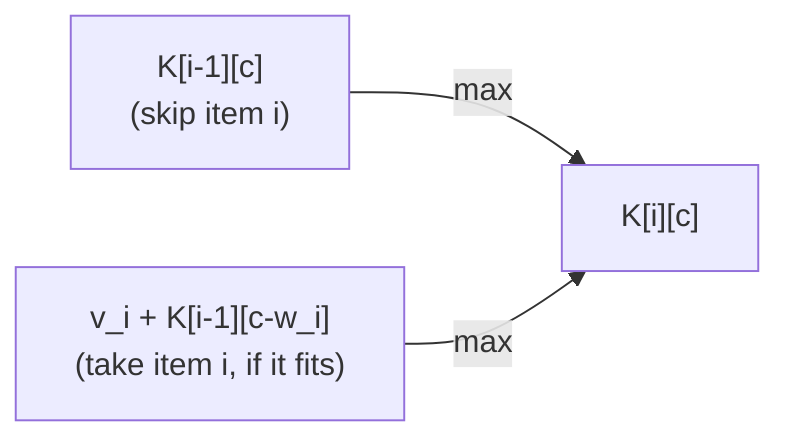

## Learning Objectives

- State the 0/1 Knapsack problem precisely, and explain why "0/1" (take fully or not at all) is the detail that rules out a simpler fractional strategy.
- Derive the two-way recurrence (skip an item, or take it if it fits) and fill a full DP table by hand for a small instance.
- Construct a concrete counterexample where a natural greedy strategy (best value-to-weight ratio first) provably fails to find the optimal solution.
- Explain, structurally, why greedy fails here in a way it did not fail for activity selection.
- Recover which items were actually selected, not just the optimal total value, by tracing back through the filled table.

## Context & Motivation

The greedy paradigm, covered earlier in this discipline, made a strong promise under the right conditions: for activity selection, always picking the activity that finishes earliest was proven — via a full exchange argument — to never cost the optimal solution anything. That proof was not a coincidence; it depended on specific structural properties of that specific problem. 0/1 Knapsack is this discipline's honest counterpoint to that success story: a problem that *looks* similarly amenable to a greedy strategy (there is an obviously appealing per-item "value density," value divided by weight), where that greedy strategy can be shown, with a small concrete example, to give a wrong answer — sometimes a substantially wrong one. This is exactly why 0/1 Knapsack earns its place as the canonical worked example of "DP is what you reach for when greedy doesn't work": not because greedy is never a legitimate tool, but because using it without the kind of proof activity selection received is a genuine risk, and this problem is where that risk becomes concrete rather than abstract.

The setup: a set of items, each with a weight and a value, and a knapsack with a fixed weight capacity. The goal is to choose a subset of items — each one either fully included or fully excluded, hence "0/1," as opposed to the *fractional* knapsack variant that allows taking a partial amount of an item — maximizing total value without the total weight exceeding capacity. The fractional version, notably, *is* solved correctly by a greedy value-density strategy; it is specifically the all-or-nothing constraint of the 0/1 version that breaks that strategy, which makes this problem an unusually precise illustration of how a small change to a problem's constraints can flip which paradigm actually applies.

## Core Theory

### The recurrence: skip it, or take it if it fits

Let `items[0..n-1]` each have a weight `w_i` and value `v_i`, and let `capacity` be the total weight limit. Define `K(i, c)` as the best achievable value using only the first `i` items with a remaining capacity of `c`. For each item `i`, exactly two choices exist, and the best of the two is taken:

- **Skip item `i`:** the best value achievable is whatever the first `i-1` items alone can achieve with the same capacity: `K(i-1, c)`.
- **Take item `i`**, only possible if it fits (`w_i <= c`): the value is `v_i` plus the best achievable with the first `i-1` items and the *reduced* capacity `c - w_i` (since taking this item uses up `w_i` of the capacity): `v_i + K(i-1, c - w_i)`.

`K(i, c) = max(K(i-1, c), v_i + K(i-1, c - w_i))` when `w_i <= c`, and simply `K(i-1, c)` when the item doesn't fit at all. Base case: `K(0, c) = 0` for any `c` (no items available, no value possible). This has both DP-qualifying properties: `K(n, capacity)`, the final answer, is built directly from correct answers to smaller `(i, c)` subproblems (optimal substructure), and different orders of skip/take decisions across items reach the same `(i, c)` pair repeatedly (overlapping subproblems).

### Filling the table

A table `K` of size `(n+1) × (capacity+1)` is filled row by row (one row per item considered so far), each entry needing only entries from the row directly above — `K[i-1][c]` and `K[i-1][c - w_i]` — so filling top to bottom, left to right (or in any order within a row, since a row only depends on the row above it) respects every dependency. The final answer is `K[n][capacity]`.

### Recovering which items were chosen

As with LCS, the table gives the optimal *value*, not directly which items achieve it. Tracing backward from `K[n][capacity]`: at each `(i, c)`, if `K[i][c] == K[i-1][c]`, item `i` was not needed (the trace moves to `(i-1, c)`); otherwise item `i` was taken (record it, and move to `(i-1, c - w_i)`, since that's the capacity that remained before this item was added). Continuing until `i` reaches 0 recovers the exact subset of items in the optimal solution.

## Worked Examples

### Example 1 — filling a full table by hand

**Problem:** Items `1: (w=1, v=1)`, `2: (w=3, v=4)`, `3: (w=4, v=5)`, `4: (w=5, v=7)`, capacity `7`. Find the maximum achievable value.

| i \\ c | 0 | 1 | 2 | 3 | 4 | 5 | 6 | 7 |
|---|---|---|---|---|---|---|---|---|
| **0** | 0 | 0 | 0 | 0 | 0 | 0 | 0 | 0 |
| **1** (w1,v1) | 0 | 1 | 1 | 1 | 1 | 1 | 1 | 1 |
| **2** (w3,v4) | 0 | 1 | 1 | 4 | 5 | 5 | 5 | 5 |
| **3** (w4,v5) | 0 | 1 | 1 | 4 | 5 | 6 | 6 | 9 |
| **4** (w5,v7) | 0 | 1 | 1 | 4 | 5 | 7 | 8 | 9 |

Sample cell: `K[3][7] = max(K[2][7], 5 + K[2][3]) = max(5, 5+4) = 9` (item 3 fits into capacity 7, and taking it plus the best from the first 2 items at the remaining capacity 3 beats skipping it). `K[4][7] = max(K[3][7], 7 + K[3][2]) = max(9, 7+1) = 9` — item 4 doesn't help here, since taking it (value 7) plus what's achievable in the remaining capacity 2 (value 1) is worse than the 9 already achievable without it.

**Final answer:** `K[4][7] = 9`. Tracing back: `K[4][7] == K[3][7]` (both 9), so item 4 is skipped; at `(3, 7)`, `K[3][7]=9 \ne K[2][7]=5`, so item 3 is taken, moving to `(2, 7-4=3)`; at `(2,3)`, `K[2][3]=4 \ne K[1][3]=1`, so item 2 is taken, moving to `(1, 3-3=0)`; at `(1,0)`, `K[1][0]=0=K[0][0]`, so item 1 is skipped. Optimal subset: items 2 and 3, weight `3+4=7`, value `4+5=9`.

### Example 2 — greedy provably fails: a concrete counterexample

**Problem:** Items `A: (w=10, v=60)`, `B: (w=20, v=100)`, `C: (w=30, v=120)`, capacity `50`. Compare the greedy "best value-to-weight ratio first" strategy against the true DP optimum.

**Greedy's choices.** Value-to-weight ratios: `A = 60/10 = 6`, `B = 100/20 = 5`, `C = 120/30 = 4`. Greedy takes items in ratio order, as long as they fit: take `A` (weight 10, value 60; capacity remaining 40); take `B` (weight 20, value 100; capacity remaining 20); `C` needs weight 30, which no longer fits in the remaining 20. Greedy's final answer: items `A` and `B`, total weight `30`, total value `160`.

**The true optimum.** Consider instead items `B` and `C`: total weight `20 + 30 = 50` (exactly at capacity), total value `100 + 120 = 220`. This is a strictly better solution than greedy found — `220 > 160` — and it fits within the capacity exactly. A DP table filled by the recurrence above would find this `220` directly, by correctly comparing *all* the ways of combining items rather than committing irrevocably to the highest-ratio item first and never reconsidering.

**Why greedy fails here, structurally.** Greedy's irrevocable first choice — take `A` because it has the best ratio — consumes capacity that turns out to be needed for the combination that actually maximizes value. Unlike activity selection, where the exchange argument proved that the earliest-finishing choice never closes off a better solution, no such proof exists for knapsack's ratio-greedy strategy, precisely because it isn't true: `A`'s presence in the knapsack directly blocks the better `B + C` combination from fitting. This is the concrete demonstration this concept promised: greedy's "never reconsider" approach is not merely unproven here, it is actively wrong on this instance.

### Example 3 — confirming why the fractional relaxation would have let greedy succeed

**Problem:** On the same instance as Example 2, would greedy succeed if fractional amounts of items were allowed (fractional knapsack)?

Greedy would again take all of `A` (value 60, weight 10, capacity remaining 40), then all of `B` (value 100, weight 20, capacity remaining 20), then as much of `C` as fits: `20/30` of `C`, worth `(20/30) × 120 = 80`. Total: `60 + 100 + 80 = 240` — which actually *exceeds* the 0/1 optimum of 220, because being able to split `C` lets greedy use every last unit of capacity optimally. This confirms the earlier claim precisely: it is the all-or-nothing constraint that breaks greedy for 0/1 Knapsack; the same greedy strategy is provably correct for the fractional variant, where partial items are allowed.

## Common Misconceptions & Pitfalls

- **"The best value-to-weight ratio is always part of some optimal solution, so it's safe to always take it first."** Example 2 shows this directly: item `A` has the best ratio, is taken by greedy, and its presence blocks the actually-optimal `B + C` combination. Ratio-greedy for 0/1 knapsack has no correctness proof because it isn't a correct algorithm.
- **"If greedy failed here, greedy never works for any resource-allocation problem."** Greedy remains provably correct for activity selection (via the exchange argument already covered) and for the fractional relaxation of this very problem (Example 3). The lesson is not "greedy is bad," it's "greedy requires a proof specific to the problem at hand, and 0/1 knapsack's all-or-nothing constraint is exactly what breaks the proof that works for its fractional cousin."
- **"The DP table only gives the best value, so you can't tell which items to actually pack."** The backward trace-back described in Core Theory and demonstrated in Example 1 recovers the exact subset, not just its total value.
- **"Filling the table in any row/column order works, as long as every cell eventually gets a value."** Each row depends only on the row above it, so rows must be filled in item order (row `i` after row `i-1`) — filling in the wrong order reads not-yet-computed values, exactly the same dependency-order requirement seen in the previous concept's tabulation.

## Summary

0/1 Knapsack chooses a subset of weighted, valued items — each fully included or fully excluded — to maximize total value without exceeding a weight capacity, via the recurrence `K(i,c) = max(K(i-1,c), v_i + K(i-1, c-w_i))`, filled into a table row by row by item and column by column by remaining capacity, with the final answer at `K(n, capacity)` and the actual chosen items recoverable by a backward trace. The concrete counterexample — items with weight/value `(10,60)`, `(20,100)`, `(30,120)` and capacity 50 — shows ratio-greedy locking in item `A` first and settling for value 160, while the true DP optimum, items `B` and `C`, achieves 220: an honest, provable greedy failure, not merely a hypothetical one, and the precise reason DP — trying every relevant combination via the table, rather than committing irrevocably to one — is the tool this problem calls for. The same greedy strategy is, by contrast, provably correct for the fractional relaxation of this problem, underscoring that it is specifically the all-or-nothing constraint that breaks it here.

## Documentation Links

- [MIT 6.006 — Lecture Notes (OCW)](https://ocw.mit.edu/courses/6-006-introduction-to-algorithms-spring-2020/pages/lecture-notes/) — doc
- [ACM/IEEE CS2013 — Algorithms and Complexity Knowledge Area](https://csed.acm.org/cs2013-version/) — doc
