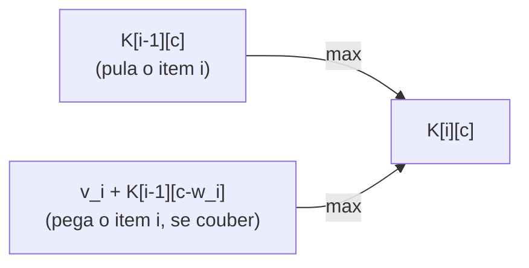

## Objetivos de Aprendizagem

- Enunciar o problema da Mochila 0/1 precisamente, e explicar por que "0/1" (pegar completamente ou não pegar de forma alguma) é o detalhe que elimina uma estratégia fracionária mais simples.
- Derivar a recorrência de duas vias (pule um item, ou pegue-o se couber) e preencher uma tabela de DP completa manualmente para uma instância pequena.
- Construir um contraexemplo concreto onde uma estratégia gulosa natural (melhor razão valor-peso primeiro) comprovadamente falha em encontrar a solução ótima.
- Explicar, estruturalmente, por que guloso falha aqui de uma forma que não falhou para seleção de atividades.
- Recuperar quais itens foram de fato selecionados, não só o valor total ótimo, rastreando de volta através da tabela preenchida.

## Contexto e Motivação

O paradigma guloso, coberto anteriormente nesta disciplina, fez uma promessa forte sob as condições certas: para seleção de atividades, sempre escolher a atividade que termina mais cedo foi provado, via um argumento de troca completo, nunca custar nada à solução ótima. Aquela prova não foi coincidência; dependia de propriedades estruturais específicas daquele problema específico. Mochila 0/1 é o contraponto honesto desta disciplina àquela história de sucesso: um problema que *parece* similarmente receptivo a uma estratégia gulosa (há uma "densidade de valor" por item obviamente atraente, valor dividido por peso), onde essa estratégia gulosa pode ser mostrada, com um pequeno exemplo concreto, dar uma resposta errada, às vezes substancialmente errada. Isso é exatamente por que Mochila 0/1 ganha seu lugar como o exemplo resolvido canônico de "DP é o que você recorre quando guloso não funciona": não porque guloso nunca é uma ferramenta legítima, mas porque usá-lo sem o tipo de prova que seleção de atividades recebeu é um risco genuíno, e este problema é onde esse risco se torna concreto em vez de abstrato.

A montagem: um conjunto de itens, cada um com um peso e um valor, e uma mochila com uma capacidade de peso fixa. O objetivo é escolher um subconjunto de itens, cada um ou totalmente incluído ou totalmente excluído, daí "0/1", ao contrário da variante da mochila *fracionária* que permite pegar uma quantidade parcial de um item, maximizando valor total sem que o peso total exceda a capacidade. A versão fracionária, notavelmente, *é* resolvida corretamente por uma estratégia gulosa de densidade de valor; é especificamente a restrição tudo-ou-nada da versão 0/1 que quebra essa estratégia, o que torna este problema uma ilustração incomumente precisa de como uma pequena mudança nas restrições de um problema pode inverter qual paradigma de fato se aplica.

## Teoria Central

### A recorrência: pule-o, ou pegue-o se couber

Sejam `items[0..n-1]` cada um com um peso `w_i` e valor `v_i`, e seja `capacity` o limite de peso total. Defina `K(i, c)` como o melhor valor alcançável usando apenas os primeiros `i` itens com uma capacidade restante de `c`. Para cada item `i`, existem exatamente duas escolhas, e a melhor das duas é tomada:

- **Pular o item `i`:** o melhor valor alcançável é qualquer que seja o que os primeiros `i-1` itens sozinhos podem alcançar com a mesma capacidade: `K(i-1, c)`.
- **Pegar o item `i`**, só possível se couber (`w_i <= c`): o valor é `v_i` mais o melhor alcançável com os primeiros `i-1` itens e a capacidade *reduzida* `c - w_i` (já que pegar esse item consome `w_i` da capacidade): `v_i + K(i-1, c - w_i)`.

`K(i, c) = max(K(i-1, c), v_i + K(i-1, c - w_i))` quando `w_i <= c`, e simplesmente `K(i-1, c)` quando o item não cabe de forma alguma. Caso base: `K(0, c) = 0` para qualquer `c` (nenhum item disponível, nenhum valor possível). Isso tem ambas as propriedades qualificantes de DP: `K(n, capacity)`, a resposta final, é construída diretamente a partir de respostas corretas a subproblemas `(i, c)` menores (subestrutura ótima), e ordens diferentes de decisões pular/pegar através de itens alcançam o mesmo par `(i, c)` repetidamente (subproblemas sobrepostos).

### Preenchendo a tabela

Uma tabela `K` de tamanho `(n+1) × (capacity+1)` é preenchida linha por linha (uma linha por item considerado até agora), cada entrada precisando apenas de entradas da linha diretamente acima, `K[i-1][c]` e `K[i-1][c - w_i]`, então preencher de cima para baixo, da esquerda para a direita (ou em qualquer ordem dentro de uma linha, já que uma linha só depende da linha acima dela) respeita toda dependência. A resposta final é `K[n][capacity]`.

### Recuperando quais itens foram escolhidos

Como com LCS, a tabela dá o *valor* ótimo, não diretamente quais itens o alcançam. Rastreando para trás a partir de `K[n][capacity]`: em cada `(i, c)`, se `K[i][c] == K[i-1][c]`, o item `i` não foi necessário (o rastreamento se move para `(i-1, c)`); caso contrário o item `i` foi pego (registre-o, e mova para `(i-1, c - w_i)`, já que essa é a capacidade que restava antes desse item ser adicionado). Continuando até que `i` alcance 0 recupera o subconjunto exato de itens na solução ótima.

## Exemplos Resolvidos

### Exemplo 1 — preenchendo uma tabela completa manualmente

**Problema:** Itens `1: (w=1, v=1)`, `2: (w=3, v=4)`, `3: (w=4, v=5)`, `4: (w=5, v=7)`, capacidade `7`. Encontre o valor máximo alcançável.

| i \\ c | 0 | 1 | 2 | 3 | 4 | 5 | 6 | 7 |
|---|---|---|---|---|---|---|---|---|
| **0** | 0 | 0 | 0 | 0 | 0 | 0 | 0 | 0 |
| **1** (w1,v1) | 0 | 1 | 1 | 1 | 1 | 1 | 1 | 1 |
| **2** (w3,v4) | 0 | 1 | 1 | 4 | 5 | 5 | 5 | 5 |
| **3** (w4,v5) | 0 | 1 | 1 | 4 | 5 | 6 | 6 | 9 |
| **4** (w5,v7) | 0 | 1 | 1 | 4 | 5 | 7 | 8 | 9 |

Célula de amostra: `K[3][7] = max(K[2][7], 5 + K[2][3]) = max(5, 5+4) = 9` (o item 3 cabe na capacidade 7, e pegá-lo mais o melhor dos primeiros 2 itens na capacidade restante 3 vence pulá-lo). `K[4][7] = max(K[3][7], 7 + K[3][2]) = max(9, 7+1) = 9`, o item 4 não ajuda aqui, já que pegá-lo (valor 7) mais o que é alcançável na capacidade restante 2 (valor 1) é pior que os 9 já alcançáveis sem ele.

**Resposta final:** `K[4][7] = 9`. Rastreando de volta: `K[4][7] == K[3][7]` (ambos 9), então o item 4 é pulado; em `(3, 7)`, `K[3][7]=9 \ne K[2][7]=5`, então o item 3 é pego, movendo para `(2, 7-4=3)`; em `(2,3)`, `K[2][3]=4 \ne K[1][3]=1`, então o item 2 é pego, movendo para `(1, 3-3=0)`; em `(1,0)`, `K[1][0]=0=K[0][0]`, então o item 1 é pulado. Subconjunto ótimo: itens 2 e 3, peso `3+4=7`, valor `4+5=9`.

### Exemplo 2 — guloso comprovadamente falha: um contraexemplo concreto

**Problema:** Itens `A: (w=10, v=60)`, `B: (w=20, v=100)`, `C: (w=30, v=120)`, capacidade `50`. Compare a estratégia gulosa "melhor razão valor-peso primeiro" contra o verdadeiro ótimo de DP.

**Escolhas de guloso.** Razões valor-peso: `A = 60/10 = 6`, `B = 100/20 = 5`, `C = 120/30 = 4`. Guloso pega itens em ordem de razão, contanto que caibam: pega `A` (peso 10, valor 60; capacidade restante 40); pega `B` (peso 20, valor 100; capacidade restante 20); `C` precisa de peso 30, que não cabe mais nos 20 restantes. Resposta final de guloso: itens `A` e `B`, peso total `30`, valor total `160`.

**O verdadeiro ótimo.** Considere em vez disso os itens `B` e `C`: peso total `20 + 30 = 50` (exatamente na capacidade), valor total `100 + 120 = 220`. Essa é uma solução estritamente melhor que a que guloso encontrou, `220 > 160`, e cabe exatamente dentro da capacidade. Uma tabela de DP preenchida pela recorrência acima encontraria esse `220` diretamente, comparando corretamente *todas* as formas de combinar itens em vez de se comprometer irrevogavelmente com o item de maior razão primeiro e nunca reconsiderar.

**Por que guloso falha aqui, estruturalmente.** A escolha irrevogável primeira de guloso, pegar `A` porque tem a melhor razão, consome capacidade que acaba sendo necessária para a combinação que de fato maximiza valor. Diferente de seleção de atividades, onde o argumento de troca provou que a escolha de término mais cedo nunca fecha o caminho para uma solução melhor, nenhuma tal prova existe para a estratégia gulosa por razão da mochila, precisamente porque não é verdadeira: a presença de `A` na mochila diretamente bloqueia a melhor combinação `B + C` de caber. Essa é a demonstração concreta que este conceito prometeu: a abordagem de "nunca reconsiderar" de guloso não é meramente não provada aqui, é ativamente errada nessa instância.

### Exemplo 3 — confirmando por que a relaxação fracionária teria permitido guloso ter sucesso

**Problema:** Na mesma instância do Exemplo 2, guloso teria sucesso se quantidades fracionárias de itens fossem permitidas (mochila fracionária)?

Guloso novamente pegaria todo `A` (valor 60, peso 10, capacidade restante 40), depois todo `B` (valor 100, peso 20, capacidade restante 20), depois tanto de `C` quanto coubesse: `20/30` de `C`, valendo `(20/30) × 120 = 80`. Total: `60 + 100 + 80 = 240`, que na verdade *excede* o ótimo 0/1 de 220, porque poder dividir `C` permite a guloso usar toda última unidade de capacidade de forma ótima. Isso confirma a afirmação anterior precisamente: é a restrição tudo-ou-nada que quebra guloso para Mochila 0/1; a mesma estratégia gulosa é comprovadamente correta para a variante fracionária, onde itens parciais são permitidos.

## Equívocos Comuns e Armadilhas

- **"A melhor razão valor-peso sempre faz parte de alguma solução ótima, então é seguro sempre pegá-la primeiro."** O Exemplo 2 mostra isso diretamente: o item `A` tem a melhor razão, é pego por guloso, e sua presença bloqueia a combinação `B + C` de fato ótima. Guloso por razão para mochila 0/1 não tem prova de correção porque não é um algoritmo correto.
- **"Se guloso falhou aqui, guloso nunca funciona para nenhum problema de alocação de recurso."** Guloso permanece comprovadamente correto para seleção de atividades (via o argumento de troca já coberto) e para a relaxação fracionária deste mesmo problema (Exemplo 3). A lição não é "guloso é ruim", é "guloso exige uma prova específica ao problema em questão, e a restrição tudo-ou-nada da mochila 0/1 é exatamente o que quebra a prova que funciona para sua prima fracionária."
- **"A tabela de DP só dá o melhor valor, então você não pode dizer quais itens de fato empacotar."** O rastreamento reverso descrito na Teoria Central e demonstrado no Exemplo 1 recupera o subconjunto exato, não só seu valor total.
- **"Preencher a tabela em qualquer ordem de linha/coluna funciona, contanto que toda célula eventualmente receba um valor."** Cada linha depende apenas da linha acima dela, então linhas devem ser preenchidas em ordem de item (linha `i` depois da linha `i-1`), preencher na ordem errada lê valores ainda não calculados, exatamente o mesmo requisito de ordem de dependência visto no conceito de tabulação anterior.

## Resumo

Mochila 0/1 escolhe um subconjunto de itens pesados, valorados, cada um totalmente incluído ou totalmente excluído, para maximizar valor total sem exceder uma capacidade de peso, via a recorrência `K(i,c) = max(K(i-1,c), v_i + K(i-1, c-w_i))`, preenchida em uma tabela linha por linha por item e coluna por coluna por capacidade restante, com a resposta final em `K(n, capacity)` e os itens realmente escolhidos recuperáveis por um rastreamento reverso. O contraexemplo concreto, itens com peso/valor `(10,60)`, `(20,100)`, `(30,120)` e capacidade 50, mostra guloso por razão travando no item `A` primeiro e se contentando com valor 160, enquanto o verdadeiro ótimo de DP, itens `B` e `C`, alcança 220: uma falha gulosa honesta, comprovável, não meramente hipotética, e a razão precisa pela qual DP, tentando toda combinação relevante via a tabela, em vez de se comprometer irrevogavelmente com uma, é a ferramenta que este problema exige. A mesma estratégia gulosa é, em contraste, comprovadamente correta para a relaxação fracionária deste problema, sublinhando que é especificamente a restrição tudo-ou-nada que a quebra aqui.

## Documentation Links

- [MIT 6.006 — Lecture Notes (OCW)](https://ocw.mit.edu/courses/6-006-introduction-to-algorithms-spring-2020/pages/lecture-notes/) — doc
- [ACM/IEEE CS2013 — Algorithms and Complexity Knowledge Area](https://csed.acm.org/cs2013-version/) — doc
