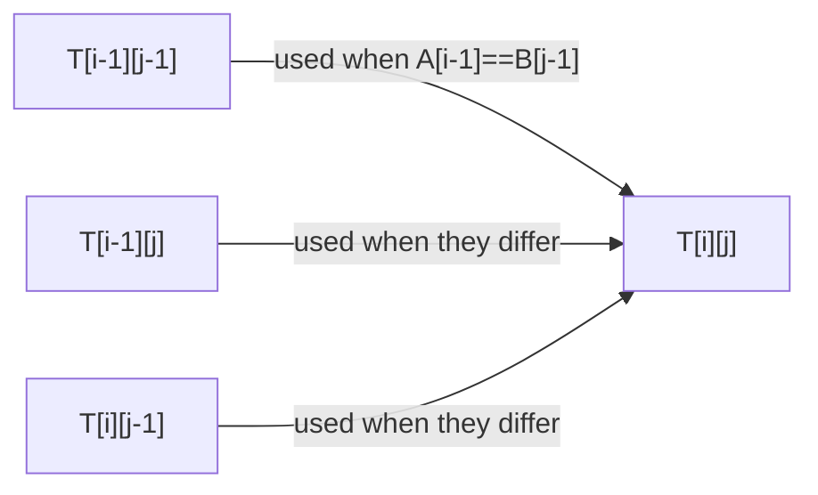

## Learning Objectives

- State the Longest Common Subsequence (LCS) problem precisely, and distinguish "subsequence" from "substring."
- Derive the two-way recurrence relating `LCS(i, j)` to smaller subproblems, based on whether the two strings' characters at positions `i` and `j` match.
- Fill a full two-dimensional DP table by hand for a pair of short strings, and read the LCS length off the finished table.
- Recover one actual longest common subsequence, not just its length, by tracing back through the filled table.
- Identify why LCS is the natural first two-dimensional DP example, after two one-dimensional ones.

## Context & Motivation

Every DP example so far — Fibonacci, grid paths — has had subproblems identified by a single shrinking parameter: one index counting down toward a base case. Longest Common Subsequence is the natural next step, because its subproblems are identified by *two* independently shrinking parameters — a position in each of two input strings — making it the canonical first example of a DP table with more than one dimension, a shape this discipline's remaining problems (0/1 Knapsack, next) will reuse directly.

The problem itself shows up constantly in practice: `diff`-style tools computing what changed between two versions of a file are, at their core, finding a longest common subsequence between the old and new text; DNA sequence comparison in bioinformatics is fundamentally an LCS-family computation; version-control merge algorithms rely on the same idea. What makes it a genuine DP problem, and not just an excuse to introduce a bigger table, is that it satisfies the requirements laid out at the start of this topic: a naive recursive solution comparing two strings position by position rediscovers the same `(i, j)` position pair through many different sequences of match/skip decisions (overlapping subproblems), and the longest common subsequence of two full strings is provably built from the longest common subsequence of some smaller prefix of each (optimal substructure) — exactly the two properties this discipline opened by requiring together.

## Core Theory

### Problem statement: subsequence, not substring

A **subsequence** of a string is obtained by deleting zero or more characters, without reordering what remains — unlike a *substring*, the remaining characters need not be contiguous. Given two strings `A` and `B`, the **Longest Common Subsequence** problem asks for the longest string that is a subsequence of both `A` and `B`. For example, given `A = "ABCBDAB"` and `B = "BDCABA"`, `"BCBA"` is a common subsequence of both (checkable by finding it, in order, with gaps allowed, inside each string) — and it turns out to be one of the longest possible, at length 4.

### The two-way recurrence

Let `LCS(i, j)` denote the length of the longest common subsequence of the first `i` characters of `A` and the first `j` characters of `B` (so `LCS(0, j) = LCS(i, 0) = 0` for any `i, j` — an empty prefix has no common subsequence with anything but length 0). The recurrence branches on whether the *last* characters of the two prefixes match:

- If `A[i-1] == B[j-1]` (the last characters of both prefixes match): that matching character can always be included in an optimal common subsequence of the two prefixes, so `LCS(i, j) = 1 + LCS(i-1, j-1)` — one more than the LCS of both prefixes with that matched character removed from each.
- If `A[i-1] != B[j-1]`: the matching subsequence can't use both of these last characters, so it either skips `A`'s last character (`LCS(i-1, j)`), or skips `B`'s last character (`LCS(i, j-1)`), and the correct answer is whichever of these two smaller subproblems is larger: `LCS(i, j) = max(LCS(i-1, j), LCS(i, j-1))`.

This recurrence has both properties in full: `LCS(i, j)` depends only on strictly smaller `(i', j')` pairs (optimal substructure — the correct final answer is built directly from correct answers to sub-prefixes), and different paths of match/skip decisions from `(len(A), len(B))` reach the same `(i, j)` pair repeatedly (overlapping subproblems) — exactly the pattern that makes tabulating a 2D table pay off.

### Filling the table

A table `T` of size `(len(A)+1) × (len(B)+1)` is filled with `T[i][j] = LCS(i, j)`, row by row (or column by column — either respects the dependency order, since every entry only needs the row above and/or the entry to its left), starting from the all-zero first row and column (the base case). Once filled, `T[len(A)][len(B)]` holds the length of the full LCS.

### Recovering the actual subsequence

The table alone gives the *length* of the LCS, but the sequence of decisions used to fill it (which of the three cases applied at each cell) can be walked backward from `T[len(A)][len(B)]` to `T[0][0]` to recover one actual longest common subsequence: at each `(i, j)`, if `A[i-1] == B[j-1]`, that character is part of the LCS and the trace moves diagonally to `(i-1, j-1)`; otherwise, the trace moves to whichever of `(i-1, j)` or `(i, j-1)` matches the value stored at `T[i][j]` (the one the `max` actually came from). This backward walk, collecting matched characters as it goes and reversing them at the end, reconstructs an actual LCS string, not just its length.

## Worked Examples

### Example 1 — filling a full table by hand for two short strings

**Problem:** Find the LCS of `A = "ABC"` and `B = "AC"`.

| | "" | A | C |
|---|---|---|---|
| **""** | 0 | 0 | 0 |
| **A** | 0 | 1 | 1 |
| **B** | 0 | 1 | 1 |
| **C** | 0 | 1 | 2 |

Reading a few cells: `T[1][1]` compares `A[0]='A'` against `B[0]='A'` — they match, so `T[1][1] = 1 + T[0][0] = 1`. `T[2][1]` compares `A[1]='B'` against `B[0]='A'` — no match, so `T[2][1] = max(T[1][1], T[2][0]) = max(1, 0) = 1`. `T[3][2]` compares `A[2]='C'` against `B[1]='C'` — they match, so `T[3][2] = 1 + T[2][1] = 1 + 1 = 2`. The final cell `T[3][2] = 2` gives the LCS length; tracing back from there (`C` matches at `(3,2)` → diagonal to `(2,1)`; `A[1]='B'` vs `B[0]='A'` don't match at `(2,1)`, and `T[2][1] = T[1][1]`, so move up to `(1,1)`; `A[0]='A'` matches `B[0]='A'` at `(1,1)` → diagonal to `(0,0)`, done) recovers the subsequence `"AC"`.

### Example 2 — a slightly larger table, read for length only

**Problem:** Find the length of the LCS of `A = "ABCBDAB"` and `B = "BDCABA"` (the example from the Context section).

Filling the full `8×7` table by the same recurrence (omitted cell-by-cell here for space, but built exactly as in Example 1) produces a final cell value of `4`, matching the earlier claim that `"BCBA"` (length 4) is one longest common subsequence — a trace-back through the completed table would confirm `"BCBA"` (or another length-4 subsequence, since ties are possible) as an actual witness.

### Example 3 — confirming overlapping subproblems concretely

**Problem:** Show directly that a naive (unmemoized, un-tabulated) recursive implementation of the recurrence revisits the same `(i, j)` pair more than once.

A naive recursive `lcs(i, j)` implementing the branch above, called as `lcs(3, 2)` on `A="ABC"`, `B="AC"`: since `A[2]='C' == B[1]='C'`, it calls `lcs(2, 1)`. Separately, consider what happens deeper in a larger example where a mismatch branch is taken at some `(i, j)`: it calls both `lcs(i-1, j)` and `lcs(i, j-1)`, and if a *later* mismatch also occurs one row over, both of those calls can independently arrive back at the same `(i-2, j-1)` pair — the same structural redundancy Fibonacci showed with a single index, now happening across a 2D grid of possible `(i, j)` pairs. Exactly as with Fibonacci, this is what tabulating the full table (or memoizing the recursive version, keyed on the pair `(i, j)`) eliminates, computing each of the `O(len(A) × len(B))` distinct pairs exactly once instead of along every path that reaches it.

## Common Misconceptions & Pitfalls

- **"LCS finds a common substring, so the result must be contiguous."** LCS explicitly allows gaps — `"AC"` in Example 1 is not contiguous in `A = "ABC"` (the `B` is skipped) but is still a valid subsequence. The related but different "longest common *substring*" problem requires contiguity and uses a different recurrence.
- **"When the last characters don't match, just pick whichever of `A` or `B` is 'ahead.'"** The recurrence's mismatch case takes the max of *both* `LCS(i-1, j)` and `LCS(i, j-1)` — skipping only one side's last character at a time and comparing — not a heuristic guess about which string to advance; both possibilities must be computed and compared, since either could turn out to be larger depending on the rest of both strings.
- **"The table gives you the actual subsequence, not just its length."** The table's numeric entries only encode length; recovering an actual LCS string requires the separate backward trace-back described in Core Theory, following which branch produced each cell's value.
- **"There's only ever one longest common subsequence."** Ties are common — different (i,j) trace-back paths can recover different, equally-long valid subsequences; the table only guarantees length is correct and maximal, not that the recovered string is unique.

## Summary

Longest Common Subsequence asks for the longest string that is a (not-necessarily-contiguous) subsequence of both of two given strings, and its DP recurrence branches on whether the two strings' last characters match: if they do, `LCS(i,j) = 1 + LCS(i-1,j-1)`; if not, `LCS(i,j) = max(LCS(i-1,j), LCS(i,j-1))`. Filling a two-dimensional table by this recurrence — demonstrated by hand for `"ABC"` and `"AC"`, landing on length 2 and recoverable subsequence `"AC"` — computes every one of the `O(len(A) × len(B))` distinct `(i,j)` subproblems exactly once, avoiding the redundant recomputation a naive recursive version would otherwise repeat across many different match/skip decision paths reaching the same pair. Recovering an actual longest common subsequence (not just its length) requires tracing backward through the filled table, following whichever branch produced each cell's stored value. This is the first DP example in the discipline whose subproblems are indexed by two independently shrinking parameters — the shape the next concept, 0/1 Knapsack, also uses.

## Documentation Links

- [MIT 6.006 — Lecture Notes (OCW)](https://ocw.mit.edu/courses/6-006-introduction-to-algorithms-spring-2020/pages/lecture-notes/) — doc
- [Sedgewick & Wayne — Algorithms Lectures (Princeton)](https://algs4.cs.princeton.edu/lectures/) — doc
