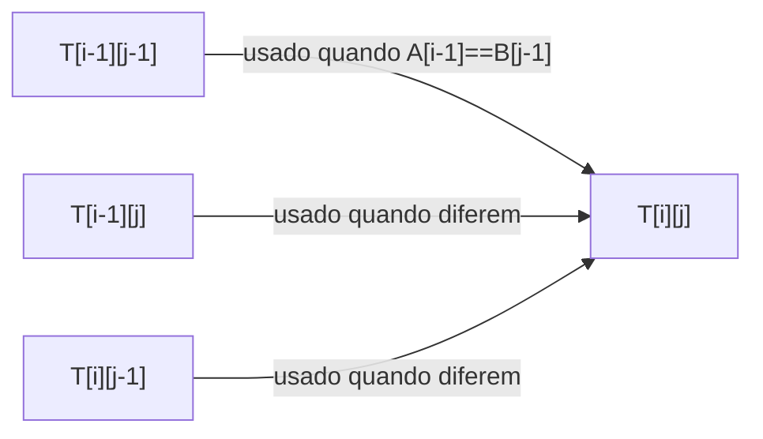

## Objetivos de Aprendizagem

- Enunciar o problema de Subsequência Comum Mais Longa (LCS) precisamente, e distinguir "subsequência" de "substring."
- Derivar a recorrência de duas vias relacionando `LCS(i, j)` a subproblemas menores, baseada em se os caracteres das duas strings nas posições `i` e `j` combinam.
- Preencher uma tabela de DP bidimensional completa manualmente para um par de strings curtas, e ler o comprimento da LCS na tabela terminada.
- Recuperar uma subsequência comum mais longa real, não só seu comprimento, rastreando de volta através da tabela preenchida.
- Identificar por que LCS é o primeiro exemplo natural de DP bidimensional, depois de dois unidimensionais.

## Contexto e Motivação

Todo exemplo de DP até agora, Fibonacci, caminhos em grid, teve subproblemas identificados por um único parâmetro encolhendo: um índice contando para baixo em direção a um caso base. Subsequência Comum Mais Longa é o próximo passo natural, porque seus subproblemas são identificados por *dois* parâmetros encolhendo independentemente, uma posição em cada uma de duas strings de entrada, tornando-o o primeiro exemplo canônico de uma tabela de DP com mais de uma dimensão, um formato que os problemas restantes desta disciplina (Mochila 0/1, em seguida) reutilizarão diretamente.

O problema em si aparece constantemente na prática: ferramentas estilo `diff` calculando o que mudou entre duas versões de um arquivo são, em seu núcleo, encontrando uma subsequência comum mais longa entre o texto antigo e o novo; comparação de sequência de DNA em bioinformática é fundamentalmente uma computação da família LCS; algoritmos de merge de controle de versão dependem da mesma ideia. O que o torna um problema de DP genuíno, e não apenas uma desculpa para introduzir uma tabela maior, é que satisfaz os requisitos estabelecidos no início deste tópico: uma solução recursiva ingênua comparando duas strings posição por posição redescobre o mesmo par de posição `(i, j)` através de muitas sequências diferentes de decisões combinar/pular (subproblemas sobrepostos), e a subsequência comum mais longa de duas strings completas é comprovadamente construída a partir da subsequência comum mais longa de algum prefixo menor de cada uma (subestrutura ótima), exatamente as duas propriedades com as quais esta disciplina abriu exigindo juntas.

## Teoria Central

### Enunciado do problema: subsequência, não substring

Uma **subsequência** de uma string é obtida deletando zero ou mais caracteres, sem reordenar o que resta, diferente de uma *substring*, os caracteres restantes não precisam ser contíguos. Dadas duas strings `A` e `B`, o problema da **Subsequência Comum Mais Longa** pede a string mais longa que é uma subsequência tanto de `A` quanto de `B`. Por exemplo, dado `A = "ABCBDAB"` e `B = "BDCABA"`, `"BCBA"` é uma subsequência comum de ambas (verificável encontrando-a, em ordem, com lacunas permitidas, dentro de cada string), e acontece de ser uma das mais longas possíveis, com comprimento 4.

### A recorrência de duas vias

Seja `LCS(i, j)` denotando o comprimento da subsequência comum mais longa dos primeiros `i` caracteres de `A` e os primeiros `j` caracteres de `B` (então `LCS(0, j) = LCS(i, 0) = 0` para qualquer `i, j`, um prefixo vazio não tem subsequência comum com nada além de comprimento 0). A recorrência se ramifica em se os *últimos* caracteres dos dois prefixos combinam:

- Se `A[i-1] == B[j-1]` (os últimos caracteres de ambos os prefixos combinam): aquele caractere combinado sempre pode ser incluído em uma subsequência comum ótima dos dois prefixos, então `LCS(i, j) = 1 + LCS(i-1, j-1)`, um a mais que a LCS de ambos os prefixos com aquele caractere combinado removido de cada.
- Se `A[i-1] != B[j-1]`: a subsequência combinante não pode usar ambos esses últimos caracteres, então ou pula o último caractere de `A` (`LCS(i-1, j)`), ou pula o último caractere de `B` (`LCS(i, j-1)`), e a resposta correta é qualquer que seja desses dois subproblemas menores que for maior: `LCS(i, j) = max(LCS(i-1, j), LCS(i, j-1))`.

Essa recorrência tem ambas as propriedades por completo: `LCS(i, j)` depende apenas de pares `(i', j')` estritamente menores (subestrutura ótima, a resposta final correta é construída diretamente a partir de respostas corretas a sub-prefixos), e caminhos diferentes de decisões combinar/pular a partir de `(len(A), len(B))` alcançam o mesmo par `(i, j)` repetidamente (subproblemas sobrepostos), exatamente o padrão que faz tabular uma tabela 2D valer a pena.

### Preenchendo a tabela

Uma tabela `T` de tamanho `(len(A)+1) × (len(B)+1)` é preenchida com `T[i][j] = LCS(i, j)`, linha por linha (ou coluna por coluna, ambas respeitam a ordem de dependência, já que toda entrada só precisa da linha acima e/ou da entrada à sua esquerda), começando da primeira linha e coluna todas zero (o caso base). Uma vez preenchida, `T[len(A)][len(B)]` guarda o comprimento da LCS completa.

### Recuperando a subsequência real

A tabela sozinha dá o *comprimento* da LCS, mas a sequência de decisões usada para preenchê-la (qual dos três casos se aplicou em cada célula) pode ser percorrida para trás de `T[len(A)][len(B)]` até `T[0][0]` para recuperar uma subsequência comum mais longa real: em cada `(i, j)`, se `A[i-1] == B[j-1]`, aquele caractere é parte da LCS e o rastreamento se move diagonalmente para `(i-1, j-1)`; caso contrário, o rastreamento se move para qualquer que seja `(i-1, j)` ou `(i, j-1)` que combine com o valor armazenado em `T[i][j]` (de qual o `max` de fato veio). Essa caminhada reversa, coletando caracteres combinados ao longo do caminho e invertendo-os no fim, reconstrói uma string LCS real, não só seu comprimento.

## Exemplos Resolvidos

### Exemplo 1 — preenchendo uma tabela completa manualmente para duas strings curtas

**Problema:** Encontre a LCS de `A = "ABC"` e `B = "AC"`.

| | "" | A | C |
|---|---|---|---|
| **""** | 0 | 0 | 0 |
| **A** | 0 | 1 | 1 |
| **B** | 0 | 1 | 1 |
| **C** | 0 | 1 | 2 |

Lendo algumas células: `T[1][1]` compara `A[0]='A'` contra `B[0]='A'`, combinam, então `T[1][1] = 1 + T[0][0] = 1`. `T[2][1]` compara `A[1]='B'` contra `B[0]='A'`, sem combinação, então `T[2][1] = max(T[1][1], T[2][0]) = max(1, 0) = 1`. `T[3][2]` compara `A[2]='C'` contra `B[1]='C'`, combinam, então `T[3][2] = 1 + T[2][1] = 1 + 1 = 2`. A célula final `T[3][2] = 2` dá o comprimento da LCS; rastreando de volta a partir dali (`C` combina em `(3,2)` → diagonal para `(2,1)`; `A[1]='B'` vs `B[0]='A'` não combinam em `(2,1)`, e `T[2][1] = T[1][1]`, então move para cima para `(1,1)`; `A[0]='A'` combina `B[0]='A'` em `(1,1)` → diagonal para `(0,0)`, terminado) recupera a subsequência `"AC"`.

### Exemplo 2 — uma tabela um pouco maior, lida só pelo comprimento

**Problema:** Encontre o comprimento da LCS de `A = "ABCBDAB"` e `B = "BDCABA"` (o exemplo da seção de Contexto).

Preencher a tabela `8×7` completa pela mesma recorrência (omitida célula por célula aqui por espaço, mas construída exatamente como no Exemplo 1) produz um valor de célula final de `4`, combinando com a afirmação anterior de que `"BCBA"` (comprimento 4) é uma subsequência comum mais longa, um rastreamento reverso através da tabela completada confirmaria `"BCBA"` (ou outra subsequência de comprimento 4, já que empates são possíveis) como uma testemunha real.

### Exemplo 3 — confirmando subproblemas sobrepostos concretamente

**Problema:** Mostre diretamente que uma implementação recursiva ingênua (não memoizada, não tabulada) da recorrência revisita o mesmo par `(i, j)` mais de uma vez.

Um `lcs(i, j)` recursivo ingênuo implementando o ramo acima, chamado como `lcs(3, 2)` em `A="ABC"`, `B="AC"`: já que `A[2]='C' == B[1]='C'`, chama `lcs(2, 1)`. Separadamente, considere o que acontece mais fundo em um exemplo maior onde um ramo de não combinação é tomado em algum `(i, j)`: chama tanto `lcs(i-1, j)` quanto `lcs(i, j-1)`, e se uma não combinação *posterior* também ocorre uma linha adiante, ambas essas chamadas podem independentemente chegar de volta ao mesmo par `(i-2, j-1)`, a mesma redundância estrutural que Fibonacci mostrou com um único índice, agora acontecendo através de um grid 2D de pares `(i, j)` possíveis. Exatamente como com Fibonacci, isso é o que tabular a tabela completa (ou memoizar a versão recursiva, chaveada no par `(i, j)`) elimina, calculando cada um dos `O(len(A) × len(B))` pares distintos exatamente uma vez em vez de ao longo de todo caminho que o alcança.

## Equívocos Comuns e Armadilhas

- **"LCS encontra uma substring comum, então o resultado deve ser contíguo."** LCS explicitamente permite lacunas, `"AC"` no Exemplo 1 não é contíguo em `A = "ABC"` (o `B` é pulado) mas ainda é uma subsequência válida. O problema relacionado mas diferente de "substring comum mais longa" exige contiguidade e usa uma recorrência diferente.
- **"Quando os últimos caracteres não combinam, apenas escolha qual de `A` ou `B` está 'à frente'."** O caso de não combinação da recorrência toma o max de *ambos* `LCS(i-1, j)` e `LCS(i, j-1)`, pulando o último caractere de apenas um lado de cada vez e comparando, não um palpite heurístico sobre qual string avançar; ambas as possibilidades devem ser calculadas e comparadas, já que qualquer uma poderia acabar sendo maior dependendo do resto de ambas as strings.
- **"A tabela dá a subsequência real, não só seu comprimento."** As entradas numéricas da tabela só codificam comprimento; recuperar uma string LCS real exige o rastreamento reverso separado descrito na Teoria Central, seguindo qual ramo produziu o valor de cada célula.
- **"Só existe uma única subsequência comum mais longa."** Empates são comuns, caminhos de rastreamento reverso (i,j) diferentes podem recuperar subsequências válidas diferentes, igualmente longas; a tabela só garante que o comprimento é correto e máximo, não que a string recuperada é única.

## Resumo

Subsequência Comum Mais Longa pede a string mais longa que é uma subsequência (não necessariamente contígua) de ambas duas strings dadas, e sua recorrência de DP ramifica em se os últimos caracteres das duas strings combinam: se combinam, `LCS(i,j) = 1 + LCS(i-1,j-1)`; se não, `LCS(i,j) = max(LCS(i-1,j), LCS(i,j-1))`. Preencher uma tabela bidimensional por essa recorrência, demonstrado manualmente para `"ABC"` e `"AC"`, pousando em comprimento 2 e subsequência recuperável `"AC"`, calcula todo um dos `O(len(A) × len(B))` subproblemas distintos `(i,j)` exatamente uma vez, evitando o recálculo redundante que uma versão recursiva ingênua de outra forma repetiria através de muitos caminhos diferentes de decisão combinar/pular alcançando o mesmo par. Recuperar uma subsequência comum mais longa real (não só seu comprimento) exige rastrear para trás através da tabela preenchida, seguindo qual ramo produziu o valor armazenado de cada célula. Este é o primeiro exemplo de DP nesta disciplina cujos subproblemas são indexados por dois parâmetros encolhendo independentemente, o formato que o próximo conceito, Mochila 0/1, também usa.

## Documentation Links

- [MIT 6.006 — Lecture Notes (OCW)](https://ocw.mit.edu/courses/6-006-introduction-to-algorithms-spring-2020/pages/lecture-notes/) — doc
- [Sedgewick & Wayne — Algorithms Lectures (Princeton)](https://algs4.cs.princeton.edu/lectures/) — doc
