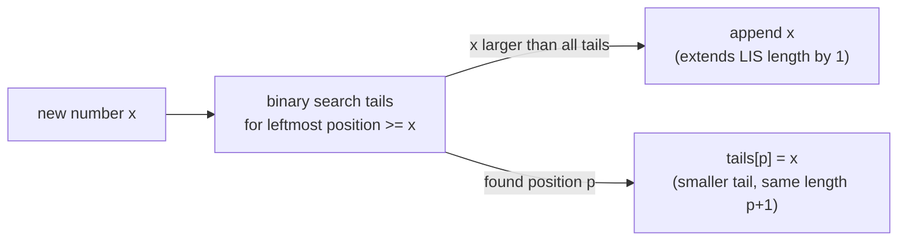

## Learning Objectives

- State the Longest Increasing Subsequence (LIS) problem precisely, and distinguish it from LCS despite both being "subsequence" problems.
- Derive and hand-trace the straightforward O(n²) DP recurrence for LIS.
- Explain the "smallest tail of an increasing subsequence of each length" invariant that the O(n log n) approach maintains.
- Trace the O(n log n) algorithm's binary search step by step on a small array, connecting it explicitly to binary search's generalized form covered earlier in this discipline.
- Compare the two approaches' time complexity and explain what the faster one trades away (recovering the actual subsequence becomes slightly more involved).

## Context & Motivation

Longest Increasing Subsequence closes out this discipline's run of "DP in Practice" concepts with a problem that looks, at first glance, like the simplest one-dimensional DP yet — a single list, a single shrinking index, nothing like LCS's two strings or Knapsack's two-parameter table. And the straightforward O(n²) solution genuinely is that simple: for each position, look back at everything smaller and earlier, and extend the best one found. What makes LIS worth a full concept of its own, rather than a quick example folded into an earlier one, is that this simple DP conceals a considerably faster O(n log n) solution — one that doesn't look like DP at all on the surface, trading the direct "look back at every earlier position" recurrence for a cleverer invariant maintained by binary search.

This also gives the discipline a chance to draw an explicit connection across topics that might otherwise look unrelated: the generalized binary-search idea covered earlier under `searching-beyond-binary-search` — searching a sorted structure for where some condition changes, not just for a literal known value — turns out to be exactly the tool the fast LIS algorithm needs. Seeing that connection concretely, rather than leaving it as a coincidence of both techniques using the word "binary search," is the other half of what this concept is for: real algorithmic ideas keep resurfacing in contexts that don't superficially resemble where they were first introduced, and LIS is a clean, worked example of exactly that.

## Core Theory

### Problem statement

Given a list of numbers, the **Longest Increasing Subsequence** problem asks for the length of the longest subsequence (elements in their original relative order, not necessarily contiguous — the same sense of "subsequence" used for LCS) that is *strictly* increasing. For `[10, 9, 2, 5, 3, 7, 101, 18]`, one longest increasing subsequence is `[2, 3, 7, 18]` (or `[2, 3, 7, 101]`), of length 4. Unlike LCS, which compares two separate sequences against each other, LIS looks for structure *within* a single sequence — a different problem shape, but one that turns out to admit both a familiar one-dimensional DP and a genuinely faster approach built on a different idea entirely.

### The straightforward O(n²) DP

Define `L(i)` as the length of the longest increasing subsequence that *ends exactly at* index `i` (not just any subsequence within the first `i` elements — specifically one whose last element is `a[i]`). For each `i`, look back at every earlier index `j < i` with `a[j] < a[i]`: any increasing subsequence ending at such a `j` can be extended by `a[i]`, giving a candidate length `L(j) + 1`. Taking the best such extension (or just `1`, for `a[i]` alone, if no earlier smaller element exists):

`L(i) = 1 + max({ L(j) : j < i and a[j] < a[i] } ∪ {0})`

The overall answer is `max(L(i))` across all `i` — the longest subsequence might end anywhere, not necessarily at the last index. This has optimal substructure (an increasing subsequence ending at `i` is built from an optimal one ending at some earlier, smaller-valued `j`) and overlapping subproblems (many different later indices' computations look back at the same earlier `L(j)`), computed via a simple double loop: for each `i`, scan every `j < i`. Filling `n` entries, each requiring an `O(n)` scan backward, gives `O(n²)` total time.

### The O(n log n) speed-up: smallest tail per length

The faster approach abandons the `L(i)`-per-index table entirely and instead maintains a single array, call it `tails`, where `tails[k]` holds the *smallest possible last value* of any increasing subsequence of length `k+1` discovered so far. This is the key invariant: `tails` is always itself sorted in increasing order (a longer increasing subsequence's smallest achievable tail is always at least as large as a shorter one's — a subtle but provable fact, since any subsequence of length `k+1` contains one of length `k` as a prefix, whose tail must be no larger), which is exactly what makes binary search legal on it.

Processing the array left to right, each new number `x` is handled by binary-searching `tails` for the leftmost position where `x` could sit while keeping `tails` sorted: if `x` is larger than every current tail, it extends the longest subsequence found so far by one (append it to `tails`); otherwise, `x` replaces the first tail value that is `>= x`, because `x` gives a strictly smaller (hence strictly more extensible-in-the-future) tail for an increasing subsequence of that same length, without changing how many lengths have been achieved so far. The final length of `tails` is the LIS length — though, notably, `tails` itself is generally *not* an actual increasing subsequence found in the array (it's a record of best-possible tails per length, not a single coherent sequence); recovering the actual subsequence, not just its length, needs a small amount of extra bookkeeping (tracking, alongside each replacement, which earlier index it extended) not shown here in full.

This binary search step is a direct instance of the generalized binary-search pattern covered earlier in this discipline (`searching-beyond-binary-search`): rather than searching literally for an item known to already be in the array, it searches a sorted structure for the correct insertion point of a value not yet present — the same "search a sorted structure for where a condition first becomes true (or false)" idea, applied here to "where does `x` fit among the current smallest tails" instead of "where is the rotation pivot" or a literal target value. Each of the `n` numbers processed does one `O(log n)` binary search, for total `O(n log n)` time — asymptotically faster than the `O(n²)` DP, at the cost of that extra bookkeeping if the actual subsequence, not just its length, is needed.

## Worked Examples

### Example 1 — the O(n²) DP, hand-traced

**Problem:** Find the LIS length of `[10, 9, 2, 5, 3, 7, 101, 18]` using the `L(i)` recurrence.

| i | a[i] | earlier j with a[j] < a[i] | L(i) |
|---|---|---|---|
| 0 | 10 | none | 1 |
| 1 | 9 | none | 1 |
| 2 | 2 | none | 1 |
| 3 | 5 | j=2 (a=2), L(2)=1 | 2 |
| 4 | 3 | j=2 (a=2), L(2)=1 | 2 |
| 5 | 7 | j=2,3,4 (a=2,5,3), best L=2 (from j=3 or j=4) | 3 |
| 6 | 101 | j=0..5 all qualify, best L=3 (from j=5) | 4 |
| 7 | 18 | j=2,3,4,5 qualify (a=2,5,3,7), best L=3 (from j=5) | 4 |

Maximum `L(i)` across the table is 4 (achieved at `i=6` and `i=7`), matching the LIS length claimed in Core Theory — witnessed concretely by `[2, 3, 7, 101]` (tracing `L(6)=4` back through `j=5, j=4 or 3, j=2`) or `[2, 3, 7, 18]` (tracing `L(7)=4` the same way).

### Example 2 — the O(n log n) approach, traced step by step

**Problem:** Process the same array, `[10, 9, 2, 5, 3, 7, 101, 18]`, maintaining `tails` and showing each binary search's outcome.

| number x | tails before | binary search result | tails after |
|---|---|---|---|
| 10 | [] | larger than all (empty) → append | [10] |
| 9 | [10] | 9 < 10, replaces position 0 | [9] |
| 2 | [9] | 2 < 9, replaces position 0 | [2] |
| 5 | [2] | larger than all → append | [2, 5] |
| 3 | [2, 5] | 3 < 5, replaces position 1 | [2, 3] |
| 7 | [2, 3] | larger than all → append | [2, 3, 7] |
| 101 | [2, 3, 7] | larger than all → append | [2, 3, 7, 101] |
| 18 | [2, 3, 7, 101] | 18 < 101, replaces position 3 | [2, 3, 7, 18] |

Final `tails = [2, 3, 7, 18]`, length 4 — matching Example 1's answer exactly. Note that `[2, 3, 7, 18]` here happens to coincide with an actual valid LIS witness, but this is not guaranteed in general; `tails` records the smallest achievable tail per length, which may drift away from any single coherent subsequence as more replacements happen (as the "18 replaces 101" step illustrates: `101` was a valid tail achieved earlier, but `18` is a strictly better one for future extension, even though `101` itself was never actually removed from the array).

### Example 3 — verifying the sortedness invariant that licenses binary search

**Problem:** Confirm that `tails` stays sorted after every single-element update in Example 2, since this is exactly what makes each binary search step valid.

Reading down the "tails after" column of Example 2's table: `[10]`, `[9]`, `[2]`, `[2,5]`, `[2,3]`, `[2,3,7]`, `[2,3,7,101]`, `[2,3,7,18]` — every one of these is sorted in increasing order at the moment it's produced. This is not a coincidence of this particular input: replacing `tails[p]` only ever happens with a value smaller than what was there, and only at the leftmost position where the new value is `>=` the current entry, which by construction can never place a value larger than its right neighbor or smaller than its left neighbor — preserving sortedness is an invariant of the update rule itself, not something that needs to be separately checked on each new input.

## Common Misconceptions & Pitfalls

- **"`tails` at the end IS an actual longest increasing subsequence in the array."** Example 2's note makes this explicit: `tails` records the best achievable tail *per length*, and can end up not corresponding to any single coherent subsequence actually present in the array, even though its *length* always correctly equals the LIS length.
- **"Binary searching `tails` is unrelated to binary search as covered earlier — this is a totally different search."** It is the same generalized pattern (searching a sorted structure for where a condition changes) applied to a new target: instead of locating a known value or a rotation point, it locates the correct insertion point for a value not yet in the structure — the same technique, a different question asked of it.
- **"The O(n²) and O(n log n) approaches solve different problems, since they don't obviously look alike."** Both compute the exact same quantity (LIS length) on the same input, and agree on every example above — the O(n log n) version is a genuinely different algorithmic idea (tracking best tails per length instead of best length ending at each index) that happens to compute the identical answer faster, not a different problem.
- **"Strictly increasing and non-decreasing (allowing equal adjacent values) are the same thing here."** LIS as defined requires strictly increasing; a sequence with repeated values (e.g., `[3, 3]`) is not itself a valid length-2 increasing subsequence under this definition — a common off-by-one-style error when adapting either approach to a "non-decreasing" variant, which needs a different comparison (`<=` in the binary search step) than the strictly-increasing version does.

## Summary

Longest Increasing Subsequence asks for the length of the longest strictly increasing subsequence of a single list, solvable by a straightforward O(n²) DP (`L(i) = 1 + max` over all smaller-valued earlier `L(j)`, hand-traced above to length 4 on `[10,9,2,5,3,7,101,18]`) or by a genuinely faster O(n log n) approach that maintains a `tails` array — the smallest achievable last value of an increasing subsequence of each length — updated by binary-searching for each new number's correct position, appending when it extends the longest subsequence found so far and replacing when it doesn't. That binary search step is a direct application of the generalized binary-search pattern covered earlier in this discipline, searching a sorted structure for an insertion point rather than a literal target. The `tails` array's length always correctly tracks the LIS length even though the array itself may not correspond to any single actual subsequence in the input — a subtlety worth holding onto if the actual subsequence, not just its length, needs to be recovered.

## Documentation Links

- [MIT 6.006 — Lecture Notes (OCW)](https://ocw.mit.edu/courses/6-006-introduction-to-algorithms-spring-2020/pages/lecture-notes/) — doc
- [Sedgewick & Wayne — Algorithms Lectures (Princeton)](https://algs4.cs.princeton.edu/lectures/) — doc
