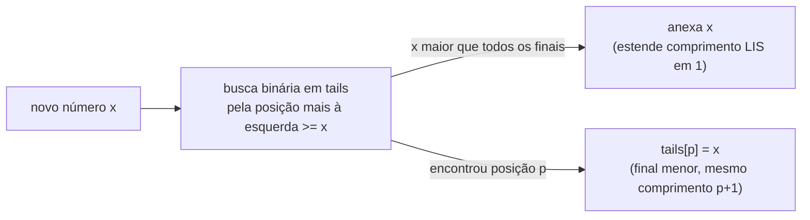

## Objetivos de Aprendizagem

- Enunciar o problema de Subsequência Crescente Mais Longa (LIS) precisamente, e distingui-lo de LCS apesar de ambos serem problemas de "subsequência."
- Derivar e rastrear manualmente a recorrência de DP O(n²) direta para LIS.
- Explicar o invariante de "menor final de uma subsequência crescente de cada comprimento" que a abordagem O(n log n) mantém.
- Rastrear o passo de busca binária do algoritmo O(n log n) passo a passo em um pequeno array, conectando-o explicitamente à forma generalizada de busca binária coberta anteriormente nesta disciplina.
- Comparar a complexidade de tempo das duas abordagens e explicar o que a mais rápida sacrifica (recuperar a subsequência real se torna ligeiramente mais envolvido).

## Contexto e Motivação

Subsequência Crescente Mais Longa fecha a sequência de conceitos "DP na Prática" desta disciplina com um problema que parece, à primeira vista, a DP unidimensional mais simples até agora, uma única lista, um único índice encolhendo, nada como as duas strings de LCS ou a tabela de dois parâmetros de Mochila. E a solução direta O(n²) genuinamente é tão simples: para cada posição, olhe para trás para tudo menor e anterior, e estenda o melhor encontrado. O que torna LIS digno de um conceito completo próprio, em vez de um exemplo rápido dobrado em um anterior, é que essa DP simples esconde uma solução consideravelmente mais rápida O(n log n), uma que não parece DP de forma alguma na superfície, trocando a recorrência direta "olhe para trás para toda posição anterior" por um invariante mais esperto mantido por busca binária.

Isso também dá à disciplina uma chance de traçar uma conexão explícita através de tópicos que de outra forma poderiam parecer não relacionados: a ideia generalizada de busca binária coberta anteriormente em `searching-beyond-binary-search`, buscar em uma estrutura ordenada onde alguma condição muda, não só para um valor literal conhecido, acaba sendo exatamente a ferramenta que o algoritmo rápido de LIS precisa. Ver essa conexão concretamente, em vez de deixá-la como uma coincidência de ambas as técnicas usarem a palavra "busca binária", é a outra metade do para quê este conceito serve: ideias algorítmicas reais continuam ressurgindo em contextos que não se assemelham superficialmente a onde foram primeiro introduzidas, e LIS é um exemplo resolvido limpo de exatamente isso.

## Teoria Central

### Enunciado do problema

Dada uma lista de números, o problema da **Subsequência Crescente Mais Longa** pede o comprimento da subsequência mais longa (elementos em sua ordem relativa original, não necessariamente contígua, o mesmo sentido de "subsequência" usado para LCS) que é *estritamente* crescente. Para `[10, 9, 2, 5, 3, 7, 101, 18]`, uma subsequência crescente mais longa é `[2, 3, 7, 18]` (ou `[2, 3, 7, 101]`), de comprimento 4. Diferente de LCS, que compara duas sequências separadas uma contra a outra, LIS procura estrutura *dentro* de uma única sequência, um formato de problema diferente, mas um que acaba admitindo tanto uma DP unidimensional familiar quanto uma abordagem genuinamente mais rápida construída sobre uma ideia inteiramente diferente.

### A DP O(n²) direta

Defina `L(i)` como o comprimento da subsequência crescente mais longa que *termina exatamente em* índice `i` (não qualquer subsequência dentro dos primeiros `i` elementos, especificamente uma cujo último elemento é `a[i]`). Para cada `i`, olhe para trás para todo índice anterior `j < i` com `a[j] < a[i]`: qualquer subsequência crescente terminando em tal `j` pode ser estendida por `a[i]`, dando um comprimento candidato `L(j) + 1`. Tomando a melhor tal extensão (ou apenas `1`, para `a[i]` sozinho, se nenhum elemento menor anterior existe):

`L(i) = 1 + max({ L(j) : j < i e a[j] < a[i] } ∪ {0})`

A resposta geral é `max(L(i))` através de todo `i`, a subsequência mais longa poderia terminar em qualquer lugar, não necessariamente no último índice. Isso tem subestrutura ótima (uma subsequência crescente terminando em `i` é construída a partir de uma ótima terminando em algum `j` anterior, de valor menor) e subproblemas sobrepostos (muitas computações de índices posteriores diferentes olham para trás para o mesmo `L(j)` anterior), calculado via um laço duplo simples: para cada `i`, varra todo `j < i`. Preencher `n` entradas, cada uma exigindo uma varredura reversa `O(n)`, dá tempo total `O(n²)`.

### A aceleração O(n log n): menor final por comprimento

A abordagem mais rápida abandona a tabela `L(i)`-por-índice inteiramente e em vez disso mantém um único array, chame-o `tails`, onde `tails[k]` guarda o *menor valor final possível* de qualquer subsequência crescente de comprimento `k+1` descoberta até agora. Esse é o invariante chave: `tails` está sempre ele próprio ordenado em ordem crescente (o menor final alcançável de uma subsequência crescente mais longa é sempre pelo menos tão grande quanto o de uma mais curta, um fato sutil mas demonstrável, já que qualquer subsequência de comprimento `k+1` contém uma de comprimento `k` como prefixo, cujo final deve ser não maior), que é exatamente o que torna busca binária legal nele.

Processando o array da esquerda para a direita, cada novo número `x` é tratado fazendo busca binária em `tails` pela posição mais à esquerda onde `x` poderia ficar mantendo `tails` ordenado: se `x` é maior que todo final atual, ele estende a subsequência mais longa encontrada até agora em um (anexe-o a `tails`); caso contrário, `x` substitui o primeiro valor de final que é `>= x`, porque `x` dá um final estritamente menor (portanto estritamente mais extensível-no-futuro) para uma subsequência crescente daquele mesmo comprimento, sem mudar quantos comprimentos foram alcançados até agora. O comprimento final de `tails` é o comprimento da LIS, embora, notavelmente, `tails` em si geralmente *não* seja uma subsequência crescente real encontrada no array (é um registro de melhores finais possíveis por comprimento, não uma única sequência coerente); recuperar a subsequência real, não só seu comprimento, precisa de uma pequena quantidade de contabilidade extra (rastreando, ao lado de cada substituição, qual índice anterior ela estendeu) não mostrada aqui por completo.

Esse passo de busca binária é uma instância direta do padrão de busca binária generalizada coberto anteriormente nesta disciplina (`searching-beyond-binary-search`): em vez de buscar literalmente por um item conhecido por já estar no array, busca em uma estrutura ordenada pelo ponto de inserção correto de um valor ainda não presente, a mesma ideia de "busque em uma estrutura ordenada onde uma condição primeiro se torna verdadeira (ou falsa)", aplicada aqui a "onde `x` se encaixa entre os finais mínimos atuais" em vez de "onde está o pivô da rotação" ou um valor alvo literal. Cada um dos `n` números processados faz uma busca binária `O(log n)`, para tempo total `O(n log n)`, assintoticamente mais rápido que a DP `O(n²)`, ao custo dessa contabilidade extra se a subsequência real, não só seu comprimento, é necessária.

## Exemplos Resolvidos

### Exemplo 1 — a DP O(n²), rastreada manualmente

**Problema:** Encontre o comprimento LIS de `[10, 9, 2, 5, 3, 7, 101, 18]` usando a recorrência `L(i)`.

| i | a[i] | j anterior com a[j] < a[i] | L(i) |
|---|---|---|---|
| 0 | 10 | nenhum | 1 |
| 1 | 9 | nenhum | 1 |
| 2 | 2 | nenhum | 1 |
| 3 | 5 | j=2 (a=2), L(2)=1 | 2 |
| 4 | 3 | j=2 (a=2), L(2)=1 | 2 |
| 5 | 7 | j=2,3,4 (a=2,5,3), melhor L=2 (de j=3 ou j=4) | 3 |
| 6 | 101 | j=0..5 todos se qualificam, melhor L=3 (de j=5) | 4 |
| 7 | 18 | j=2,3,4,5 se qualificam (a=2,5,3,7), melhor L=3 (de j=5) | 4 |

O `L(i)` máximo através da tabela é 4 (alcançado em `i=6` e `i=7`), combinando com o comprimento LIS afirmado na Teoria Central, testemunhado concretamente por `[2, 3, 7, 101]` (rastreando `L(6)=4` de volta através de `j=5, j=4 ou 3, j=2`) ou `[2, 3, 7, 18]` (rastreando `L(7)=4` da mesma forma).

### Exemplo 2 — a abordagem O(n log n), rastreada passo a passo

**Problema:** Processe o mesmo array, `[10, 9, 2, 5, 3, 7, 101, 18]`, mantendo `tails` e mostrando o resultado de cada busca binária.

| número x | tails antes | resultado da busca binária | tails depois |
|---|---|---|---|
| 10 | [] | maior que tudo (vazio) → anexa | [10] |
| 9 | [10] | 9 < 10, substitui posição 0 | [9] |
| 2 | [9] | 2 < 9, substitui posição 0 | [2] |
| 5 | [2] | maior que tudo → anexa | [2, 5] |
| 3 | [2, 5] | 3 < 5, substitui posição 1 | [2, 3] |
| 7 | [2, 3] | maior que tudo → anexa | [2, 3, 7] |
| 101 | [2, 3, 7] | maior que tudo → anexa | [2, 3, 7, 101] |
| 18 | [2, 3, 7, 101] | 18 < 101, substitui posição 3 | [2, 3, 7, 18] |

`tails` final = `[2, 3, 7, 18]`, comprimento 4, combinando exatamente com a resposta do Exemplo 1. Note que `[2, 3, 7, 18]` aqui acontece de coincidir com uma testemunha LIS válida real, mas isso não é garantido em geral; `tails` registra o menor final alcançável por comprimento, que pode se afastar de qualquer única subsequência coerente conforme mais substituições acontecem (como o passo "18 substitui 101" ilustra: `101` era um final válido alcançado anteriormente, mas `18` é estritamente melhor para extensão futura, mesmo que `101` em si nunca tenha de fato sido removido do array).

### Exemplo 3 — verificando o invariante de ordenação que licencia busca binária

**Problema:** Confirme que `tails` permanece ordenado depois de toda atualização de elemento único no Exemplo 2, já que isso é exatamente o que torna cada passo de busca binária válido.

Lendo pela coluna "tails depois" da tabela do Exemplo 2: `[10]`, `[9]`, `[2]`, `[2,5]`, `[2,3]`, `[2,3,7]`, `[2,3,7,101]`, `[2,3,7,18]`, cada um destes está ordenado em ordem crescente no momento em que é produzido. Isso não é coincidência dessa entrada particular: substituir `tails[p]` só jamais acontece com um valor menor que o que estava lá, e só na posição mais à esquerda onde o novo valor é `>=` a entrada atual, que por construção nunca pode colocar um valor maior que seu vizinho direito ou menor que seu vizinho esquerdo, preservar ordenação é um invariante da própria regra de atualização, não algo que precise ser verificado separadamente em cada nova entrada.

## Equívocos Comuns e Armadilhas

- **"`tails` no fim É uma subsequência crescente mais longa real no array."** A nota do Exemplo 2 torna isso explícito: `tails` registra o melhor final alcançável *por comprimento*, e pode acabar não correspondendo a nenhuma única subsequência coerente de fato presente no array, mesmo que seu *comprimento* sempre corretamente iguale o comprimento LIS.
- **"Busca binária em `tails` não está relacionada à busca binária coberta anteriormente, isso é uma busca totalmente diferente."** É o mesmo padrão generalizado (buscar em uma estrutura ordenada onde uma condição muda) aplicado a um novo alvo: em vez de localizar um valor conhecido ou um ponto de rotação, localiza o ponto de inserção correto para um valor ainda não na estrutura, a mesma técnica, uma pergunta diferente feita a ela.
- **"As abordagens O(n²) e O(n log n) resolvem problemas diferentes, já que não parecem obviamente iguais."** Ambas calculam a mesma quantidade exata (comprimento LIS) na mesma entrada, e concordam em todo exemplo acima, a versão O(n log n) é uma ideia algorítmica genuinamente diferente (rastreando melhores finais por comprimento em vez de melhor comprimento terminando em cada índice) que acontece de calcular a resposta idêntica mais rápido, não um problema diferente.
- **"Estritamente crescente e não decrescente (permitindo valores adjacentes iguais) são a mesma coisa aqui."** LIS conforme definido exige estritamente crescente; uma sequência com valores repetidos (por exemplo, `[3, 3]`) não é ela própria uma subsequência crescente de comprimento 2 válida sob essa definição, um erro comum de estilo fora-por-um ao adaptar qualquer abordagem para uma variante "não decrescente", que precisa de uma comparação diferente (`<=` no passo de busca binária) do que a versão estritamente crescente precisa.

## Resumo

Subsequência Crescente Mais Longa pede o comprimento da subsequência estritamente crescente mais longa de uma única lista, solucionável por uma DP O(n²) direta (`L(i) = 1 + max` sobre todo `L(j)` anterior de valor menor, rastreada manualmente acima para comprimento 4 em `[10,9,2,5,3,7,101,18]`) ou por uma abordagem genuinamente mais rápida O(n log n) que mantém um array `tails`, o menor valor final alcançável de uma subsequência crescente de cada comprimento, atualizado buscando binariamente pela posição correta de cada novo número, anexando quando estende a subsequência mais longa encontrada até agora e substituindo quando não estende. Esse passo de busca binária é uma aplicação direta do padrão de busca binária generalizada coberto anteriormente nesta disciplina, buscando em uma estrutura ordenada por um ponto de inserção em vez de um alvo literal. O comprimento do array `tails` sempre rastreia corretamente o comprimento LIS mesmo que o próprio array possa não corresponder a nenhuma única subsequência real na entrada, uma sutileza que vale a pena reter se a subsequência real, não só seu comprimento, precisa ser recuperada.

## Documentation Links

- [MIT 6.006 — Lecture Notes (OCW)](https://ocw.mit.edu/courses/6-006-introduction-to-algorithms-spring-2020/pages/lecture-notes/) — doc
- [Sedgewick & Wayne — Algorithms Lectures (Princeton)](https://algs4.cs.princeton.edu/lectures/) — doc
