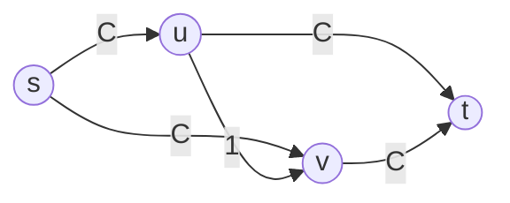

## Learning Objectives

- Construct a concrete network where an arbitrary choice of augmenting path forces far more iterations than a smarter choice would need.
- State the Edmonds-Karp rule: always choose the augmenting path with the fewest edges, found by running BFS on the residual graph.
- State, without necessarily reproducing the full proof, why this single rule bounds the total number of iterations by O(V·E), regardless of edge capacities.
- Compute Edmonds-Karp's overall running time from the per-iteration cost of a BFS and the O(V·E) iteration bound.
- Explain why this specific instantiation of Ford-Fulkerson's method is the one virtually every practical implementation actually uses.

## Context & Motivation

The Ford-Fulkerson method, as stated two concepts ago, deliberately left one question unanswered: which augmenting path should be chosen, when more than one exists? The method is correct no matter which choice is made, as the max-flow min-cut theorem guarantees, but "correct eventually" and "fast" are not the same promise, and it turns out the choice of path matters enormously for how many iterations "eventually" actually takes. With an unlucky or adversarial path-selection rule, the number of iterations can depend directly on the numeric size of the capacities involved, not just on the size of the graph, an unacceptable property for an algorithm whose input capacities could be arbitrarily large integers. This concept shows the problem concretely, then presents the fix: a specific, simple rule for which path to pick, due to Jack Edmonds and Richard Karp (1972), that guarantees a running time depending only on the graph's size, never on the capacities themselves.

## Core Theory

### A concrete network where the wrong choice is disastrously slow

Consider a network with vertices `s, u, v, t`, edges `s→u` and `s→v` and `u→t` and `v→t` each with capacity `C` (a large integer), and a single "bridge" edge `u→v` with capacity 1.



The maximum flow here is `2C`, achieved trivially by two disjoint paths, `s→u→t` (capacity `C`) and `s→v→t` (capacity `C`), never touching the bridge edge `u→v` at all. But suppose the algorithm instead first picks the path `s→u→v→t`: its bottleneck is `min(C, 1, C) = 1` (the bridge edge), so only 1 unit is pushed, and the bridge edge becomes saturated. The residual graph now has a backward edge `v→u` with residual capacity 1. If the algorithm's next choice is `s→v→u→t` (using that backward edge to "undo" the bridge), its bottleneck is again `min(C, 1, C) = 1`, pushing 1 more unit, but net progress is exactly 2 units of flow value per *pair* of iterations (one unit added to `f(s,u)`, one to `f(s,v)`), while the bridge edge flips from saturated to unsaturated and back, over and over. Reaching the true maximum of `2C` this way requires `C` such round trips, `2C` iterations total, purely because of one poorly chosen edge in one poorly chosen early path, compared to the 2 iterations a smarter choice needs. Since `C` can be an arbitrarily large integer with no relationship to the graph's actual size (number of vertices or edges), this means Ford-Fulkerson's running time, under an unlucky path-selection rule, is not bounded by any function of the graph's size alone.

### The Edmonds-Karp rule: shortest augmenting path by edge count

Edmonds and Karp's fix is a single, simple rule: at every iteration, choose the augmenting path with the *fewest edges* among all augmenting paths currently available, found by running an ordinary BFS on the residual graph `G_f` from `s` to `t` (treating every residual edge, forward or backward, as unweighted, exactly as BFS already treats an unweighted graph in this discipline's earlier concept on breadth-first search). On the network above, this rule immediately picks `s→u→t` or `s→v→t` first (2 edges each), never the 3-edge detour through the bridge, sidestepping the entire disastrous scenario.

### Why bounding path length bounds the iteration count: the distance-monotonicity argument

The key fact making this rule provably fast, stated here without reproducing its full proof in exhaustive detail, is a **monotonicity lemma**: over the entire run of the algorithm, the shortest-path distance (in number of edges) from `s` to any fixed vertex `v`, measured in the current residual graph, never decreases from one iteration to the next. Intuitively, augmenting along a shortest path can only add "long way around" residual edges (backward edges undoing what was just done), never a genuine shortcut, so no vertex can ever become *closer* to `s` than it already was.

This monotonicity is the engine behind a counting argument for how many times any single edge `(u, v)` can be the *critical* edge of an augmenting path (the bottleneck edge, whose residual capacity hits exactly 0 and is removed from the residual graph). Each time `(u, v)` is critical, the shortest-path distance to `v` at that moment equals the shortest-path distance to `u` plus 1. For `(u, v)` to become critical *again* later, it must first reappear in the residual graph, which only happens via a backward edge `(v, u)` being used, meaning the distance to `u` at that later point equals the distance to `v` at that point plus 1. Combining this with monotonicity (distances only ever increase) shows the distance to `u` must have increased by at least 2 between consecutive times `(u, v)` is critical. Since every distance is bounded between 0 and `V` (the number of vertices), any single edge can be critical at most `O(V)` times over the algorithm's entire run. With `O(E)` edges total, and every iteration having at least one critical edge (the bottleneck of that iteration's augmenting path), the total number of iterations is bounded by `O(V · E)`, a bound depending only on the graph's size, with no dependence whatsoever on the capacities.

### Overall running time

Each iteration runs one BFS on the residual graph to find the shortest augmenting path, costing `O(E)` (the residual graph has `O(E)` edges, since each original edge contributes at most a forward and a backward residual edge). Combined with the `O(V · E)` bound on the number of iterations, the Edmonds-Karp algorithm's total running time is:

```
O(V · E) iterations × O(E) per iteration = O(V · E²)
```

This is a genuine polynomial bound in the size of the input graph alone, in sharp contrast to the network shown in Core Theory, where an arbitrary path-selection rule's iteration count depended directly on the capacity value `C`, a number entirely unrelated to the graph's size and potentially exponentially larger than `V` or `E` in terms of the number of bits needed to represent it.

## Worked Examples

### Example 1: comparing iteration counts on the bridge-edge network for a specific capacity

**Problem:** For the network in Core Theory with `C = 500`, compare the number of iterations an arbitrary (unlucky) path-selection rule might take against the number Edmonds-Karp's BFS-based rule takes.

**Unlucky rule:** As Core Theory derived, repeatedly alternating through the capacity-1 bridge edge requires `C = 500` round trips, `2 × 500 = 1000` iterations, to reach the maximum flow of `2C = 1000`.

**Edmonds-Karp:** BFS from `s` finds `s→u→t` and `s→v→t` as the two shortest augmenting paths (2 edges each), strictly shorter than the 3-edge detour `s→u→v→t`. Pushing `C = 500` along each of these two paths in turn reaches the maximum flow of `1000` in exactly **2 iterations**. The gap, `1000` versus `2`, illustrates precisely why the path-selection rule, not just the underlying method, determines whether an implementation is practical.

### Example 2: counting how many times one edge can be critical, on a small graph

**Problem:** In a graph with 6 vertices, using the `O(V)` bound on how many times a single edge can be critical, give an upper bound on how many total iterations Edmonds-Karp could need if the graph has 8 edges.

**Applying the bound:** Each of the 8 edges can be critical at most `O(V) = O(6)` times (a small constant factor times 6, per the monotonicity argument), so the total number of critical-edge events, and therefore the total number of iterations (each iteration has at least one critical edge), is bounded by `O(V · E) = O(6 × 8) = O(48)`, a bound depending only on this graph's size, regardless of how large any individual edge's capacity happens to be, whether that capacity is 10 or 10 billion.

## Common Misconceptions & Pitfalls

- **"Ford-Fulkerson and Edmonds-Karp are two different algorithms for two different problems."** Edmonds-Karp is not a different method, it is Ford-Fulkerson's exact same method (find an augmenting path, push its bottleneck flow, repeat) with one specific, fully determined rule bolted onto the previously unspecified "which path?" choice: always the fewest-edges path, found by BFS.
- **"The number of iterations Ford-Fulkerson needs is always proportional to the graph's size, this is just a detail of implementation efficiency."** Core Theory's bridge-edge network is a direct counterexample: with an unlucky path choice, the iteration count scales with the capacity value `C`, which has no necessary relationship to the number of vertices or edges at all, and can require exponentially many iterations relative to the input's actual bit-length. This is precisely the problem Edmonds-Karp's rule fixes.
- **"Choosing the shortest augmenting path guarantees the fewest iterations in every single case, not just in the worst case."** The `O(V·E)` bound is a worst-case guarantee, not a claim that BFS-based selection is always literally optimal iteration-by-iteration; some specific instances might need fewer iterations under a different rule, but no rule can do better than `O(V·E)` in the worst case over all possible networks, and Edmonds-Karp is what guarantees that worst case is never exceeded.
- **"The monotonicity lemma says the algorithm's total flow value never decreases, which is obvious."** The lemma is about something more specific and less obvious: it is the *shortest-path distance from `s` to any fixed vertex*, in the residual graph, that never decreases across iterations, a structural fact about the residual graph's evolving shape, not a statement about the flow's value (which of course only ever increases, separately and for a different reason).

## Summary

An arbitrary choice of augmenting path can make Ford-Fulkerson's iteration count depend directly on the numeric size of the edge capacities, as the bridge-edge network shows concretely, an unlucky sequence of choices needing `2C` iterations where a smarter choice needs only 2. Edmonds and Karp's fix is a single rule: always choose the shortest augmenting path by edge count, found via BFS on the residual graph. A monotonicity lemma, the shortest-path distance from `s` to any vertex never decreases across iterations, drives a counting argument showing any single edge can be the bottleneck ("critical") of an augmenting path at most `O(V)` times over the whole run, giving a total iteration count of `O(V·E)`, a bound depending only on the graph's size, never on the capacities. Combined with each BFS costing `O(E)`, the Edmonds-Karp algorithm runs in `O(V·E²)`, a genuinely polynomial guarantee that is precisely why this specific instantiation, rather than an arbitrary-path version of Ford-Fulkerson, is what real implementations reach for. This closes out this discipline's treatment of network flow: the problem defined, the method that solves it, the duality theorem proving that method correct, and the specific rule that makes it provably fast.

## Documentation Links

- [Edmonds, J., & Karp, R. M. (1972). "Theoretical Improvements in Algorithmic Efficiency for Network Flow Problems." Journal of the ACM.](https://dl.acm.org/doi/10.1145/321694.321699): paper
- [MIT 6.006 - Lecture Notes (OCW)](https://ocw.mit.edu/courses/6-006-introduction-to-algorithms-spring-2020/pages/lecture-notes/): doc
