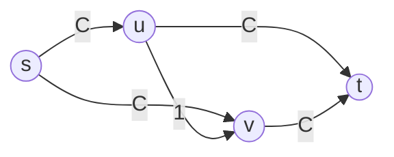

## Objetivos de Aprendizagem

- Construir uma rede concreta onde uma escolha arbitrária de caminho de aumento força muito mais iterações do que uma escolha mais inteligente precisaria.
- Enunciar a regra de Edmonds-Karp: sempre escolha o caminho de aumento com menos arestas, encontrado rodando BFS no grafo residual.
- Enunciar, sem necessariamente reproduzir a prova completa, por que essa única regra limita o número total de iterações a O(V·E), independente das capacidades das arestas.
- Calcular o tempo de execução total de Edmonds-Karp a partir do custo por iteração de uma BFS e do limite de iterações O(V·E).
- Explicar por que essa instanciação específica do método de Ford-Fulkerson é a que praticamente toda implementação prática de fato usa.

## Contexto e Motivação

O método de Ford-Fulkerson, como enunciado dois conceitos atrás, deliberadamente deixou uma pergunta sem resposta: qual caminho de aumento deveria ser escolhido, quando mais de um existe? O método é correto não importa qual escolha seja feita, como o teorema do fluxo máximo/corte mínimo garante, mas "correto eventualmente" e "rápido" não são a mesma promessa, e acontece que a escolha do caminho importa enormemente para quantas iterações esse "eventualmente" de fato leva. Com uma regra de seleção de caminho azarada ou adversarial, o número de iterações pode depender diretamente do tamanho numérico das capacidades envolvidas, não só do tamanho do grafo, uma propriedade inaceitável para um algoritmo cujas capacidades de entrada poderiam ser inteiros arbitrariamente grandes. Este conceito mostra o problema concretamente, depois apresenta a correção: uma regra específica e simples para qual caminho escolher, devida a Jack Edmonds e Richard Karp (1972), que garante um tempo de execução dependendo só do tamanho do grafo, nunca das próprias capacidades.

## Teoria Central

### Uma rede concreta onde a escolha errada é desastrosamente lenta

Considere uma rede com vértices `s, u, v, t`, arestas `s→u` e `s→v` e `u→t` e `v→t` cada uma com capacidade `C` (um inteiro grande), e uma única aresta "ponte" `u→v` com capacidade 1.



O fluxo máximo aqui é `2C`, alcançado trivialmente por dois caminhos disjuntos, `s→u→t` (capacidade `C`) e `s→v→t` (capacidade `C`), sem nunca tocar a aresta ponte `u→v`. Mas suponha que o algoritmo em vez disso escolha primeiro o caminho `s→u→v→t`: seu gargalo é `min(C, 1, C) = 1` (a aresta ponte), então só 1 unidade é empurrada, e a aresta ponte fica saturada. O grafo residual agora tem uma aresta reversa `v→u` com residual 1. Se a próxima escolha do algoritmo for `s→v→u→t` (usando essa aresta reversa para "desfazer" a ponte), seu gargalo é novamente `min(C, 1, C) = 1`, empurrando mais 1 unidade, mas o progresso líquido é exatamente 2 unidades de valor de fluxo a cada *par* de iterações (uma unidade adicionada a `f(s,u)`, uma a `f(s,v)`), enquanto a aresta ponte alterna entre saturada e não saturada, repetidamente. Alcançar o verdadeiro máximo de `2C` dessa forma exige `C` dessas idas e voltas, `2C` iterações no total, puramente por causa de uma aresta mal escolhida em um caminho inicial mal escolhido, comparado às 2 iterações que uma escolha mais inteligente precisa. Já que `C` pode ser um inteiro arbitrariamente grande sem nenhuma relação com o tamanho real da rede (número de vértices ou arestas), isso significa que o tempo de execução de Ford-Fulkerson, sob uma regra de seleção de caminho azarada, não é limitado por nenhuma função do tamanho do grafo sozinho.

### A regra de Edmonds-Karp: caminho de aumento mais curto por contagem de arestas

A correção de Edmonds e Karp é uma única regra simples: em toda iteração, escolha o caminho de aumento com o *menor número de arestas* entre todos os caminhos de aumento atualmente disponíveis, encontrado rodando uma BFS comum no grafo residual `G_f` de `s` a `t` (tratando toda aresta residual, direta ou reversa, como não ponderada, exatamente como a BFS já trata um grafo não ponderado no conceito anterior desta disciplina sobre busca em largura). Na rede acima, essa regra escolhe imediatamente `s→u→t` ou `s→v→t` primeiro (2 arestas cada), nunca o desvio de 3 arestas pela ponte, evitando inteiramente o cenário desastroso.

### Por que limitar o comprimento do caminho limita a contagem de iterações: o argumento de monotonicidade de distância

O fato chave que torna essa regra comprovadamente rápida, enunciado aqui sem reproduzir sua prova completa em detalhe exaustivo, é um **lema de monotonicidade**: ao longo de toda a execução do algoritmo, a distância de caminho mínimo (em número de arestas) de `s` até qualquer vértice fixo `v`, medida no grafo residual atual, nunca diminui de uma iteração para a próxima. Intuitivamente, aumentar ao longo de um caminho mais curto só pode adicionar arestas residuais de "volta por cima" (arestas reversas desfazendo o que acabou de ser feito), nunca um atalho genuíno, então nenhum vértice pode jamais ficar *mais perto* de `s` do que já estava.

Essa monotonicidade é o motor por trás de um argumento de contagem para quantas vezes uma única aresta `(u, v)` pode ser a aresta *crítica* de um caminho de aumento (a aresta de gargalo, cuja capacidade residual chega exatamente a 0 e é removida do grafo residual). Toda vez que `(u, v)` é crítica, a distância de caminho mínimo até `v` naquele momento é igual à distância de caminho mínimo até `u` mais 1. Para que `(u, v)` se torne crítica *novamente* depois, ela precisa primeiro reaparecer no grafo residual, o que só acontece através do uso de uma aresta reversa `(v, u)`, significando que a distância até `u` naquele ponto posterior é igual à distância até `v` naquele ponto mais 1. Combinar isso com a monotonicidade (distâncias só aumentam) mostra que a distância até `u` precisa ter aumentado em pelo menos 2 entre vezes consecutivas em que `(u, v)` é crítica. Já que toda distância é limitada entre 0 e `V` (o número de vértices), qualquer aresta única pode ser crítica no máximo `O(V)` vezes ao longo de toda a execução do algoritmo. Com `O(E)` arestas no total, e toda iteração tendo pelo menos uma aresta crítica (o gargalo do caminho de aumento daquela iteração), o número total de iterações é limitado por `O(V · E)`, um limite dependendo só do tamanho do grafo, sem nenhuma dependência das capacidades.

### Tempo de execução total

Cada iteração roda uma BFS no grafo residual para encontrar o caminho de aumento mais curto, custando `O(E)` (o grafo residual tem `O(E)` arestas, já que toda aresta original contribui no máximo uma aresta residual direta e uma reversa). Combinado com o limite `O(V · E)` no número de iterações, o tempo de execução total do algoritmo de Edmonds-Karp é:

```
O(V · E) iterações × O(E) por iteração = O(V · E²)
```

Este é um limite genuinamente polinomial no tamanho do grafo de entrada sozinho, em contraste marcante com a rede mostrada na Teoria Central, onde a contagem de iterações de uma regra de seleção de caminho arbitrária dependia diretamente do valor da capacidade `C`, um número inteiramente não relacionado ao tamanho do grafo e potencialmente exponencialmente maior que `V` ou `E` em termos do número de bits necessários para representá-lo.

## Exemplos Resolvidos

### Exemplo 1: comparando contagens de iteração na rede da aresta ponte para uma capacidade específica

**Problema:** Para a rede na Teoria Central com `C = 500`, compare o número de iterações que uma regra de seleção de caminho arbitrária (azarada) poderia levar contra o número que a regra baseada em BFS de Edmonds-Karp leva.

**Regra azarada:** Como a Teoria Central derivou, alternar repetidamente pela aresta ponte de capacidade 1 exige `C = 500` idas e voltas, `2 × 500 = 1000` iterações, para alcançar o fluxo máximo de `2C = 1000`.

**Edmonds-Karp:** BFS a partir de `s` encontra `s→u→t` e `s→v→t` como os dois caminhos de aumento mais curtos (2 arestas cada), estritamente mais curtos que o desvio de 3 arestas `s→u→v→t`. Empurrar `C = 500` por cada um desses dois caminhos, em sequência, alcança o fluxo máximo de `1000` em exatamente **2 iterações**. A diferença, `1000` contra `2`, ilustra precisamente por que a regra de seleção de caminho, não só o método subjacente, determina se uma implementação é prática.

### Exemplo 2: contando quantas vezes uma aresta pode ser crítica, em um grafo pequeno

**Problema:** Em um grafo com 6 vértices, usando o limite `O(V)` de quantas vezes uma única aresta pode ser crítica, dê um limite superior de quantas iterações totais Edmonds-Karp poderia precisar se o grafo tiver 8 arestas.

**Aplicando o limite:** Cada uma das 8 arestas pode ser crítica no máximo `O(V) = O(6)` vezes (um pequeno fator constante vezes 6, pelo argumento de monotonicidade), então o número total de eventos de aresta crítica, e portanto o número total de iterações (toda iteração tem pelo menos uma aresta crítica), é limitado por `O(V · E) = O(6 × 8) = O(48)`, um limite dependendo só do tamanho deste grafo, independente de quão grande a capacidade de qualquer aresta individual seja, seja essa capacidade 10 ou 10 bilhões.

## Equívocos Comuns e Armadilhas

- **"Ford-Fulkerson e Edmonds-Karp são dois algoritmos diferentes para dois problemas diferentes."** Edmonds-Karp não é um método diferente, é o mesmo método exato de Ford-Fulkerson (encontre um caminho de aumento, empurre seu fluxo de gargalo, repita) com uma regra específica e totalmente determinada acoplada à escolha antes não especificada de "qual caminho?": sempre o caminho com menos arestas, encontrado por BFS.
- **"O número de iterações que Ford-Fulkerson precisa é sempre proporcional ao tamanho do grafo, isso é só um detalhe de eficiência de implementação."** A rede da aresta ponte da Teoria Central é um contraexemplo direto: com uma escolha de caminho azarada, a contagem de iterações escala com o valor da capacidade `C`, que não tem nenhuma relação necessária com o número de vértices ou arestas, e pode exigir exponencialmente mais iterações em relação ao comprimento em bits real da entrada. Essa é precisamente a questão que a regra de Edmonds-Karp corrige.
- **"Escolher o caminho de aumento mais curto garante o menor número de iterações em todo caso individual, não só no pior caso."** O limite `O(V·E)` é uma garantia de pior caso, não uma afirmação de que a seleção baseada em BFS é sempre literalmente ótima iteração por iteração; algumas instâncias específicas poderiam precisar de menos iterações sob uma regra diferente, mas nenhuma regra pode fazer melhor que `O(V·E)` no pior caso sobre todas as redes possíveis, e Edmonds-Karp é o que garante que esse pior caso nunca é excedido.
- **"O lema de monotonicidade diz que o valor total do fluxo do algoritmo nunca diminui, o que é óbvio."** O lema é sobre algo mais específico e menos óbvio: é a *distância de caminho mínimo de `s` até qualquer vértice fixo*, no grafo residual, que nunca diminui entre iterações, um fato estrutural sobre a forma em evolução do grafo residual, não uma afirmação sobre o valor do fluxo (que naturalmente só aumenta, separadamente e por uma razão diferente).

## Resumo

Uma escolha arbitrária de caminho de aumento pode fazer a contagem de iterações de Ford-Fulkerson depender diretamente do tamanho numérico das capacidades das arestas, como a rede da aresta ponte mostra concretamente, uma sequência azarada de escolhas precisando de `2C` iterações onde uma escolha mais inteligente precisa de apenas 2. A correção de Edmonds e Karp é uma única regra: sempre escolha o caminho de aumento mais curto por contagem de arestas, encontrado via BFS no grafo residual. Um lema de monotonicidade, a distância de caminho mínimo de `s` até qualquer vértice nunca diminui entre iterações, impulsiona um argumento de contagem mostrando que qualquer aresta única pode ser o gargalo ("crítica") de um caminho de aumento no máximo `O(V)` vezes ao longo de toda a execução, dando uma contagem total de iterações de `O(V·E)`, um limite dependendo só do tamanho do grafo, nunca das capacidades. Combinado com cada BFS custando `O(E)`, o algoritmo de Edmonds-Karp roda em `O(V·E²)`, uma garantia genuinamente polinomial que é precisamente por que essa instanciação específica, em vez de uma versão de caminho arbitrário de Ford-Fulkerson, é o que implementações reais de fato usam. Isso encerra o tratamento desta disciplina sobre fluxo em redes: o problema definido, o método que o resolve, o teorema de dualidade provando esse método correto, e a regra específica que o torna comprovadamente rápido.

## Documentation Links

- [Edmonds, J., & Karp, R. M. (1972). "Theoretical Improvements in Algorithmic Efficiency for Network Flow Problems." Journal of the ACM.](https://dl.acm.org/doi/10.1145/321694.321699): paper
- [MIT 6.006 - Lecture Notes (OCW)](https://ocw.mit.edu/courses/6-006-introduction-to-algorithms-spring-2020/pages/lecture-notes/): doc
