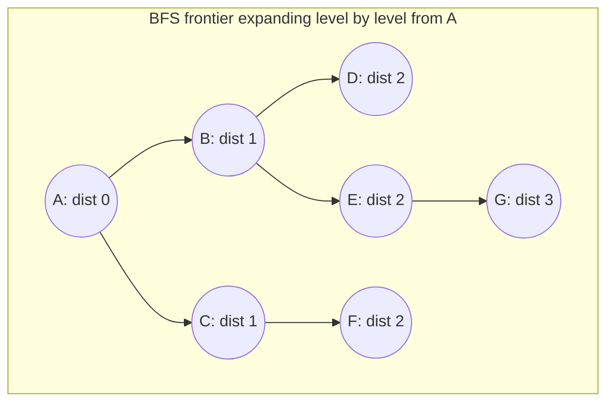
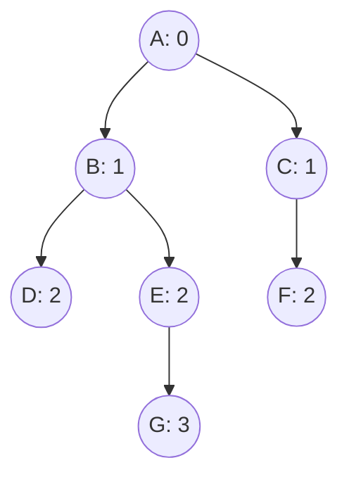

## Learning Objectives

- Implement breadth-first search (BFS) from a source vertex using a queue and a visited set, over an adjacency-list representation.
- Prove that BFS discovers every vertex for the first time along a shortest path from the source, measured in number of edges.
- Trace BFS by hand on a concrete graph, recording the queue's contents at every step and the resulting shortest-path (BFS) tree.
- Explain why BFS explores strictly level by level, and relate this to the queue's first-in-first-out discipline.
- State the running time of BFS, O(V + E), and identify which part of the algorithm each term accounts for.

## Context & Motivation

The previous topic established the two standard ways to represent a graph in memory — the adjacency matrix and the adjacency list — and argued that the adjacency list wins for exactly the operation most graph algorithms perform constantly: enumerating a vertex's neighbors. Breadth-first search is the first algorithm in this course that makes that operation the entire point. BFS starts at a chosen source vertex and systematically visits every vertex reachable from it, one "ring" of increasing distance at a time — first the source itself, then every vertex one edge away, then every vertex two edges away, and so on — and at every step, the only thing it ever needs to do is ask "what are this vertex's neighbors?" This is precisely the adjacency list's strength, and it is no accident that BFS (and DFS, covered next) is the textbook example used to justify that representation choice in the first place.

BFS earns its place as the first traversal algorithm covered, rather than an afterthought bolted onto graph terminology, because it solves a genuinely useful problem as a side effect of just visiting every vertex: it computes the shortest path, in number of edges, from the source to every other reachable vertex, simultaneously, in a single pass. This is not a coincidence to be taken on faith — it follows directly from the order in which BFS discovers vertices, and proving it carefully here pays off immediately, because "shortest path in an unweighted graph" is exactly the sub-problem that motivates everything that follows: connected components (run BFS repeatedly), and eventually the entire cluster of weighted shortest-path algorithms (Dijkstra, Bellman-Ford, DAG shortest paths), each of which generalizes some part of what BFS already does for the unweighted case. Every algorithm-course treatment of graphs — MIT's 6.006 among them — introduces BFS first for exactly this reason: it is the simplest possible traversal, and its correctness proof is a template for reasoning about every shortest-path algorithm that comes after it.

## Core Theory

### The algorithm: explore level by level with a queue

BFS maintains a queue of vertices "to be processed" and a `visited` set (or array) recording which vertices have already been discovered, to avoid processing any vertex more than once. Starting from a source vertex s: mark s visited and enqueue it. Then, repeatedly, dequeue a vertex u, and for every neighbor v of u (read directly off u's adjacency list) that has not yet been visited, mark v visited and enqueue it. The algorithm terminates when the queue is empty — every vertex reachable from s has by then been visited exactly once.

```python
from collections import deque

def bfs(adj, source):
    visited = {source}
    parent = {source: None}
    distance = {source: 0}
    queue = deque([source])
    order = []  # the order vertices were dequeued, for reference

    while queue:
        u = queue.popleft()
        order.append(u)
        for v in adj[u]:
            if v not in visited:
                visited.add(v)
                parent[v] = u
                distance[v] = distance[u] + 1
                queue.append(v)

    return order, distance, parent
```

The critical detail, easy to get backwards, is that a vertex is marked `visited` the moment it is *enqueued*, not when it is later dequeued. If marking were delayed until dequeue time, the same vertex could be discovered again by a different neighbor before its first appearance is processed, and be enqueued multiple times — still eventually correct, but wasteful, and it would break the clean one-shot distance bookkeeping used above. Marking at enqueue time guarantees each vertex enters the queue exactly once.

### Why the queue produces level-by-level order

A queue is first-in-first-out: whatever was enqueued earliest is dequeued next. This single property is the entire reason BFS proceeds level by level. Suppose, as an inductive hypothesis, that at some point the queue contains exactly the vertices at distance k from the source, followed by (possibly) some vertices at distance k+1 — call this the "queue invariant." Initially (queue = [source]) this holds trivially with k = 0. When a distance-k vertex u is dequeued and processed, every currently-unvisited neighbor v of u must be at distance k+1 (v is adjacent to a distance-k vertex, so v is at distance at most k+1; and v cannot be at distance ≤ k, since if it were, it would already have been visited by the time every distance-≤k vertex was processed, by the same inductive argument one level down). Each such v is enqueued, appended after every other item currently in the queue — meaning after all remaining distance-k vertices and after any distance-(k+1) vertices already enqueued. So the invariant is preserved: the queue always holds a block of distance-k vertices, followed by a growing block of distance-(k+1) vertices, and only once the last distance-k vertex is dequeued does the queue contain distance-(k+1) vertices exclusively. This is exactly why BFS finishes an entire level before starting the next.



### Theorem: the first discovery of a vertex is via a shortest path

**Claim.** When BFS discovers a vertex v for the first time (enqueues it), the value `distance[v]` recorded at that moment equals the true shortest-path distance from the source to v, measured in number of edges — and it is never recorded, or updated, incorrectly.

**Proof sketch, by strong induction on the true shortest-path distance d(s, v).** *Base case:* d(s, s) = 0, and BFS initializes `distance[source] = 0` before processing anything — correct. *Inductive step:* suppose every vertex at true distance ≤ k has already been assigned the correct distance value by BFS (by the queue-invariant argument above, this happens before any distance-(k+1) vertex is discovered). Let v be a vertex with d(s, v) = k+1. By definition of shortest-path distance, v has some neighbor u with d(s, u) = k (the second-to-last vertex on a shortest path to v) — and v cannot have *only* neighbors at distance ≥ k+1 among visited vertices, or its true distance would be ≥ k+2, a contradiction. Since u is at distance k, u was correctly discovered and processed by BFS before any distance-(k+1) vertex was discovered (by the level-by-level property), and when u is processed, if v is not yet visited, v is discovered via the edge (u, v), receiving distance k+1 — exactly its true distance. If v was already visited by that point, it must have been discovered by some other distance-k vertex, receiving the same correct value k+1 by the same argument applied to that neighbor instead. Either way, `distance[v]` is set correctly, and — crucially — once set, it is never revisited or changed, since BFS only ever assigns a distance the first time a vertex is discovered. ∎

The `parent` pointers recorded during BFS form a **shortest-path tree**: following parent pointers from any vertex back to the source traces out a path using the minimum possible number of edges to reach that vertex.

### Running time: O(V + E)

Every vertex is enqueued exactly once (guaranteed by the `visited` check at enqueue time), so the outer loop body — dequeuing and processing a vertex — runs exactly V times. Each vertex u's adjacency list is scanned exactly once, when u is dequeued, and scanning it costs time proportional to deg(u); summed over all vertices, Σ deg(u) = 2|E| for an undirected graph (or |E| for a directed graph, by the handshake theorem and its directed analogue). So the total work is Θ(V) for the enqueue/dequeue bookkeeping plus Θ(E) for the neighbor scans — O(V + E) overall, linear in the size of the graph's representation. This is only achievable because the adjacency list makes neighbor enumeration cost exactly deg(u), not V, per vertex — the same trade-off argued for previously now pays off concretely.

## Worked Examples

### Example 1 — full BFS trace with queue contents at every step

**Problem:** Run BFS from source A on the undirected graph with adjacency list:

```python
adj = {
    'A': ['B', 'C'],
    'B': ['A', 'D', 'E'],
    'C': ['A', 'F'],
    'D': ['B'],
    'E': ['B', 'F', 'G'],
    'F': ['C', 'E'],
    'G': ['E'],
}
```

Record the queue's contents after each step, and the resulting distances and shortest-path tree.

**Trace.** Enqueue A, `visited = {A}`, `distance[A] = 0`. Queue: `[A]`.

Dequeue A. Neighbors B, C, both unvisited: mark visited, set `distance[B] = distance[C] = 1`, `parent[B] = parent[C] = A`, enqueue both. Queue: `[B, C]`.

Dequeue B. Neighbors A (visited, skip), D, E (both unvisited): set `distance[D] = distance[E] = 2`, `parent[D] = parent[E] = B`, enqueue both. Queue: `[C, D, E]`.

Dequeue C. Neighbors A (visited, skip), F (unvisited): set `distance[F] = 2`, `parent[F] = C`, enqueue. Queue: `[D, E, F]`.

Dequeue D. Neighbor B (visited, skip). Nothing new. Queue: `[E, F]`.

Dequeue E. Neighbors B (visited), F (visited — already enqueued via C, skip), G (unvisited): set `distance[G] = 3`, `parent[G] = E`, enqueue. Queue: `[F, G]`.

Dequeue F. Neighbors C, E, both visited. Nothing new. Queue: `[G]`.

Dequeue G. Neighbor E, visited. Nothing new. Queue: `[]`. Done.

**Result.** Distances: A=0, B=1, C=1, D=2, E=2, F=2, G=3. Shortest-path tree (parent edges): A–B, A–C, B–D, B–E, C–F, E–G.



Notice F is reached via C (distance 2), even though F is also adjacent to E — but by the time E is dequeued, F has already been discovered, so BFS correctly leaves its distance at 2 rather than considering it again. Also notice G's *only* connection is through E; no shorter route exists (A–B–E–G and A–C–F–E–G are the only paths, of lengths 3 and 4 respectively), and BFS correctly reports 3, confirming the theorem: the first (and only) time a vertex is discovered, the distance recorded is its true shortest-path distance in edges.

### Example 2 — using BFS distances to answer a shortest-path query

**Problem:** Using the graph and BFS run from Example 1, what is the shortest path (in edges) from A to G, and what does it look like?

**Solution.** `distance[G] = 3` directly answers the "how far" question. To recover the actual path, follow parent pointers backward from G: `parent[G] = E`, `parent[E] = B`, `parent[B] = A`, `parent[A] = None`. Reversing gives A → B → E → G, a path of 3 edges — matching `distance[G]`. This is the general technique: a single BFS run from a source answers "shortest distance to every vertex" and "an actual shortest path to every vertex" simultaneously, using the `parent` array built during the same pass, with no additional traversal needed.

## Common Misconceptions & Pitfalls

- **"BFS finds the shortest path in a *weighted* graph too."** BFS's guarantee is specifically about number of edges, not total weight — it is silent on weight entirely, since it never looks at edge weights at all. On the graph A→B (weight 10), A→C (weight 1), C→B (weight 1), BFS from A would report B at distance 1 edge (the direct edge A→B), even though the path A→C→B has lower total weight (2) but more edges (2). BFS is correct only for the specific, narrower question of fewest edges; the weighted case needs an entirely different family of algorithms, covered next.
- **"Marking a vertex visited when it's dequeued, rather than when it's enqueued, doesn't change the result."** It doesn't change which vertices are eventually visited, but it breaks the clean distance bookkeeping and can cause the same vertex to be enqueued multiple times before its first dequeue is processed — wasteful, and a common source of subtly wrong distance values if the distance update is written carelessly around the delayed check.
- **"BFS explores in some particular vertex order because of graph structure, not because of the queue."** The specific order vertices are dequeued within a level depends only on the order they were enqueued (which depends on adjacency-list ordering and processing order) — the *level* a vertex belongs to is fixed by the graph, but its position within that level's processing order is an implementation detail, not something the shortest-path guarantee depends on.
- **"A vertex not reached by BFS from a given source doesn't exist in the graph."** It exists, and BFS from a *different* source (or exploring all components, the next topic) would find it — BFS from a single source only ever discovers the connected component (or, for a directed graph, the set of vertices reachable) containing that source.

## Summary

BFS explores a graph from a source vertex level by level, using a queue to guarantee vertices are processed in non-decreasing order of distance, and a `visited` set to guarantee each vertex is enqueued exactly once. This queue discipline is precisely what makes the level-by-level property hold, and that property in turn is what makes the central theorem work: the first time BFS discovers any vertex, it does so via a path with the minimum possible number of edges from the source, and the resulting `parent` pointers form a shortest-path tree usable to reconstruct an actual shortest path to any reachable vertex. The whole traversal runs in O(V + E) time, linear in the graph's adjacency-list representation, since every vertex is enqueued once and every edge is examined at most twice (once from each endpoint, in the undirected case). BFS's guarantee is specifically about edge count, not weight — a distinction that becomes essential once weighted graphs are introduced.

## Documentation Links

- [MIT 6.006 — Lecture Notes (OCW)](https://ocw.mit.edu/courses/6-006-introduction-to-algorithms-spring-2020/pages/lecture-notes/) — doc
- [Sedgewick & Wayne — Algorithms Lectures (Princeton)](https://algs4.cs.princeton.edu/lectures/) — doc
