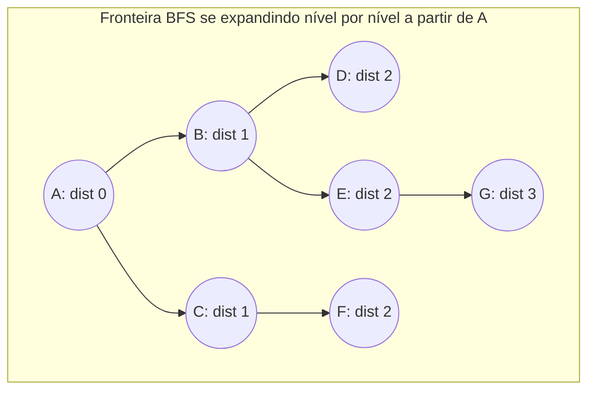
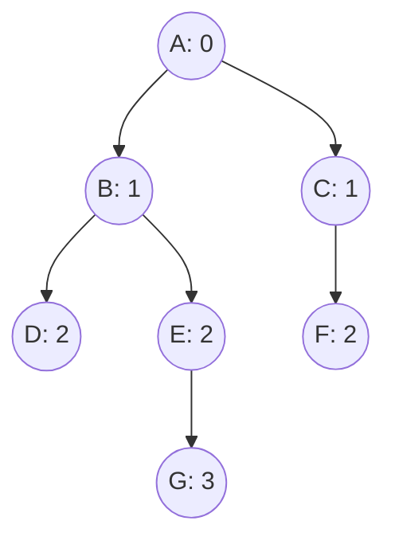

## Objetivos de Aprendizagem

- Implementar busca em largura (BFS) a partir de um vértice fonte usando uma fila e um conjunto de visitados, sobre uma representação de lista de adjacência.
- Provar que BFS descobre todo vértice pela primeira vez via um caminho mais curto a partir da fonte, medido em número de arestas.
- Rastrear BFS manualmente em um grafo concreto, registrando o conteúdo da fila a cada passo e a árvore de caminho mais curto (BFS) resultante.
- Explicar por que BFS explora estritamente nível por nível, e relacionar isso à disciplina primeiro-a-entrar-primeiro-a-sair da fila.
- Enunciar o tempo de execução de BFS, O(V + E), e identificar qual parte do algoritmo cada termo contabiliza.

## Contexto e Motivação

O tópico anterior estabeleceu as duas formas padrão de representar um grafo em memória, a matriz de adjacência e a lista de adjacência, e argumentou que a lista de adjacência vence para exatamente a operação que a maioria dos algoritmos de grafo realiza constantemente: enumerar os vizinhos de um vértice. Busca em largura é o primeiro algoritmo neste curso que torna essa operação o ponto inteiro. BFS começa em um vértice fonte escolhido e sistematicamente visita todo vértice alcançável a partir dele, um "anel" de distância crescente por vez, primeiro a própria fonte, depois todo vértice a uma aresta de distância, depois todo vértice a duas arestas de distância, e assim por diante, e em todo passo, a única coisa que jamais precisa fazer é perguntar "quais são os vizinhos deste vértice?" Isso é precisamente a força da lista de adjacência, e não é acidente que BFS (e DFS, coberto em seguida) seja o exemplo de livro-texto usado para justificar essa escolha de representação em primeiro lugar.

BFS ganha seu lugar como o primeiro algoritmo de travessia coberto, em vez de uma reflexão tardia acoplada à terminologia de grafo, porque resolve um problema genuinamente útil como efeito colateral de simplesmente visitar todo vértice: calcula o caminho mais curto, em número de arestas, da fonte para todo outro vértice alcançável, simultaneamente, em uma única passagem. Isso não é uma coincidência a ser aceita de fé, decorre diretamente da ordem em que BFS descobre vértices, e provar isso cuidadosamente aqui compensa imediatamente, porque "caminho mais curto em um grafo não ponderado" é exatamente o subproblema que motiva tudo que segue: componentes conexos (rode BFS repetidamente), e eventualmente o grupo inteiro de algoritmos de caminho mais curto ponderado (Dijkstra, Bellman-Ford, caminhos mais curtos em DAG), cada um dos quais generaliza alguma parte do que BFS já faz para o caso não ponderado. Todo tratamento de grafos em curso de algoritmos, o 6.006 do MIT entre eles, introduz BFS primeiro por exatamente essa razão: é a travessia mais simples possível, e sua prova de correção é um modelo para raciocinar sobre todo algoritmo de caminho mais curto que vem depois dela.

## Teoria Central

### O algoritmo: explore nível por nível com uma fila

BFS mantém uma fila de vértices "a serem processados" e um conjunto (ou array) `visited` registrando quais vértices já foram descobertos, para evitar processar qualquer vértice mais de uma vez. Começando a partir de um vértice fonte s: marque s como visitado e enfileire-o. Depois, repetidamente, desenfileire um vértice u, e para todo vizinho v de u (lido diretamente da lista de adjacência de u) que ainda não foi visitado, marque v como visitado e enfileire-o. O algoritmo termina quando a fila está vazia, todo vértice alcançável a partir de s foi então visitado exatamente uma vez.

```python
from collections import deque

def bfs(adj, source):
    visited = {source}
    parent = {source: None}
    distance = {source: 0}
    queue = deque([source])
    order = []  # a ordem em que vértices foram desenfileirados, para referência

    while queue:
        u = queue.popleft()
        order.append(u)
        for v in adj[u]:
            if v not in visited:
                visited.add(v)
                parent[v] = u
                distance[v] = distance[u] + 1
                queue.append(v)

    return order, distance, parent
```

O detalhe crítico, fácil de inverter, é que um vértice é marcado `visited` no momento em que é *enfileirado*, não quando é depois desenfileirado. Se a marcação fosse adiada até o momento de desenfileirar, o mesmo vértice poderia ser descoberto de novo por um vizinho diferente antes que sua primeira aparição seja processada, e ser enfileirado múltiplas vezes, ainda eventualmente correto, mas desperdiçador, e quebraria a contabilidade limpa de distância de passagem única usada acima. Marcar no momento de enfileirar garante que cada vértice entra na fila exatamente uma vez.

### Por que a fila produz ordem nível por nível

Uma fila é primeiro-a-entrar-primeiro-a-sair: o que foi enfileirado mais cedo é desenfileirado em seguida. Essa única propriedade é a razão inteira pela qual BFS procede nível por nível. Suponha, como hipótese indutiva, que em algum ponto a fila contém exatamente os vértices à distância k da fonte, seguidos por (possivelmente) alguns vértices à distância k+1, chame isso de "invariante da fila." Inicialmente (fila = [fonte]) isso vale trivialmente com k = 0. Quando um vértice u de distância k é desenfileirado e processado, todo vizinho v de u ainda não visitado deve estar à distância k+1 (v é adjacente a um vértice de distância k, então v está a no máximo distância k+1; e v não pode estar à distância ≤ k, já que se estivesse, já teria sido visitado no momento em que todo vértice de distância-≤k foi processado, pelo mesmo argumento indutivo um nível abaixo). Cada tal v é enfileirado, anexado depois de todo outro item atualmente na fila, significando depois de todos os vértices de distância-k restantes e depois de quaisquer vértices de distância-(k+1) já enfileirados. Então o invariante é preservado: a fila sempre contém um bloco de vértices de distância-k, seguido por um bloco crescente de vértices de distância-(k+1), e só uma vez que o último vértice de distância-k é desenfileirado a fila contém vértices de distância-(k+1) exclusivamente. Isso é exatamente por que BFS termina um nível inteiro antes de começar o próximo.



### Teorema: a primeira descoberta de um vértice é via um caminho mais curto

**Afirmação.** Quando BFS descobre um vértice v pela primeira vez (enfileira-o), o valor `distance[v]` registrado naquele momento é igual à distância verdadeira do caminho mais curto da fonte até v, medida em número de arestas, e nunca é registrado, ou atualizado, incorretamente.

**Esboço de prova, por indução forte na distância verdadeira do caminho mais curto d(s, v).** *Caso base:* d(s, s) = 0, e BFS inicializa `distance[source] = 0` antes de processar qualquer coisa, correto. *Passo indutivo:* suponha que todo vértice à distância verdadeira ≤ k já recebeu o valor de distância correto por BFS (pelo argumento do invariante da fila acima, isso acontece antes que qualquer vértice de distância-(k+1) seja descoberto). Seja v um vértice com d(s, v) = k+1. Por definição de distância de caminho mais curto, v tem algum vizinho u com d(s, u) = k (o penúltimo vértice em um caminho mais curto até v), e v não pode ter *apenas* vizinhos à distância ≥ k+1 entre vértices visitados, ou sua distância verdadeira seria ≥ k+2, uma contradição. Já que u está à distância k, u foi corretamente descoberto e processado por BFS antes que qualquer vértice de distância-(k+1) fosse descoberto (pela propriedade nível-por-nível), e quando u é processado, se v ainda não está visitado, v é descoberto via a aresta (u, v), recebendo distância k+1, exatamente sua distância verdadeira. Se v já estava visitado nesse ponto, deve ter sido descoberto por algum outro vértice de distância-k, recebendo o mesmo valor correto k+1 pelo mesmo argumento aplicado àquele vizinho em vez disso. De qualquer forma, `distance[v]` é definido corretamente, e, crucialmente, uma vez definido, nunca é revisitado ou alterado, já que BFS só jamais atribui uma distância na primeira vez que um vértice é descoberto. ∎

Os ponteiros `parent` registrados durante BFS formam uma **árvore de caminho mais curto**: seguir ponteiros parent de qualquer vértice de volta à fonte traça um caminho usando o número mínimo possível de arestas para alcançar aquele vértice.

### Tempo de execução: O(V + E)

Todo vértice é enfileirado exatamente uma vez (garantido pela verificação `visited` no momento de enfileirar), então o corpo do laço externo, desenfileirar e processar um vértice, roda exatamente V vezes. A lista de adjacência de todo vértice u é varrida exatamente uma vez, quando u é desenfileirado, e varrê-la custa tempo proporcional a deg(u); somado sobre todos os vértices, Σ deg(u) = 2|E| para um grafo não direcionado (ou |E| para um grafo direcionado, pelo teorema do aperto de mão e seu análogo direcionado). Então o trabalho total é Θ(V) para a contabilidade de enfileirar/desenfileirar mais Θ(E) para as varreduras de vizinhos, O(V + E) no geral, linear no tamanho da representação do grafo. Isso só é alcançável porque a lista de adjacência torna a enumeração de vizinhos custar exatamente deg(u), não V, por vértice, a mesma troca argumentada anteriormente agora compensa concretamente.

## Exemplos Resolvidos

### Exemplo 1 — rastreamento completo de BFS com conteúdo da fila a cada passo

**Problema:** Rode BFS a partir da fonte A no grafo não direcionado com lista de adjacência:

```python
adj = {
    'A': ['B', 'C'],
    'B': ['A', 'D', 'E'],
    'C': ['A', 'F'],
    'D': ['B'],
    'E': ['B', 'F', 'G'],
    'F': ['C', 'E'],
    'G': ['E'],
}
```

Registre o conteúdo da fila depois de cada passo, e as distâncias e árvore de caminho mais curto resultantes.

**Rastreamento.** Enfileira A, `visited = {A}`, `distance[A] = 0`. Fila: `[A]`.

Desenfileira A. Vizinhos B, C, ambos não visitados: marca visitados, define `distance[B] = distance[C] = 1`, `parent[B] = parent[C] = A`, enfileira ambos. Fila: `[B, C]`.

Desenfileira B. Vizinhos A (visitado, pula), D, E (ambos não visitados): define `distance[D] = distance[E] = 2`, `parent[D] = parent[E] = B`, enfileira ambos. Fila: `[C, D, E]`.

Desenfileira C. Vizinhos A (visitado, pula), F (não visitado): define `distance[F] = 2`, `parent[F] = C`, enfileira. Fila: `[D, E, F]`.

Desenfileira D. Vizinho B (visitado, pula). Nada novo. Fila: `[E, F]`.

Desenfileira E. Vizinhos B (visitado), F (visitado, já enfileirado via C, pula), G (não visitado): define `distance[G] = 3`, `parent[G] = E`, enfileira. Fila: `[F, G]`.

Desenfileira F. Vizinhos C, E, ambos visitados. Nada novo. Fila: `[G]`.

Desenfileira G. Vizinho E, visitado. Nada novo. Fila: `[]`. Terminado.

**Resultado.** Distâncias: A=0, B=1, C=1, D=2, E=2, F=2, G=3. Árvore de caminho mais curto (arestas parent): A–B, A–C, B–D, B–E, C–F, E–G.



Note que F é alcançado via C (distância 2), mesmo que F também seja adjacente a E, mas no momento em que E é desenfileirado, F já foi descoberto, então BFS corretamente deixa sua distância em 2 em vez de considerá-lo de novo. Note também que a *única* conexão de G é através de E; nenhuma rota mais curta existe (A–B–E–G e A–C–F–E–G são os únicos caminhos, de comprimentos 3 e 4 respectivamente), e BFS corretamente relata 3, confirmando o teorema: a primeira (e única) vez que um vértice é descoberto, a distância registrada é sua distância verdadeira de caminho mais curto em arestas.

### Exemplo 2 — usando distâncias BFS para responder uma consulta de caminho mais curto

**Problema:** Usando o grafo e a execução de BFS do Exemplo 1, qual é o caminho mais curto (em arestas) de A a G, e como ele se parece?

**Solução.** `distance[G] = 3` responde diretamente a pergunta de "quão longe." Para recuperar o caminho real, siga ponteiros parent para trás a partir de G: `parent[G] = E`, `parent[E] = B`, `parent[B] = A`, `parent[A] = None`. Invertendo dá A → B → E → G, um caminho de 3 arestas, combinando com `distance[G]`. Esta é a técnica geral: uma única execução de BFS a partir de uma fonte responde "distância mais curta para todo vértice" e "um caminho mais curto real para todo vértice" simultaneamente, usando o array `parent` construído durante a mesma passagem, sem travessia adicional necessária.

## Equívocos Comuns e Armadilhas

- **"BFS encontra o caminho mais curto em um grafo *ponderado* também."** A garantia de BFS é especificamente sobre número de arestas, não peso total, é silenciosa sobre peso inteiramente, já que nunca olha para pesos de aresta de forma alguma. No grafo A→B (peso 10), A→C (peso 1), C→B (peso 1), BFS a partir de A relataria B à distância de 1 aresta (a aresta direta A→B), mesmo que o caminho A→C→B tenha peso total menor (2) mas mais arestas (2). BFS é correto apenas para a pergunta específica, mais estreita, de menos arestas; o caso ponderado precisa de uma família inteiramente diferente de algoritmos, coberta em seguida.
- **"Marcar um vértice como visitado quando é desenfileirado, em vez de quando é enfileirado, não muda o resultado."** Não muda quais vértices são eventualmente visitados, mas quebra a contabilidade limpa de distância e pode fazer o mesmo vértice ser enfileirado múltiplas vezes antes que seu primeiro desenfileiramento seja processado, desperdiçador, e uma fonte comum de valores de distância sutilmente errados se a atualização de distância for escrita descuidadamente em torno da verificação adiada.
- **"BFS explora em alguma ordem particular de vértice por causa da estrutura do grafo, não por causa da fila."** A ordem específica em que vértices são desenfileirados dentro de um nível depende apenas da ordem em que foram enfileirados (que depende da ordenação da lista de adjacência e da ordem de processamento), o *nível* ao qual um vértice pertence é fixado pelo grafo, mas sua posição dentro da ordem de processamento daquele nível é um detalhe de implementação, não algo do qual a garantia de caminho mais curto depende.
- **"Um vértice não alcançado por BFS a partir de uma dada fonte não existe no grafo."** Existe, e BFS a partir de uma fonte *diferente* (ou explorando todos os componentes, o próximo tópico) o encontraria, BFS a partir de uma única fonte só jamais descobre o componente conexo (ou, para um grafo direcionado, o conjunto de vértices alcançáveis) contendo aquela fonte.

## Resumo

BFS explora um grafo a partir de um vértice fonte nível por nível, usando uma fila para garantir que vértices são processados em ordem não decrescente de distância, e um conjunto `visited` para garantir que cada vértice é enfileirado exatamente uma vez. Essa disciplina de fila é precisamente o que faz a propriedade nível-por-nível valer, e essa propriedade por sua vez é o que faz o teorema central funcionar: a primeira vez que BFS descobre qualquer vértice, faz isso via um caminho com o número mínimo possível de arestas a partir da fonte, e os ponteiros `parent` resultantes formam uma árvore de caminho mais curto usável para reconstruir um caminho mais curto real até qualquer vértice alcançável. A travessia inteira roda em tempo O(V + E), linear na representação de lista de adjacência do grafo, já que todo vértice é enfileirado uma vez e toda aresta é examinada no máximo duas vezes (uma vez de cada extremidade, no caso não direcionado). A garantia de BFS é especificamente sobre contagem de arestas, não peso, uma distinção que se torna essencial uma vez que grafos ponderados são introduzidos.

## Documentation Links

- [MIT 6.006 — Lecture Notes (OCW)](https://ocw.mit.edu/courses/6-006-introduction-to-algorithms-spring-2020/pages/lecture-notes/) — doc
- [Sedgewick & Wayne — Algorithms Lectures (Princeton)](https://algs4.cs.princeton.edu/lectures/) — doc
