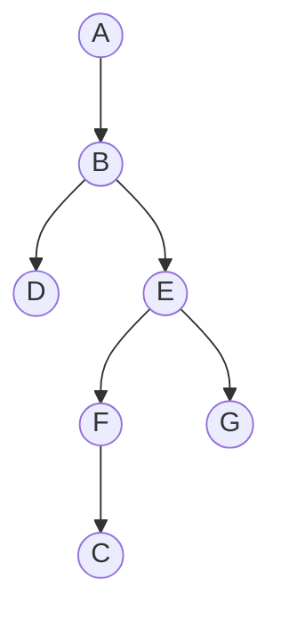

## Learning Objectives

- Implement depth-first search (DFS), both via explicit recursion and via an explicit stack, over an adjacency-list representation.
- Trace DFS by hand on a concrete graph, recording discovery and finish timestamps for every vertex.
- Contrast DFS's exploration order against BFS's on the same graph, and explain why the two produce different-shaped traversal trees from the same source.
- Explain why DFS is naturally expressed as recursion, and how an explicit stack simulates the same behavior iteratively.
- State the running time of DFS, O(V + E), and identify why it matches BFS's bound despite the very different exploration strategy.

## Context & Motivation

BFS explores a graph cautiously, one whole ring of distance at a time, never going deeper until every vertex at the current distance has been accounted for — a direct consequence of using a queue. Depth-first search asks what happens with the opposite discipline: plunge down a single path as far as it possibly goes, only turning back (backtracking) once every avenue from the current vertex has been exhausted. The mechanism needed to get this behavior is almost embarrassingly simple: swap the queue for a stack, or — equivalently, and usually more naturally — just use the call stack of a recursive function, since recursion *is* a stack, managed implicitly by the language runtime.

DFS is covered directly after BFS specifically to make the contrast concrete rather than abstract: run both traversals from the same source on the same graph, and the two produce differently shaped trees, discovering vertices in a different order, purely because of the underlying data structure's discipline — first-in-first-out versus last-in-first-out. This comparison is worth internalizing carefully, because DFS is not "BFS but worse" or "an alternative when BFS doesn't apply" — it solves a different family of problems that BFS's shortest-path guarantee has nothing to say about. The bookkeeping DFS layers on top of plain visitation — a discovery timestamp and a finish timestamp for every vertex — is introduced here specifically because the next topic, detecting cycles and producing a topological order in a directed graph, depends entirely on reading structure out of these timestamps; DFS earns its real payoff one topic later, in exactly the way BFS's did with connected components.

## Core Theory

### The algorithm: plunge deep, then backtrack

Starting from a source vertex s, DFS marks s visited, then recurses into the *first* unvisited neighbor of s, which itself recurses into its first unvisited neighbor, and so on — building a single long chain — until some vertex is reached whose every neighbor has already been visited. At that point, the recursion "backtracks": control returns to the previous vertex on the chain, which then tries its *next* unvisited neighbor (if any), potentially starting a new deep plunge down a different branch. This continues until every vertex reachable from s has been visited.

```python
def dfs(adj, source):
    visited = set()
    parent = {source: None}
    order = []  # order vertices were discovered, for reference

    def visit(u):
        visited.add(u)
        order.append(u)
        for v in adj[u]:
            if v not in visited:
                parent[v] = u
                visit(v)

    visit(source)
    return order, parent
```

The equivalent iterative form makes the "stack" nature explicit rather than implicit in the call stack:

```python
def dfs_iterative(adj, source):
    visited = {source}
    parent = {source: None}
    order = []
    stack = [source]

    while stack:
        u = stack.pop()          # LIFO: most recently pushed comes off first
        order.append(u)
        for v in adj[u]:
            if v not in visited:
                visited.add(v)
                parent[v] = u
                stack.append(v)

    return order, parent
```

(The iterative version's exact discovery order can differ slightly from the recursive version's — depending on the order neighbors are pushed — but both share the defining LIFO property: whatever was most recently discovered is explored next, before anything discovered earlier, which is exactly what produces "go deep before going wide.")

### Discovery and finish timestamps

A standard piece of DFS bookkeeping — essential for the next topic, not optional decoration here — is a single shared clock, incremented every time any vertex is either *discovered* (first visited) or *finished* (every one of its neighbors has been fully explored, and its recursive call is about to return). Every vertex gets a discovery time d(v) and a finish time f(v), with d(v) < f(v) always, and the interval [d(v), f(v)] for one vertex is either completely nested inside, or completely disjoint from, the interval of any other vertex — never partially overlapping — a direct consequence of the stack discipline: a vertex's recursive call cannot return until every recursive call it triggered has already returned.

```python
def dfs_with_times(adj, source):
    visited = set()
    d, f = {}, {}
    clock = [0]

    def visit(u):
        visited.add(u)
        clock[0] += 1
        d[u] = clock[0]
        for v in adj[u]:
            if v not in visited:
                visit(v)
        clock[0] += 1
        f[u] = clock[0]

    visit(source)
    return d, f
```

### Why DFS is naturally recursive

DFS's defining rule — "fully explore this neighbor's entire reachable subtree before trying the next neighbor" — is precisely what a recursive call already guarantees for free: calling `visit(v)` does not return control to the caller until everything reachable through v (via further recursive calls) has been visited, at which point the loop inside the caller's own frame resumes with the *next* neighbor. This is exactly the LIFO behavior a stack provides, made implicit by the language runtime maintaining the call stack automatically — which is why the recursive formulation reads so naturally, while BFS's queue-based level order has no equally natural recursive phrasing (attempting to write BFS recursively is awkward exactly because recursion's built-in stack fights against the FIFO order BFS needs).

### Running time: O(V + E)

The `visited` check guarantees `visit` is called at most once per vertex, so the total number of recursive calls is O(V). Within each call to `visit(u)`, the `for` loop scans u's entire adjacency list exactly once, costing time proportional to deg(u); summed over all vertices this is Θ(E) (or Θ(2E) for an undirected graph, since each edge is scanned from both endpoints), by the same handshake-theorem argument used for BFS. Total: O(V + E), matching BFS exactly, despite the two algorithms visiting vertices in completely different orders — the bound depends only on "every vertex is fully processed once, and every edge is examined a bounded number of times," a property both traversal disciplines share regardless of which data structure (queue or stack) governs the order.

## Worked Examples

### Example 1 — full DFS trace, contrasted directly against BFS on the same graph

**Problem:** Run DFS from source A on the same graph used for the BFS worked example:

```python
adj = {
    'A': ['B', 'C'],
    'B': ['A', 'D', 'E'],
    'C': ['A', 'F'],
    'D': ['B'],
    'E': ['B', 'F', 'G'],
    'F': ['C', 'E'],
    'G': ['E'],
}
```

Record discovery/finish times, and compare the resulting DFS tree to the BFS tree found previously.

**Trace (recursive form, visiting neighbors in list order).** `visit(A)`: clock 1, d(A)=1. First unvisited neighbor: B. `visit(B)`: clock 2, d(B)=2. First unvisited neighbor of B: D (A is visited, skip). `visit(D)`: clock 3, d(D)=3. D's only neighbor, B, is visited — nothing to recurse into. Finish D: clock 4, f(D)=4.

Back in `visit(B)`, next neighbor: E. `visit(E)`: clock 5, d(E)=5. First unvisited neighbor of E: F (B visited, skip). `visit(F)`: clock 6, d(F)=6. First unvisited neighbor of F: C (E visited, skip). `visit(C)`: clock 7, d(C)=7. C's neighbors: A (visited), F (visited — currently mid-recursion, an ancestor on the stack). Nothing unvisited. Finish C: clock 8, f(C)=8.

Back in `visit(F)`: next neighbor E, visited. Nothing more. Finish F: clock 9, f(F)=9.

Back in `visit(E)`: next neighbor G (unvisited). `visit(G)`: clock 10, d(G)=10. G's only neighbor, E, visited. Finish G: clock 11, f(G)=11.

Back in `visit(E)`: no more neighbors. Finish E: clock 12, f(E)=12.

Back in `visit(B)`: no more neighbors (A, D, E all processed). Finish B: clock 13, f(B)=13.

Back in `visit(A)`: next neighbor C, already visited. No more neighbors. Finish A: clock 14, f(A)=14.

**Result — timestamps:**

| vertex | A | B | C | D | E | F | G |
|---|---|---|---|---|---|---|---|
| d | 1 | 2 | 7 | 3 | 5 | 6 | 10 |
| f | 14 | 13 | 8 | 4 | 12 | 9 | 11 |

**DFS tree** (parent edges from the trace): A–B, B–D, B–E, E–F, F–C, E–G — a long, stringy shape.



**Contrast with BFS.** The BFS tree found previously, from the same source A, was A → {B, C} (depth 1), B → {D, E} and C → {F} (depth 2), E → {G} (depth 3) — bushy and shallow, height 3, every vertex reached via the fewest possible edges. The DFS tree above is a long chain — A–B–E–F–C is a path of length 4, deeper than any BFS distance in this graph (the true shortest distance from A to C is 1, via the direct edge, yet DFS's tree routes to C through a length-4 path, since DFS commits fully to exploring B's subtree, then E's, then F's, before ever returning to check A's second neighbor C directly). Same graph, same source, same set of visited vertices — completely different tree shape, entirely because of queue versus stack discipline.

### Example 2 — reading structure directly off the timestamps

**Problem:** Using the timestamp table above, determine which vertices are "descendants" of E in the DFS tree, without re-examining the tree diagram.

**Solution.** A vertex v is a descendant of u in the DFS tree exactly when u's interval contains v's: d(u) < d(v) and f(v) < f(u) (the nesting property noted in Core Theory). E has d(E)=5, f(E)=12, so any vertex whose discovery/finish times both fall strictly inside (5, 12) is a descendant of E: F (6, 9) ✓ inside; C (7, 8) ✓ inside; G (10, 11) ✓ inside. D (3, 4) is not (its interval, 3–4, falls entirely *before* E's discovery at 5, meaning D was finished before E was even discovered — D is a "cousin" subtree under B, not a descendant of E). This matches the tree directly: F, C, G are all reached only by first passing through E, while D branches off earlier, directly from B.

## Common Misconceptions & Pitfalls

- **"DFS and BFS, run from the same source, always find the same distances or the same tree — they're both just 'graph traversal.'"** Example 1 shows this is false in general: DFS routed to C via a path of 4 edges, while the true shortest distance (and what BFS finds) is 1 edge. DFS makes no claim about shortest paths at all — its guarantees are about exploration order and the nesting structure of discovery/finish times, an entirely different set of properties than BFS provides.
- **"A vertex's discovery time alone tells you its depth in the DFS tree."** Discovery order reflects *when* a vertex was first reached, which depends on the entire path DFS happened to take to get there, not a level-based notion of depth the way BFS's distance does — comparing discovery numbers across two vertices tells you nothing about how many edges separate them without also consulting the tree structure itself.
- **"The recursive and iterative (explicit-stack) formulations of DFS always visit vertices in exactly the same order."** They share the same LIFO discipline and asymptotic behavior, but the iterative version pushes *all* unvisited neighbors onto the stack before popping the next one, which can interleave differently than the recursive version's immediate one-at-a-time recursive descent — the exact discovery order can differ between the two implementations even though both are valid DFS traversals of the same graph.
- **"Finish time only matters for bookkeeping — it doesn't reveal anything about graph structure."** The interval-nesting property (a vertex's discovery/finish interval either fully contains or is fully disjoint from any other vertex's) is exactly the structural fact the next topic relies on to classify edges and detect cycles — finish times are not incidental output, they are the mechanism the next algorithm reads directly.

## Summary

DFS explores a graph by committing fully to one neighbor's entire reachable subtree before trying the next, a behavior that falls directly out of using a stack (explicit, or implicit via recursion) rather than a queue — whatever was most recently discovered is explored next, in contrast to BFS's first-discovered-first-explored discipline. Run from the same source on the same graph, DFS and BFS produce structurally different trees: BFS's is shallow and bushy, reflecting shortest paths in edge count; DFS's is typically long and stringy, reflecting whatever order neighbors happened to be visited in, with no shortest-path guarantee at all. DFS additionally tracks a discovery time and finish time for every vertex, using one shared clock, and these intervals are always either fully nested or fully disjoint between any two vertices — a structural fact that the next topic (cycle detection and topological sort) builds on directly. Both BFS and DFS run in O(V + E), since each vertex is fully processed exactly once and each edge is examined a bounded number of times, regardless of which data structure governs the exploration order.

## Documentation Links

- [MIT 6.006 — Lecture Notes (OCW)](https://ocw.mit.edu/courses/6-006-introduction-to-algorithms-spring-2020/pages/lecture-notes/) — doc
- [Sedgewick & Wayne — Algorithms Lectures (Princeton)](https://algs4.cs.princeton.edu/lectures/) — doc
