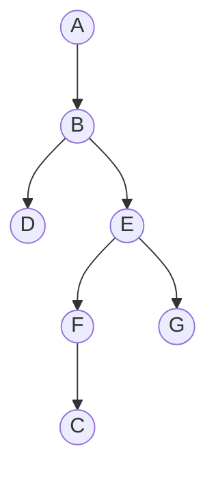

## Objetivos de Aprendizagem

- Implementar busca em profundidade (DFS), tanto via recursão explícita quanto via uma pilha explícita, sobre uma representação de lista de adjacência.
- Rastrear DFS manualmente em um grafo concreto, registrando timestamps de descoberta e término para todo vértice.
- Contrastar a ordem de exploração de DFS contra a de BFS no mesmo grafo, e explicar por que as duas produzem árvores de travessia de formatos diferentes a partir da mesma fonte.
- Explicar por que DFS é naturalmente expresso como recursão, e como uma pilha explícita simula o mesmo comportamento iterativamente.
- Enunciar o tempo de execução de DFS, O(V + E), e identificar por que combina com o limite de BFS apesar da estratégia de exploração muito diferente.

## Contexto e Motivação

BFS explora um grafo cautelosamente, um anel inteiro de distância por vez, nunca indo mais fundo até que todo vértice na distância atual tenha sido contabilizado, uma consequência direta de usar uma fila. Busca em profundidade pergunta o que acontece com a disciplina oposta: mergulhe por um único caminho o quanto ele possivelmente for, só voltando (retrocedendo) uma vez que toda avenida a partir do vértice atual tenha sido esgotada. O mecanismo necessário para obter esse comportamento é quase embaraçosamente simples: troque a fila por uma pilha, ou, equivalentemente, e geralmente mais naturalmente, apenas use a pilha de chamada de uma função recursiva, já que recursão *é* uma pilha, gerenciada implicitamente pelo runtime da linguagem.

DFS é coberto diretamente depois de BFS especificamente para tornar o contraste concreto em vez de abstrato: rode ambas as travessias a partir da mesma fonte no mesmo grafo, e as duas produzem árvores de formatos diferentes, descobrindo vértices em uma ordem diferente, puramente por causa da disciplina da estrutura de dados subjacente, primeiro-a-entrar-primeiro-a-sair versus último-a-entrar-primeiro-a-sair. Essa comparação vale a pena internalizar cuidadosamente, porque DFS não é "BFS mas pior" ou "uma alternativa quando BFS não se aplica", resolve uma família diferente de problemas sobre a qual a garantia de caminho mais curto de BFS não tem nada a dizer. A contabilidade que DFS adiciona sobre a visitação simples, um timestamp de descoberta e um timestamp de término para todo vértice, é introduzida aqui especificamente porque o próximo tópico, detectar ciclos e produzir uma ordem topológica em um grafo direcionado, depende inteiramente de ler estrutura a partir desses timestamps; DFS ganha seu ganho real um tópico depois, exatamente da forma como o de BFS ganhou com componentes conexos.

## Teoria Central

### O algoritmo: mergulhe fundo, depois retroceda

Começando a partir de um vértice fonte s, DFS marca s como visitado, depois recursa no *primeiro* vizinho não visitado de s, que ele próprio recursa em seu primeiro vizinho não visitado, e assim por diante, construindo uma única corrente longa, até que algum vértice seja alcançado cujo todo vizinho já foi visitado. Naquele ponto, a recursão "retrocede": o controle retorna ao vértice anterior na corrente, que então tenta seu *próximo* vizinho não visitado (se houver), potencialmente começando um novo mergulho fundo por um ramo diferente. Isso continua até que todo vértice alcançável a partir de s tenha sido visitado.

```python
def dfs(adj, source):
    visited = set()
    parent = {source: None}
    order = []  # ordem em que vértices foram descobertos, para referência

    def visit(u):
        visited.add(u)
        order.append(u)
        for v in adj[u]:
            if v not in visited:
                parent[v] = u
                visit(v)

    visit(source)
    return order, parent
```

A forma iterativa equivalente torna a natureza de "pilha" explícita em vez de implícita na pilha de chamada:

```python
def dfs_iterative(adj, source):
    visited = {source}
    parent = {source: None}
    order = []
    stack = [source]

    while stack:
        u = stack.pop()          # LIFO: o mais recentemente empilhado sai primeiro
        order.append(u)
        for v in adj[u]:
            if v not in visited:
                visited.add(v)
                parent[v] = u
                stack.append(v)

    return order, parent
```

(A ordem de descoberta exata da versão iterativa pode diferir ligeiramente da versão recursiva, dependendo da ordem em que vizinhos são empilhados, mas ambas compartilham a propriedade LIFO definidora: o que quer que tenha sido descoberto mais recentemente é explorado em seguida, antes de qualquer coisa descoberta antes, que é exatamente o que produz "vá fundo antes de ir largo.")

### Timestamps de descoberta e término

Uma peça padrão de contabilidade de DFS, essencial para o próximo tópico, não decoração opcional aqui, é um único relógio compartilhado, incrementado toda vez que qualquer vértice é ou *descoberto* (visitado pela primeira vez) ou *terminado* (todo um de seus vizinhos foi completamente explorado, e sua chamada recursiva está prestes a retornar). Todo vértice ganha um tempo de descoberta d(v) e um tempo de término f(v), com d(v) < f(v) sempre, e o intervalo [d(v), f(v)] de um vértice é ou completamente aninhado dentro de, ou completamente disjunto de, o intervalo de qualquer outro vértice, nunca parcialmente sobreposto, uma consequência direta da disciplina de pilha: a chamada recursiva de um vértice não pode retornar até que toda chamada recursiva que ela disparou já tenha retornado.

```python
def dfs_with_times(adj, source):
    visited = set()
    d, f = {}, {}
    clock = [0]

    def visit(u):
        visited.add(u)
        clock[0] += 1
        d[u] = clock[0]
        for v in adj[u]:
            if v not in visited:
                visit(v)
        clock[0] += 1
        f[u] = clock[0]

    visit(source)
    return d, f
```

### Por que DFS é naturalmente recursivo

A regra definidora de DFS, "explore completamente a subárvore alcançável inteira deste vizinho antes de tentar o próximo vizinho", é precisamente o que uma chamada recursiva já garante de graça: chamar `visit(v)` não retorna controle ao chamador até que tudo alcançável através de v (via chamadas recursivas adicionais) tenha sido visitado, ponto no qual o laço dentro do próprio quadro do chamador retoma com o *próximo* vizinho. Este é exatamente o comportamento LIFO que uma pilha fornece, tornado implícito pelo runtime da linguagem mantendo a pilha de chamada automaticamente, que é por que a formulação recursiva se lê tão naturalmente, enquanto a ordem de nível baseada em fila de BFS não tem uma formulação recursiva igualmente natural (tentar escrever BFS recursivamente é estranho exatamente porque a pilha embutida da recursão luta contra a ordem FIFO que BFS precisa).

### Tempo de execução: O(V + E)

A verificação `visited` garante que `visit` é chamado no máximo uma vez por vértice, então o número total de chamadas recursivas é O(V). Dentro de cada chamada a `visit(u)`, o laço `for` varre a lista de adjacência inteira de u exatamente uma vez, custando tempo proporcional a deg(u); somado sobre todos os vértices isso é Θ(E) (ou Θ(2E) para um grafo não direcionado, já que toda aresta é varrida a partir de ambas as extremidades), pelo mesmo argumento do teorema do aperto de mão usado para BFS. Total: O(V + E), combinando exatamente com BFS, apesar dos dois algoritmos visitarem vértices em ordens completamente diferentes, o limite depende apenas de "todo vértice é completamente processado uma vez, e toda aresta é examinada um número limitado de vezes", uma propriedade que ambas as disciplinas de travessia compartilham independentemente de qual estrutura de dados (fila ou pilha) governa a ordem.

## Exemplos Resolvidos

### Exemplo 1 — rastreamento completo de DFS, contrastado diretamente contra BFS no mesmo grafo

**Problema:** Rode DFS a partir da fonte A no mesmo grafo usado para o exemplo resolvido de BFS:

```python
adj = {
    'A': ['B', 'C'],
    'B': ['A', 'D', 'E'],
    'C': ['A', 'F'],
    'D': ['B'],
    'E': ['B', 'F', 'G'],
    'F': ['C', 'E'],
    'G': ['E'],
}
```

Registre tempos de descoberta/término, e compare a árvore DFS resultante com a árvore BFS encontrada anteriormente.

**Rastreamento (forma recursiva, visitando vizinhos na ordem da lista).** `visit(A)`: relógio 1, d(A)=1. Primeiro vizinho não visitado: B. `visit(B)`: relógio 2, d(B)=2. Primeiro vizinho não visitado de B: D (A visitado, pula). `visit(D)`: relógio 3, d(D)=3. O único vizinho de D, B, está visitado, nada para recursar. Termina D: relógio 4, f(D)=4.

De volta em `visit(B)`, próximo vizinho: E. `visit(E)`: relógio 5, d(E)=5. Primeiro vizinho não visitado de E: F (B visitado, pula). `visit(F)`: relógio 6, d(F)=6. Primeiro vizinho não visitado de F: C (E visitado, pula). `visit(C)`: relógio 7, d(C)=7. Vizinhos de C: A (visitado), F (visitado, atualmente em meio à recursão, um ancestral na pilha). Nada não visitado. Termina C: relógio 8, f(C)=8.

De volta em `visit(F)`: próximo vizinho E, visitado. Nada mais. Termina F: relógio 9, f(F)=9.

De volta em `visit(E)`: próximo vizinho G (não visitado). `visit(G)`: relógio 10, d(G)=10. O único vizinho de G, E, visitado. Termina G: relógio 11, f(G)=11.

De volta em `visit(E)`: sem mais vizinhos. Termina E: relógio 12, f(E)=12.

De volta em `visit(B)`: sem mais vizinhos (A, D, E todos processados). Termina B: relógio 13, f(B)=13.

De volta em `visit(A)`: próximo vizinho C, já visitado. Sem mais vizinhos. Termina A: relógio 14, f(A)=14.

**Resultado — timestamps:**

| vértice | A | B | C | D | E | F | G |
|---|---|---|---|---|---|---|---|
| d | 1 | 2 | 7 | 3 | 5 | 6 | 10 |
| f | 14 | 13 | 8 | 4 | 12 | 9 | 11 |

**Árvore DFS** (arestas parent do rastreamento): A–B, B–D, B–E, E–F, F–C, E–G, um formato comprido e sinuoso.



**Contraste com BFS.** A árvore BFS encontrada anteriormente, a partir da mesma fonte A, foi A → {B, C} (profundidade 1), B → {D, E} e C → {F} (profundidade 2), E → {G} (profundidade 3), larga e rasa, altura 3, todo vértice alcançado via o menor número possível de arestas. A árvore DFS acima é uma corrente longa, A–B–E–F–C é um caminho de comprimento 4, mais fundo que qualquer distância BFS neste grafo (a verdadeira distância mais curta de A a C é 1, via a aresta direta, mas a árvore de DFS encaminha para C através de um caminho de comprimento 4, já que DFS se compromete completamente a explorar a subárvore de B, depois a de E, depois a de F, antes de jamais retornar para verificar o segundo vizinho de A, C, diretamente). Mesmo grafo, mesma fonte, mesmo conjunto de vértices visitados, formato de árvore completamente diferente, inteiramente por causa da disciplina de fila versus pilha.

### Exemplo 2 — lendo estrutura diretamente dos timestamps

**Problema:** Usando a tabela de timestamps acima, determine quais vértices são "descendentes" de E na árvore DFS, sem reexaminar o diagrama da árvore.

**Solução.** Um vértice v é descendente de u na árvore DFS exatamente quando o intervalo de u contém o de v: d(u) < d(v) e f(v) < f(u) (a propriedade de aninhamento notada na Teoria Central). E tem d(E)=5, f(E)=12, então qualquer vértice cujos tempos de descoberta/término ambos caiam estritamente dentro de (5, 12) é descendente de E: F (6, 9) ✓ dentro; C (7, 8) ✓ dentro; G (10, 11) ✓ dentro. D (3, 4) não é (seu intervalo, 3–4, cai inteiramente *antes* da descoberta de E em 5, significando que D terminou antes mesmo de E ser descoberto, D é uma subárvore "prima" sob B, não um descendente de E). Isso combina com a árvore diretamente: F, C, G são todos alcançados só passando primeiro por E, enquanto D se ramifica mais cedo, diretamente de B.

## Equívocos Comuns e Armadilhas

- **"DFS e BFS, rodados a partir da mesma fonte, sempre encontram as mesmas distâncias ou a mesma árvore, ambos são apenas 'travessia de grafo'."** O Exemplo 1 mostra que isso é falso em geral: DFS encaminhou para C via um caminho de 4 arestas, enquanto a verdadeira distância mais curta (e o que BFS encontra) é 1 aresta. DFS não faz nenhuma afirmação sobre caminhos mais curtos de forma alguma, suas garantias são sobre ordem de exploração e a estrutura de aninhamento dos tempos de descoberta/término, um conjunto de propriedades inteiramente diferente do que BFS fornece.
- **"O tempo de descoberta de um vértice sozinho diz sua profundidade na árvore DFS."** A ordem de descoberta reflete *quando* um vértice foi alcançado pela primeira vez, o que depende do caminho inteiro que DFS aconteceu de tomar para chegar lá, não uma noção de profundidade baseada em nível como a distância de BFS, comparar números de descoberta entre dois vértices não diz nada sobre quantas arestas os separam sem também consultar a própria estrutura da árvore.
- **"As formulações recursiva e iterativa (pilha explícita) de DFS sempre visitam vértices em exatamente a mesma ordem."** Compartilham a mesma disciplina LIFO e comportamento assintótico, mas a versão iterativa empilha *todos* os vizinhos não visitados antes de desempilhar o próximo, o que pode intercalar diferentemente do descenso recursivo imediato um-de-cada-vez da versão recursiva, a ordem de descoberta exata pode diferir entre as duas implementações mesmo que ambas sejam travessias DFS válidas do mesmo grafo.
- **"O tempo de término só importa para contabilidade, não revela nada sobre estrutura de grafo."** A propriedade de aninhamento de intervalo (o intervalo de descoberta/término de um vértice ou contém completamente, ou é completamente disjunto de, o de qualquer outro vértice) é exatamente o fato estrutural do qual o próximo tópico depende para classificar arestas e detectar ciclos, tempos de término não são saída incidental, são o mecanismo que o próximo algoritmo lê diretamente.

## Resumo

DFS explora um grafo se comprometendo completamente com a subárvore alcançável inteira de um vizinho antes de tentar o próximo, um comportamento que decorre diretamente de usar uma pilha (explícita, ou implícita via recursão) em vez de uma fila, o que quer que tenha sido descoberto mais recentemente é explorado em seguida, em contraste com a disciplina de primeiro-descoberto-primeiro-explorado de BFS. Rodados a partir da mesma fonte no mesmo grafo, DFS e BFS produzem árvores estruturalmente diferentes: a de BFS é rasa e larga, refletindo caminhos mais curtos em contagem de arestas; a de DFS é tipicamente comprida e sinuosa, refletindo qualquer ordem em que vizinhos aconteceram de ser visitados, sem nenhuma garantia de caminho mais curto de forma alguma. DFS adicionalmente rastreia um tempo de descoberta e tempo de término para todo vértice, usando um único relógio compartilhado, e esses intervalos são sempre ou completamente aninhados ou completamente disjuntos entre quaisquer dois vértices, um fato estrutural sobre o qual o próximo tópico (detecção de ciclo e ordenação topológica) se constrói diretamente. Tanto BFS quanto DFS rodam em O(V + E), já que todo vértice é completamente processado exatamente uma vez e toda aresta é examinada um número limitado de vezes, independentemente de qual estrutura de dados governa a ordem de exploração.

## Documentation Links

- [MIT 6.006 — Lecture Notes (OCW)](https://ocw.mit.edu/courses/6-006-introduction-to-algorithms-spring-2020/pages/lecture-notes/) — doc
- [Sedgewick & Wayne — Algorithms Lectures (Princeton)](https://algs4.cs.princeton.edu/lectures/) — doc
