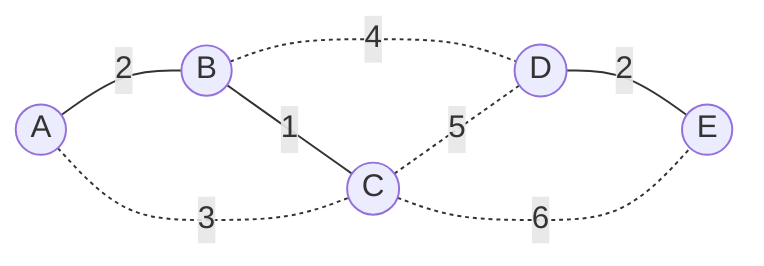

## Learning Objectives

- State Kruskal's algorithm precisely: sort all edges by weight ascending, then process them in that order, adding an edge unless it would connect two vertices already in the same component.
- Explain why the "same component" check that decides whether to add or skip an edge is exactly the union-find ADT's `connected` operation, with no adaptation needed.
- Justify Kruskal's correctness by connecting each accepted edge to the cut property: at the moment an edge is considered, it is the minimum-weight edge crossing the cut between its endpoint's component and everything else not yet merged with it.
- Derive Kruskal's overall running time, O(E log E), and explain why the initial sort — not the union-find operations — dominates that cost.
- Trace Kruskal's algorithm by hand on a small weighted graph, correctly identifying which edges are accepted, which are rejected as cycle-forming, and what the union-find structure's `find` results are at each step.

## Context & Motivation

The minimum spanning tree problem concept established the theoretical foundation this algorithm builds directly on: the cut property, which guarantees that a minimum-weight edge crossing any cut belongs to some MST, and the generic greedy MST algorithm, which repeatedly finds a not-yet-crossed cut and takes its cheapest crossing edge. Kruskal's algorithm is the first, and arguably the most direct, way of turning that generic template into something concrete and implementable: rather than picking cuts in some elaborate order, it simply sorts every edge in the graph by weight once, and then walks through that sorted list from cheapest to most expensive, deciding for each edge whether including it is safe.

The deciding question at each edge is simple to state: does this edge connect two vertices that are already connected to each other through edges already accepted? If yes, adding it would create a cycle — the two endpoints already have a path between them, so this edge would be a redundant connection, not one that extends the growing tree to somewhere new — and Kruskal's algorithm rejects it. If no — the two endpoints currently sit in two different, still-unconnected pieces of the structure being built — the edge safely merges those two pieces into one, and Kruskal's algorithm accepts it and moves on.

That deciding question — "are these two vertices already connected, given everything accepted so far?" — is precisely the question the union-find (disjoint-set) ADT was built to answer cheaply and incrementally, and this is not a coincidence or a re-purposing: the union-find concept's own Context & Motivation section named Kruskal's algorithm explicitly as the reason an efficient union-find implementation matters beyond toy network-connectivity examples, stating outright that "Kruskal's algorithm simply *is* a loop that calls union-find operations, which is precisely why an efficient union-find implementation matters well beyond the toy connectivity example." This concept is where that forward-pointer gets cashed in. Everything about *how* `find` and `union` work internally — the forest-of-trees representation, path compression, union by rank or size, and the resulting O(α(n)) amortized cost per operation — was already developed in full in the union-find ADT concept and its optimized-implementation successors; none of that is re-derived here. What matters for Kruskal's algorithm is only the *interface*: a `connected(a, b)` query answered in effectively constant time, and a `union(a, b)` call to merge two components, both already proven fast.

## Core Theory

### The algorithm, stated precisely

Given a connected, weighted, undirected graph G = (V, E) with n = |V| vertices:

1. Sort all edges in E by weight, ascending.
2. Initialize a union-find structure over V, with every vertex in its own singleton component (n components initially).
3. Initialize an empty set of accepted edges.
4. For each edge (u, v) in sorted order:
   - If `connected(u, v)` is `true` (i.e., `find(u) == find(v)`) — u and v are already in the same component — reject this edge; adding it would close a cycle.
   - Otherwise, accept the edge (add it to the growing spanning tree), and call `union(u, v)` to merge u's and v's components into one.
5. Stop once n − 1 edges have been accepted (equivalently, once the union-find structure reports a single remaining component); the accepted edges form a minimum spanning tree.

Every step of the deciding logic in step 4 is exactly the union-find ADT's contract, used with no modification: `connected` (built from `find`) answers "same component?", and `union` performs the merge that keeps the structure's partition accurate for the next edge considered. Kruskal's algorithm contributes the surrounding loop and the choice to process edges in globally sorted order; the component bookkeeping inside the loop is entirely union-find's job.

### Why sorting first, and why it's correct

Processing edges in strictly increasing weight order is what connects this algorithm back to the cut property. Consider the moment a given edge (u, v) is examined. Every edge cheaper than it has already been processed, so the components that exist at this moment (as tracked by union-find) reflect every accepted, safe merge made so far. If u and v are in different components at this moment, consider the cut separating u's current component from the rest of the graph: every edge examined so far that could have crossed this cut either was rejected (same component at the time, so it didn't actually cross this particular cut) or already merged u's component with something else (in which case that boundary has moved). Because edges are processed in ascending order, (u, v) — the first edge encountered connecting u's component to v's component — is guaranteed to be a minimum-weight edge crossing the cut between u's component and everything not yet merged with it, at the moment it's considered; nothing cheaper connects these two particular components, since anything cheaper was already processed and either already merged one of them elsewhere or didn't touch this pair at all. By the cut property, this edge is therefore safe to add — it belongs to some MST. Repeating this reasoning for every accepted edge shows the whole accepted set is safe, and since exactly n − 1 edges get accepted (one fewer than the starting number of singleton components, since each accepted edge reduces the component count by exactly one, matching union-find's own invariant that every effective union reduces the group count by one), the result is a complete, correctly minimal spanning tree.

### Complexity: the sort dominates

Kruskal's algorithm does two kinds of work: sorting all |E| edges once, and performing exactly 2|E| union-find operations in the worst case (one `connected` check and, for accepted edges, one `union` call, per edge examined). Sorting costs O(E log E) with any comparison-based sort. Each union-find operation, using the optimized implementation already established (union by rank or size, with path compression), costs O(α(n)) amortized — where α is the inverse Ackermann function, a quantity that grows so slowly it is less than 5 for any n that could ever be represented in physical memory, making it effectively constant for every practical purpose. So the total union-find work across all |E| edges is O(E · α(n)), which is asymptotically dwarfed by the O(E log E) sorting cost. The overall running time of Kruskal's algorithm is therefore O(E log E) — driven entirely by the initial sort, with the cycle-detection bookkeeping contributing a term so small it disappears into the sort's cost. (Since E can be as large as O(V²) for a dense graph, log E and log V differ only by a constant factor — log(V²) = 2 log V — so this bound is also commonly written O(E log V).)

Solid edges (B–C weight 1, A–B weight 2, D–E weight 2, B–D weight 4) are the ones Kruskal's algorithm accepts into the MST when processing this graph's edges in ascending order; dotted edges (A–C weight 3, C–D weight 5, C–E weight 6) are rejected because, by the time each is examined, its two endpoints are already in the same component.

## Worked Examples

### Example 1 — full trace on the five-building graph, with explicit union-find state

**Problem:** Using the same graph from the minimum spanning tree problem's Example 1 — vertices A, B, C, D, E; edges A–B: 2, A–C: 3, B–C: 1, B–D: 4, C–D: 5, C–E: 6, D–E: 2 — run Kruskal's algorithm, showing the union-find `find` result and decision at each step.

**Sort edges ascending:** B–C (1), A–B (2), D–E (2), A–C (3), B–D (4), C–D (5), C–E (6).

**Initialize:** union-find with 5 singleton components: {A}, {B}, {C}, {D}, {E}.

| Edge | find(u) vs find(v) | Decision | Components after |
|---|---|---|---|
| B–C (1) | find(B) ≠ find(C) — different singletons | Accept; union(B, C) | {B,C}, {A}, {D}, {E} |
| A–B (2) | find(A) ≠ find(B) — A is alone, B is in {B,C} | Accept; union(A, B) | {A,B,C}, {D}, {E} |
| D–E (2) | find(D) ≠ find(E) — different singletons | Accept; union(D, E) | {A,B,C}, {D,E} |
| A–C (3) | find(A) == find(C) — both already in {A,B,C} | **Reject** — would close cycle A-B-C-A | {A,B,C}, {D,E} (unchanged) |
| B–D (4) | find(B) ≠ find(D) — {A,B,C} vs {D,E} | Accept; union(B, D) | {A,B,C,D,E} — one component |

Four edges accepted (B–C, A–B, D–E, B–D) — exactly n − 1 = 4 for n = 5 — and the union-find structure now reports a single component, so the algorithm stops. The remaining edges (C–D, C–E) are never even examined in practice once n − 1 edges are accepted, though tracing them would show both rejected (find(C) == find(D) and find(C) == find(E) respectively, since everything has merged into one component by that point). Total weight: 1 + 2 + 2 + 4 = 9 — matching the MST found by direct inspection in the earlier concept.

### Example 2 — a rejection-heavy graph, to isolate the cycle check

**Problem:** Vertices {1, 2, 3, 4}, edges 1–2 (1), 2–3 (2), 1–3 (3), 3–4 (4), 1–4 (5). Trace Kruskal's algorithm.

**Sort:** 1–2 (1), 2–3 (2), 1–3 (3), 3–4 (4), 1–4 (5).

- 1–2 (1): find(1) ≠ find(2) → accept, union(1,2). Components: {1,2}, {3}, {4}.
- 2–3 (2): find(2) ≠ find(3) → accept, union(2,3). Components: {1,2,3}, {4}.
- 1–3 (3): find(1) == find(3) (both in {1,2,3}) → **reject**, cycle 1-2-3-1.
- 3–4 (4): find(3) ≠ find(4) → accept, union(3,4). Components: {1,2,3,4} — done, n − 1 = 3 edges accepted.
- 1–4 (5): never examined — the algorithm already stopped at 3 accepted edges.

Accepted edges: 1–2, 2–3, 3–4; total weight 1 + 2 + 4 = 7. Note that edge 1–3, despite being cheaper than 3–4, was correctly rejected — it would have connected two vertices (1 and 3) already reachable from each other through the accepted edges 1–2 and 2–3, and the union-find `find` check caught this in O(α(n)) time rather than requiring any explicit path search through the partially built tree.

## Common Misconceptions & Pitfalls

- **"Kruskal's algorithm needs to check for cycles by searching the partially built tree for a path between u and v."** That would work, but it throws away exactly the efficiency union-find was built to provide. The whole point of using union-find here is that "would this edge close a cycle" reduces to one `find`-based `connected` check, at effectively constant amortized cost, rather than a graph search through the tree built so far — which is exactly the forward-pointer the union-find concept made explicit.
- **"Since union-find can answer queries so fast, Kruskal's algorithm's running time should be near-linear in E, like union-find's own operations."** The union-find operations are indeed nearly constant-time each, but Kruskal's algorithm still has to sort all the edges first, and that sort costs O(E log E) — asymptotically larger than the O(E · α(n)) total spent on union-find calls. The bottleneck is the sort, not the connectivity structure; α(n) is small enough to be irrelevant next to log E.
- **"An edge should be rejected only if it forms a cycle with the immediately preceding accepted edge."** Cycle-formation is a property of an edge relative to the *entire* current set of accepted edges (equivalently, the current union-find partition), not just the most recently added one — Example 2's edge 1–3 forms a cycle using two earlier edges (1–2 and 2–3) together, not any single other edge alone, and the `find` check correctly accounts for this because union-find tracks the full transitive partition, not just pairwise adjacency.
- **"Processing edges in sorted order is just an implementation convenience — any order would work as long as cycles are avoided."** Sorted order is what makes the cut-property argument for correctness hold in the first place: the reasoning that the first edge connecting two components must be a minimum-weight crossing edge for the cut between them depends entirely on having already processed everything cheaper. Processing edges in an arbitrary order (while still rejecting cycles) produces *some* spanning tree, but gives no guarantee it is minimal.

## Summary

Kruskal's algorithm instantiates the generic greedy MST algorithm by sorting every edge once, ascending by weight, and then walking that sorted list, accepting each edge unless its two endpoints are already in the same component (which would close a cycle) and merging components otherwise. The "same component" check and the merge step are exactly the union-find ADT's `connected` and `union` operations, already fully developed and optimized elsewhere — this concept reuses that structure as a tool rather than re-explaining it, exactly per the forward-pointer laid down when union-find was introduced. Correctness follows from the cut property: because edges are processed cheapest-first, each accepted edge is guaranteed to be a minimum-weight edge crossing the cut separating its two not-yet-merged components at that moment. The overall running time is O(E log E), driven entirely by the initial sort, since the O(E · α(n)) total cost of every union-find operation across all edges is asymptotically negligible in comparison.

## Documentation Links

- [Sedgewick & Wayne — Algorithms Lectures (Princeton)](https://algs4.cs.princeton.edu/lectures/) — doc
- [MIT 6.006 — Syllabus (OCW)](https://ocw.mit.edu/courses/6-006-introduction-to-algorithms-spring-2020/pages/syllabus/) — doc
