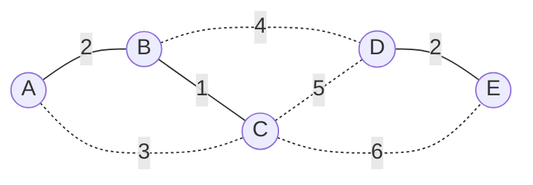

## Objetivos de Aprendizagem

- Enunciar o algoritmo de Kruskal precisamente: ordene todas as arestas por peso ascendente, depois as processe naquela ordem, adicionando uma aresta a menos que ela conectasse dois vértices já no mesmo componente.
- Explicar por que a verificação de "mesmo componente" que decide se adiciona ou pula uma aresta é exatamente a operação `connected` do TAD union-find, sem adaptação necessária.
- Justificar a correção de Kruskal conectando cada aresta aceita à propriedade de corte: no momento em que uma aresta é considerada, é a aresta de peso mínimo cruzando o corte entre o componente de seu extremo e tudo mais ainda não mesclado com ele.
- Derivar o tempo de execução geral de Kruskal, O(E log E), e explicar por que a ordenação inicial, não as operações de union-find, domina esse custo.
- Rastrear o algoritmo de Kruskal manualmente em um pequeno grafo ponderado, identificando corretamente quais arestas são aceitas, quais são rejeitadas por formar ciclo, e quais são os resultados de `find` da estrutura union-find em cada passo.

## Contexto e Motivação

O conceito do problema de árvore geradora mínima estabeleceu a fundação teórica sobre a qual este algoritmo se constrói diretamente: a propriedade de corte, que garante que uma aresta de peso mínimo cruzando qualquer corte pertence a alguma MST, e o algoritmo genérico guloso de MST, que repetidamente encontra um corte ainda não cruzado e toma sua aresta de cruzamento mais barata. O algoritmo de Kruskal é a primeira, e possivelmente a mais direta, forma de transformar esse modelo genérico em algo concreto e implementável: em vez de escolher cortes em alguma ordem elaborada, simplesmente ordena toda aresta no grafo por peso uma vez, e depois percorre essa lista ordenada da mais barata para a mais cara, decidindo para cada aresta se incluí-la é seguro.

A pergunta decisiva em cada aresta é simples de enunciar: essa aresta conecta dois vértices que já estão conectados um ao outro através de arestas já aceitas? Se sim, adicioná-la criaria um ciclo, os dois extremos já têm um caminho entre eles, então essa aresta seria uma conexão redundante, não uma que estende a árvore crescente para algum lugar novo, e o algoritmo de Kruskal a rejeita. Se não, os dois extremos atualmente estão em dois pedaços diferentes, ainda não conectados, da estrutura sendo construída, a aresta mescla com segurança esses dois pedaços em um, e o algoritmo de Kruskal a aceita e continua.

Essa pergunta decisiva, "esses dois vértices já estão conectados, dado tudo aceito até agora?", é precisamente a pergunta que o TAD union-find (conjunto disjunto) foi construído para responder barata e incrementalmente, e isso não é coincidência ou reaproveitamento: a própria seção de Contexto e Motivação do conceito de union-find nomeou o algoritmo de Kruskal explicitamente como a razão pela qual uma implementação eficiente de union-find importa além dos exemplos de brinquedo de conectividade de rede, afirmando diretamente que "o algoritmo de Kruskal simplesmente *é* um laço que chama operações de union-find, que é precisamente por que uma implementação eficiente de union-find importa muito além do exemplo de conectividade de brinquedo." Este conceito é onde essa referência antecipada é resgatada. Tudo sobre *como* `find` e `union` funcionam internamente, a representação de floresta de árvores, compressão de caminho, união por rank ou size, e o custo amortizado O(α(n)) resultante por operação, já foi desenvolvido por completo no conceito do TAD union-find e seus sucessores de implementação otimizada; nada disso é rederivado aqui. O que importa para o algoritmo de Kruskal é apenas a *interface*: uma consulta `connected(a, b)` respondida em tempo efetivamente constante, e uma chamada `union(a, b)` para mesclar dois componentes, ambas já provadas rápidas.

## Teoria Central

### O algoritmo, enunciado precisamente

Dado um grafo conexo, ponderado, não direcionado G = (V, E) com n = |V| vértices:

1. Ordene todas as arestas em E por peso, ascendente.
2. Inicialize uma estrutura union-find sobre V, com todo vértice em seu próprio componente unitário (n componentes inicialmente).
3. Inicialize um conjunto vazio de arestas aceitas.
4. Para cada aresta (u, v) em ordem ordenada:
   - Se `connected(u, v)` é `true` (ou seja, `find(u) == find(v)`), u e v já estão no mesmo componente, rejeite essa aresta; adicioná-la fecharia um ciclo.
   - Caso contrário, aceite a aresta (adicione-a à árvore geradora crescente), e chame `union(u, v)` para mesclar os componentes de u e v em um.
5. Pare uma vez que n − 1 arestas tenham sido aceitas (equivalentemente, uma vez que a estrutura union-find relata um único componente restante); as arestas aceitas formam uma árvore geradora mínima.

Todo passo da lógica decisiva no passo 4 é exatamente o contrato do TAD union-find, usado sem modificação: `connected` (construído a partir de `find`) responde "mesmo componente?", e `union` realiza a mesclagem que mantém a partição da estrutura precisa para a próxima aresta considerada. O algoritmo de Kruskal contribui o laço ao redor e a escolha de processar arestas em ordem globalmente ordenada; a contabilidade de componente dentro do laço é inteiramente trabalho de union-find.

### Por que ordenar primeiro, e por que é correto

Processar arestas em ordem estritamente crescente de peso é o que conecta este algoritmo de volta à propriedade de corte. Considere o momento em que uma dada aresta (u, v) é examinada. Toda aresta mais barata que ela já foi processada, então os componentes que existem naquele momento (rastreados por union-find) refletem toda mesclagem aceita, segura, feita até agora. Se u e v estão em componentes diferentes naquele momento, considere o corte separando o componente atual de u do resto do grafo: toda aresta examinada até agora que poderia ter cruzado esse corte ou foi rejeitada (mesmo componente naquele momento, então na verdade não cruzou esse corte particular) ou já mesclou o componente de u com algo mais (caso em que aquela fronteira se moveu). Porque arestas são processadas em ordem ascendente, (u, v), a primeira aresta encontrada conectando o componente de u ao componente de v, é garantida ser uma aresta de peso mínimo cruzando o corte entre o componente de u e tudo ainda não mesclado com ele, no momento em que é considerada; nada mais barato conecta esses dois componentes específicos, já que qualquer coisa mais barata já foi processada e ou já mesclou um deles em outro lugar ou não tocou esse par de forma alguma. Pela propriedade de corte, essa aresta é portanto segura para adicionar, pertence a alguma MST. Repetir esse raciocínio para toda aresta aceita mostra que o conjunto aceito inteiro é seguro, e já que exatamente n − 1 arestas são aceitas (uma a menos que o número inicial de componentes unitários, já que cada aresta aceita reduz a contagem de componente por exatamente um, combinando com o próprio invariante de union-find de que toda união efetiva reduz a contagem de grupo por um), o resultado é uma árvore geradora completa e corretamente mínima.

### Complexidade: a ordenação domina

O algoritmo de Kruskal faz dois tipos de trabalho: ordenar todas as |E| arestas uma vez, e realizar exatamente 2|E| operações de union-find no pior caso (uma verificação `connected` e, para arestas aceitas, uma chamada `union`, por aresta examinada). Ordenar custa O(E log E) com qualquer ordenação baseada em comparação. Cada operação de union-find, usando a implementação otimizada já estabelecida (união por rank ou size, com compressão de caminho), custa O(α(n)) amortizado, onde α é a função inversa de Ackermann, uma quantidade que cresce tão lentamente que é menor que 5 para qualquer n que já pudesse ser representado em memória física, tornando-a efetivamente constante para todo propósito prático. Então o trabalho total de union-find através de todas as |E| arestas é O(E · α(n)), que é assintoticamente ofuscado pelo custo de ordenação O(E log E). O tempo de execução geral do algoritmo de Kruskal é portanto O(E log E), movido inteiramente pela ordenação inicial, com a contabilidade de detecção de ciclo contribuindo um termo tão pequeno que desaparece no custo da ordenação. (Já que E pode ser tão grande quanto O(V²) para um grafo denso, log E e log V diferem apenas por um fator constante, log(V²) = 2 log V, então esse limite também é comumente escrito O(E log V).)

Arestas sólidas (B–C peso 1, A–B peso 2, D–E peso 2, B–D peso 4) são as que o algoritmo de Kruskal aceita na MST ao processar as arestas deste grafo em ordem ascendente; arestas pontilhadas (A–C peso 3, C–D peso 5, C–E peso 6) são rejeitadas porque, no momento em que cada uma é examinada, seus dois extremos já estão no mesmo componente.

## Exemplos Resolvidos

### Exemplo 1 — rastreamento completo no grafo dos cinco prédios, com estado union-find explícito

**Problema:** Usando o mesmo grafo do Exemplo 1 do problema de árvore geradora mínima, vértices A, B, C, D, E; arestas A–B: 2, A–C: 3, B–C: 1, B–D: 4, C–D: 5, C–E: 6, D–E: 2, rode o algoritmo de Kruskal, mostrando o resultado de `find` do union-find e a decisão em cada passo.

**Ordene arestas ascendente:** B–C (1), A–B (2), D–E (2), A–C (3), B–D (4), C–D (5), C–E (6).

**Inicialize:** union-find com 5 componentes unitários: {A}, {B}, {C}, {D}, {E}.

| Aresta | find(u) vs find(v) | Decisão | Componentes depois |
|---|---|---|---|
| B–C (1) | find(B) ≠ find(C) — unitários diferentes | Aceita; union(B, C) | {B,C}, {A}, {D}, {E} |
| A–B (2) | find(A) ≠ find(B) — A está sozinho, B está em {B,C} | Aceita; union(A, B) | {A,B,C}, {D}, {E} |
| D–E (2) | find(D) ≠ find(E) — unitários diferentes | Aceita; union(D, E) | {A,B,C}, {D,E} |
| A–C (3) | find(A) == find(C) — ambos já em {A,B,C} | **Rejeita** — fecharia ciclo A-B-C-A | {A,B,C}, {D,E} (inalterado) |
| B–D (4) | find(B) ≠ find(D) — {A,B,C} vs {D,E} | Aceita; union(B, D) | {A,B,C,D,E} — um componente |

Quatro arestas aceitas (B–C, A–B, D–E, B–D), exatamente n − 1 = 4 para n = 5, e a estrutura union-find agora relata um único componente, então o algoritmo para. As arestas restantes (C–D, C–E) nunca são de fato examinadas na prática uma vez que n − 1 arestas são aceitas, embora rastreá-las mostraria ambas rejeitadas (find(C) == find(D) e find(C) == find(E) respectivamente, já que tudo se mesclou em um componente naquele ponto). Peso total: 1 + 2 + 2 + 4 = 9, combinando com a MST encontrada por inspeção direta no conceito anterior.

### Exemplo 2 — um grafo pesado em rejeições, para isolar a verificação de ciclo

**Problema:** Vértices {1, 2, 3, 4}, arestas 1–2 (1), 2–3 (2), 1–3 (3), 3–4 (4), 1–4 (5). Rastreie o algoritmo de Kruskal.

**Ordene:** 1–2 (1), 2–3 (2), 1–3 (3), 3–4 (4), 1–4 (5).

- 1–2 (1): find(1) ≠ find(2) → aceita, union(1,2). Componentes: {1,2}, {3}, {4}.
- 2–3 (2): find(2) ≠ find(3) → aceita, union(2,3). Componentes: {1,2,3}, {4}.
- 1–3 (3): find(1) == find(3) (ambos em {1,2,3}) → **rejeita**, ciclo 1-2-3-1.
- 3–4 (4): find(3) ≠ find(4) → aceita, union(3,4). Componentes: {1,2,3,4} — terminado, n − 1 = 3 arestas aceitas.
- 1–4 (5): nunca examinada, o algoritmo já parou em 3 arestas aceitas.

Arestas aceitas: 1–2, 2–3, 3–4; peso total 1 + 2 + 4 = 7. Note que a aresta 1–3, apesar de ser mais barata que 3–4, foi corretamente rejeitada, teria conectado dois vértices (1 e 3) já alcançáveis um do outro através das arestas aceitas 1–2 e 2–3, e a verificação `find` do union-find capturou isso em tempo O(α(n)) em vez de exigir qualquer busca de caminho explícita através da árvore parcialmente construída.

## Equívocos Comuns e Armadilhas

- **"O algoritmo de Kruskal precisa verificar ciclos buscando na árvore parcialmente construída por um caminho entre u e v."** Isso funcionaria, mas descarta exatamente a eficiência que union-find foi construído para fornecer. O ponto inteiro de usar union-find aqui é que "essa aresta fecharia um ciclo" se reduz a uma verificação `connected` baseada em `find`, a custo amortizado efetivamente constante, em vez de uma busca de grafo através da árvore construída até agora, que é exatamente a referência antecipada que o conceito de union-find tornou explícita.
- **"Já que union-find pode responder consultas tão rápido, o tempo de execução do algoritmo de Kruskal deveria ser quase linear em E, como as próprias operações de union-find."** As operações de union-find são de fato quase de tempo constante cada uma, mas o algoritmo de Kruskal ainda tem que ordenar todas as arestas primeiro, e essa ordenação custa O(E log E), assintoticamente maior que o O(E · α(n)) total gasto em chamadas de union-find. O gargalo é a ordenação, não a estrutura de conectividade; α(n) é pequeno o suficiente para ser irrelevante ao lado de log E.
- **"Uma aresta deveria ser rejeitada só se forma um ciclo com a aresta aceita imediatamente anterior."** Formação de ciclo é uma propriedade de uma aresta relativa ao conjunto *inteiro* de arestas atualmente aceitas (equivalentemente, a partição union-find atual), não apenas a mais recentemente adicionada, a aresta 1–3 do Exemplo 2 forma um ciclo usando duas arestas anteriores (1–2 e 2–3) juntas, não qualquer outra aresta única sozinha, e a verificação `find` corretamente contabiliza isso porque union-find rastreia a partição transitiva completa, não só adjacência par-a-par.
- **"Processar arestas em ordem ordenada é só uma conveniência de implementação; qualquer ordem funcionaria desde que ciclos sejam evitados."** Ordem ordenada é o que torna o argumento da propriedade de corte para correção válido afinal: o raciocínio de que a primeira aresta conectando dois componentes deve ser uma aresta de cruzamento de peso mínimo para o corte entre eles depende inteiramente de já ter processado tudo mais barato. Processar arestas em uma ordem arbitrária (ainda rejeitando ciclos) produz *alguma* árvore geradora, mas não dá nenhuma garantia de que seja mínima.

## Resumo

O algoritmo de Kruskal instancia o algoritmo genérico guloso de MST ordenando toda aresta uma vez, ascendente por peso, e depois percorrendo essa lista ordenada, aceitando cada aresta a menos que seus dois extremos já estejam no mesmo componente (o que fecharia um ciclo) e mesclando componentes caso contrário. A verificação de "mesmo componente" e o passo de mesclagem são exatamente as operações `connected` e `union` do TAD union-find, já completamente desenvolvidas e otimizadas em outro lugar, este conceito reutiliza essa estrutura como uma ferramenta em vez de reexplicá-la, exatamente conforme a referência antecipada estabelecida quando union-find foi introduzido. Correção decorre da propriedade de corte: porque arestas são processadas mais-barata-primeiro, toda aresta aceita é garantida ser uma aresta de peso mínimo cruzando o corte separando seus dois componentes ainda não mesclados naquele momento. O tempo de execução geral é O(E log E), movido inteiramente pela ordenação inicial, já que o custo total O(E · α(n)) de toda operação de union-find através de todas as arestas é assintoticamente negligenciável em comparação.

## Documentation Links

- [Sedgewick & Wayne — Algorithms Lectures (Princeton)](https://algs4.cs.princeton.edu/lectures/) — doc
- [MIT 6.006 — Syllabus (OCW)](https://ocw.mit.edu/courses/6-006-introduction-to-algorithms-spring-2020/pages/syllabus/) — doc
