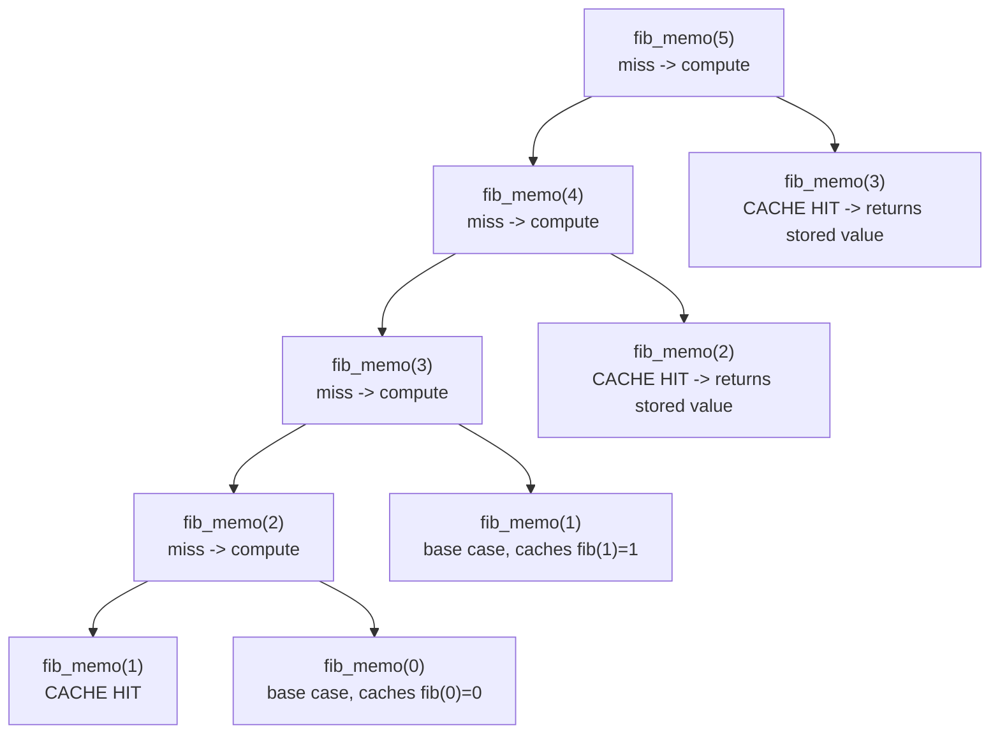

## Learning Objectives

- Add a cache to an existing naive recursive function without changing its recursive structure or its correctness.
- Trace a memoized call tree and identify exactly which calls hit the cache instead of recursing further.
- Explain, in complexity terms, why caching turns an exponential number of calls into a linear one.
- State the general memoization pattern (check cache, compute on miss, store before returning) so it transfers to any problem satisfying the previous concept's two properties.
- Identify the specific cost memoization retains from ordinary recursion (call-stack depth) that the next concept's technique avoids.

## Context & Motivation

The recursion concept already built, in full, the mental model this concept needs: a base case, a recursive case that shrinks the problem and trusts ("the recursive leap of faith") that the smaller call returns the right answer, and a call stack of paused frames unwinding once the base case is reached. That same material closed with an honest admission about naive recursive Fibonacci — that `fibonacci(2)` gets computed twice just within `fibonacci(4)`, "repeated work that a loop-based, iterative version naturally avoids by computing each value only once and remembering it." Memoization is the direct, minimal fix for exactly that gap, applied without abandoning recursion at all: keep the exact same recursive function, exactly as already written and understood, and add a single new piece of behavior — a cache, checked before recursing and filled after computing.

This is worth stating as plainly as possible, because it is easy to over-mystify: memoization is not a new paradigm bolted onto recursion from outside. It is the same base case, the same recursive case, the same leap of faith, the same call stack — with one line added at the top of the function ("have I already solved this exact subproblem? if so, hand back the stored answer instead of recursing") and one line added at the bottom ("before returning, store this answer under this input, so any future call with the same input can just look it up"). Every recursive function that has overlapping subproblems, in the sense the previous concept made precise, can be memoized this same way, with no other change to its logic. The previous concept established *when* this technique is legitimate to reach for (both properties must hold); this concept is about *how* to apply it, mechanically, to a function already in hand.

The payoff for that one small addition is not small at all: naive recursive Fibonacci's `O(2ⁿ)`-ish call count collapses to `O(n)` distinct subproblems ever actually computed, each one exactly once. This is one of the starkest complexity improvements available from a single, localized code change anywhere in this course, and seeing it happen concretely — not just asserted, but traced through an actual modified call tree — is the point of this concept.

## Core Theory

### The exact same function, plus a cache

Recall naive recursive Fibonacci from the previous concept:

```python
def fib(n):
    if n <= 1:
        return n
    return fib(n - 1) + fib(n - 2)
```

Memoization changes this to:

```python
def fib_memo(n, cache={}):
    if n in cache:                        # NEW: have we already solved this exact subproblem?
        return cache[n]
    if n <= 1:                            # base case — unchanged
        result = n
    else:
        result = fib_memo(n - 1, cache) + fib_memo(n - 2, cache)   # recursive case — unchanged
    cache[n] = result                     # NEW: store before returning
    return result
```

Every piece that was already there — the base case `n <= 1`, the recursive case `fib_memo(n-1) + fib_memo(n-2)`, the trust that each recursive call returns the correct answer for its smaller input — is untouched. The only additions are the cache check at the top and the cache write just before returning. This is memoization in full generality: given any correctly-written recursive function whose problem satisfies overlapping subproblems and optimal substructure, wrap it exactly this way, and nothing about its correctness needs to be re-argued — it was already proven correct as ordinary recursion; the cache only changes *how many times* each subproblem gets solved, never *what* the answer is.

### Tracing the modified call tree

Retracing `fib_memo(5)` with an empty starting cache shows exactly which calls now short-circuit:



Compare this against the previous concept's unmodified diagram, which had 15 total calls branching all the way down to repeated `fib(1)` and `fib(0)` leaves. Here, the *first* time `fib_memo(3)` is reached (via `fib_memo(4) → fib_memo(3)`), it actually recurses and computes an answer, caching it under key `3`. The *second* time `fib_memo(3)` is reached (directly from `fib_memo(5)`), it hits the cache immediately and returns without recursing at all — no further branches spawn beneath that node. The same happens for `fib_memo(2)`: computed once (as a side effect of resolving `fib_memo(3)`), then reused directly from `fib_memo(4)` without recomputation. Every one of the `n + 1` distinct subproblems (`fib_memo(0)` through `fib_memo(5)`) is computed exactly once; every repeat visit is a cache hit that returns in constant time with no further recursion.

### Complexity: exponential to linear

Naive Fibonacci makes a number of calls that grows roughly like `φⁿ` (`φ ≈ 1.618`), i.e., `O(2ⁿ)` as a coarse bound — because every one of the exponentially many leaves of the recursion tree contributes a full-cost call. Memoized Fibonacci computes each of the `n + 1` distinct subproblems exactly once (the first time it's reached), doing `O(1)` work per subproblem beyond its own recursive calls, and every subsequent reference to an already-solved subproblem costs `O(1)` (a cache lookup) instead of triggering fresh recursion. Total time drops to `O(n)` — linear — a genuinely exponential-to-polynomial improvement from a two-line change. Space also grows to `O(n)`, for the cache itself (plus the call stack, addressed next) — memoization trades a small, deliberate amount of memory for an enormous reduction in redundant computation.

### The general pattern, and what memoization still costs

The pattern generalizes beyond Fibonacci to any problem meeting the previous concept's two properties: identify the subproblem a given input represents (often, but not always, just the function's arguments), check a cache keyed by that subproblem before doing any work, compute normally (recursively) on a miss, and store the result before returning. This is called **top-down** dynamic programming because computation starts at the top (the original, largest input) and works its way down to base cases via recursion — exactly the direction ordinary recursion already goes, memoization only prevents repeat descents into already-resolved subproblems.

What memoization does *not* remove is the call stack itself: `fib_memo(n)`, on its very first (cache-miss) descent to compute `fib_memo(0)`, still requires roughly `n` simultaneously-pending stack frames, exactly as ordinary recursion did — the recursion concept's warning about stack depth (and Python's `RecursionError` once that depth limit is hit) still applies in full to memoized code. Eliminating that cost entirely is precisely what the next concept, tabulation, achieves.

## Worked Examples

### Example 1 — memoized Fibonacci, traced against the naive version

**Problem:** Confirm memoized `fib_memo(5)` returns the correct value, and count how many distinct subproblems are actually computed (as opposed to looked up).

Following the Core Theory diagram: `fib_memo(5)` computes fresh values for `n = 5, 4, 3, 2, 1, 0` — six distinct subproblems — and every other call in the tree (the second `fib_memo(3)`, the second `fib_memo(2)`, every repeated `fib_memo(1)` and `fib_memo(0)`) is a cache hit. `fib_memo(0) = 0`, `fib_memo(1) = 1`, `fib_memo(2) = 1`, `fib_memo(3) = 2`, `fib_memo(4) = 3`, `fib_memo(5) = 5` — matching the well-known Fibonacci sequence, and matching exactly what naive `fib(5)` would have returned, just computed with `6` fresh calls total instead of `15`.

### Example 2 — memoizing a different problem: grid paths

**Problem:** Memoize the grid-path-counting recursion from the previous concept's Example 2, `count_paths(r, c) = count_paths(r-1, c) + count_paths(r, c-1)` with base case `count_paths(0, c) = count_paths(r, 0) = 1`.

Applying the same recipe — cache keyed this time by the pair `(r, c)`, since that pair is what identifies a subproblem here, not a single number:

```python
def count_paths_memo(r, c, cache=None):
    if cache is None:
        cache = {}
    if (r, c) in cache:
        return cache[(r, c)]
    if r == 0 or c == 0:
        result = 1
    else:
        result = count_paths_memo(r - 1, c, cache) + count_paths_memo(r, c - 1, cache)
    cache[(r, c)] = result
    return result
```

Nothing about the recursive logic changed from the un-memoized version — only the cache check and cache write were added, keyed on the `(r, c)` pair instead of a single integer. Every one of the `O(rows × cols)` distinct `(r, c)` pairs is now computed exactly once, rather than being rediscovered along every distinct path that happens to pass through it — the same exponential-to-polynomial shift seen with Fibonacci, here from exponential-in-the-worst-case naive recursion to `O(rows × cols)`.

### Example 3 — diagnosing a cache keyed incorrectly

**Problem:** A student memoizes a function `longest_prefix_match(s, i, target)` — meant to find, starting at index `i` of string `s`, the longest prefix of `target` matched starting there — but keys the cache only by `i`, not by `target`. The function is later called with several different `target` values against the same `s`. Why does this memoization silently return wrong answers?

**Diagnosis.** The cache key must uniquely identify the subproblem — every distinct input that could produce a distinct answer needs to be distinguishable in the cache. Here, keying only by `i` conflates "the answer for `(i, target="cat")`" with "the answer for `(i, target="dog")`" — whichever `target` happens to populate the cache entry for a given `i` first will be wrongly returned for every subsequent call with the same `i` but a different `target`. The fix is to key the cache by the full tuple `(i, target)` (or, if `target` is fixed for the lifetime of one top-level call, to reset the cache between calls with different targets) — a reminder that "the subproblem" is defined by everything the recursive case actually depends on, not just whichever argument happens to look like the natural index.

## Common Misconceptions & Pitfalls

- **"Memoization is a completely different technique from recursion, requiring new logic."** As the side-by-side `fib` vs. `fib_memo` code shows, the recursive case and base case are byte-for-byte the same; only a cache check and a cache write were added. Anyone comfortable with ordinary recursion already has 90% of memoization down.
- **"Memoization avoids the call stack, just like an iterative loop does."** It does not — the very first descent to the smallest base case still requires a full chain of pending stack frames, exactly as unmemoized recursion does. Memoization saves redundant *recomputation*, not stack *depth*; a memoized function can still hit `RecursionError` on a large enough first call.
- **"The cache key should just be whatever the first argument is."** Example 3 shows this can silently produce wrong answers if the function's answer actually depends on more than one argument — the cache key must capture everything that distinguishes one subproblem's correct answer from another's.
- **"Adding a cache always helps."** Memoization only helps when subproblems actually recur (overlapping subproblems, per the previous concept) — memoizing a divide-and-conquer recursion like merge sort's, where no subproblem is ever revisited, adds cache-lookup overhead and memory for zero benefit, since every cache check would be a guaranteed miss.

## Summary

Memoization takes an already-correct recursive function — unchanged base case, unchanged recursive case, unchanged trust in the recursive leap of faith — and adds exactly two things: a check, at the top, for whether this exact subproblem's answer is already cached, and a write, at the bottom, storing the answer before it returns. Retracing memoized Fibonacci's call tree shows every repeated subproblem (`fib_memo(3)` and `fib_memo(2)`, each reached twice in `fib_memo(5)`'s tree) resolving as an instant cache hit on its second visit, with no further recursion beneath it — collapsing what was `O(2ⁿ)`-ish total calls down to `O(n)` distinct subproblems ever computed. This "top-down" style still walks from the original input down toward base cases via ordinary recursive calls, and it still pays recursion's full call-stack cost on its first descent to the smallest subproblems — a cost the next concept's technique, tabulation, eliminates entirely by inverting the direction of computation.

## Documentation Links

- [MIT 6.006 — Lecture Notes (OCW)](https://ocw.mit.edu/courses/6-006-introduction-to-algorithms-spring-2020/pages/lecture-notes/) — doc
- [MIT 6.006 — Syllabus (OCW)](https://ocw.mit.edu/courses/6-006-introduction-to-algorithms-spring-2020/pages/syllabus/) — doc
