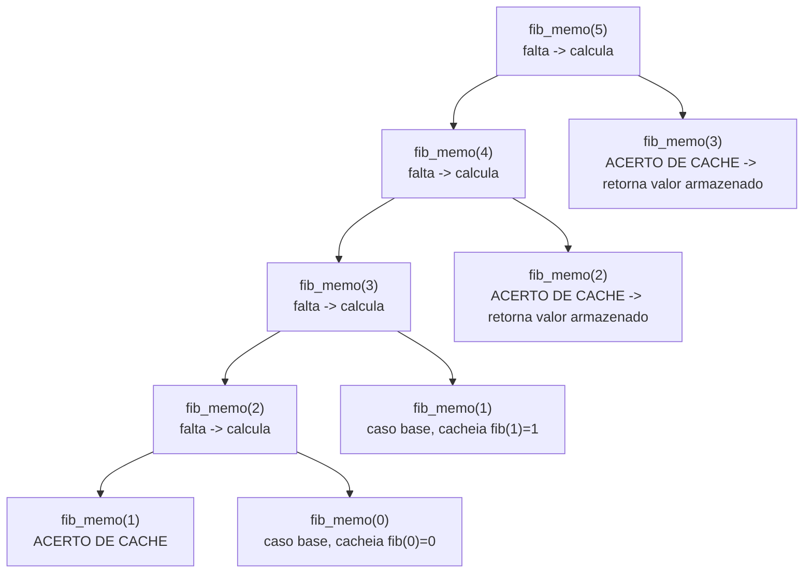

## Objetivos de Aprendizagem

- Adicionar um cache a uma função recursiva ingênua existente sem mudar sua estrutura recursiva ou sua correção.
- Rastrear uma árvore de chamada memoizada e identificar exatamente quais chamadas acertam o cache em vez de recursar mais.
- Explicar, em termos de complexidade, por que cachear transforma um número exponencial de chamadas em um linear.
- Enunciar o padrão geral de memoização (verifique cache, calcule na falta, armazene antes de retornar) para que se transfira a qualquer problema satisfazendo as duas propriedades do conceito anterior.
- Identificar o custo específico que memoização retém da recursão comum (profundidade de pilha de chamada) que a técnica do próximo conceito evita.

## Contexto e Motivação

O conceito de recursão já construiu, por completo, o modelo mental que este conceito precisa: um caso base, um caso recursivo que encolhe o problema e confia ("o salto de fé recursivo") que a chamada menor retorna a resposta certa, e uma pilha de chamada de quadros pausados se desenrolando uma vez que o caso base é alcançado. Aquele mesmo material terminou com uma admissão honesta sobre Fibonacci recursivo ingênuo, que `fibonacci(2)` é calculado duas vezes só dentro de `fibonacci(4)`, "trabalho repetido que uma versão iterativa, baseada em laço, naturalmente evita calculando cada valor só uma vez e lembrando dele." Memoização é o conserto direto, mínimo, para exatamente essa lacuna, aplicado sem abandonar recursão de forma alguma: mantenha exatamente a mesma função recursiva, exatamente como já escrita e entendida, e adicione um único comportamento novo, um cache, verificado antes de recursar e preenchido depois de calcular.

Vale a pena enunciar isso o mais claramente possível, porque é fácil supermistificar: memoização não é um novo paradigma acoplado à recursão de fora. É o mesmo caso base, o mesmo caso recursivo, o mesmo salto de fé, a mesma pilha de chamada, com uma linha adicionada no topo da função ("já resolvi esse exato subproblema? se sim, entregue a resposta armazenada em vez de recursar") e uma linha adicionada no fim ("antes de retornar, armazene essa resposta sob essa entrada, para que qualquer chamada futura com a mesma entrada possa simplesmente consultá-la"). Toda função recursiva que tem subproblemas sobrepostos, no sentido que o conceito anterior tornou preciso, pode ser memoizada exatamente dessa forma, sem nenhuma outra mudança à sua lógica. O conceito anterior estabeleceu *quando* essa técnica é legítima de usar (ambas as propriedades devem valer); este conceito é sobre *como* aplicá-la, mecanicamente, a uma função já à mão.

O ganho por essa pequena adição não é pequeno de forma alguma: a contagem de chamada tipo-`O(2ⁿ)` de Fibonacci recursivo ingênuo colapsa para `O(n)` subproblemas distintos jamais de fato calculados, cada um exatamente uma vez. Essa é uma das melhorias de complexidade mais gritantes disponíveis a partir de uma única mudança de código localizada em qualquer lugar neste curso, e vê-la acontecer concretamente, não apenas afirmada, mas rastreada através de uma árvore de chamada modificada real, é o ponto deste conceito.

## Teoria Central

### A mesmíssima função, mais um cache

Relembre Fibonacci recursivo ingênuo do conceito anterior:

```python
def fib(n):
    if n <= 1:
        return n
    return fib(n - 1) + fib(n - 2)
```

Memoização transforma isso em:

```python
def fib_memo(n, cache={}):
    if n in cache:                        # NOVO: já resolvemos esse exato subproblema?
        return cache[n]
    if n <= 1:                            # caso base — inalterado
        result = n
    else:
        result = fib_memo(n - 1, cache) + fib_memo(n - 2, cache)   # caso recursivo — inalterado
    cache[n] = result                     # NOVO: armazena antes de retornar
    return result
```

Toda peça que já estava ali, o caso base `n <= 1`, o caso recursivo `fib_memo(n-1) + fib_memo(n-2)`, a confiança de que cada chamada recursiva retorna a resposta correta para sua entrada menor, está intocada. As únicas adições são a verificação de cache no topo e a escrita de cache logo antes de retornar. Isso é memoização em generalidade completa: dada qualquer função recursiva corretamente escrita cujo problema satisfaça subproblemas sobrepostos e subestrutura ótima, envolva-a exatamente dessa forma, e nada sobre sua correção precisa ser rearumentado, já foi provada correta como recursão comum; o cache só muda *quantas vezes* cada subproblema é resolvido, nunca *qual* é a resposta.

### Rastreando a árvore de chamada modificada

Rerastrear `fib_memo(5)` com um cache inicial vazio mostra exatamente quais chamadas agora fazem curto-circuito:



Compare isso contra o diagrama não modificado do conceito anterior, que tinha 15 chamadas totais se ramificando até o fundo para folhas repetidas `fib(1)` e `fib(0)`. Aqui, a *primeira* vez que `fib_memo(3)` é alcançado (via `fib_memo(4) → fib_memo(3)`), de fato recursa e calcula uma resposta, cacheando-a sob a chave `3`. A *segunda* vez que `fib_memo(3)` é alcançado (diretamente de `fib_memo(5)`), acerta o cache imediatamente e retorna sem recursar de forma alguma, nenhum ramo adicional brota abaixo daquele nó. O mesmo acontece para `fib_memo(2)`: calculado uma vez (como efeito colateral de resolver `fib_memo(3)`), depois reutilizado diretamente de `fib_memo(4)` sem recálculo. Todo um dos `n + 1` subproblemas distintos (`fib_memo(0)` até `fib_memo(5)`) é calculado exatamente uma vez; toda visita repetida é um acerto de cache que retorna em tempo constante sem mais recursão.

### Complexidade: de exponencial para linear

Fibonacci ingênuo faz um número de chamadas que cresce aproximadamente como `φⁿ` (`φ ≈ 1.618`), ou seja, `O(2ⁿ)` como um limite grosseiro, porque toda uma das exponencialmente muitas folhas da árvore de recursão contribui uma chamada de custo completo. Fibonacci memoizado calcula cada um dos `n + 1` subproblemas distintos exatamente uma vez (a primeira vez que é alcançado), fazendo `O(1)` de trabalho por subproblema além de suas próprias chamadas recursivas, e toda referência subsequente a um subproblema já resolvido custa `O(1)` (uma consulta de cache) em vez de disparar recursão fresca. Tempo total cai para `O(n)`, linear, uma melhoria genuinamente exponencial-para-polinomial a partir de uma mudança de duas linhas. Espaço também cresce para `O(n)`, pelo próprio cache (mais a pilha de chamada, abordada em seguida), memoização troca uma pequena, deliberada quantidade de memória por uma enorme redução em computação redundante.

### O padrão geral, e o que memoização ainda custa

O padrão generaliza além de Fibonacci para qualquer problema atendendo às duas propriedades do conceito anterior: identifique o subproblema que uma dada entrada representa (frequentemente, mas nem sempre, apenas os argumentos da função), verifique um cache chaveado por aquele subproblema antes de fazer qualquer trabalho, calcule normalmente (recursivamente) em uma falta, e armazene o resultado antes de retornar. Isso é chamado de programação dinâmica **de cima para baixo** porque a computação começa no topo (a entrada original, maior) e trabalha seu caminho para baixo até casos base via recursão, exatamente a direção que recursão comum já vai, memoização só previne descidas repetidas em subproblemas já resolvidos.

O que memoização *não* remove é a própria pilha de chamada: `fib_memo(n)`, em sua primeiríssima descida (falta de cache) para calcular `fib_memo(0)`, ainda exige aproximadamente `n` quadros de pilha simultaneamente pendentes, exatamente como recursão comum exigia, o alerta do conceito de recursão sobre profundidade de pilha (e o `RecursionError` do Python uma vez que aquele limite de profundidade é atingido) ainda se aplica por completo a código memoizado. Eliminar esse custo inteiramente é precisamente o que o próximo conceito, tabulação, alcança.

## Exemplos Resolvidos

### Exemplo 1 — Fibonacci memoizado, rastreado contra a versão ingênua

**Problema:** Confirme que `fib_memo(5)` memoizado retorna o valor correto, e conte quantos subproblemas distintos são de fato calculados (em oposição a consultados).

Seguindo o diagrama da Teoria Central: `fib_memo(5)` calcula valores frescos para `n = 5, 4, 3, 2, 1, 0`, seis subproblemas distintos, e toda outra chamada na árvore (o segundo `fib_memo(3)`, o segundo `fib_memo(2)`, todo `fib_memo(1)` e `fib_memo(0)` repetido) é um acerto de cache. `fib_memo(0) = 0`, `fib_memo(1) = 1`, `fib_memo(2) = 1`, `fib_memo(3) = 2`, `fib_memo(4) = 3`, `fib_memo(5) = 5`, combinando com a sequência de Fibonacci bem conhecida, e combinando exatamente com o que `fib(5)` ingênuo teria retornado, só calculado com `6` chamadas frescas totais em vez de `15`.

### Exemplo 2 — memoizando um problema diferente: caminhos em grid

**Problema:** Memoize a recursão de contagem de caminho de grid do Exemplo 2 do conceito anterior, `count_paths(r, c) = count_paths(r-1, c) + count_paths(r, c-1)` com caso base `count_paths(0, c) = count_paths(r, 0) = 1`.

Aplicando a mesma receita, cache chaveado desta vez pelo par `(r, c)`, já que aquele par é o que identifica um subproblema aqui, não um único número:

```python
def count_paths_memo(r, c, cache=None):
    if cache is None:
        cache = {}
    if (r, c) in cache:
        return cache[(r, c)]
    if r == 0 or c == 0:
        result = 1
    else:
        result = count_paths_memo(r - 1, c, cache) + count_paths_memo(r, c - 1, cache)
    cache[(r, c)] = result
    return result
```

Nada sobre a lógica recursiva mudou da versão não memoizada, só a verificação de cache e a escrita de cache foram adicionadas, chaveadas no par `(r, c)` em vez de um único inteiro. Todo um dos `O(linhas × colunas)` pares distintos `(r, c)` agora é calculado exatamente uma vez, em vez de ser redescoberto ao longo de todo caminho distinto que acontece de passar por ele, a mesma mudança exponencial-para-polinomial vista com Fibonacci, aqui de recursão ingênua exponencial-no-pior-caso para `O(linhas × colunas)`.

### Exemplo 3 — diagnosticando um cache chaveado incorretamente

**Problema:** Um estudante memoiza uma função `longest_prefix_match(s, i, target)`, destinada a encontrar, começando no índice `i` da string `s`, o prefixo mais longo de `target` correspondido começando ali, mas chaveia o cache só por `i`, não por `target`. A função é depois chamada com vários valores diferentes de `target` contra o mesmo `s`. Por que essa memoização silenciosamente retorna respostas erradas?

**Diagnóstico.** A chave de cache deve identificar unicamente o subproblema, toda entrada distinta que poderia produzir uma resposta distinta precisa ser distinguível no cache. Aqui, chavear só por `i` confunde "a resposta para `(i, target="cat")`" com "a resposta para `(i, target="dog")`", qualquer que seja o `target` que aconteça de popular a entrada de cache para um dado `i` primeiro será erroneamente retornado para toda chamada subsequente com o mesmo `i` mas um `target` diferente. O conserto é chavear o cache pela tupla completa `(i, target)` (ou, se `target` é fixo durante a vida de uma chamada de topo, reiniciar o cache entre chamadas com targets diferentes), um lembrete de que "o subproblema" é definido por tudo que o caso recursivo de fato depende, não só qualquer argumento que aconteça de parecer o índice natural.

## Equívocos Comuns e Armadilhas

- **"Memoização é uma técnica completamente diferente de recursão, exigindo lógica nova."** Como o código lado a lado `fib` vs. `fib_memo` mostra, o caso recursivo e o caso base são byte-por-byte os mesmos; só uma verificação de cache e uma escrita de cache foram adicionadas. Qualquer um confortável com recursão comum já domina 90% de memoização.
- **"Memoização evita a pilha de chamada, assim como um laço iterativo faz."** Não evita, a própria primeira descida até o menor caso base ainda exige uma cadeia completa de quadros de pilha pendentes, exatamente como recursão não memoizada faz. Memoização economiza *recálculo* redundante, não *profundidade* de pilha; uma função memoizada ainda pode atingir `RecursionError` em uma primeira chamada grande o suficiente.
- **"A chave de cache deveria ser só o que quer que seja o primeiro argumento."** O Exemplo 3 mostra que isso pode silenciosamente produzir respostas erradas se a resposta da função de fato depender de mais de um argumento, a chave de cache deve capturar tudo que distingue a resposta correta de um subproblema da de outro.
- **"Adicionar um cache sempre ajuda."** Memoização só ajuda quando subproblemas de fato recorrem (subproblemas sobrepostos, conforme o conceito anterior), memoizar uma recursão de dividir para conquistar como a do merge sort, onde nenhum subproblema é jamais revisitado, adiciona sobrecarga de consulta de cache e memória por zero benefício, já que toda verificação de cache seria uma falta garantida.

## Resumo

Memoização pega uma função recursiva já correta, caso base inalterado, caso recursivo inalterado, confiança inalterada no salto de fé recursivo, e adiciona exatamente duas coisas: uma verificação, no topo, de se a resposta desse exato subproblema já está em cache, e uma escrita, no fim, armazenando a resposta antes de retornar. Rerastrear a árvore de chamada de Fibonacci memoizado mostra todo subproblema repetido (`fib_memo(3)` e `fib_memo(2)`, cada um alcançado duas vezes na árvore de `fib_memo(5)`) se resolvendo como um acerto de cache instantâneo em sua segunda visita, sem mais recursão abaixo dele, colapsando o que era aproximadamente `O(2ⁿ)` chamadas totais para `O(n)` subproblemas distintos jamais calculados. Esse estilo "de cima para baixo" ainda caminha da entrada original para baixo em direção a casos base via chamadas recursivas comuns, e ainda paga o custo de pilha de chamada completo da recursão em sua primeira descida até os menores subproblemas, um custo que a técnica do próximo conceito, tabulação, elimina inteiramente invertendo a direção da computação.

## Documentation Links

- [MIT 6.006 — Lecture Notes (OCW)](https://ocw.mit.edu/courses/6-006-introduction-to-algorithms-spring-2020/pages/lecture-notes/) — doc
- [MIT 6.006 — Syllabus (OCW)](https://ocw.mit.edu/courses/6-006-introduction-to-algorithms-spring-2020/pages/syllabus/) — doc
