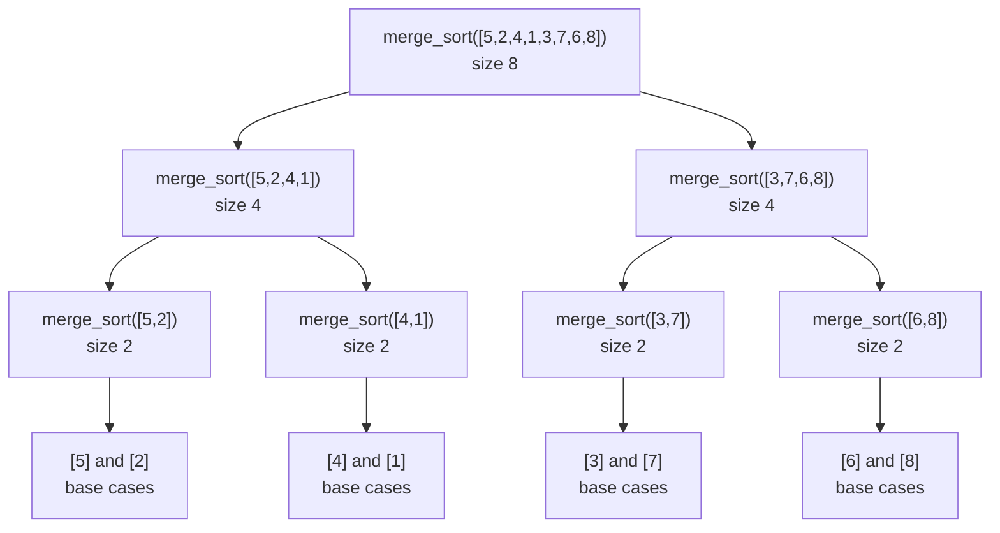

## Learning Objectives

- Re-derive merge sort as the canonical divide-and-conquer algorithm, naming its divide, conquer, and combine steps explicitly.
- Apply the recursion-tree solution from the prerequisite concept to confirm merge sort's `T(n) = 2T(n/2) + O(n)` recurrence resolves to `Θ(n log n)`.
- Implement merge sort and its merge step in Python, and trace both on a concrete example.
- Prove that the standard merge step preserves stability (equal elements keep their relative input order), and explain why an incorrect merge can break it.
- Explain why merge sort needs `Θ(n)` auxiliary space, and why that is a genuine, not incidental, cost of the algorithm.

## Context & Motivation

Merge sort has already made one appearance in this curriculum, in *Sorting Algorithms: An Introduction*, where it showed up as one option among several — set against bubble, selection, and insertion sort to make a single point vivid: an `O(n log n)` algorithm eventually, and decisively, beats an `O(n²)` one as input grows. That comparison did its job well, but it necessarily treated merge sort as a black box earning its keep by a growth rate taken on faith from a table of numbers. This concept revisits the exact same algorithm with a different goal: not to compare it against alternatives, but to understand it on its own terms, as the single cleanest full illustration of the divide-and-conquer paradigm — two genuine subproblems, real combining work, and a recurrence that can now be solved in full rather than asserted.

That "solved in full" is not a small addition. The recursion-tree method from the prerequisite concept was built specifically to answer why `T(n) = 2T(n/2) + O(n)` resolves to `Θ(n log n)` — and this concept is where that derivation gets applied to the actual algorithm it was designed around, rather than to a schematic version of it. Merge sort is also the point where two properties worth knowing about any sorting algorithm — whether it is *stable* (equal elements preserve their relative order) and how much *extra memory* it needs beyond the input array — become concrete for the first time in this curriculum, in a way the introductory treatment had no occasion to raise. Both properties matter in practice well beyond this one algorithm: stability determines whether a sort can be used as a building block for multi-key sorting (sort by the secondary key, then stably by the primary key), and space cost determines whether an algorithm is even usable on data that doesn't comfortably fit in memory twice over. Sedgewick & Wayne's course and MIT's 6.006 both treat merge sort as the natural place to introduce this vocabulary, precisely because it is the first sort covered where these questions have genuine, non-trivial answers.

## Core Theory

### The algorithm: divide, conquer, combine, named explicitly

```python
def merge_sort(items):
    if len(items) <= 1:                    # base case: 0 or 1 elements is already sorted
        return items
    mid = len(items) // 2
    left = merge_sort(items[:mid])          # divide + conquer: recursively sort the left half
    right = merge_sort(items[mid:])         # divide + conquer: recursively sort the right half
    return merge(left, right)               # combine: merge two sorted halves into one

def merge(left, right):
    result = []
    i = j = 0
    while i < len(left) and j < len(right):
        if left[i] <= right[j]:             # <= (not <) is what makes the merge stable
            result.append(left[i])
            i += 1
        else:
            result.append(right[j])
            j += 1
    return result + left[i:] + right[j:]    # append whichever side has leftovers

merge_sort([5, 2, 4, 1, 3])   # [1, 2, 3, 4, 5]
```

Mapped directly onto the divide-and-conquer template: **divide** splits the array at its midpoint into two halves; **conquer** recursively sorts each half independently (two subproblems, `a = 2`, each of size `n/2` — exactly the fuller shape the paradigm concept previewed against binary search's minimal one); **combine** merges the two already-sorted halves into one fully sorted array, in a single linear pass. Unlike binary search's essentially free combine step, merge sort's combine step is where real, non-trivial work happens — every one of the `n` elements is examined exactly once during the merge, which is exactly the `f(n) = O(n)` term the recurrence below accounts for.

### The recurrence, and its solution, applied to this exact algorithm

Reading `a`, `b`, and `f(n)` directly off the code above: two recursive calls (`a = 2`), each on a half-sized array (`b = 2`), plus a merge that does `O(n)` work (one pass over `n` total elements, split across the two `while`/leftover-append segments). This gives:

```
T(n) = 2T(n/2) + O(n)
```

which is exactly the shape solved in full, via recursion tree, in the prerequisite concept: `Θ(n)` work at each of `Θ(log n)` levels, for a total of `Θ(n log n)`. Applied to this specific algorithm, the recursion tree's levels correspond directly to the recursive call structure below — level 0 is the single top-level call on the whole array, level `k` is the `2^k` calls each handling an array of size `n/2^k`, and the tree bottoms out once arrays reach size 1:



Each level of this tree does `Θ(n)` total merge work (one merge per node, but the merges at a given level together touch every element exactly once), and there are `Θ(log n)` levels (the array halves at each step, bottoming out at size 1) — precisely the two facts the recursion-tree method combines to conclude `Θ(n log n)`, now confirmed against the actual algorithm rather than an abstract recurrence.

### Stability: equal elements keep their relative order

A sort is **stable** if, whenever two elements compare equal, their relative order in the output matches their relative order in the input. Merge sort's stability is a direct consequence of one small detail in the `merge` function: the comparison `left[i] <= right[j]` (not `left[i] < right[j]`). When an element from `left` is equal to the current element of `right`, the `<=` causes the left element to be taken first — and because every element originally further left in the input array ends up in the `left` half (or in the earlier-processed portion of a half) before an equal element from the right, this single tie-breaking choice is what preserves original relative order through every level of merging. Stability is not a property that needs to be checked separately at every level of recursion — it holds by induction on the recursive structure itself: if both `left` and `right` are stably sorted (each preserves the relative order of its own original elements, by the inductive hypothesis on smaller subproblems), and the merge step itself never lets a later-original-position element jump ahead of an equal earlier one, then the merged result is stably sorted too.

### Space: why merge sort spends `Θ(n)` extra memory

The `merge` function, as written, allocates a new list (`result`) at every single merge call, sized proportionally to the two halves being combined — this is *auxiliary* space, memory beyond the input array itself. At the top-level call, this new list has size `n`; at the two second-level calls, two new lists of total size `n` are allocated (though not necessarily all live simultaneously, depending on when each returns); the important quantity is not how many lists get allocated over the algorithm's lifetime, but the maximum amount of memory in use *at any one time*, which is `Θ(n)` — proportional to the size of the array, not to the number of recursive calls or the number of levels. This is a genuine, structural cost of the algorithm, not an artifact of one particular implementation: any correct merge of two sorted sequences into one sorted sequence, done by the standard linear-scan method, needs somewhere to write the merged output while both input sequences are still being read from, and that somewhere costs space proportional to their combined size. This is exactly the trade-off the introductory concept flagged as "spending memory to save time" without deriving why — here, the *why* is the merge step's own mechanics.

## Worked Examples

### Example 1 — tracing the full call tree and confirming the recurrence's Θ(n) per-level work

**Problem:** For `merge_sort([5, 2, 4, 1, 3, 7, 6, 8])`, trace the call tree and confirm that the total work merging at each level is proportional to `n = 8`.

**Level 2 (bottommost, before base cases merge upward):** four merges, each combining two single elements: `[5],[2]→[2,5]`; `[4],[1]→[1,4]`; `[3],[7]→[3,7]`; `[6],[8]→[6,8]`. Each merge does 1 comparison, touching 2 elements — total elements touched across all four merges: `4 × 2 = 8`.

**Level 1:** two merges, each combining two size-2 sorted lists: `[2,5]` with `[1,4]` → compare `2,1`→`1`; `2,4`→`2`; `5,4`→`4`; only `5` left → append → `[1,2,4,5]`. And `[3,7]` with `[6,8]` → compare `3,6`→`3`; `7,6`→`6`; `7,8`→`7`; only `8` left → append → `[3,6,7,8]`. Total elements touched across both merges: `4 + 4 = 8`.

**Level 0:** one merge, combining `[1,2,4,5]` with `[3,6,7,8]` → `1,3`→`1`; `2,3`→`2`; `4,3`→`3`; `4,6`→`4`; `5,6`→`5`; only `6,7,8` left → append → `[1,2,3,4,5,6,7,8]`. Total elements touched: `8`.

Every level touches exactly `8 = n` elements in total, confirming the `Θ(n)`-per-level claim from Core Theory concretely, on this exact array, matching the abstract recursion-tree argument from the prerequisite concept element for element.

### Example 2 — verifying stability with a concrete tie

**Problem:** Sort the list of pairs `[(3, 'a'), (1, 'b'), (3, 'c'), (2, 'd')]` by first element only, and confirm the two elements with first element `3` keep their original relative order (`'a'` before `'c'`) in the output.

**Trace.** Splitting: `[(3,'a'), (1,'b')]` and `[(3,'c'), (2,'d')]`. Left half sorts to `[(1,'b'), (3,'a')]` (comparing only first elements: `1 < 3`). Right half sorts to `[(2,'d'), (3,'c')]`. Merging these two: compare `(1,'b')` vs `(2,'d')` → `1 <= 2` → take `(1,'b')`. Compare `(3,'a')` vs `(2,'d')` → `3 <= 2` is false → take `(2,'d')`. Compare `(3,'a')` vs `(3,'c')` → `3 <= 3` is true → take `(3,'a')` first (the `<=` breaks the tie in favor of the left side). Only `(3,'c')` remains → append it. Result: `[(1,'b'), (2,'d'), (3,'a'), (3,'c')]`.

**Confirm.** `(3,'a')` appeared before `(3,'c')` in the original input (positions 0 and 2), and it appears before `(3,'c')` in the output too — stability preserved, and specifically because of the `<=` comparison at the exact moment the two equal-by-first-element pairs were compared during the final merge.

### Example 3 — what breaks if the merge uses `<` instead of `<=`

**Problem:** Using the same input as Example 2, trace what would happen if `merge` used `left[i] < right[j]` instead of `left[i] <= right[j]`, at the specific comparison between `(3,'a')` and `(3,'c')`.

**Trace the changed step.** Everything proceeds identically until comparing `(3,'a')` (from `left`) against `(3,'c')` (from `right`). With strict `<`, `3 < 3` is false, so the `else` branch fires and `(3,'c')` (from `right`) is taken *first*, ahead of `(3,'a')`.

**Result with `<`:** `[(1,'b'), (2,'d'), (3,'c'), (3,'a')]` — `(3,'c')` now precedes `(3,'a')`, even though `(3,'a')` appeared first in the original input. Stability is broken by this one-character change, even though the sort is still entirely correct with respect to the first element alone (both orderings are "sorted by first element"). This demonstrates precisely how narrow the stability guarantee is: it depends on a specific, easy-to-get-backwards choice in one comparison, not on anything about the overall recursive structure.

## Common Misconceptions & Pitfalls

- **"Merge sort was already fully covered in the introductory sorting concept — this is repetition."** The introductory concept established *that* merge sort is `O(n log n)` by counting comparisons informally and comparing it against quadratic sorts; it never solved the recurrence, never discussed stability, and never derived the `Θ(n)` space cost from the mechanics of the merge step. Those three things — the recurrence solved in full via recursion tree, stability proved from the `<=` comparison, and space cost derived from the merge's own need for an output buffer — are new content, not a restatement of the growth-rate comparison already made.
- **"Any implementation of merge sort is automatically stable."** Stability is a property of the specific comparison used in the merge step (`<=`, taking the left element on ties), not an automatic consequence of the divide-and-conquer structure — Example 3 shows a single-character change (`<=` to `<`) that still sorts correctly but silently breaks stability.
- **"Merge sort can be made to use no extra space with a cleverer implementation."** In-place merging of two sorted sequences without any auxiliary buffer is possible in principle but requires a substantially more complex algorithm with worse constant factors, and is not what "merge sort" refers to in the standard treatment; the straightforward, standard merge step shown here structurally requires `Θ(n)` auxiliary space because it needs somewhere to write output while still reading from both untouched inputs.
- **"Since merge sort is asymptotically optimal-looking, its space cost doesn't really matter."** As the introductory concept already flagged and this concept now explains mechanically, `Θ(n)` extra memory is a real cost that matters directly when the input is already close to filling available memory — an in-place `O(n²)` sort remains the only option in some genuinely memory-constrained settings, independent of how much slower it runs.

## Summary

Merge sort, met previously as one entry in a comparison table, is the canonical full illustration of divide-and-conquer: divide splits the array at its midpoint, conquer recursively sorts each half (two subproblems, unlike binary search's one), and combine merges two sorted halves in one linear pass. Its recurrence, `T(n) = 2T(n/2) + O(n)`, is exactly the shape solved via recursion tree in the prerequisite concept, and applying that solution here confirms `Θ(n log n)` directly against the algorithm's own call structure, level by level. Two properties worth knowing for the first time here: merge sort is stable, because the merge step's `<=` comparison always prefers the left half on ties, preserving original relative order by induction on the recursive structure; and it needs `Θ(n)` auxiliary space, because the merge step must write its output somewhere while both sorted inputs are still being read — a genuine, structural cost, not an implementation accident.

## Documentation Links

- [Sedgewick & Wayne — Algorithms Lectures (Princeton)](https://algs4.cs.princeton.edu/lectures/) — doc
- [MIT 6.006 — Lecture Notes (OCW)](https://ocw.mit.edu/courses/6-006-introduction-to-algorithms-spring-2020/pages/lecture-notes/) — doc
